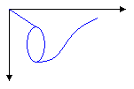
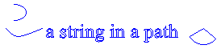

# Graphics Paths in GDI+
Paths are formed by combining lines, rectangles, and simple curves. Recall from the [Vector Graphics Overview](../../../../docs/framework/winforms/advanced/vector-graphics-overview.md) that the following basic building blocks have proven to be the most useful for drawing pictures:  
  
-   Lines  
  
-   Rectangles  
  
-   Ellipses  
  
-   Arcs  
  
-   Polygons  
  
-   Cardinal splines  
  
-   Bézier splines  
  
 In GDI+, the <xref:System.Drawing.Drawing2D.GraphicsPath> object allows you to collect a sequence of these building blocks into a single unit. The entire sequence of lines, rectangles, polygons, and curves can then be drawn with one call to the <xref:System.Drawing.Graphics.DrawPath%2A> method of the <xref:System.Drawing.Graphics> class. The following illustration shows a path created by combining a line, an arc, a Bézier spline, and a cardinal spline.  
  
   
  
## Using a Path  
 The <xref:System.Drawing.Drawing2D.GraphicsPath> class provides the following methods for creating a sequence of items to be drawn: <xref:System.Drawing.Drawing2D.GraphicsPath.AddLine%2A>, <xref:System.Drawing.Drawing2D.GraphicsPath.AddRectangle%2A>, <xref:System.Drawing.Drawing2D.GraphicsPath.AddEllipse%2A>, <xref:System.Drawing.Drawing2D.GraphicsPath.AddArc%2A>, <xref:System.Drawing.Drawing2D.GraphicsPath.AddPolygon%2A>, <xref:System.Drawing.Drawing2D.GraphicsPath.AddCurve%2A> (for cardinal splines), and <xref:System.Drawing.Drawing2D.GraphicsPath.AddBezier%2A>. Each of these methods is overloaded; that is, each method supports several different parameter lists. For example, one variation of the <xref:System.Drawing.Drawing2D.GraphicsPath.AddLine%2A> method receives four integers, and another variation of the <xref:System.Drawing.Drawing2D.GraphicsPath.AddLine%2A> method receives two <xref:System.Drawing.Point> objects.  
  
 The methods for adding lines, rectangles, and Bézier splines to a path have plural companion methods that add several items to the path in a single call: <xref:System.Drawing.Drawing2D.GraphicsPath.AddLines%2A>, <xref:System.Drawing.Drawing2D.GraphicsPath.AddRectangles%2A>, and <xref:System.Drawing.Drawing2D.GraphicsPath.AddBeziers%2A>. Also, the <xref:System.Drawing.Drawing2D.GraphicsPath.AddCurve%2A> and <xref:System.Drawing.Drawing2D.GraphicsPath.AddArc%2A> methods have companion methods, <xref:System.Drawing.Drawing2D.GraphicsPath.AddClosedCurve%2A> and <xref:System.Drawing.Drawing2D.GraphicsPath.AddPie%2A>, that add a closed curve or pie to the path.  
  
 To draw a path, you need a <xref:System.Drawing.Graphics> object, a <xref:System.Drawing.Pen> object, and a <xref:System.Drawing.Drawing2D.GraphicsPath> object. The <xref:System.Drawing.Graphics> object provides the <xref:System.Drawing.Graphics.DrawPath%2A> method, and the <xref:System.Drawing.Pen> object stores attributes, such as width and color, of the line used to render the path. The <xref:System.Drawing.Drawing2D.GraphicsPath> object stores the sequence of lines and curves that make up the path. The <xref:System.Drawing.Pen> object and the <xref:System.Drawing.Drawing2D.GraphicsPath> object are passed as arguments to the <xref:System.Drawing.Graphics.DrawPath%2A> method. The following example draws a path that consists of a line, an ellipse, and a Bézier spline:  
  
 [!code-csharp[LinesCurvesAndShapes#101](../../../../samples/snippets/csharp/VS_Snippets_Winforms/LinesCurvesAndShapes/CS/Class1.cs#101)]
 [!code-vb[LinesCurvesAndShapes#101](../../../../samples/snippets/visualbasic/VS_Snippets_Winforms/LinesCurvesAndShapes/VB/Class1.vb#101)]  
  
 The following illustration shows the path.  
  
   
  
 In addition to adding lines, rectangles, and curves to a path, you can add paths to a path. This allows you to combine existing paths to form large, complex paths.  
  
 [!code-csharp[LinesCurvesAndShapes#102](../../../../samples/snippets/csharp/VS_Snippets_Winforms/LinesCurvesAndShapes/CS/Class1.cs#102)]
 [!code-vb[LinesCurvesAndShapes#102](../../../../samples/snippets/visualbasic/VS_Snippets_Winforms/LinesCurvesAndShapes/VB/Class1.vb#102)]  
  
 There are two other items you can add to a path: strings and pies. A pie is a portion of the interior of an ellipse. The following example creates a path from an arc, a cardinal spline, a string, and a pie:  
  
 [!code-csharp[LinesCurvesAndShapes#103](../../../../samples/snippets/csharp/VS_Snippets_Winforms/LinesCurvesAndShapes/CS/Class1.cs#103)]
 [!code-vb[LinesCurvesAndShapes#103](../../../../samples/snippets/visualbasic/VS_Snippets_Winforms/LinesCurvesAndShapes/VB/Class1.vb#103)]  
  
 The following illustration shows the path. Note that a path does not have to be connected; the arc, cardinal spline, string, and pie are separated.  
  
   
  
## See Also  
 <xref:System.Drawing.Drawing2D.GraphicsPath?displayProperty=nameWithType>  
 <xref:System.Drawing.Point?displayProperty=nameWithType>  
 [Lines, Curves, and Shapes](../../../../docs/framework/winforms/advanced/lines-curves-and-shapes.md)  
 [How to: Create Graphics Objects for Drawing](../../../../docs/framework/winforms/advanced/how-to-create-graphics-objects-for-drawing.md)  
 [Constructing and Drawing Paths](../../../../docs/framework/winforms/advanced/constructing-and-drawing-paths.md)
