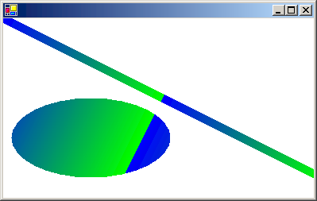

# How to: Create a Linear Gradient
[!INCLUDE[ndptecgdiplus](../../../../includes/ndptecgdiplus-md.md)] provides horizontal, vertical, and diagonal linear gradients. By default, the color in a linear gradient changes uniformly. However, you can customize a linear gradient so that the color changes in a non-uniform fashion.  
  
 The following example fills a line, an ellipse, and a rectangle with a horizontal linear gradient brush.  
  
 The <xref:System.Drawing.Drawing2D.LinearGradientBrush.%23ctor%2A> constructor receives four arguments: two points and two colors. The first point (0, 10) is associated with the first color (red), and the second point (200, 10) is associated with the second color (blue). As you would expect, the line drawn from (0, 10) to (200, 10) changes gradually from red to blue.  
  
 The 10s in the points (50, 10) and (200, 10) are not important. What is important is that the two points have the same second coordinate — the line connecting them is horizontal. The ellipse and the rectangle also change gradually from red to blue as the horizontal coordinate goes from 0 to 200.  
  
 The following illustration shows the line, the ellipse, and the rectangle. Note that the color gradient repeats itself as the horizontal coordinate increases beyond 200.  
  
   
  
### To use horizontal linear gradients  
  
-   Pass in the opaque red and opaque blue as the third and fourth argument, respectively.  
  
     [!code-csharp[System.Drawing.UsingaGradientBrush#21](../../../../samples/snippets/csharp/VS_Snippets_Winforms/System.Drawing.UsingaGradientBrush/CS/Class1.cs#21)]
     [!code-vb[System.Drawing.UsingaGradientBrush#21](../../../../samples/snippets/visualbasic/VS_Snippets_Winforms/System.Drawing.UsingaGradientBrush/VB/Class1.vb#21)]  
  
 In the preceding example, the color components change linearly as you move from a horizontal coordinate of 0 to a horizontal coordinate of 200. For example, a point whose first coordinate is halfway between 0 and 200 will have a blue component that is halfway between 0 and 255.  
  
 [!INCLUDE[ndptecgdiplus](../../../../includes/ndptecgdiplus-md.md)] allows you to adjust the way a color varies from one edge of a gradient to the other. Suppose you want to create a gradient brush that changes from black to red according to the following table.  
  
|Horizontal coordinate|RGB components|  
|---------------------------|--------------------|  
|0|(0, 0, 0)|  
|40|(128, 0, 0)|  
|200|(255, 0, 0)|  
  
 Note that the red component is at half intensity when the horizontal coordinate is only 20 percent of the way from 0 to 200.  
  
 The following example sets the <xref:System.Drawing.Drawing2D.LinearGradientBrush.Blend%2A> property of a <xref:System.Drawing.Drawing2D.LinearGradientBrush> object to associate three relative intensities with three relative positions. As in the preceding table, a relative intensity of 0.5 is associated with a relative position of 0.2. The code fills an ellipse and a rectangle with the gradient brush.  
  
 The following illustration shows the resulting ellipse and rectangle.  
  
   
  
### To customize linear gradients  
  
-   Pass in the opaque black and opaque red as the third and fourth argument, respectively.  
  
     [!code-csharp[System.Drawing.UsingaGradientBrush#22](../../../../samples/snippets/csharp/VS_Snippets_Winforms/System.Drawing.UsingaGradientBrush/CS/Class1.cs#22)]
     [!code-vb[System.Drawing.UsingaGradientBrush#22](../../../../samples/snippets/visualbasic/VS_Snippets_Winforms/System.Drawing.UsingaGradientBrush/VB/Class1.vb#22)]  
  
 The gradients in the preceding examples have been horizontal; that is, the color changes gradually as you move along any horizontal line. You can also define vertical gradients and diagonal gradients.  
  
 The following example passes the points (0, 0) and (200, 100) to a <xref:System.Drawing.Drawing2D.LinearGradientBrush.%23ctor%2A> constructor. The color blue is associated with (0, 0), and the color green is associated with (200, 100). A line (with pen width 10) and an ellipse are filled with the linear gradient brush.  
  
 The following illustration shows the line and the ellipse. Note that the color in the ellipse changes gradually as you move along any line that is parallel to the line passing through (0, 0) and (200, 100).  
  
   
  
### To create diagonal linear gradients  
  
-   Pass in the opaque blue and opaque green as the third and fourth argument, respectively.  
  
     [!code-csharp[System.Drawing.UsingaGradientBrush#23](../../../../samples/snippets/csharp/VS_Snippets_Winforms/System.Drawing.UsingaGradientBrush/CS/Class1.cs#23)]
     [!code-vb[System.Drawing.UsingaGradientBrush#23](../../../../samples/snippets/visualbasic/VS_Snippets_Winforms/System.Drawing.UsingaGradientBrush/VB/Class1.vb#23)]  
  
## See Also  
 [Using a Gradient Brush to Fill Shapes](../../../../docs/framework/winforms/advanced/using-a-gradient-brush-to-fill-shapes.md)  
 [Graphics and Drawing in Windows Forms](../../../../docs/framework/winforms/advanced/graphics-and-drawing-in-windows-forms.md)
