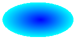
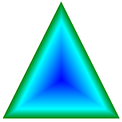
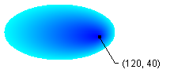

# How to: Create a Path Gradient
The <xref:System.Drawing.Drawing2D.PathGradientBrush> class allows you to customize the way you fill a shape with gradually changing colors. For example, you can specify one color for the center of a path and another color for the boundary of a path. You can also specify separate colors for each of several points along the boundary of a path.  
  
> [!NOTE]
>  In [!INCLUDE[ndptecgdiplus](../../../../includes/ndptecgdiplus-md.md)], a path is a sequence of lines and curves maintained by a <xref:System.Drawing.Drawing2D.GraphicsPath> object. For more information about [!INCLUDE[ndptecgdiplus](../../../../includes/ndptecgdiplus-md.md)] paths, see [Graphics Paths in GDI+](../../../../docs/framework/winforms/advanced/graphics-paths-in-gdi.md) and [Constructing and Drawing Paths](../../../../docs/framework/winforms/advanced/constructing-and-drawing-paths.md).  
  
### To fill an ellipse with a path gradient  
  
-   The following example fills an ellipse with a path gradient brush. The center color is set to blue and the boundary color is set to aqua. The following illustration shows the filled ellipse.  
  
       
  
     By default, a path gradient brush does not extend outside the boundary of the path. If you use the path gradient brush to fill a figure that extends beyond the boundary of the path, the area of the screen outside the path will not be filled.  
  
     The following illustration shows what happens if you change the <xref:System.Drawing.Graphics.FillEllipse%2A> call in the following code to `e.Graphics.FillRectangle(pthGrBrush, 0, 10, 200, 40)`.  
  
       
  
     [!code-csharp[System.Drawing.UsingaGradientBrush#11](../../../../samples/snippets/csharp/VS_Snippets_Winforms/System.Drawing.UsingaGradientBrush/CS/Class1.cs#11)]
     [!code-vb[System.Drawing.UsingaGradientBrush#11](../../../../samples/snippets/visualbasic/VS_Snippets_Winforms/System.Drawing.UsingaGradientBrush/VB/Class1.vb#11)]  
  
     The preceding code example is designed for use with Windows Forms, and it requires the <xref:System.Windows.Forms.PaintEventArgs> e, which is a parameter of <xref:System.Windows.Forms.PaintEventHandler>.  
  
### To specify points on the boundary  
  
-   The following example constructs a path gradient brush from a star-shaped path. The code sets the <xref:System.Drawing.Drawing2D.PathGradientBrush.CenterColor%2A> property, which sets the color at the centroid of the star to red. Then the code sets the <xref:System.Drawing.Drawing2D.PathGradientBrush.SurroundColors%2A> property to specify various colors (stored in the `colors` array) at the individual points in the `points` array. The final code statement fills the star-shaped path with the path gradient brush.  
  
     [!code-csharp[System.Drawing.UsingaGradientBrush#12](../../../../samples/snippets/csharp/VS_Snippets_Winforms/System.Drawing.UsingaGradientBrush/CS/Class1.cs#12)]
     [!code-vb[System.Drawing.UsingaGradientBrush#12](../../../../samples/snippets/visualbasic/VS_Snippets_Winforms/System.Drawing.UsingaGradientBrush/VB/Class1.vb#12)]  
  
-   The following example draws a path gradient without a <xref:System.Drawing.Drawing2D.GraphicsPath> object in the code. The particular <xref:System.Drawing.Drawing2D.PathGradientBrush.%23ctor%2A> constructor in the example receives an array of points but does not require a <xref:System.Drawing.Drawing2D.GraphicsPath> object. Also, note that the <xref:System.Drawing.Drawing2D.PathGradientBrush> is used to fill a rectangle, not a path. The rectangle is larger than the closed path used to define the brush, so some of the rectangle is not painted by the brush. The following illustration shows the rectangle (dotted line) and the portion of the rectangle painted by the path gradient brush.  
  
       
  
     [!code-csharp[System.Drawing.UsingaGradientBrush#13](../../../../samples/snippets/csharp/VS_Snippets_Winforms/System.Drawing.UsingaGradientBrush/CS/Class1.cs#13)]
     [!code-vb[System.Drawing.UsingaGradientBrush#13](../../../../samples/snippets/visualbasic/VS_Snippets_Winforms/System.Drawing.UsingaGradientBrush/VB/Class1.vb#13)]  
  
### To customize a path gradient  
  
-   One way to customize a path gradient brush is to set its <xref:System.Drawing.Drawing2D.PathGradientBrush.FocusScales%2A> property. The focus scales specify an inner path that lies inside the main path. The center color is displayed everywhere inside that inner path rather than only at the center point.  
  
     The following example creates a path gradient brush based on an elliptical path. The code sets the boundary color to blue, sets the center color to aqua, and then uses the path gradient brush to fill the elliptical path.  
  
     Next, the code sets the focus scales of the path gradient brush. The x focus scale is set to 0.3, and the y focus scale is set to 0.8. The code calls the <xref:System.Drawing.Graphics.TranslateTransform%2A> method of a <xref:System.Drawing.Graphics> object so that the subsequent call to <xref:System.Drawing.Graphics.FillPath%2A> fills an ellipse that sits to the right of the first ellipse.  
  
     To see the effect of the focus scales, imagine a small ellipse that shares its center with the main ellipse. The small (inner) ellipse is the main ellipse scaled (about its center) horizontally by a factor of 0.3 and vertically by a factor of 0.8. As you move from the boundary of the outer ellipse to the boundary of the inner ellipse, the color changes gradually from blue to aqua. As you move from the boundary of the inner ellipse to the shared center, the color remains aqua.  
  
     The following illustration shows the output of the following code. The ellipse on the left is aqua only at the center point. The ellipse on the right is aqua everywhere inside the inner path.  
  
   
  
 [!code-csharp[System.Drawing.UsingaGradientBrush#14](../../../../samples/snippets/csharp/VS_Snippets_Winforms/System.Drawing.UsingaGradientBrush/CS/Class1.cs#14)]
 [!code-vb[System.Drawing.UsingaGradientBrush#14](../../../../samples/snippets/visualbasic/VS_Snippets_Winforms/System.Drawing.UsingaGradientBrush/VB/Class1.vb#14)]  
  
### To customize with interpolation  
  
-   Another way to customize a path gradient brush is to specify an array of interpolation colors and an array of interpolation positions.  
  
     The following example creates a path gradient brush based on a triangle. The code sets the <xref:System.Drawing.Drawing2D.PathGradientBrush.InterpolationColors%2A> property of the path gradient brush to specify an array of interpolation colors (dark green, aqua, blue) and an array of interpolation positions (0, 0.25, 1). As you move from the boundary of the triangle to the center point, the color changes gradually from dark green to aqua and then from aqua to blue. The change from dark green to aqua happens in 25 percent of the distance from dark green to blue.  
  
     The following illustration shows the triangle filled with the custom path gradient brush.  
  
       
  
     [!code-csharp[System.Drawing.UsingaGradientBrush#15](../../../../samples/snippets/csharp/VS_Snippets_Winforms/System.Drawing.UsingaGradientBrush/CS/Class1.cs#15)]
     [!code-vb[System.Drawing.UsingaGradientBrush#15](../../../../samples/snippets/visualbasic/VS_Snippets_Winforms/System.Drawing.UsingaGradientBrush/VB/Class1.vb#15)]  
  
### To set the center point  
  
-   By default, the center point of a path gradient brush is at the centroid of the path used to construct the brush. You can change the location of the center point by setting the <xref:System.Drawing.Drawing2D.PathGradientBrush.CenterPoint%2A> property of the <xref:System.Drawing.Drawing2D.PathGradientBrush> class.  
  
     The following example creates a path gradient brush based on an ellipse. The center of the ellipse is at (70, 35), but the center point of the path gradient brush is set to (120, 40).  
  
     [!code-csharp[System.Drawing.UsingaGradientBrush#16](../../../../samples/snippets/csharp/VS_Snippets_Winforms/System.Drawing.UsingaGradientBrush/CS/Class1.cs#16)]
     [!code-vb[System.Drawing.UsingaGradientBrush#16](../../../../samples/snippets/visualbasic/VS_Snippets_Winforms/System.Drawing.UsingaGradientBrush/VB/Class1.vb#16)]  
  
     The following illustration shows the filled ellipse and the center point of the path gradient brush.  
  
       
  
-   You can set the center point of a path gradient brush to a location outside the path that was used to construct the brush. The following example replaces the call to set the <xref:System.Drawing.Drawing2D.PathGradientBrush.CenterPoint%2A> property in the preceding code.  
  
     [!code-csharp[System.Drawing.UsingaGradientBrush#17](../../../../samples/snippets/csharp/VS_Snippets_Winforms/System.Drawing.UsingaGradientBrush/CS/Class1.cs#17)]
     [!code-vb[System.Drawing.UsingaGradientBrush#17](../../../../samples/snippets/visualbasic/VS_Snippets_Winforms/System.Drawing.UsingaGradientBrush/VB/Class1.vb#17)]  
  
     The following illustration shows the output with this change.  
  
       
  
     In the preceding illustration, the points at the far right of the ellipse are not pure blue (although they are very close). The colors in the gradient are positioned as if the fill reached the point (145, 35) where the color would be pure blue (0, 0, 255). But the fill never reaches (145, 35) because a path gradient brush paints only inside its path.  
  
## Compiling the Code  
 The preceding examples are designed for use with Windows Forms, and they require <xref:System.Windows.Forms.PaintEventArgs> `e`, which is a parameter of the <xref:System.Windows.Forms.Control.Paint> event handler.  
  
## See Also  
 [Using a Gradient Brush to Fill Shapes](../../../../docs/framework/winforms/advanced/using-a-gradient-brush-to-fill-shapes.md)
