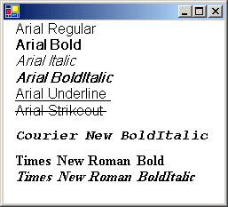

# How to: Create a Private Font Collection
The <xref:System.Drawing.Text.PrivateFontCollection> class inherits from the <xref:System.Drawing.Text.FontCollection> abstract base class. You can use a <xref:System.Drawing.Text.PrivateFontCollection> object to maintain a set of fonts specifically for your application. A private font collection can include installed system fonts as well as fonts that have not been installed on the computer. To add a font file to a private font collection, call the <xref:System.Drawing.Text.PrivateFontCollection.AddFontFile%2A> method of a <xref:System.Drawing.Text.PrivateFontCollection> object.  
  
 The <xref:System.Drawing.Text.FontCollection.Families%2A> property of a <xref:System.Drawing.Text.PrivateFontCollection> object contains an array of <xref:System.Drawing.FontFamily> objects.  
  
 The number of font families in a private font collection is not necessarily the same as the number of font files that have been added to the collection. For example, suppose you add the files ArialBd.tff, Times.tff, and TimesBd.tff to a collection. There will be three files but only two families in the collection because Times.tff and TimesBd.tff belong to the same family.  
  
## Example  
 The following example adds the following three font files to a <xref:System.Drawing.Text.PrivateFontCollection> object:  
  
-   C:\\*systemroot*\Fonts\Arial.tff (Arial, regular)  
  
-   C:\\*systemroot*\Fonts\CourBI.tff (Courier New, bold italic)  
  
-   C:\\*systemroot*\Fonts\TimesBd.tff (Times New Roman, bold)  
  
 The code retrieves an array of <xref:System.Drawing.FontFamily> objects from the <xref:System.Drawing.Text.FontCollection.Families%2A> property of the <xref:System.Drawing.Text.PrivateFontCollection> object.  
  
 For each <xref:System.Drawing.FontFamily> object in the collection, the code calls the <xref:System.Drawing.FontFamily.IsStyleAvailable%2A> method to determine whether various styles (regular, bold, italic, bold italic, underline, and strikeout) are available. The arguments passed to the <xref:System.Drawing.FontFamily.IsStyleAvailable%2A> method are members of the <xref:System.Drawing.FontStyle> enumeration.  
  
 If a given family/style combination is available, a <xref:System.Drawing.Font> object is constructed using that family and style. The first argument passed to the <xref:System.Drawing.Font.%23ctor%2A> constructor is the font family name (not a <xref:System.Drawing.FontFamily> object as is the case for other variations of the <xref:System.Drawing.Font.%23ctor%2A> constructor). After the <xref:System.Drawing.Font> object is constructed, it is passed to the <xref:System.Drawing.Graphics.DrawString%2A> method of the <xref:System.Drawing.Graphics> class to display the family name along with the name of the style.  
  
 The output of the following code is similar to the output shown in the following illustration.  
  
   
  
 Arial.tff (which was added to the private font collection in the following code example) is the font file for the Arial regular style. Note, however, that the program output shows several available styles other than regular for the Arial font family. That is because [!INCLUDE[ndptecgdiplus](../../../../includes/ndptecgdiplus-md.md)] can simulate the bold, italic, and bold italic styles from the regular style. [!INCLUDE[ndptecgdiplus](../../../../includes/ndptecgdiplus-md.md)] can also produce underlines and strikeouts from the regular style.  
  
 Similarly, [!INCLUDE[ndptecgdiplus](../../../../includes/ndptecgdiplus-md.md)] can simulate the bold italic style from either the bold style or the italic style. The program output shows that the bold italic style is available for the Times family even though TimesBd.tff (Times New Roman, bold) is the only Times file in the collection.  
  
 [!code-csharp[System.Drawing.FontsAndText#51](../../../../samples/snippets/csharp/VS_Snippets_Winforms/System.Drawing.FontsAndText/CS/Class1.cs#51)]
 [!code-vb[System.Drawing.FontsAndText#51](../../../../samples/snippets/visualbasic/VS_Snippets_Winforms/System.Drawing.FontsAndText/VB/Class1.vb#51)]  
  
## Compiling the Code  
 The preceding example is designed for use with Windows Forms, and it requires <xref:System.Windows.Forms.PaintEventArgs> `e`, which is a parameter of <xref:System.Windows.Forms.PaintEventHandler>.  
  
## See Also  
 <xref:System.Drawing.Text.PrivateFontCollection>  
 [Using Fonts and Text](../../../../docs/framework/winforms/advanced/using-fonts-and-text.md)
