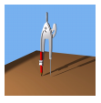

# How to: Create Thumbnail Images
A thumbnail image is a small version of an image. You can create a thumbnail image by calling the <xref:System.Drawing.Image.GetThumbnailImage%2A> method of an <xref:System.Drawing.Image> object.  
  
## Example  
 The following example constructs an <xref:System.Drawing.Image> object from a JPG file. The original image has a width of 640 pixels and a height of 479 pixels. The code creates a thumbnail image that has a width of 100 pixels and a height of 100 pixels.  
  
 The following illustration shows the thumbnail image.  
  
   
  
> [!NOTE]
>  In this example, a callback method is declared, but never used. This supports all versions of GDI+.  
  
 [!code-csharp[System.Drawing.WorkingWithImages#71](../../../../samples/snippets/csharp/VS_Snippets_Winforms/System.Drawing.WorkingWithImages/CS/Class1.cs#71)]
 [!code-vb[System.Drawing.WorkingWithImages#71](../../../../samples/snippets/visualbasic/VS_Snippets_Winforms/System.Drawing.WorkingWithImages/VB/Class1.vb#71)]  
  
## Compiling the Code  
 The preceding example is designed for use with Windows Forms, and it requires <xref:System.Windows.Forms.PaintEventArgs> `e`, which is a parameter of the <xref:System.Windows.Forms.Control.Paint> event handler. To run the example, follow these steps:  
  
1.  Create a new Windows Forms application.  
  
2.  Add the example code to the form.  
  
3.  Create a handler for the form's <xref:System.Windows.Forms.Control.Paint> event  
  
4.  In the <xref:System.Windows.Forms.Control.Paint> handler, call the `GetThumbnail` method and pass `e` for <xref:System.Windows.Forms.PaintEventArgs>.  
  
5.  Find an image file that you want to make a thumbnail of.  
  
6.  In the `GetThumbnail` method, specify the path and file name to your image.  
  
7.  Press F5 to run the example.  
  
     A 100 by 100 thumbnail image appears on the form.  
  
## See Also  
 [Images, Bitmaps, and Metafiles](../../../../docs/framework/winforms/advanced/images-bitmaps-and-metafiles.md)  
 [Working with Images, Bitmaps, Icons, and Metafiles](../../../../docs/framework/winforms/advanced/working-with-images-bitmaps-icons-and-metafiles.md)
