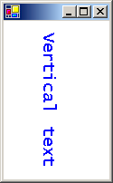

# How to: Create Vertical Text
You can use a <xref:System.Drawing.StringFormat> object to specify that text be drawn vertically rather than horizontally.  
  
## Example  
 The following example assigns the value <xref:System.Drawing.StringFormatFlags.DirectionVertical> to the <xref:System.Drawing.StringFormat.FormatFlags%2A> property of a <xref:System.Drawing.StringFormat> object. That <xref:System.Drawing.StringFormat> object is passed to the <xref:System.Drawing.Graphics.DrawString%2A> method of the <xref:System.Drawing.Graphics> class. The value <xref:System.Drawing.StringFormatFlags.DirectionVertical> is a member of the <xref:System.Drawing.StringFormatFlags> enumeration.  
  
 The following illustration shows the vertical text.  
  
   
  
 [!code-csharp[System.Drawing.FontsAndText#31](../../../../samples/snippets/csharp/VS_Snippets_Winforms/System.Drawing.FontsAndText/CS/Class1.cs#31)]
 [!code-vb[System.Drawing.FontsAndText#31](../../../../samples/snippets/visualbasic/VS_Snippets_Winforms/System.Drawing.FontsAndText/VB/Class1.vb#31)]  
  
## Compiling the Code  
  
-   The preceding example is designed for use with Windows Forms, and it requires <xref:System.Windows.Forms.PaintEventArgs>`e` , which is a parameter of <xref:System.Windows.Forms.PaintEventHandler>.  
  
## See Also  
 [How to: Draw Text with GDI](../../../../docs/framework/winforms/advanced/how-to-draw-text-with-gdi.md)
