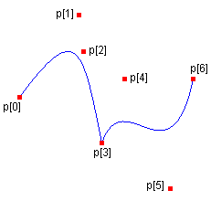

# How to: Draw a Sequence of B&#233;zier Splines
You can use the <xref:System.Drawing.Graphics.DrawBeziers%2A> method of the <xref:System.Drawing.Graphics> class to draw a sequence of connected Bézier splines.  
  
## Example  
 The following example draws a curve that consists of two connected Bézier splines. The endpoint of the first Bézier spline is the start point of the second Bézier spline.  
  
 The following illustration shows the connected splines along with the seven points:  
  
   
  
 [!code-csharp[System.Drawing.ConstructingDrawingCurves#11](~/samples/snippets/csharp/VS_Snippets_Winforms/System.Drawing.ConstructingDrawingCurves/CS/Class1.cs#11)]
 [!code-vb[System.Drawing.ConstructingDrawingCurves#11](~/samples/snippets/visualbasic/VS_Snippets_Winforms/System.Drawing.ConstructingDrawingCurves/VB/Class1.vb#11)]  
  
## Compiling the Code  
 The preceding example is designed for use with Windows Forms, and it requires <xref:System.Windows.Forms.PaintEventArgs> `e`, which is a parameter of the <xref:System.Windows.Forms.Control.Paint> event handler.  
  
## See also

- [Graphics and Drawing in Windows Forms](graphics-and-drawing-in-windows-forms.md)
- [Bézier Splines in GDI+](bezier-splines-in-gdi.md)
- [Constructing and Drawing Curves](constructing-and-drawing-curves.md)
