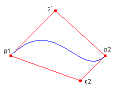

# How to: Draw a Single B&#233;zier Spline
A Bézier spline is defined by four points: a start point, two control points, and an endpoint.  
  
## Example  
 The following example draws a Bézier spline with start point (10, 100) and endpoint (200, 100). The control points are (100, 10) and (150, 150).  
  
 The following illustration shows the resulting Bézier spline along with its start point, control points, and endpoint. The illustration also shows the spline's convex hull, which is a polygon formed by connecting the four points with straight lines.  
  
   
  
 [!code-csharp[System.Drawing.ConstructingDrawingCurves#31](../../../../samples/snippets/csharp/VS_Snippets_Winforms/System.Drawing.ConstructingDrawingCurves/CS/Class1.cs#31)]
 [!code-vb[System.Drawing.ConstructingDrawingCurves#31](../../../../samples/snippets/visualbasic/VS_Snippets_Winforms/System.Drawing.ConstructingDrawingCurves/VB/Class1.vb#31)]  
  
## Compiling the Code  
 The preceding example is designed for use with Windows Forms, and it requires <xref:System.Windows.Forms.PaintEventArgs> `e`, which is a parameter of the <xref:System.Windows.Forms.Control.Paint> event handler.  
  
## See Also  
 <xref:System.Drawing.Graphics.DrawBezier%2A>  
 [Bézier Splines in GDI+](../../../../docs/framework/winforms/advanced/bezier-splines-in-gdi.md)  
 [How to: Draw a Sequence of Bézier Splines](../../../../docs/framework/winforms/advanced/how-to-draw-a-sequence-of-bezier-splines.md)
