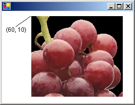

# How to: Draw an Existing Bitmap to the Screen
You can easily draw an existing image on the screen. First you need to create a <xref:System.Drawing.Bitmap> object by using the bitmap constructor that takes a file name, <xref:System.Drawing.Bitmap.%23ctor%28System.String%29>. This constructor accepts images with several different file formats, including BMP, GIF, JPEG, PNG, and TIFF. After you have created the <xref:System.Drawing.Bitmap> object, pass that <xref:System.Drawing.Bitmap> object to the <xref:System.Drawing.Graphics.DrawImage%2A> method of a <xref:System.Drawing.Graphics> object.  
  
## Example  
 This example creates a <xref:System.Drawing.Bitmap> object from a JPEG file and then draws the bitmap with its upper-left corner at (60, 10).  
  
 The following illustration shows the bitmap drawn at the specified location.  
  
   
  
 [!code-csharp[System.Drawing.WorkingWithImages#21](../../../../samples/snippets/csharp/VS_Snippets_Winforms/System.Drawing.WorkingWithImages/CS/Class1.cs#21)]
 [!code-vb[System.Drawing.WorkingWithImages#21](../../../../samples/snippets/visualbasic/VS_Snippets_Winforms/System.Drawing.WorkingWithImages/VB/Class1.vb#21)]  
  
## Compiling the Code  
 The preceding example is designed for use with Windows Forms, and it requires <xref:System.Windows.Forms.PaintEventArgs> `e`, which is a parameter of the <xref:System.Windows.Forms.Control.Paint> event handler.  
  
## See Also  
 [Graphics and Drawing in Windows Forms](../../../../docs/framework/winforms/advanced/graphics-and-drawing-in-windows-forms.md)  
 [Working with Images, Bitmaps, Icons, and Metafiles](../../../../docs/framework/winforms/advanced/working-with-images-bitmaps-icons-and-metafiles.md)
