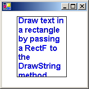

# How to: Draw Wrapped Text in a Rectangle
You can draw wrapped text in a rectangle by using the <xref:System.Drawing.Graphics.DrawString%2A> overloaded method of the <xref:System.Drawing.Graphics> class that takes a <xref:System.Drawing.Rectangle> or <xref:System.Drawing.RectangleF> parameter. You will also use a <xref:System.Drawing.Brush> and a <xref:System.Drawing.Font>.  
  
 You can also draw wrapped text in a rectangle by using the <xref:System.Windows.Forms.TextRenderer.DrawText%2A> overloaded method of the <xref:System.Windows.Forms.TextRenderer> that takes a <xref:System.Drawing.Rectangle> and a <xref:System.Windows.Forms.TextFormatFlags> parameter. You will also use a <xref:System.Drawing.Color> and a <xref:System.Drawing.Font>.  
  
 The following illustration shows the output of text drawn in the rectangle when you use the <xref:System.Drawing.Graphics.DrawString%2A> method.  
  
   
  
### To draw wrapped text in a rectangle with GDI+  
  
1.  Use the <xref:System.Drawing.Graphics.DrawString%2A> overloaded method, passing the text you want, <xref:System.Drawing.Rectangle> or <xref:System.Drawing.RectangleF>, <xref:System.Drawing.Font> and <xref:System.Drawing.Brush>.  
  
     [!code-csharp[System.Drawing.AlignDrawnText#50](../../../../samples/snippets/csharp/VS_Snippets_Winforms/System.Drawing.AlignDrawnText/CS/Form1.cs#50)]
     [!code-vb[System.Drawing.AlignDrawnText#50](../../../../samples/snippets/visualbasic/VS_Snippets_Winforms/System.Drawing.AlignDrawnText/VB/Form1.vb#50)]  
  
### To draw wrapped text in a rectangle with GDI  
  
1.  Use the <xref:System.Windows.Forms.TextFormatFlags> enumeration value to specify the text should be wrapped with the <xref:System.Windows.Forms.TextRenderer.DrawText%2A> overloaded method, passing the text you want, <xref:System.Drawing.Rectangle>, <xref:System.Drawing.Font> and <xref:System.Drawing.Color>.  
  
     [!code-csharp[System.Drawing.AlignDrawnText#60](../../../../samples/snippets/csharp/VS_Snippets_Winforms/System.Drawing.AlignDrawnText/CS/Form1.cs#60)]
     [!code-vb[System.Drawing.AlignDrawnText#60](../../../../samples/snippets/visualbasic/VS_Snippets_Winforms/System.Drawing.AlignDrawnText/VB/Form1.vb#60)]  
  
## Compiling the Code  
 The previous examples require:  
  
-   <xref:System.Windows.Forms.PaintEventArgs> `e`, which is a parameter of <xref:System.Windows.Forms.PaintEventHandler>.  
  
## See Also  
 [How to: Draw Text with GDI](../../../../docs/framework/winforms/advanced/how-to-draw-text-with-gdi.md)  
 [Using Fonts and Text](../../../../docs/framework/winforms/advanced/using-fonts-and-text.md)  
 [How to: Construct Font Families and Fonts](../../../../docs/framework/winforms/advanced/how-to-construct-font-families-and-fonts.md)  
 [How to: Draw Text at a Specified Location](../../../../docs/framework/winforms/advanced/how-to-draw-text-at-a-specified-location.md)
