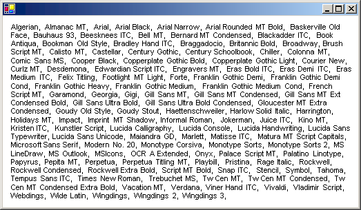

# How to: Enumerate Installed Fonts
The <xref:System.Drawing.Text.InstalledFontCollection> class inherits from the <xref:System.Drawing.Text.FontCollection> abstract base class. You can use an <xref:System.Drawing.Text.InstalledFontCollection> object to enumerate the fonts installed on the computer. The <xref:System.Drawing.Text.FontCollection.Families%2A> property of an <xref:System.Drawing.Text.InstalledFontCollection> object is an array of <xref:System.Drawing.FontFamily> objects.  
  
## Example  
 The following example lists the names of all the font families installed on the computer. The code retrieves the <xref:System.Drawing.FontFamily.Name%2A> property of each <xref:System.Drawing.FontFamily> object in the array returned by the <xref:System.Drawing.Text.FontCollection.Families%2A> property. As the family names are retrieved, they are concatenated to form a comma-separated list. Then the <xref:System.Drawing.Graphics.DrawString%2A> method of the <xref:System.Drawing.Graphics> class draws the comma-separated list in a rectangle.  
  
 If you run the example code, the output will be similar to that shown in the following illustration:  
  
   
  
 [!code-csharp[System.Drawing.FontsAndText#11](~/samples/snippets/csharp/VS_Snippets_Winforms/System.Drawing.FontsAndText/CS/Class1.cs#11)]
 [!code-vb[System.Drawing.FontsAndText#11](~/samples/snippets/visualbasic/VS_Snippets_Winforms/System.Drawing.FontsAndText/VB/Class1.vb#11)]  
  
## Compiling the Code  
 The preceding example is designed for use with Windows Forms, and it requires <xref:System.Windows.Forms.PaintEventArgs> `e`, which is a parameter of <xref:System.Windows.Forms.PaintEventHandler>. In addition, you should import the <xref:System.Drawing.Text> namespace.  
  
## See also

- [Using Fonts and Text](using-fonts-and-text.md)
