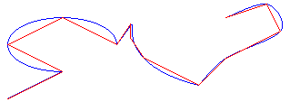

# How to: Flatten a Curved Path into a Line
A <xref:System.Drawing.Drawing2D.GraphicsPath> object stores a sequence of lines and Bézier splines. You can add several types of curves (ellipses, arcs, cardinal splines) to a path, but each curve is converted to a Bézier spline before it is stored in the path. Flattening a path consists of converting each Bézier spline in the path to a sequence of straight lines. The following illustration shows a path before and after flattening.  
  
   
  
### To Flatten a Path  
  
-   call the <xref:System.Drawing.Drawing2D.GraphicsPath.Flatten%2A> method of a <xref:System.Drawing.Drawing2D.GraphicsPath> object. The <xref:System.Drawing.Drawing2D.GraphicsPath.Flatten%2A> method receives a flatness argument that specifies the maximum distance between the flattened path and the original path.  
  
## See Also  
 <xref:System.Drawing.Drawing2D.GraphicsPath?displayProperty=nameWithType>  
 [Lines, Curves, and Shapes](../../../../docs/framework/winforms/advanced/lines-curves-and-shapes.md)  
 [Constructing and Drawing Paths](../../../../docs/framework/winforms/advanced/constructing-and-drawing-paths.md)
