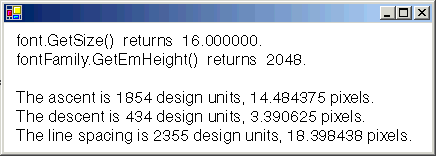

# How to: Obtain Font Metrics
The <xref:System.Drawing.FontFamily> class provides the following methods that retrieve various metrics for a particular family/style combination:  
  
-   <xref:System.Drawing.FontFamily.GetEmHeight%2A>(FontStyle)  
  
-   <xref:System.Drawing.FontFamily.GetCellAscent%2A>(FontStyle)  
  
-   <xref:System.Drawing.FontFamily.GetCellDescent%2A>(FontStyle)  
  
-   <xref:System.Drawing.FontFamily.GetLineSpacing%2A>(FontStyle)  
  
 The numbers returned by these methods are in font design units, so they are independent of the size and units of a particular <xref:System.Drawing.Font> object.  
  
 The following illustration shows the various metrics.  
  
   
  
## Example  
 The following example displays the metrics for the regular style of the Arial font family. The code also creates a <xref:System.Drawing.Font> object (based on the Arial family) with size 16 pixels and displays the metrics (in pixels) for that particular <xref:System.Drawing.Font> object.  
  
 The following illustration shows the output of the example code.  
  
   
  
 Note the first two lines of output in the preceding illustration. The <xref:System.Drawing.Font> object returns a size of 16, and the <xref:System.Drawing.FontFamily> object returns an em height of 2,048. These two numbers (16 and 2,048) are the key to converting between font design units and the units (in this case pixels) of the <xref:System.Drawing.Font> object.  
  
 For example, you can convert the ascent from design units to pixels as follows:  
  
   
  
 The following code positions text vertically by setting the <xref:System.Drawing.PointF.Y%2A> data member of a <xref:System.Drawing.PointF> object. The y-coordinate is increased by `font.Height` for each new line of text. The <xref:System.Drawing.Font.Height%2A> property of a <xref:System.Drawing.Font> object returns the line spacing (in pixels) for that particular <xref:System.Drawing.Font> object. In this example, the number returned by <xref:System.Drawing.Font.Height%2A> is 19. Note that this is the same as the number (rounded up to an integer) obtained by converting the line-spacing metric to pixels.  
  
 Note that the em height (also called size or em size) is not the sum of the ascent and the descent. The sum of the ascent and the descent is called the cell height. The cell height minus the internal leading is equal to the em height. The cell height plus the external leading is equal to the line spacing.  
  
 [!code-csharp[System.Drawing.FontsAndText#71](../../../../samples/snippets/csharp/VS_Snippets_Winforms/System.Drawing.FontsAndText/CS/Class1.cs#71)]
 [!code-vb[System.Drawing.FontsAndText#71](../../../../samples/snippets/visualbasic/VS_Snippets_Winforms/System.Drawing.FontsAndText/VB/Class1.vb#71)]  
  
## Compiling the Code  
 The preceding example is designed for use with Windows Forms, and it requires <xref:System.Windows.Forms.PaintEventArgs> `e`, which is a parameter of <xref:System.Windows.Forms.PaintEventHandler>.  
  
## See Also  
 [Graphics and Drawing in Windows Forms](../../../../docs/framework/winforms/advanced/graphics-and-drawing-in-windows-forms.md)  
 [Using Fonts and Text](../../../../docs/framework/winforms/advanced/using-fonts-and-text.md)
