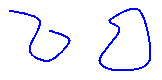
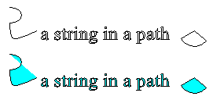

# Open and Closed Curves in GDI+
The following illustration shows two curves: one open and one closed.  
  
   
  
## Managed Interface for Curves  
 Closed curves have an interior and therefore can be filled with a brush. The <xref:System.Drawing.Graphics> class in [!INCLUDE[ndptecgdiplus](../../../../includes/ndptecgdiplus-md.md)] provides the following methods for filling closed shapes and curves: <xref:System.Drawing.Graphics.FillRectangle%2A>, <xref:System.Drawing.Graphics.FillEllipse%2A>, <xref:System.Drawing.Graphics.FillPie%2A>, <xref:System.Drawing.Graphics.FillPolygon%2A>, <xref:System.Drawing.Graphics.FillClosedCurve%2A>, <xref:System.Drawing.Graphics.FillPath%2A>, and <xref:System.Drawing.Graphics.FillRegion%2A>. Whenever you call one of these methods, you must pass one of the specific brush types (<xref:System.Drawing.SolidBrush>, <xref:System.Drawing.Drawing2D.HatchBrush>, <xref:System.Drawing.TextureBrush>, <xref:System.Drawing.Drawing2D.LinearGradientBrush>, or <xref:System.Drawing.Drawing2D.PathGradientBrush>) as an argument.  
  
 The <xref:System.Drawing.Graphics.FillPie%2A> method is a companion to the <xref:System.Drawing.Graphics.DrawArc%2A> method. Just as the <xref:System.Drawing.Graphics.DrawArc%2A> method draws a portion of the outline of an ellipse, the <xref:System.Drawing.Graphics.FillPie%2A> method fills a portion of the interior of an ellipse. The following example draws an arc and fills the corresponding portion of the interior of the ellipse:  
  
 [!code-csharp[LinesCurvesAndShapes#21](../../../../samples/snippets/csharp/VS_Snippets_Winforms/LinesCurvesAndShapes/CS/Class1.cs#21)]
 [!code-vb[LinesCurvesAndShapes#21](../../../../samples/snippets/visualbasic/VS_Snippets_Winforms/LinesCurvesAndShapes/VB/Class1.vb#21)]  
  
 The following illustration shows the arc and the filled pie.  
  
   
  
 The <xref:System.Drawing.Graphics.FillClosedCurve%2A> method is a companion to the <xref:System.Drawing.Graphics.DrawClosedCurve%2A> method. Both methods automatically close the curve by connecting the ending point to the starting point. The following example draws a curve that passes through (0, 0), (60, 20), and (40, 50). Then, the curve is automatically closed by connecting (40, 50) to the starting point (0, 0), and the interior is filled with a solid color.  
  
 [!code-csharp[LinesCurvesAndShapes#22](../../../../samples/snippets/csharp/VS_Snippets_Winforms/LinesCurvesAndShapes/CS/Class1.cs#22)]
 [!code-vb[LinesCurvesAndShapes#22](../../../../samples/snippets/visualbasic/VS_Snippets_Winforms/LinesCurvesAndShapes/VB/Class1.vb#22)]  
  
 The <xref:System.Drawing.Graphics.FillPath%2A> method fills the interiors of the separate pieces of a path. If a piece of a path doesn't form a closed curve or shape, the <xref:System.Drawing.Graphics.FillPath%2A> method automatically closes that piece of the path before filling it. The following example draws and fills a path that consists of an arc, a cardinal spline, a string, and a pie:  
  
 [!code-csharp[LinesCurvesAndShapes#23](../../../../samples/snippets/csharp/VS_Snippets_Winforms/LinesCurvesAndShapes/CS/Class1.cs#23)]
 [!code-vb[LinesCurvesAndShapes#23](../../../../samples/snippets/visualbasic/VS_Snippets_Winforms/LinesCurvesAndShapes/VB/Class1.vb#23)]  
  
 The following illustration shows the path with and without the solid fill. Note that the text in the string is outlined, but not filled, by the <xref:System.Drawing.Graphics.DrawPath%2A> method. It is the <xref:System.Drawing.Graphics.FillPath%2A> method that paints the interiors of the characters in the string.  
  
   
  
## See Also  
 <xref:System.Drawing.Drawing2D.GraphicsPath?displayProperty=nameWithType>  
 <xref:System.Drawing.Pen?displayProperty=nameWithType>  
 <xref:System.Drawing.Point?displayProperty=nameWithType>  
 [Lines, Curves, and Shapes](../../../../docs/framework/winforms/advanced/lines-curves-and-shapes.md)  
 [How to: Create Graphics Objects for Drawing](../../../../docs/framework/winforms/advanced/how-to-create-graphics-objects-for-drawing.md)  
 [Constructing and Drawing Paths](../../../../docs/framework/winforms/advanced/constructing-and-drawing-paths.md)
