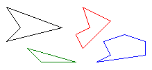
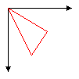

# Polygons in GDI+
A polygon is a closed shape with three or more straight sides. For example, a triangle is a polygon with three sides, a rectangle is a polygon with four sides, and a pentagon is a polygon with five sides. The following illustration shows several polygons.  
  
   
  
## Drawing a Polygon  
 To draw a polygon, you need a <xref:System.Drawing.Graphics> object, a <xref:System.Drawing.Pen> object, and an array of <xref:System.Drawing.Point> (or <xref:System.Drawing.PointF>) objects. The <xref:System.Drawing.Graphics> object provides the <xref:System.Drawing.Graphics.DrawPolygon%2A> method. The <xref:System.Drawing.Pen> object stores attributes, such as width and color, of the line used to render the polygon, and the array of <xref:System.Drawing.Point> objects stores the points to be connected by straight lines. The <xref:System.Drawing.Pen> object and the array of <xref:System.Drawing.Point> objects are passed as arguments to the <xref:System.Drawing.Graphics.DrawPolygon%2A> method. The following example draws a three-sided polygon. Note that there are only three points in `myPointArray`: (0, 0), (50, 30), and (30, 60). The <xref:System.Drawing.Graphics.DrawPolygon%2A> method automatically closes the polygon by drawing a line from (30, 60) back to the starting point (0, 0).  
  
 [!code-csharp[LinesCurvesAndShapes#111](../../../../samples/snippets/csharp/VS_Snippets_Winforms/LinesCurvesAndShapes/CS/Class1.cs#111)]
 [!code-vb[LinesCurvesAndShapes#111](../../../../samples/snippets/visualbasic/VS_Snippets_Winforms/LinesCurvesAndShapes/VB/Class1.vb#111)]  
  
 The following illustration shows the polygon.  
  
   
  
## See Also  
 <xref:System.Drawing.Graphics?displayProperty=nameWithType>  
 <xref:System.Drawing.Pen?displayProperty=nameWithType>  
 [Lines, Curves, and Shapes](../../../../docs/framework/winforms/advanced/lines-curves-and-shapes.md)  
 [How to: Create a Pen](../../../../docs/framework/winforms/advanced/how-to-create-a-pen.md)
