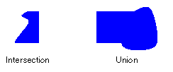
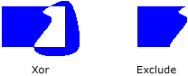

# Regions in GDI+
A region is a portion of the display area of an output device. Regions can be simple (a single rectangle) or complex (a combination of polygons and closed curves). The following illustration shows two regions: one constructed from a rectangle, and the other constructed from a path.  
  
   
  
## Using Regions  
 Regions are often used for clipping and hit testing. Clipping involves restricting drawing to a certain region of the display area, usually the portion that needs to be updated. Hit testing involves checking to determine whether the cursor is in a certain region of the screen when a mouse button is pressed.  
  
 You can construct a region from a rectangle or a path. You can also create complex regions by combining existing regions. The <xref:System.Drawing.Region> class provides the following methods for combining regions: <xref:System.Drawing.Region.Intersect%2A>, <xref:System.Drawing.Region.Union%2A>, <xref:System.Drawing.Region.Xor%2A>, <xref:System.Drawing.Region.Exclude%2A>, and <xref:System.Drawing.Region.Complement%2A>.  
  
 The intersection of two regions is the set of all points belonging to both regions. The union is the set of all points belonging to one or the other or both regions. The complement of a region is the set of all points that are not in the region. The following illustration shows the intersection and union of the two regions shown in the preceding illustration.  
  
   
  
 The <xref:System.Drawing.Region.Xor%2A> method, applied to a pair of regions, produces a region that contains all points that belong to one region or the other, but not both. The <xref:System.Drawing.Region.Exclude%2A> method, applied to a pair of regions, produces a region that contains all points in the first region that are not in the second region. The following illustration shows the regions that result from applying the <xref:System.Drawing.Region.Xor%2A> and <xref:System.Drawing.Region.Exclude%2A> methods to the two regions shown at the beginning of this topic.  
  
   
  
 To fill a region, you need a <xref:System.Drawing.Graphics> object, a <xref:System.Drawing.Brush> object, and a <xref:System.Drawing.Region> object. The <xref:System.Drawing.Graphics> object provides the <xref:System.Drawing.Graphics.FillRegion%2A> method, and the <xref:System.Drawing.Brush> object stores attributes of the fill, such as color or pattern. The following example fills a region with a solid color.  
  
 [!code-csharp[LinesCurvesAndShapes#61](../../../../samples/snippets/csharp/VS_Snippets_Winforms/LinesCurvesAndShapes/CS/Class1.cs#61)]
 [!code-vb[LinesCurvesAndShapes#61](../../../../samples/snippets/visualbasic/VS_Snippets_Winforms/LinesCurvesAndShapes/VB/Class1.vb#61)]  
  
## See Also  
 <xref:System.Drawing.Region?displayProperty=nameWithType>  
 [Lines, Curves, and Shapes](../../../../docs/framework/winforms/advanced/lines-curves-and-shapes.md)  
 [Using Regions](../../../../docs/framework/winforms/advanced/using-regions.md)
