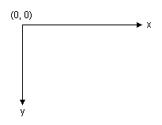
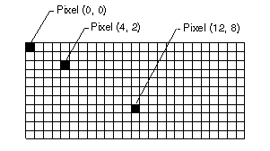
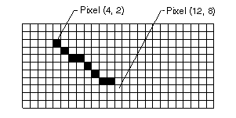

# Vector Graphics Overview
[!INCLUDE[ndptecgdiplus](../../../../includes/ndptecgdiplus-md.md)] draws lines, rectangles, and other shapes on a coordinate system. You can choose from a variety of coordinate systems, but the default coordinate system has the origin in the upper-left corner with the x-axis pointing to the right and the y-axis pointing down. The unit of measure in the default coordinate system is the pixel.  
  
## The Building Blocks of GDI+  
   
  
 A computer monitor creates its display on a rectangular array of dots called picture elements or pixels. The number of pixels that appear on the screen varies from one monitor to the next, and the number of pixels that appear on an individual monitor can usually be configured to some extent by the user.  
  
   
  
 When you use [!INCLUDE[ndptecgdiplus](../../../../includes/ndptecgdiplus-md.md)] to draw a line, rectangle, or curve, you provide certain key information about the item to be drawn. For example, you can specify a line by providing two points, and you can specify a rectangle by providing a point, a height, and a width. [!INCLUDE[ndptecgdiplus](../../../../includes/ndptecgdiplus-md.md)] works in conjunction with the display driver software to determine which pixels must be turned on to show the line, rectangle, or curve. The following illustration shows the pixels that are turned on to display a line from the point (4, 2) to the point (12, 8).  
  
   
  
 Over time, certain basic building blocks have proven to be the most useful for creating two-dimensional pictures. These building blocks, which are all supported by [!INCLUDE[ndptecgdiplus](../../../../includes/ndptecgdiplus-md.md)], are given in the following list:  
  
-   Lines  
  
-   Rectangles  
  
-   Ellipses  
  
-   Arcs  
  
-   Polygons  
  
-   Cardinal splines  
  
-   Bezier splines  
  
## Methods For Drawing with a Graphics Object  
 The <xref:System.Drawing.Graphics> class in [!INCLUDE[ndptecgdiplus](../../../../includes/ndptecgdiplus-md.md)] provides the following methods for drawing the items in the previous list: <xref:System.Drawing.Graphics.DrawLine%2A>, <xref:System.Drawing.Graphics.DrawRectangle%2A>, <xref:System.Drawing.Graphics.DrawEllipse%2A>, <xref:System.Drawing.Graphics.DrawPolygon%2A>, <xref:System.Drawing.Graphics.DrawArc%2A>, <xref:System.Drawing.Graphics.DrawCurve%2A> (for cardinal splines), and <xref:System.Drawing.Graphics.DrawBezier%2A>. Each of these methods is overloaded; that is, each method supports several different parameter lists. For example, one variation of the <xref:System.Drawing.Graphics.DrawLine%2A> method receives a <xref:System.Drawing.Pen> object and four integers, while another variation of the <xref:System.Drawing.Graphics.DrawLine%2A> method receives a <xref:System.Drawing.Pen> object and two <xref:System.Drawing.Point> objects.  
  
 The methods for drawing lines, rectangles, and Bézier splines have plural companion methods that draw several items in a single call: <xref:System.Drawing.Graphics.DrawLines%2A>, <xref:System.Drawing.Graphics.DrawRectangles%2A>, and <xref:System.Drawing.Graphics.DrawBeziers%2A>. Also, the <xref:System.Drawing.Graphics.DrawCurve%2A> method has a companion method, <xref:System.Drawing.Graphics.DrawClosedCurve%2A>, that closes a curve by connecting the ending point of the curve to the starting point.  
  
 All of the drawing methods of the <xref:System.Drawing.Graphics> class work in conjunction with a <xref:System.Drawing.Pen> object. To draw anything, you must create at least two objects: a <xref:System.Drawing.Graphics> object and a <xref:System.Drawing.Pen> object. The <xref:System.Drawing.Pen> object stores attributes, such as line width and color, of the item to be drawn. The <xref:System.Drawing.Pen> object is passed as one of the arguments to the drawing method. For example, one variation of the <xref:System.Drawing.Graphics.DrawLine%2A> method receives a <xref:System.Drawing.Pen> object and four integers as shown in the following example, which draws a rectangle with a width of 100, a height of 50 and an upper-left corner of (20, 10):  
  
 [!code-csharp[LinesCurvesAndShapes#11](../../../../samples/snippets/csharp/VS_Snippets_Winforms/LinesCurvesAndShapes/CS/Class1.cs#11)]
 [!code-vb[LinesCurvesAndShapes#11](../../../../samples/snippets/visualbasic/VS_Snippets_Winforms/LinesCurvesAndShapes/VB/Class1.vb#11)]  
  
## See Also  
 <xref:System.Drawing.Graphics?displayProperty=nameWithType>  
 <xref:System.Drawing.Pen?displayProperty=nameWithType>  
 [Lines, Curves, and Shapes](../../../../docs/framework/winforms/advanced/lines-curves-and-shapes.md)  
 [How to: Create Graphics Objects for Drawing](../../../../docs/framework/winforms/advanced/how-to-create-graphics-objects-for-drawing.md)
