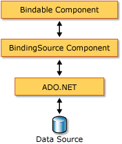

# BindingSource Component Overview
The <xref:System.Windows.Forms.BindingSource> component is designed to simplify the process of binding controls to an underlying data source. The <xref:System.Windows.Forms.BindingSource> component acts as both a conduit and a data source for other controls to bind to. It provides an abstraction of your form's data connection while passing through commands to the underlying list of data. Additionally, you can add data directly to it, so that the component itself functions as a data source.  
  
## BindingSource Component as an Intermediary  
 The <xref:System.Windows.Forms.BindingSource> component acts as the data source for some or all of the controls on the form. In Visual Studio, the <xref:System.Windows.Forms.BindingSource> can be bound to a control by means of the `DataBindings` property, which is accessible from the **Properties** window. Also see [How to: Bind Windows Forms Controls with the BindingSource Component Using the Designer](../../../../docs/framework/winforms/controls/bind-wf-controls-with-the-bindingsource.md).  
  
 You can bind the <xref:System.Windows.Forms.BindingSource> component to both simple data sources, like a single property of an object or a basic collection like <xref:System.Collections.ArrayList>, and complex data sources, like a database table. The <xref:System.Windows.Forms.BindingSource> component acts as an intermediary that provides binding and currency management services. At design time or run time, you can bind a <xref:System.Windows.Forms.BindingSource> component to a complex data source by setting its <xref:System.Windows.Forms.BindingSource.DataSource%2A> and <xref:System.Windows.Forms.BindingSource.DataMember%2A> properties to the database and table, respectively. The following illustration demonstrates where the <xref:System.Windows.Forms.BindingSource> component fits into the existing data-binding architecture.  
  
   
  
> [!NOTE]
>  At design time, some actions, like dragging a database table from a data window onto a blank form, will create the <xref:System.Windows.Forms.BindingSource> component, bind it to the underlying data source, and add data-aware controls all in one operation. Also see [Bind Windows Forms controls to data in Visual Studio](/visualstudio/data-tools/bind-windows-forms-controls-to-data-in-visual-studio).  
  
## BindingSource Component as a Data Source  
 If you start adding items to the <xref:System.Windows.Forms.BindingSource> component without first specifying a list to be bound to, the component will act like a list-style data source and accept these added items.  
  
 Additionally, you can write code to provide custom "AddNew" functionality by means of the <xref:System.Windows.Forms.BindingSource.AddingNew> event, which is raised when the <xref:System.Windows.Forms.BindingSource.AddNew%2A> method is called prior to the item being added to the list. For more information, see [BindingSource Component Architecture](../../../../docs/framework/winforms/controls/bindingsource-component-architecture.md).  
  
## Navigation  
 For users that need to navigate the data on a form, the <xref:System.Windows.Forms.BindingNavigator> component enables you to navigate and manipulate data, in coordination with a <xref:System.Windows.Forms.BindingSource> component. For more information, see [BindingNavigator Control](../../../../docs/framework/winforms/controls/bindingnavigator-control-windows-forms.md).  
  
## Data Manipulation  
 The: <xref:System.Windows.Forms.BindingSource> acts as a <xref:System.Windows.Forms.CurrencyManager> for all of its bindings and can, therefore, provide access to currency and position information regarding the data source. The following table shows the members that the <xref:System.Windows.Forms.BindingSource> component provides for accessing and manipulating the underlying data.  
  
|Member|Description|  
|------------|-----------------|  
|<xref:System.Windows.Forms.BindingSource.Current%2A> property|Gets the current item of the data source.|  
|<xref:System.Windows.Forms.BindingSource.Position%2A> property|Gets or sets the current position in the underlying list.|  
|<xref:System.Windows.Forms.BindingSource.List%2A> property|Gets the list that is the evaluation of the <xref:System.Windows.Forms.BindingSource.DataSource%2A> and <xref:System.Windows.Forms.BindingSource.DataMember%2A> evaluation. If <xref:System.Windows.Forms.BindingSource.DataMember%2A> is not set, returns the list specified by <xref:System.Windows.Forms.BindingSource.DataSource%2A>.|  
|<xref:System.Windows.Forms.BindingSource.Insert%2A> method|Inserts an item in the list at the specified index.|  
|<xref:System.Windows.Forms.BindingSource.RemoveCurrent%2A> method|Removes the current item from the list.|  
|<xref:System.Windows.Forms.BindingSource.EndEdit%2A> method|Applies pending changes to the underlying data source.|  
|<xref:System.Windows.Forms.BindingSource.CancelEdit%2A> method|Cancels the current edit operation.|  
|<xref:System.Windows.Forms.BindingSource.AddNew%2A> method|Adds a new item to the underlying list. If the data source implements <xref:System.ComponentModel.IBindingList> and returns an item from the <xref:System.Windows.Forms.BindingSource.AddingNew> event, adds this item. Otherwise, the request is passed to the list's <xref:System.ComponentModel.IBindingList.AddNew%2A> method. If the underlying list is not an <xref:System.ComponentModel.IBindingList>, the item is automatically created through its public default constructor.|  
  
## Sorting and Filtering  
 Usually, you should work with an ordered or filtered view of the data source. The following table shows the members that the <xref:System.Windows.Forms.BindingSource> component data source provides.  
  
|Member|Description|  
|------------|-----------------|  
|<xref:System.Windows.Forms.BindingSource.Sort%2A> property|If the data source is an <xref:System.ComponentModel.IBindingList>, gets or sets a column name used for sorting and sort order information. If the data source is an <xref:System.ComponentModel.IBindingListView> and supports advanced sorting, gets multiple column names used for sorting and sort order information|  
|<xref:System.Windows.Forms.BindingSource.Filter%2A> property|If the data source is an <xref:System.ComponentModel.IBindingListView>, gets or sets the expression used to filter which rows are viewed.|  
  
## See Also  
 <xref:System.Windows.Forms.BindingSource>  
 <xref:System.Windows.Forms.BindingNavigator>  
 [BindingSource Component Architecture](../../../../docs/framework/winforms/controls/bindingsource-component-architecture.md)  
 [BindingSource Component](../../../../docs/framework/winforms/controls/bindingsource-component.md)  
 [BindingNavigator Control](../../../../docs/framework/winforms/controls/bindingnavigator-control-windows-forms.md)  
 [Windows Forms Data Binding](../../../../docs/framework/winforms/windows-forms-data-binding.md)  
 [Controls to Use on Windows Forms](../../../../docs/framework/winforms/controls/controls-to-use-on-windows-forms.md)
