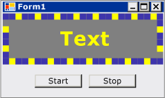

# Walkthrough: Creating a Windows Forms Control That Takes Advantage of Visual Studio Design-Time Features
The design-time experience for a custom control can be enhanced by authoring an associated custom designer.  
  
 This walkthrough illustrates how to create a custom designer for a custom control. You will implement a `MarqueeControl` type and an associated designer class, called `MarqueeControlRootDesigner`.  
  
 The `MarqueeControl` type implements a display similar to a theater marquee, with animated lights and flashing text.  
  
 The designer for this control interacts with the design environment to provide a custom design-time experience. With the custom designer, you can assemble a custom `MarqueeControl` implementation with animated lights and flashing text in many combinations. You can use the assembled control on a form like any other Windows Forms control.  
  
 Tasks illustrated in this walkthrough include:  
  
-   Creating the Project  
  
-   Creating a Control Library Project  
  
-   Referencing the Custom Control Project  
  
-   Defining a Custom Control and Its Custom Designer  
  
-   Creating an Instance of Your Custom Control  
  
-   Setting Up the Project for Design-Time Debugging  
  
-   Implementing Your Custom Control  
  
-   Creating a Child Control for Your Custom Control  
  
-   Create the MarqueeBorder Child Control  
  
-   Creating a Custom Designer to Shadow and Filter Properties  
  
-   Handling Component Changes  
  
-   Adding Designer Verbs to your Custom Designer  
  
-   Creating a Custom UITypeEditor  
  
-   Testing your Custom Control in the Designer  
  
 When you are finished, your custom control will look something like the following:  
  
   
  
 For the complete code listing, see [How to: Create a Windows Forms Control That Takes Advantage of Design-Time Features](http://msdn.microsoft.com/library/8e0bad0e-56f3-43d2-bf63-a945c654d97c).  
  
> [!NOTE]
>  The dialog boxes and menu commands you see might differ from those described in Help depending on your active settings or edition. To change your settings, choose **Import and Export Settings** on the **Tools** menu. For more information, see [Customizing Development Settings in Visual Studio](http://msdn.microsoft.com/library/22c4debb-4e31-47a8-8f19-16f328d7dcd3).  
  
## Prerequisites  
 In order to complete this walkthrough, you will need:  
  
-   Sufficient permissions to be able to create and run Windows Forms application projects on the computer where Visual Studio is installed.  
  
## Creating the Project  
 The first step is to create the application project. You will use this project to build the application that hosts the custom control.  
  
#### To create the project  
  
-   Create a Windows Forms Application project called "MarqueeControlTest." For more information, see [How to: Create a Windows Application Project](http://msdn.microsoft.com/library/b2f93fed-c635-4705-8d0e-cf079a264efa).  
  
## Creating a Control Library Project  
 The next step is to create the control library project. You will create a new custom control and its corresponding custom designer.  
  
#### To create the control library project  
  
1.  Add a Windows Forms Control Library project to the solution. Name the project "MarqueeControlLibrary."  
  
2.  Using **Solution Explorer**, delete the project's default control by deleting the source file named "UserControl1.cs" or "UserControl1.vb", depending on your language of choice. For more information, see [NIB:How to: Remove, Delete, and Exclude Items](http://msdn.microsoft.com/library/6dffdc86-29c8-4eff-bcd8-e3a0dd9e9a73).  
  
3.  Add a new <xref:System.Windows.Forms.UserControl> item to the `MarqueeControlLibrary` project. Give the new source file a base name of "MarqueeControl."  
  
4.  Using **Solution Explorer**, create a new folder in the `MarqueeControlLibrary` project. For more information, see [NIB:How to: Add New Project Items](http://msdn.microsoft.com/library/63d3e16b-de6e-4bb5-a0e3-ecec762201ce). Name the new folder "Design."  
  
5.  Right-click the **Design** folder and add a new class. Give the source file a base name of "MarqueeControlRootDesigner."  
  
6.  You will need to use types from the System.Design assembly, so add this reference to the `MarqueeControlLibrary` project.  
  
    > [!NOTE]
    >  To use the System.Design assembly, your project must target the full version of the .NET Framework, not the .NET Framework Client Profile. To change the target framework, see [How to: Target a Version of the .NET Framework](/visualstudio/ide/how-to-target-a-version-of-the-dotnet-framework).  
  
## Referencing the Custom Control Project  
 You will use the `MarqueeControlTest` project to test the custom control. The test project will become aware of the custom control when you add a project reference to the `MarqueeControlLibrary` assembly.  
  
#### To reference the custom control project  
  
-   In the `MarqueeControlTest` project, add a project reference to the `MarqueeControlLibrary` assembly. Be sure to use the **Projects** tab in the **Add Reference** dialog box instead of referencing the `MarqueeControlLibrary` assembly directly.  
  
## Defining a Custom Control and Its Custom Designer  
 Your custom control will derive from the <xref:System.Windows.Forms.UserControl> class. This allows your control to contain other controls, and it gives your control a great deal of default functionality.  
  
 Your custom control will have an associated custom designer. This allows you to create a unique design experience tailored specifically for your custom control.  
  
 You associate the control with its designer by using the <xref:System.ComponentModel.DesignerAttribute> class. Because you are developing the entire design-time behavior of your custom control, the custom designer will implement the <xref:System.ComponentModel.Design.IRootDesigner> interface.  
  
#### To define a custom control and its custom designer  
  
1.  Open the `MarqueeControl` source file in the **Code Editor**. At the top of the file, import the following namespaces:  
  
     [!code-csharp[System.Windows.Forms.Design.DocumentDesigner#220](../../../../samples/snippets/csharp/VS_Snippets_Winforms/System.Windows.Forms.Design.DocumentDesigner/CS/marqueecontrol.cs#220)]
     [!code-vb[System.Windows.Forms.Design.DocumentDesigner#220](../../../../samples/snippets/visualbasic/VS_Snippets_Winforms/System.Windows.Forms.Design.DocumentDesigner/VB/marqueecontrol.vb#220)]  
  
2.  Add the <xref:System.ComponentModel.DesignerAttribute> to the `MarqueeControl` class declaration. This associates the custom control with its designer.  
  
     [!code-csharp[System.Windows.Forms.Design.DocumentDesigner#240](../../../../samples/snippets/csharp/VS_Snippets_Winforms/System.Windows.Forms.Design.DocumentDesigner/CS/marqueecontrol.cs#240)]
     [!code-vb[System.Windows.Forms.Design.DocumentDesigner#240](../../../../samples/snippets/visualbasic/VS_Snippets_Winforms/System.Windows.Forms.Design.DocumentDesigner/VB/marqueecontrol.vb#240)]  
  
3.  Open the `MarqueeControlRootDesigner` source file in the **Code Editor**. At the top of the file, import the following namespaces:  
  
     [!code-csharp[System.Windows.Forms.Design.DocumentDesigner#520](../../../../samples/snippets/csharp/VS_Snippets_Winforms/System.Windows.Forms.Design.DocumentDesigner/CS/marqueecontrolrootdesigner.cs#520)]
     [!code-vb[System.Windows.Forms.Design.DocumentDesigner#520](../../../../samples/snippets/visualbasic/VS_Snippets_Winforms/System.Windows.Forms.Design.DocumentDesigner/VB/marqueecontrolrootdesigner.vb#520)]  
  
4.  Change the declaration of `MarqueeControlRootDesigner` to inherit from the <xref:System.Windows.Forms.Design.DocumentDesigner> class. Apply the <xref:System.ComponentModel.ToolboxItemFilterAttribute> to specify the designer interaction with the **Toolbox**.  
  
     **Note** The definition for the `MarqueeControlRootDesigner` class has been enclosed in a namespace called "MarqueeControlLibrary.Design." This declaration places the designer in a special namespace reserved for design-related types.  
  
     [!code-csharp[System.Windows.Forms.Design.DocumentDesigner#530](../../../../samples/snippets/csharp/VS_Snippets_Winforms/System.Windows.Forms.Design.DocumentDesigner/CS/marqueecontrolrootdesigner.cs#530)]
     [!code-vb[System.Windows.Forms.Design.DocumentDesigner#530](../../../../samples/snippets/visualbasic/VS_Snippets_Winforms/System.Windows.Forms.Design.DocumentDesigner/VB/marqueecontrolrootdesigner.vb#530)]  
  
5.  Define the constructor for the `MarqueeControlRootDesigner` class. Insert a <xref:System.Diagnostics.Trace.WriteLine%2A> statement in the constructor body. This will be useful for debugging purposes.  
  
     [!code-csharp[System.Windows.Forms.Design.DocumentDesigner#540](../../../../samples/snippets/csharp/VS_Snippets_Winforms/System.Windows.Forms.Design.DocumentDesigner/CS/marqueecontrolrootdesigner.cs#540)]
     [!code-vb[System.Windows.Forms.Design.DocumentDesigner#540](../../../../samples/snippets/visualbasic/VS_Snippets_Winforms/System.Windows.Forms.Design.DocumentDesigner/VB/marqueecontrolrootdesigner.vb#540)]  
  
## Creating an Instance of Your Custom Control  
 To observe the custom design-time behavior of your control, you will place an instance of your control on the form in `MarqueeControlTest` project.  
  
#### To create an instance of your custom control  
  
1.  Add a new <xref:System.Windows.Forms.UserControl> item to the `MarqueeControlTest` project. Give the new source file a base name of "DemoMarqueeControl."  
  
2.  Open the `DemoMarqueeControl` file in the **Code Editor**. At the top of the file, import the `MarqueeControlLibrary` namespace:  
  
```vb  
Imports MarqueeControlLibrary  
```  
  
```csharp  
using MarqueeControlLibrary;  
```  
  
1.  Change the declaration of `DemoMarqueeControl` to inherit from the `MarqueeControl` class.  
  
2.  Build the project.  
  
3.  Open `Form1` in the Windows Forms Designer.  
  
4.  Find the **MarqueeControlTest Components** tab in the **Toolbox** and open it. Drag a `DemoMarqueeControl` from the **Toolbox** onto your form.  
  
5.  Build the project.  
  
## Setting Up the Project for Design-Time Debugging  
 When you are developing a custom design-time experience, it will be necessary to debug your controls and components. There is a simple way to set up your project to allow debugging at design time. For more information, see [Walkthrough: Debugging Custom Windows Forms Controls at Design Time](../../../../docs/framework/winforms/controls/walkthrough-debugging-custom-windows-forms-controls-at-design-time.md).  
  
#### To set up the project for design-time debugging  
  
1.  Right-click the `MarqueeControlLibrary` project and select **Properties**.  
  
2.  In the "MarqueeControlLibrary Property Pages" dialog box, select the **Debug** page.  
  
3.  In the **Start Action** section, select **Start External Program**. You will be debugging a separate instance of Visual Studio, so click the ellipsis () button to browse for the Visual Studio IDE. The name of the executable file is devenv.exe, and if you installed to the default location, its path is %programfiles%\Microsoft Visual Studio 9.0\Common7\IDE\devenv.exe.  
  
4.  Click OK to close the dialog box.  
  
5.  Right-click the `MarqueeControlLibrary` project and select "Set as StartUp Project" to enable this debugging configuration.  
  
## Checkpoint  
 You are now ready to debug the design-time behavior of your custom control. Once you have determined that the debugging environment is set up correctly, you will test the association between the custom control and the custom designer.  
  
#### To test the debugging environment and the designer association  
  
1.  Open the `MarqueeControlRootDesigner` source file in the **Code Editor** and place a breakpoint on the <xref:System.Diagnostics.Trace.WriteLine%2A> statement.  
  
2.  Press F5 to start the debugging session. Note that a new instance of Visual Studio is created.  
  
3.  In the new instance of Visual Studio, open the "MarqueeControlTest" solution. You can easily find the solution by selecting **Recent Projects** from the **File** menu. The "MarqueeControlTest.sln" solution file will be listed as the most recently used file.  
  
4.  Open the `DemoMarqueeControl` in the designer. Note that the debugging instance of Visual Studio acquires focus and execution stops at your breakpoint. Press F5 to continue the debugging session.  
  
 At this point, everything is in place for you to develop and debug your custom control and its associated custom designer. The remainder of this walkthrough will concentrate on the details of implementing features of the control and the designer.  
  
## Implementing Your Custom Control  
 The `MarqueeControl` is a <xref:System.Windows.Forms.UserControl> with a little bit of customization. It exposes two methods: `Start`, which starts the marquee animation, and `Stop`, which stops the animation. Because the `MarqueeControl` contains child controls that implement the `IMarqueeWidget` interface, `Start` and `Stop` enumerate each child control and call the `StartMarquee` and `StopMarquee` methods, respectively, on each child control that implements `IMarqueeWidget`.  
  
 The appearance of the `MarqueeBorder` and `MarqueeText` controls is dependent on the layout, so `MarqueeControl` overrides the <xref:System.Windows.Forms.Control.OnLayout%2A> method and calls <xref:System.Windows.Forms.Control.PerformLayout%2A> on child controls of this type.  
  
 This is the extent of the `MarqueeControl` customizations. The run-time features are implemented by the `MarqueeBorder` and `MarqueeText` controls, and the design-time features are implemented by the `MarqueeBorderDesigner` and `MarqueeControlRootDesigner` classes.  
  
#### To implement your custom control  
  
1.  Open the `MarqueeControl` source file in the **Code Editor**. Implement the `Start` and `Stop` methods.  
  
     [!code-csharp[System.Windows.Forms.Design.DocumentDesigner#260](../../../../samples/snippets/csharp/VS_Snippets_Winforms/System.Windows.Forms.Design.DocumentDesigner/CS/marqueecontrol.cs#260)]
     [!code-vb[System.Windows.Forms.Design.DocumentDesigner#260](../../../../samples/snippets/visualbasic/VS_Snippets_Winforms/System.Windows.Forms.Design.DocumentDesigner/VB/marqueecontrol.vb#260)]  
  
2.  Override the <xref:System.Windows.Forms.Control.OnLayout%2A> method.  
  
     [!code-csharp[System.Windows.Forms.Design.DocumentDesigner#270](../../../../samples/snippets/csharp/VS_Snippets_Winforms/System.Windows.Forms.Design.DocumentDesigner/CS/marqueecontrol.cs#270)]
     [!code-vb[System.Windows.Forms.Design.DocumentDesigner#270](../../../../samples/snippets/visualbasic/VS_Snippets_Winforms/System.Windows.Forms.Design.DocumentDesigner/VB/marqueecontrol.vb#270)]  
  
## Creating a Child Control for Your Custom Control  
 The `MarqueeControl` will host two kinds of child control: the `MarqueeBorder` control and the `MarqueeText` control.  
  
-   `MarqueeBorder`: This control paints a border of "lights" around its edges. The lights flash in sequence, so they appear to be moving around the border. The speed at which the lights flash is controlled by a property called `UpdatePeriod`. Several other custom properties determine other aspects of the control's appearance. Two methods, called `StartMarquee` and `StopMarquee`, control when the animation starts and stops.  
  
-   `MarqueeText`: This control paints a flashing string. Like the `MarqueeBorder` control, the speed at which the text flashes is controlled by the `UpdatePeriod` property. The `MarqueeText` control also has the `StartMarquee` and `StopMarquee` methods in common with the `MarqueeBorder` control.  
  
 At design time, the `MarqueeControlRootDesigner` allows these two control types to be added to a `MarqueeControl` in any combination.  
  
 Common features of the two controls are factored into an interface called `IMarqueeWidget`. This allows the `MarqueeControl` to discover any Marquee-related child controls and give them special treatment.  
  
 To implement the periodic animation feature, you will use <xref:System.ComponentModel.BackgroundWorker> objects from the <xref:System.ComponentModel?displayProperty=nameWithType> namespace. You could use <xref:System.Windows.Forms.Timer> objects, but when many `IMarqueeWidget` objects are present, the single UI thread may be unable to keep up with the animation.  
  
#### To create a child control for your custom control  
  
1.  Add a new class item to the `MarqueeControlLibrary` project. Give the new source file a base name of "IMarqueeWidget."  
  
2.  Open the `IMarqueeWidget` source file in the **Code Editor** and change the declaration from `class` to `interface`:  
  
     [!code-csharp[System.Windows.Forms.Design.DocumentDesigner#2](../../../../samples/snippets/csharp/VS_Snippets_Winforms/System.Windows.Forms.Design.DocumentDesigner/CS/imarqueewidget.cs#2)]
     [!code-vb[System.Windows.Forms.Design.DocumentDesigner#2](../../../../samples/snippets/visualbasic/VS_Snippets_Winforms/System.Windows.Forms.Design.DocumentDesigner/VB/imarqueewidget.vb#2)]  
  
3.  Add the following code to the `IMarqueeWidget` interface to expose two methods and a property that manipulate the marquee animation:  
  
     [!code-csharp[System.Windows.Forms.Design.DocumentDesigner#3](../../../../samples/snippets/csharp/VS_Snippets_Winforms/System.Windows.Forms.Design.DocumentDesigner/CS/imarqueewidget.cs#3)]
     [!code-vb[System.Windows.Forms.Design.DocumentDesigner#3](../../../../samples/snippets/visualbasic/VS_Snippets_Winforms/System.Windows.Forms.Design.DocumentDesigner/VB/imarqueewidget.vb#3)]  
  
4.  Add a new **Custom Control** item to the `MarqueeControlLibrary` project. Give the new source file a base name of "MarqueeText."  
  
5.  Drag a <xref:System.ComponentModel.BackgroundWorker> component from the **Toolbox** onto your `MarqueeText` control. This component will allow the `MarqueeText` control to update itself asynchronously.  
  
6.  In the Properties window, set the <xref:System.ComponentModel.BackgroundWorker> component's `WorkerReportsProgess` and <xref:System.ComponentModel.BackgroundWorker.WorkerSupportsCancellation%2A> properties to `true`. These settings allow the <xref:System.ComponentModel.BackgroundWorker> component to periodically raise the <xref:System.ComponentModel.BackgroundWorker.ProgressChanged> event and to cancel asynchronous updates. For more information, see [BackgroundWorker Component](../../../../docs/framework/winforms/controls/backgroundworker-component.md).  
  
7.  Open the `MarqueeText` source file in the **Code Editor**. At the top of the file, import the following namespaces:  
  
     [!code-csharp[System.Windows.Forms.Design.DocumentDesigner#120](../../../../samples/snippets/csharp/VS_Snippets_Winforms/System.Windows.Forms.Design.DocumentDesigner/CS/marqueetext.cs#120)]
     [!code-vb[System.Windows.Forms.Design.DocumentDesigner#120](../../../../samples/snippets/visualbasic/VS_Snippets_Winforms/System.Windows.Forms.Design.DocumentDesigner/VB/marqueetext.vb#120)]  
  
8.  Change the declaration of `MarqueeText` to inherit from <xref:System.Windows.Forms.Label> and to implement the `IMarqueeWidget` interface:  
  
     [!code-csharp[System.Windows.Forms.Design.DocumentDesigner#130](../../../../samples/snippets/csharp/VS_Snippets_Winforms/System.Windows.Forms.Design.DocumentDesigner/CS/marqueetext.cs#130)]
     [!code-vb[System.Windows.Forms.Design.DocumentDesigner#130](../../../../samples/snippets/visualbasic/VS_Snippets_Winforms/System.Windows.Forms.Design.DocumentDesigner/VB/marqueetext.vb#130)]  
  
9. Declare the instance variables that correspond to the exposed properties, and initialize them in the constructor. The `isLit` field determines if the text is to be painted in the color given by the `LightColor` property.  
  
     [!code-csharp[System.Windows.Forms.Design.DocumentDesigner#140](../../../../samples/snippets/csharp/VS_Snippets_Winforms/System.Windows.Forms.Design.DocumentDesigner/CS/marqueetext.cs#140)]
     [!code-vb[System.Windows.Forms.Design.DocumentDesigner#140](../../../../samples/snippets/visualbasic/VS_Snippets_Winforms/System.Windows.Forms.Design.DocumentDesigner/VB/marqueetext.vb#140)]  
  
10. Implement the `IMarqueeWidget` interface.  
  
     The `StartMarquee` and `StopMarquee` methods invoke the <xref:System.ComponentModel.BackgroundWorker> component's <xref:System.ComponentModel.BackgroundWorker.RunWorkerAsync%2A> and <xref:System.ComponentModel.BackgroundWorker.CancelAsync%2A> methods to start and stop the animation.  
  
     The <xref:System.ComponentModel.CategoryAttribute.Category%2A> and <xref:System.ComponentModel.BrowsableAttribute.Browsable%2A> attributes are applied to the `UpdatePeriod` property so it appears in a custom section of the Properties window called "Marquee."  
  
     [!code-csharp[System.Windows.Forms.Design.DocumentDesigner#150](../../../../samples/snippets/csharp/VS_Snippets_Winforms/System.Windows.Forms.Design.DocumentDesigner/CS/marqueetext.cs#150)]
     [!code-vb[System.Windows.Forms.Design.DocumentDesigner#150](../../../../samples/snippets/visualbasic/VS_Snippets_Winforms/System.Windows.Forms.Design.DocumentDesigner/VB/marqueetext.vb#150)]  
  
11. Implement the property accessors. You will expose two properties to clients: `LightColor` and `DarkColor`. The <xref:System.ComponentModel.CategoryAttribute.Category%2A> and <xref:System.ComponentModel.BrowsableAttribute.Browsable%2A> attributes are applied to these properties, so the properties appear in a custom section of the Properties window called "Marquee."  
  
     [!code-csharp[System.Windows.Forms.Design.DocumentDesigner#160](../../../../samples/snippets/csharp/VS_Snippets_Winforms/System.Windows.Forms.Design.DocumentDesigner/CS/marqueetext.cs#160)]
     [!code-vb[System.Windows.Forms.Design.DocumentDesigner#160](../../../../samples/snippets/visualbasic/VS_Snippets_Winforms/System.Windows.Forms.Design.DocumentDesigner/VB/marqueetext.vb#160)]  
  
12. Implement the handlers for the <xref:System.ComponentModel.BackgroundWorker> component's <xref:System.ComponentModel.BackgroundWorker.DoWork> and <xref:System.ComponentModel.BackgroundWorker.ProgressChanged> events.  
  
     The <xref:System.ComponentModel.BackgroundWorker.DoWork> event handler sleeps for the number of milliseconds specified by `UpdatePeriod` then raises the <xref:System.ComponentModel.BackgroundWorker.ProgressChanged> event, until your code stops the animation by calling <xref:System.ComponentModel.BackgroundWorker.CancelAsync%2A>.  
  
     The <xref:System.ComponentModel.BackgroundWorker.ProgressChanged> event handler toggles the text between its light and dark state to give the appearance of flashing.  
  
     [!code-csharp[System.Windows.Forms.Design.DocumentDesigner#180](../../../../samples/snippets/csharp/VS_Snippets_Winforms/System.Windows.Forms.Design.DocumentDesigner/CS/marqueetext.cs#180)]
     [!code-vb[System.Windows.Forms.Design.DocumentDesigner#180](../../../../samples/snippets/visualbasic/VS_Snippets_Winforms/System.Windows.Forms.Design.DocumentDesigner/VB/marqueetext.vb#180)]  
  
13. Override the <xref:System.Windows.Forms.Control.OnPaint%2A> method to enable the animation.  
  
     [!code-csharp[System.Windows.Forms.Design.DocumentDesigner#170](../../../../samples/snippets/csharp/VS_Snippets_Winforms/System.Windows.Forms.Design.DocumentDesigner/CS/marqueetext.cs#170)]
     [!code-vb[System.Windows.Forms.Design.DocumentDesigner#170](../../../../samples/snippets/visualbasic/VS_Snippets_Winforms/System.Windows.Forms.Design.DocumentDesigner/VB/marqueetext.vb#170)]  
  
14. Press F6 to build the solution.  
  
## Create the MarqueeBorder Child Control  
 The `MarqueeBorder` control is slightly more sophisticated than the `MarqueeText` control. It has more properties and the animation in the <xref:System.Windows.Forms.Control.OnPaint%2A> method is more involved. In principle, it is quite similar to the `MarqueeText` control.  
  
 Because the `MarqueeBorder` control can have child controls, it needs to be aware of <xref:System.Windows.Forms.Control.Layout> events.  
  
#### To create the MarqueeBorder control  
  
1.  Add a new **Custom Control** item to the `MarqueeControlLibrary` project. Give the new source file a base name of "MarqueeBorder."  
  
2.  Drag a <xref:System.ComponentModel.BackgroundWorker> component from the **Toolbox** onto your `MarqueeBorder` control. This component will allow the `MarqueeBorder` control to update itself asynchronously.  
  
3.  In the Properties window, set the <xref:System.ComponentModel.BackgroundWorker> component's `WorkerReportsProgess` and <xref:System.ComponentModel.BackgroundWorker.WorkerSupportsCancellation%2A> properties to `true`. These settings allow the <xref:System.ComponentModel.BackgroundWorker> component to periodically raise the <xref:System.ComponentModel.BackgroundWorker.ProgressChanged> event and to cancel asynchronous updates. For more information, see [BackgroundWorker Component](../../../../docs/framework/winforms/controls/backgroundworker-component.md).  
  
4.  In the Properties window, click the Events button. Attach handlers for the <xref:System.ComponentModel.BackgroundWorker.DoWork> and <xref:System.ComponentModel.BackgroundWorker.ProgressChanged> events.  
  
5.  Open the `MarqueeBorder` source file in the **Code Editor**. At the top of the file, import the following namespaces:  
  
     [!code-csharp[System.Windows.Forms.Design.DocumentDesigner#20](../../../../samples/snippets/csharp/VS_Snippets_Winforms/System.Windows.Forms.Design.DocumentDesigner/CS/marqueeborder.cs#20)]
     [!code-vb[System.Windows.Forms.Design.DocumentDesigner#20](../../../../samples/snippets/visualbasic/VS_Snippets_Winforms/System.Windows.Forms.Design.DocumentDesigner/VB/marqueeborder.vb#20)]  
  
6.  Change the declaration of `MarqueeBorder` to inherit from <xref:System.Windows.Forms.Panel> and to implement the `IMarqueeWidget` interface.  
  
     [!code-csharp[System.Windows.Forms.Design.DocumentDesigner#30](../../../../samples/snippets/csharp/VS_Snippets_Winforms/System.Windows.Forms.Design.DocumentDesigner/CS/marqueeborder.cs#30)]
     [!code-vb[System.Windows.Forms.Design.DocumentDesigner#30](../../../../samples/snippets/visualbasic/VS_Snippets_Winforms/System.Windows.Forms.Design.DocumentDesigner/VB/marqueeborder.vb#30)]  
  
7.  Declare two enumerations for managing the `MarqueeBorder` control's state: `MarqueeSpinDirection`, which determines the direction in which the lights "spin" around the border, and `MarqueeLightShape`, which determines the shape of the lights (square or circular). Place these declarations before the `MarqueeBorder` class declaration.  
  
     [!code-csharp[System.Windows.Forms.Design.DocumentDesigner#97](../../../../samples/snippets/csharp/VS_Snippets_Winforms/System.Windows.Forms.Design.DocumentDesigner/CS/marqueeborder.cs#97)]
     [!code-vb[System.Windows.Forms.Design.DocumentDesigner#97](../../../../samples/snippets/visualbasic/VS_Snippets_Winforms/System.Windows.Forms.Design.DocumentDesigner/VB/marqueeborder.vb#97)]  
  
8.  Declare the instance variables that correspond to the exposed properties, and initialize them in the constructor.  
  
     [!code-csharp[System.Windows.Forms.Design.DocumentDesigner#40](../../../../samples/snippets/csharp/VS_Snippets_Winforms/System.Windows.Forms.Design.DocumentDesigner/CS/marqueeborder.cs#40)]
     [!code-vb[System.Windows.Forms.Design.DocumentDesigner#40](../../../../samples/snippets/visualbasic/VS_Snippets_Winforms/System.Windows.Forms.Design.DocumentDesigner/VB/marqueeborder.vb#40)]  
  
9. Implement the `IMarqueeWidget` interface.  
  
     The `StartMarquee` and `StopMarquee` methods invoke the <xref:System.ComponentModel.BackgroundWorker> component's <xref:System.ComponentModel.BackgroundWorker.RunWorkerAsync%2A> and <xref:System.ComponentModel.BackgroundWorker.CancelAsync%2A> methods to start and stop the animation.  
  
     Because the `MarqueeBorder` control can contain child controls, the `StartMarquee` method enumerates all child controls and calls `StartMarquee` on those that implement `IMarqueeWidget`. The `StopMarquee` method has a similar implementation.  
  
     [!code-csharp[System.Windows.Forms.Design.DocumentDesigner#50](../../../../samples/snippets/csharp/VS_Snippets_Winforms/System.Windows.Forms.Design.DocumentDesigner/CS/marqueeborder.cs#50)]
     [!code-vb[System.Windows.Forms.Design.DocumentDesigner#50](../../../../samples/snippets/visualbasic/VS_Snippets_Winforms/System.Windows.Forms.Design.DocumentDesigner/VB/marqueeborder.vb#50)]  
  
10. Implement the property accessors. The `MarqueeBorder` control has several properties for controlling its appearance.  
  
     [!code-csharp[System.Windows.Forms.Design.DocumentDesigner#60](../../../../samples/snippets/csharp/VS_Snippets_Winforms/System.Windows.Forms.Design.DocumentDesigner/CS/marqueeborder.cs#60)]
     [!code-vb[System.Windows.Forms.Design.DocumentDesigner#60](../../../../samples/snippets/visualbasic/VS_Snippets_Winforms/System.Windows.Forms.Design.DocumentDesigner/VB/marqueeborder.vb#60)]  
  
11. Implement the handlers for the <xref:System.ComponentModel.BackgroundWorker> component's <xref:System.ComponentModel.BackgroundWorker.DoWork> and <xref:System.ComponentModel.BackgroundWorker.ProgressChanged> events.  
  
     The <xref:System.ComponentModel.BackgroundWorker.DoWork> event handler sleeps for the number of milliseconds specified by `UpdatePeriod` then raises the <xref:System.ComponentModel.BackgroundWorker.ProgressChanged> event, until your code stops the animation by calling <xref:System.ComponentModel.BackgroundWorker.CancelAsync%2A>.  
  
     The <xref:System.ComponentModel.BackgroundWorker.ProgressChanged> event handler increments the position of the "base" light, from which the light/dark state of the other lights is determined, and calls the <xref:System.Windows.Forms.Control.Refresh%2A> method to cause the control to repaint itself.  
  
     [!code-csharp[System.Windows.Forms.Design.DocumentDesigner#90](../../../../samples/snippets/csharp/VS_Snippets_Winforms/System.Windows.Forms.Design.DocumentDesigner/CS/marqueeborder.cs#90)]
     [!code-vb[System.Windows.Forms.Design.DocumentDesigner#90](../../../../samples/snippets/visualbasic/VS_Snippets_Winforms/System.Windows.Forms.Design.DocumentDesigner/VB/marqueeborder.vb#90)]  
  
12. Implement the helper methods, `IsLit` and `DrawLight`.  
  
     The `IsLit` method determines the color of a light at a given position. Lights that are "lit" are drawn in the color given by the `LightColor` property, and those that are "dark" are drawn in the color given by the `DarkColor` property.  
  
     The `DrawLight` method draws a light using the appropriate color, shape, and position.  
  
     [!code-csharp[System.Windows.Forms.Design.DocumentDesigner#80](../../../../samples/snippets/csharp/VS_Snippets_Winforms/System.Windows.Forms.Design.DocumentDesigner/CS/marqueeborder.cs#80)]
     [!code-vb[System.Windows.Forms.Design.DocumentDesigner#80](../../../../samples/snippets/visualbasic/VS_Snippets_Winforms/System.Windows.Forms.Design.DocumentDesigner/VB/marqueeborder.vb#80)]  
  
13. Override the <xref:System.Windows.Forms.Control.OnLayout%2A> and <xref:System.Windows.Forms.Control.OnPaint%2A> methods.  
  
     The <xref:System.Windows.Forms.Control.OnPaint%2A> method draws the lights along the edges of the `MarqueeBorder` control.  
  
     Because the <xref:System.Windows.Forms.Control.OnPaint%2A> method depends on the dimensions of the `MarqueeBorder` control, you need to call it whenever the layout changes. To achieve this, override <xref:System.Windows.Forms.Control.OnLayout%2A> and call <xref:System.Windows.Forms.Control.Refresh%2A>.  
  
     [!code-csharp[System.Windows.Forms.Design.DocumentDesigner#70](../../../../samples/snippets/csharp/VS_Snippets_Winforms/System.Windows.Forms.Design.DocumentDesigner/CS/marqueeborder.cs#70)]
     [!code-vb[System.Windows.Forms.Design.DocumentDesigner#70](../../../../samples/snippets/visualbasic/VS_Snippets_Winforms/System.Windows.Forms.Design.DocumentDesigner/VB/marqueeborder.vb#70)]  
  
## Creating a Custom Designer to Shadow and Filter Properties  
 The `MarqueeControlRootDesigner` class provides the implementation for the root designer. In addition to this designer, which operates on the `MarqueeControl`, you will need a custom designer that is specifically associated with the `MarqueeBorder` control. This designer provides custom behavior that is appropriate in the context of the custom root designer.  
  
 Specifically, the `MarqueeBorderDesigner` will "shadow" and filter certain properties on the `MarqueeBorder` control, changing their interaction with the design environment.  
  
 Intercepting calls to a component's property accessor is known as "shadowing." It allows a designer to track the value set by the user and optionally pass that value to the component being designed.  
  
 For this example, the <xref:System.Windows.Forms.Control.Visible%2A> and <xref:System.Windows.Forms.Control.Enabled%2A> properties will be shadowed by the `MarqueeBorderDesigner`, which prevents the user from making the `MarqueeBorder` control invisible or disabled during design time.  
  
 Designers can also add and remove properties. For this example, the <xref:System.Windows.Forms.Control.Padding%2A> property will be removed at design time, because the `MarqueeBorder` control programmatically sets the padding based on the size of the lights specified by the `LightSize` property.  
  
 The base class for `MarqueeBorderDesigner` is <xref:System.ComponentModel.Design.ComponentDesigner>, which has methods that can change the attributes, properties, and events exposed by a control at design time:  
  
-   <xref:System.ComponentModel.Design.ComponentDesigner.PreFilterProperties%2A>  
  
-   <xref:System.ComponentModel.Design.ComponentDesigner.PostFilterProperties%2A>  
  
-   <xref:System.ComponentModel.Design.ComponentDesigner.PreFilterAttributes%2A>  
  
-   <xref:System.ComponentModel.Design.ComponentDesigner.PostFilterAttributes%2A>  
  
-   <xref:System.ComponentModel.Design.ComponentDesigner.PreFilterEvents%2A>  
  
-   <xref:System.ComponentModel.Design.ComponentDesigner.PostFilterEvents%2A>  
  
 When changing the public interface of a component using these methods, you must follow these rules:  
  
-   Add or remove items in the `PreFilter` methods only  
  
-   Modify existing items in the `PostFilter` methods only  
  
-   Always call the base implementation first in the `PreFilter` methods  
  
-   Always call the base implementation last in the `PostFilter` methods  
  
 Adhering to these rules ensures that all designers in the design-time environment have a consistent view of all components being designed.  
  
 The <xref:System.ComponentModel.Design.ComponentDesigner> class provides a dictionary for managing the values of shadowed properties, which relieves you of the need to create specific instance variables.  
  
#### To create a custom designer to shadow and filter properties  
  
1.  Right-click the **Design** folder and add a new class. Give the source file a base name of "MarqueeBorderDesigner."  
  
2.  Open the `MarqueeBorderDesigner` source file in the **Code Editor**. At the top of the file, import the following namespaces:  
  
     [!code-csharp[System.Windows.Forms.Design.DocumentDesigner#420](../../../../samples/snippets/csharp/VS_Snippets_Winforms/System.Windows.Forms.Design.DocumentDesigner/CS/marqueeborderdesigner.cs#420)]
     [!code-vb[System.Windows.Forms.Design.DocumentDesigner#420](../../../../samples/snippets/visualbasic/VS_Snippets_Winforms/System.Windows.Forms.Design.DocumentDesigner/VB/marqueeborderdesigner.vb#420)]  
  
3.  Change the declaration of `MarqueeBorderDesigner` to inherit from <xref:System.Windows.Forms.Design.ParentControlDesigner>.  
  
     Because the `MarqueeBorder` control can contain child controls, `MarqueeBorderDesigner` inherits from <xref:System.Windows.Forms.Design.ParentControlDesigner>, which handles the parent-child interaction.  
  
     [!code-csharp[System.Windows.Forms.Design.DocumentDesigner#430](../../../../samples/snippets/csharp/VS_Snippets_Winforms/System.Windows.Forms.Design.DocumentDesigner/CS/marqueeborderdesigner.cs#430)]
     [!code-vb[System.Windows.Forms.Design.DocumentDesigner#430](../../../../samples/snippets/visualbasic/VS_Snippets_Winforms/System.Windows.Forms.Design.DocumentDesigner/VB/marqueeborderdesigner.vb#430)]  
  
4.  Override the base implementation of <xref:System.ComponentModel.Design.ComponentDesigner.PreFilterProperties%2A>.  
  
     [!code-csharp[System.Windows.Forms.Design.DocumentDesigner#450](../../../../samples/snippets/csharp/VS_Snippets_Winforms/System.Windows.Forms.Design.DocumentDesigner/CS/marqueeborderdesigner.cs#450)]
     [!code-vb[System.Windows.Forms.Design.DocumentDesigner#450](../../../../samples/snippets/visualbasic/VS_Snippets_Winforms/System.Windows.Forms.Design.DocumentDesigner/VB/marqueeborderdesigner.vb#450)]  
  
5.  Implement the <xref:System.Windows.Forms.Control.Enabled%2A> and <xref:System.Windows.Forms.Control.Visible%2A> properties. These implementations shadow the control's properties.  
  
     [!code-csharp[System.Windows.Forms.Design.DocumentDesigner#440](../../../../samples/snippets/csharp/VS_Snippets_Winforms/System.Windows.Forms.Design.DocumentDesigner/CS/marqueeborderdesigner.cs#440)]
     [!code-vb[System.Windows.Forms.Design.DocumentDesigner#440](../../../../samples/snippets/visualbasic/VS_Snippets_Winforms/System.Windows.Forms.Design.DocumentDesigner/VB/marqueeborderdesigner.vb#440)]  
  
## Handling Component Changes  
 The `MarqueeControlRootDesigner` class provides the custom design-time experience for your `MarqueeControl` instances. Most of the design-time functionality is inherited from the <xref:System.Windows.Forms.Design.DocumentDesigner> class; your code will implement two specific customizations: handling component changes, and adding designer verbs.  
  
 As users design their `MarqueeControl` instances, your root designer will track changes to the `MarqueeControl` and its child controls. The design-time environment offers a convenient service, <xref:System.ComponentModel.Design.IComponentChangeService>, for tracking changes to component state.  
  
 You acquire a reference to this service by querying the environment with the <xref:System.ComponentModel.Design.ComponentDesigner.GetService%2A> method. If the query is successful, your designer can attach a handler for the <xref:System.ComponentModel.Design.IComponentChangeService.ComponentChanged> event and perform whatever tasks are required to maintain a consistent state at design time.  
  
 In the case of the `MarqueeControlRootDesigner` class, you will call the <xref:System.Windows.Forms.Control.Refresh%2A> method on each `IMarqueeWidget` object contained by the `MarqueeControl`. This will cause the `IMarqueeWidget` object to repaint itself appropriately when properties like its parent's <xref:System.Windows.Forms.Control.Size%2A> are changed.  
  
#### To handle component changes  
  
1.  Open the `MarqueeControlRootDesigner` source file in the **Code Editor** and override the <xref:System.Windows.Forms.Design.DocumentDesigner.Initialize%2A> method. Call the base implementation of <xref:System.Windows.Forms.Design.DocumentDesigner.Initialize%2A> and query for the <xref:System.ComponentModel.Design.IComponentChangeService>.  
  
     [!code-csharp[System.Windows.Forms.Design.DocumentDesigner#580](../../../../samples/snippets/csharp/VS_Snippets_Winforms/System.Windows.Forms.Design.DocumentDesigner/CS/marqueecontrolrootdesigner.cs#580)]
     [!code-vb[System.Windows.Forms.Design.DocumentDesigner#580](../../../../samples/snippets/visualbasic/VS_Snippets_Winforms/System.Windows.Forms.Design.DocumentDesigner/VB/marqueecontrolrootdesigner.vb#580)]  
  
2.  Implement the <xref:System.ComponentModel.Design.IComponentChangeService.OnComponentChanged%2A> event handler. Test the sending component's type, and if it is an `IMarqueeWidget`, call its <xref:System.Windows.Forms.Control.Refresh%2A> method.  
  
     [!code-csharp[System.Windows.Forms.Design.DocumentDesigner#560](../../../../samples/snippets/csharp/VS_Snippets_Winforms/System.Windows.Forms.Design.DocumentDesigner/CS/marqueecontrolrootdesigner.cs#560)]
     [!code-vb[System.Windows.Forms.Design.DocumentDesigner#560](../../../../samples/snippets/visualbasic/VS_Snippets_Winforms/System.Windows.Forms.Design.DocumentDesigner/VB/marqueecontrolrootdesigner.vb#560)]  
  
## Adding Designer Verbs to your Custom Designer  
 A designer verb is a menu command linked to an event handler. Designer verbs are added to a component's shortcut menu at design time. For more information, see <xref:System.ComponentModel.Design.DesignerVerb>.  
  
 You will add two designer verbs to your designers: **Run Test** and **Stop Test**. These verbs will allow you to view the run-time behavior of the `MarqueeControl` at design time. These verbs will be added to the `MarqueeControlRootDesigner`.  
  
 When **Run Test** is invoked, the verb event handler will call the `StartMarquee` method on the `MarqueeControl`. When **Stop Test** is invoked, the verb event handler will call the `StopMarquee` method on the `MarqueeControl`. The implementation of the `StartMarquee` and `StopMarquee` methods call these methods on contained controls that implement `IMarqueeWidget`, so any contained `IMarqueeWidget` controls will also participate in the test.  
  
#### To add designer verbs to your custom designers  
  
1.  In the `MarqueeControlRootDesigner` class, add event handlers named `OnVerbRunTest` and `OnVerbStopTest`.  
  
     [!code-csharp[System.Windows.Forms.Design.DocumentDesigner#570](../../../../samples/snippets/csharp/VS_Snippets_Winforms/System.Windows.Forms.Design.DocumentDesigner/CS/marqueecontrolrootdesigner.cs#570)]
     [!code-vb[System.Windows.Forms.Design.DocumentDesigner#570](../../../../samples/snippets/visualbasic/VS_Snippets_Winforms/System.Windows.Forms.Design.DocumentDesigner/VB/marqueecontrolrootdesigner.vb#570)]  
  
2.  Connect these event handlers to their corresponding designer verbs. `MarqueeControlRootDesigner` inherits a <xref:System.ComponentModel.Design.DesignerVerbCollection> from its base class. You will create two new <xref:System.ComponentModel.Design.DesignerVerb> objects and add them to this collection in the <xref:System.Windows.Forms.Design.DocumentDesigner.Initialize%2A> method.  
  
     [!code-csharp[System.Windows.Forms.Design.DocumentDesigner#590](../../../../samples/snippets/csharp/VS_Snippets_Winforms/System.Windows.Forms.Design.DocumentDesigner/CS/marqueecontrolrootdesigner.cs#590)]
     [!code-vb[System.Windows.Forms.Design.DocumentDesigner#590](../../../../samples/snippets/visualbasic/VS_Snippets_Winforms/System.Windows.Forms.Design.DocumentDesigner/VB/marqueecontrolrootdesigner.vb#590)]  
  
## Creating a Custom UITypeEditor  
 When you create a custom design-time experience for users, it is often desirable to create a custom interaction with the Properties window. You can accomplish this by creating a <xref:System.Drawing.Design.UITypeEditor>. For more information, see [How to: Create a UI Type Editor](http://msdn.microsoft.com/library/292c6e33-8d85-4012-9b51-05835a6f6dfd).  
  
 The `MarqueeBorder` control exposes several properties in the Properties window. Two of these properties, `MarqueeSpinDirection` and `MarqueeLightShape` are represented by enumerations. To illustrate the use of a UI type editor, the `MarqueeLightShape` property will have an associated <xref:System.Drawing.Design.UITypeEditor> class.  
  
#### To create a custom UI type editor  
  
1.  Open the `MarqueeBorder` source file in the **Code Editor**.  
  
2.  In the definition of the `MarqueeBorder` class, declare a class called `LightShapeEditor` that derives from <xref:System.Drawing.Design.UITypeEditor>.  
  
     [!code-csharp[System.Windows.Forms.Design.DocumentDesigner#96](../../../../samples/snippets/csharp/VS_Snippets_Winforms/System.Windows.Forms.Design.DocumentDesigner/CS/marqueeborder.cs#96)]
     [!code-vb[System.Windows.Forms.Design.DocumentDesigner#96](../../../../samples/snippets/visualbasic/VS_Snippets_Winforms/System.Windows.Forms.Design.DocumentDesigner/VB/marqueeborder.vb#96)]  
  
3.  Declare an <xref:System.Windows.Forms.Design.IWindowsFormsEditorService> instance variable called `editorService`.  
  
     [!code-csharp[System.Windows.Forms.Design.DocumentDesigner#92](../../../../samples/snippets/csharp/VS_Snippets_Winforms/System.Windows.Forms.Design.DocumentDesigner/CS/marqueeborder.cs#92)]
     [!code-vb[System.Windows.Forms.Design.DocumentDesigner#92](../../../../samples/snippets/visualbasic/VS_Snippets_Winforms/System.Windows.Forms.Design.DocumentDesigner/VB/marqueeborder.vb#92)]  
  
4.  Override the <xref:System.Drawing.Design.UITypeEditor.GetEditStyle%2A> method. This implementation returns <xref:System.Drawing.Design.UITypeEditorEditStyle.DropDown>, which tells the design environment how to display the `LightShapeEditor`.  
  
     [!code-csharp[System.Windows.Forms.Design.DocumentDesigner#93](../../../../samples/snippets/csharp/VS_Snippets_Winforms/System.Windows.Forms.Design.DocumentDesigner/CS/marqueeborder.cs#93)]
     [!code-vb[System.Windows.Forms.Design.DocumentDesigner#93](../../../../samples/snippets/visualbasic/VS_Snippets_Winforms/System.Windows.Forms.Design.DocumentDesigner/VB/marqueeborder.vb#93)]  
  
5.  Override the <xref:System.Drawing.Design.UITypeEditor.EditValue%2A> method. This implementation queries the design environment for an <xref:System.Windows.Forms.Design.IWindowsFormsEditorService> object. If successful, it creates a `LightShapeSelectionControl`. The <xref:System.Windows.Forms.Design.IWindowsFormsEditorService.DropDownControl%2A> method is invoked to start the `LightShapeEditor`. The return value from this invocation is returned to the design environment.  
  
     [!code-csharp[System.Windows.Forms.Design.DocumentDesigner#94](../../../../samples/snippets/csharp/VS_Snippets_Winforms/System.Windows.Forms.Design.DocumentDesigner/CS/marqueeborder.cs#94)]
     [!code-vb[System.Windows.Forms.Design.DocumentDesigner#94](../../../../samples/snippets/visualbasic/VS_Snippets_Winforms/System.Windows.Forms.Design.DocumentDesigner/VB/marqueeborder.vb#94)]  
  
## Creating a View Control for your Custom UITypeEditor  
  
1.  The `MarqueeLightShape` property supports two types of light shapes: `Square` and `Circle`. You will create a custom control used solely for the purpose of graphically displaying these values in the Properties window. This custom control will be used by your <xref:System.Drawing.Design.UITypeEditor> to interact with the Properties window.  
  
#### To create a view control for your custom UI type editor  
  
1.  Add a new <xref:System.Windows.Forms.UserControl> item to the `MarqueeControlLibrary` project. Give the new source file a base name of "LightShapeSelectionControl."  
  
2.  Drag two <xref:System.Windows.Forms.Panel> controls from the **Toolbox** onto the `LightShapeSelectionControl`. Name them `squarePanel` and `circlePanel`. Arrange them side by side. Set the <xref:System.Windows.Forms.Control.Size%2A> property of both <xref:System.Windows.Forms.Panel> controls to (60, 60). Set the <xref:System.Windows.Forms.Control.Location%2A> property of the `squarePanel` control to (8, 10). Set the <xref:System.Windows.Forms.Control.Location%2A> property of the `circlePanel` control to (80, 10). Finally, set the <xref:System.Windows.Forms.Control.Size%2A> property of the `LightShapeSelectionControl` to (150, 80).  
  
3.  Open the `LightShapeSelectionControl` source file in the **Code Editor**. At the top of the file, import the <xref:System.Windows.Forms.Design?displayProperty=nameWithType> namespace:  
  
```vb  
Imports System.Windows.Forms.Design  
```  
  
```csharp  
using System.Windows.Forms.Design;  
```  
  
1.  Implement <xref:System.Windows.Forms.Control.Click> event handlers for the `squarePanel` and `circlePanel` controls. These methods invoke <xref:System.Windows.Forms.Design.IWindowsFormsEditorService.CloseDropDown%2A> to end the custom <xref:System.Drawing.Design.UITypeEditor> editing session.  
  
     [!code-csharp[System.Windows.Forms.Design.DocumentDesigner#390](../../../../samples/snippets/csharp/VS_Snippets_Winforms/System.Windows.Forms.Design.DocumentDesigner/CS/lightshapeselectioncontrol.cs#390)]
     [!code-vb[System.Windows.Forms.Design.DocumentDesigner#390](../../../../samples/snippets/visualbasic/VS_Snippets_Winforms/System.Windows.Forms.Design.DocumentDesigner/VB/lightshapeselectioncontrol.vb#390)]  
  
2.  Declare an <xref:System.Windows.Forms.Design.IWindowsFormsEditorService> instance variable called `editorService`.  
  
```vb  
Private editorService As IWindowsFormsEditorService  
```  
  
```csharp  
private IWindowsFormsEditorService editorService;  
```  
  
1.  Declare a `MarqueeLightShape` instance variable called `lightShapeValue`.  
  
     [!code-csharp[System.Windows.Forms.Design.DocumentDesigner#330](../../../../samples/snippets/csharp/VS_Snippets_Winforms/System.Windows.Forms.Design.DocumentDesigner/CS/lightshapeselectioncontrol.cs#330)]
     [!code-vb[System.Windows.Forms.Design.DocumentDesigner#330](../../../../samples/snippets/visualbasic/VS_Snippets_Winforms/System.Windows.Forms.Design.DocumentDesigner/VB/lightshapeselectioncontrol.vb#330)]  
  
2.  In the `LightShapeSelectionControl` constructor, attach the <xref:System.Windows.Forms.Control.Click> event handlers to the `squarePanel` and `circlePanel` controls' <xref:System.Windows.Forms.Control.Click> events. Also, define a constructor overload that assigns the `MarqueeLightShape` value from the design environment to the `lightShapeValue` field.  
  
     [!code-csharp[System.Windows.Forms.Design.DocumentDesigner#340](../../../../samples/snippets/csharp/VS_Snippets_Winforms/System.Windows.Forms.Design.DocumentDesigner/CS/lightshapeselectioncontrol.cs#340)]
     [!code-vb[System.Windows.Forms.Design.DocumentDesigner#340](../../../../samples/snippets/visualbasic/VS_Snippets_Winforms/System.Windows.Forms.Design.DocumentDesigner/VB/lightshapeselectioncontrol.vb#340)]  
  
3.  In the <xref:System.ComponentModel.Component.Dispose%2A> method, detach the <xref:System.Windows.Forms.Control.Click> event handlers.  
  
     [!code-csharp[System.Windows.Forms.Design.DocumentDesigner#350](../../../../samples/snippets/csharp/VS_Snippets_Winforms/System.Windows.Forms.Design.DocumentDesigner/CS/lightshapeselectioncontrol.cs#350)]
     [!code-vb[System.Windows.Forms.Design.DocumentDesigner#350](../../../../samples/snippets/visualbasic/VS_Snippets_Winforms/System.Windows.Forms.Design.DocumentDesigner/VB/lightshapeselectioncontrol.vb#350)]  
  
4.  In **Solution Explorer**, click the **Show All Files** button. Open the LightShapeSelectionControl.Designer.cs or LightShapeSelectionControl.Designer.vb file, and remove the default definition of the <xref:System.ComponentModel.Component.Dispose%2A> method.  
  
5.  Implement the `LightShape` property.  
  
     [!code-csharp[System.Windows.Forms.Design.DocumentDesigner#360](../../../../samples/snippets/csharp/VS_Snippets_Winforms/System.Windows.Forms.Design.DocumentDesigner/CS/lightshapeselectioncontrol.cs#360)]
     [!code-vb[System.Windows.Forms.Design.DocumentDesigner#360](../../../../samples/snippets/visualbasic/VS_Snippets_Winforms/System.Windows.Forms.Design.DocumentDesigner/VB/lightshapeselectioncontrol.vb#360)]  
  
6.  Override the <xref:System.Windows.Forms.Control.OnPaint%2A> method. This implementation will draw a filled square and circle. It will also highlight the selected value by drawing a border around one shape or the other.  
  
     [!code-csharp[System.Windows.Forms.Design.DocumentDesigner#380](../../../../samples/snippets/csharp/VS_Snippets_Winforms/System.Windows.Forms.Design.DocumentDesigner/CS/lightshapeselectioncontrol.cs#380)]
     [!code-vb[System.Windows.Forms.Design.DocumentDesigner#380](../../../../samples/snippets/visualbasic/VS_Snippets_Winforms/System.Windows.Forms.Design.DocumentDesigner/VB/lightshapeselectioncontrol.vb#380)]  
  
## Testing your Custom Control in the Designer  
 At this point, you can build the `MarqueeControlLibrary` project. Test your implementation by creating a control that inherits from the `MarqueeControl` class and using it on a form.  
  
#### To create a custom MarqueeControl implementation  
  
1.  Open `DemoMarqueeControl` in the Windows Forms Designer. This creates an instance of the `DemoMarqueeControl` type and displays it in an instance of the `MarqueeControlRootDesigner` type.  
  
2.  In the **Toolbox**, open the **MarqueeControlLibrary Components** tab. You will see the `MarqueeBorder` and `MarqueeText` controls available for selection.  
  
3.  Drag an instance of the `MarqueeBorder` control onto the `DemoMarqueeControl` design surface. Dock this `MarqueeBorder` control to the parent control.  
  
4.  Drag an instance of the `MarqueeText` control onto the `DemoMarqueeControl` design surface.  
  
5.  Build the solution.  
  
6.  Right-click the `DemoMarqueeControl` and from the shortcut menu select the **Run Test** option to start the animation. Click **Stop Test** to stop the animation.  
  
7.  Open **Form1** in Design view.  
  
8.  Place two <xref:System.Windows.Forms.Button> controls on the form. Name them `startButton` and `stopButton`, and change the <xref:System.Windows.Forms.Control.Text%2A> property values to **Start** and **Stop**, respectively.  
  
9. Implement <xref:System.Windows.Forms.Control.Click> event handlers for both <xref:System.Windows.Forms.Button> controls.  
  
10. In the **Toolbox**, open the **MarqueeControlTest Components** tab. You will see the `DemoMarqueeControl` available for selection.  
  
11. Drag an instance of `DemoMarqueeControl` onto the **Form1** design surface.  
  
12. In the <xref:System.Windows.Forms.Control.Click> event handlers, invoke the `Start` and `Stop` methods on the `DemoMarqueeControl`.  
  
```vb  
Private Sub startButton_Click(sender As Object, e As System.EventArgs)  
    Me.demoMarqueeControl1.Start()  
End Sub 'startButton_Click  
  
Private Sub stopButton_Click(sender As Object, e As System.EventArgs)  
Me.demoMarqueeControl1.Stop()  
End Sub 'stopButton_Click  
```  
  
```csharp  
private void startButton_Click(object sender, System.EventArgs e)  
{  
    this.demoMarqueeControl1.Start();  
}  
  
private void stopButton_Click(object sender, System.EventArgs e)  
{  
    this.demoMarqueeControl1.Stop();  
}  
```  
  
1.  Set the `MarqueeControlTest` project as the startup project and run it. You will see the form displaying your `DemoMarqueeControl`. Click the **Start** button to start the animation. You should see the text flashing and the lights moving around the border.  
  
## Next Steps  
 The `MarqueeControlLibrary` demonstrates a simple implementation of custom controls and associated designers. You can make this sample more sophisticated in several ways:  
  
-   Change the property values for the `DemoMarqueeControl` in the designer. Add more `MarqueBorder` controls and dock them within their parent instances to create a nested effect. Experiment with different settings for the `UpdatePeriod` and the light-related properties.  
  
-   Author your own implementations of `IMarqueeWidget`. You could, for example, create a flashing "neon sign" or an animated sign with multiple images.  
  
-   Further customize the design-time experience. You could try shadowing more properties than <xref:System.Windows.Forms.Control.Enabled%2A> and <xref:System.Windows.Forms.Control.Visible%2A>, and you could add new properties. Add new designer verbs to simplify common tasks like docking child controls.  
  
-   License the `MarqueeControl`. For more information, see [How to: License Components and Controls](http://msdn.microsoft.com/library/8e66c1ed-a445-4b26-8185-990b6e2bbd57).  
  
-   Control how your controls are serialized and how code is generated for them. For more information, see [Dynamic Source Code Generation and Compilation](../../../../docs/framework/reflection-and-codedom/dynamic-source-code-generation-and-compilation.md).  
  
## See Also  
 <xref:System.Windows.Forms.UserControl>  
 <xref:System.Windows.Forms.Design.ParentControlDesigner>  
 <xref:System.Windows.Forms.Design.DocumentDesigner>  
 <xref:System.ComponentModel.Design.IRootDesigner>  
 <xref:System.ComponentModel.Design.DesignerVerb>  
 <xref:System.Drawing.Design.UITypeEditor>  
 <xref:System.ComponentModel.BackgroundWorker>  
 [How to: Create a Windows Forms Control That Takes Advantage of Design-Time Features](http://msdn.microsoft.com/library/8e0bad0e-56f3-43d2-bf63-a945c654d97c)  
 [Extending Design-Time Support](http://msdn.microsoft.com/library/d6ac8a6a-42fd-4bc8-bf33-b212811297e2)  
 [Custom Designers](http://msdn.microsoft.com/library/ca11988e-d38e-44d8-a05d-71362ae7844d)  
 [.NET Shape Library: A Sample Designer](http://windowsforms.net/articles/shapedesigner.aspx)
