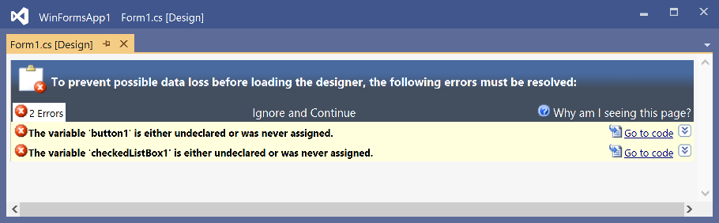
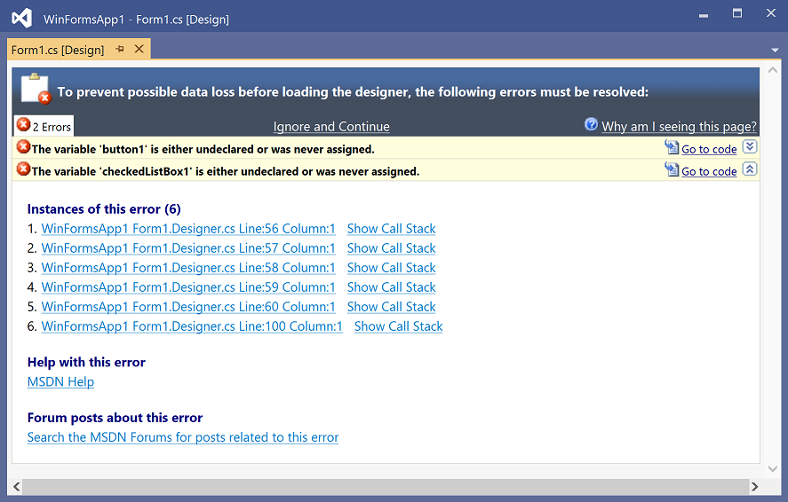

# Windows Forms Designer error page

If the Windows Forms Designer fails to load due to an error in your code, in a third-party component, or elsewhere, you'll see an error page instead of the designer. This error page does not necessarily signify a bug in the designer. The bug may be somewhere in the code-behind page that's named \<your-form-name>.Designer.cs. Errors appear in collapsible, yellow bars with a link to jump to the location of the error on the code page.

You can choose to ignore the errors and continue loading the designer by clicking **Ignore and Continue**. This action may result in unexpected behavior, for example, controls may not appear on the design surface.

## Instances of this error

When the yellow error bar is expanded, each instance of the error is listed. Many error types include an exact location in the following format: *[Project Name]* *[Form Name]* Line:*[Line Number]* Column:*[Column Number]*. If a call stack is associated with the error, you can click the **Show Call Stack** link to see it. Examining the call stack may further help you resolve the error.

> [!NOTE]
> - For Visual Basic apps, the design-time error page does not display more than one error, but it may display multiple instances of the same error.
> - For C++ apps, errors don't have code location links.

## Help with this error

If a help topic for the error is available, click the **MSDN Help** link to navigate directly to the help page on docs.microsoft.com.

## Forum posts about this error

Click the **Search the MSDN Forums for posts related to this error** link to navigate to the Microsoft Developer Network forums. You may want to specifically search the [Windows Forms Designer](https://social.msdn.microsoft.com/Forums/windows/home?forum=winformsdesigner) or [Windows Forms](https://social.msdn.microsoft.com/Forums/windows/home?category=windowsforms) forums.

## Design-time errors

This section lists some of the errors you may encounter.

### '\<identifier name>' is not a valid identifier

This error indicates that a field, method, event, or object is improperly named.

### '\<name>' already exists in '\<project name>'

Error message: "'\<name>' already exists in '\<project name>'. Please enter a unique name."

You've specified a name for an inherited form that already exists in the project. To correct this error, give the inherited form a unique name.

### '\<Toolbox tab name>' is not a toolbox category

A third-party designer has tried to access a tab on the Toolbox that does not exist. Contact the component vendor.

### A requested language parser is not installed

Error message: "A requested language parser is not installed. The language parser name is '{0}'."

Visual Studio attempted to a load a designer that's registered for the file type but could not. This is most likely because of an error that occurred during setup. Contact the vendor of the language you're using for a fix.

### A service required for generating and parsing source code is missing

This is a problem with a third-party component. Contact the component vendor.

### An exception occurred while trying to create an instance of '\<object name>'

Error message: "An exception occurred while trying to create an instance of '\<object name>'. The exception was "\<exception string\>".

A third-party designer requested that Visual Studio create an object, but the object raised an error. Contact the component vendor.

### Another editor has '\<document name>' open in an incompatible mode

Error message: "Another editor has '\<document name>' open in an incompatible mode. Please close the editor and try this operation again."

This error arises if you try to open a file that is already opened in another editor. The editor that already has the file open is shown. To correct this error, close the editor that has the file open, and try again.

## Another editor has made changes to '\<document name>'

Close and reopen the designer for the changes to take effect. Normally, Visual Studio automatically reloads a designer after changes are made. However, other designers, such as third-party component designers, may not support reload behavior. In this case, Visual Studio prompts you to close and reopen the designer manually.

### Another editor has the file open in an incompatible mode

Error message: "Another editor has the file open in an incompatible mode. Please close the editor and try this operation again."

This message is similar to "Another editor has '\<document name>' open in an incompatible mode", but Visual Studio is unable to determine the file name. To correct this error, close the editor that has the file open, and try again.

### Array rank '\<rank in array>' is too high

Visual Studio only supports single-dimension arrays in the code block that's parsed by the designer. Multidimensional arrays are valid outside this area.

### Assembly '\<assembly name>' could not be opened

Error message: "Assembly '\<assembly name>' could not be opened. Verify that the file still exists."

This error message arises when you try to open a file that could not be opened. Verify that the file exists and is a valid assembly.

### Bad element type. This serializer expects an element of type '\<type name>'

This is a problem with a third-party component. Contact the component vendor.

### Cannot access the Visual Studio Toolbox at this time

Visual Studio made a call to the Toolbox, which was not available. If you see this error, If you see this error, please log an issue by using [Report a Problem](/visualstudio/ide/how-to-report-a-problem-with-visual-studio).

### Cannot bind an event handler to the '\<event name>' event because it is read-only

This error most often arises when you've tried to connect an event to a control that's inherited from a base class. If the control's member variable is private, Visual Studio cannot connect the event to the method. Privately inherited controls cannot have additional events bound to them.

### Cannot create a method name for the requested component because it is not a member of the design container

Visual Studio has tried to add an event handler to a component that does not have a member variable in the designer. Contact the component vendor.

### Cannot name the object '\<name>' because it is already named '\<name>'

This is an internal error in the Visual Studio serializer. It indicates that the serializer has tried to name an object twice, which is not supported. If you see this error, please log an issue by using [Report a Problem](/visualstudio/ide/how-to-report-a-problem-with-visual-studio).

### Cannot remove or destroy inherited component '\<component name>'

Inherited controls are under the ownership of their inheriting class. Changes to the inherited control must be made in the class from which the control originates. Thus, you cannot rename or destroy it.

### Category '\<Toolbox tab name>' does not have a tool for class '\<class name>'

The designer tried to reference a class on a particular Toolbox tab, but the class does not exist. Contact the component vendor.

### Class '\<class name>' has no matching constructor

A third-party designer has asked Visual Studio to create an object with particular parameters in the constructor that does not exist. Contact the component vendor.

### Code generation for property '\<property name>' failed

This is a generic wrapper for an error. The error string that accompanies this message will give more details about the error message and have a link to a more specific help topic. To correct this error, address the error specified in the error message appended to this error.

### Component '\<component name>' did not call Container.Add() in its constructor

This is an error in the component you just loaded or placed on the form. It indicates that the component did not add itself to its container control (whether that is another control or a form). The designer will continue to work, but there may be problems with the component at run time.

To correct the error, contact the component vendor. Or, if it is a component you created, call the `IContainer.Add` method in the component's constructor.

### Component name cannot be empty

This error arises when you try to rename a component to an empty value.

### Could not access the variable '\<variable name>' because it has not been initialized yet

This error can arise because of two scenarios. Either a third-party component vendor has a problem with a control or component they have distributed, or the code you have written has recursive dependencies between components.

To correct this error, ensure that your code does not have a recursive dependency. If it is free of such problems, note the exact text of the error message and contact the component vendor.

### Could not find type '\<type name>'

Error message: "Could not find type '\<type name>'. Please make sure that the assembly that contains this type is referenced. If this type is a part of your development project, make sure that the project has been successfully built."

This error occurred because a reference was not found. Make sure the type indicated in the error message is referenced, and that any assemblies that the type requires are also referenced. Often, the problem is that a control in the solution has not been built. To build, select **Build Solution** from the **Build** menu. Otherwise, if the control has already been built, add a reference manually from the right-click menu of the **References** or **Dependencies** folder in Solution Explorer.

### Could not load type '\<type name>'

Error message: "Could not load type '\<type name>'. Please make sure that the assembly containing this type is added to the project references."

Visual Studio attempted to wire up an event-handling method and could not find one or more parameter types for the method. This is usually caused by a missing reference. To correct this error, add the reference containing the type to the project and try again.

### Could not locate the project item templates for inherited components

The templates for inherited forms in Visual Studio are not available. If you see this error, please log an issue by using [Report a Problem](/visualstudio/ide/how-to-report-a-problem-with-visual-studio).

### Delegate class '\<class name>' has no invoke method. Is this class a delegate?

Visual Studio has tried to create an event handler, but there is something wrong with the event type. This can happen if the event was created by a non-CLS-compliant language. Contact the component vendor.

### Duplicate declaration of member '\<member name>'

This error arises because a member variable has been declared twice (for example, two controls named `Button1` are declared in the code). Names must be unique across inherited forms. Additionally, names cannot differ only by case.

### Error reading resources from the resource file for the culture '\<culture name>'

This error can occur if there is a bad .resx file in the project.

To correct this error:

1. Click the **Show All Files** button in Solution Explorer to view the .resx files associated with the solution.
2. Load the .resx file in the XML Editor by right-clicking the .resx file and choosing **Open**.
3. Edit the .resx file manually to address the errors.

### Error reading resources from the resource file for the default culture '\<culture name>'

This error can occur if there is a bad .resx file in the project for the default culture.

To correct this error:

1. Click the **Show All Files** button in Solution Explorer to view the .resx files associated with the solution.
2. Load the .resx file in the XML Editor by right-clicking the .resx file and choosing **Open**.
3. Edit the .resx file manually to address the errors.

### Failed to parse method '\<method name>'

Error message: "Failed to parse method '\<method name>'. The parser reported the following error: '\<error string>'. Please look in the Task List for potential errors."

This is a general error message for problems that arise during parsing. These errors are often due to syntax errors. See the Task List for specific messages related to the error.

### Invalid component name: '\<component name>'

You've tried to rename a component to an invalid value for that language. To correct this error, name the component such that it complies with the naming rules for that language.

### The type '\<class name>' is made of several partial classes in the same file

When you define a class in multiple files by using the [partial](/dotnet/csharp/language-reference/keywords/partial-type) keyword, you can only have one partial definition in each file.

To correct this error, remove all but one of the partial definitions of your class from the file.

### The assembly '\<assembly name>' could not be found

Error message: "The assembly '\<assembly name>' could not be found. Ensure that the assembly is referenced. If the assembly is part of the current development project, ensure that the project has been built."

This error is similar to "The type '\<type name>' could not be found", but this error usually happens because of a metadata attribute. To correct this error, check that all assemblies used by attributes are referenced.

### The assembly name '\<assembly name>' is invalid

A component has requested a particular assembly, but the name provided by the component is not a valid assembly name. Contact the component vendor.

### The base class '\<class name>' cannot be designed

Visual Studio loaded the class, but the class cannot be designed because the implementer of the class did not provide a designer. If the class supports a designer, make sure there are no problems that would cause issues with displaying it in a designer, such as compiler errors. Also, make sure that all references to the class are correct and all class names are correctly spelled. Otherwise, if the class is not designable, edit it in Code view.

### The base class '\<class name>' could not be loaded

The class is not referenced in the project, so Visual Studio can't load it. To correct this error, add a reference to the class in the project, and close and reopen the Windows Forms Designer window.

### The class '\<class name>' cannot be designed in this version of Visual Studio

The designer for this control or component does not support the same types that Visual Studio does. Contact the component vendor.

### The class name is not a valid identifier for this language

The source code being created by the user has a class name that is not valid for the language being used. To correct this error, name the class such that it conforms to the language requirements.

### The component cannot be added because it contains a circular reference to '\<reference name>'

You cannot add a control or component to itself. Another situation where this might occur is if there is code in the InitializeComponent method of a form (for example, Form1) that creates another instance of Form1.

### The designer cannot be modified at this time

This error occurs when the file in the editor is marked as read-only. Ensure that the file is not marked read-only and the application is not running.

### The designer could not be shown for this file because none of the classes within it can be designed

This error occurs when Visual Studio cannot find a base class that satisfies designer requirements. Forms and controls must derive from a base class that supports designers. If you're deriving from an inherited form or control, make sure the project has been built.

### The designer for base class '\<class name>' is not installed

Visual Studio could not load the designer for the class. If you see this error, please log an issue by using [Report a Problem](/visualstudio/ide/how-to-report-a-problem-with-visual-studio).

### The designer must create an instance of type '\<type name>', but it can't because the type is declared as abstract

This error occurred because the base class of the object being passed to the designer is [abstract](/dotnet/csharp/language-reference/keywords/abstract), which is not allowed.

### The file could not be loaded in the designer

The base class of this file does not support any designers. As a workaround, use Code view to work on the file. Right-click the file in Solution Explorer and choose **View Code**.

### The language for this file does not support the necessary code parsing and generation services

Error message: "The language for this file does not support the necessary code parsing and generation services. Please ensure the file you are opening is a member of a project and then try to open the file again."

This error most likely resulted from opening a file that's in a project that does not support designers.

### The language parser class '\<class name>' is not implemented properly

Error message: "The language parser class '\<class name>' is not implemented properly. Contact the vendor for an updated parser module."

The language in use has registered a designer class that doesn't derive from the correct base class. Contact the vendor of the language you're using.

### The name '\<name>' is already used by another object

This is an internal error in the Visual Studio serializer. If you see this error, please log an issue by using [Report a Problem](/visualstudio/ide/how-to-report-a-problem-with-visual-studio).

### The object '\<object name>' does not implement the IComponent interface

Visual Studio tried to create a component, but the object created does not implement the <xref:System.ComponentModel.IComponent> interface. Contact the component vendor for a fix.

### The object '\<object name>' returned null for the property '\<property name>' but this is not allowed

There are some .NET properties that should always return an object. For example, the **Controls** collection of a form should always return an object, even when there are no controls in it.

To correct this error, ensure that the property specified in the error is not null.

### The serialization data object is not of the proper type

A data object offered by the serializer is not an instance of a type that matches the current serializer being used. Contact the component vendor.

### The service '\<service name>' is required, but could not be located

Error message: "The service '\<service name>' is required, but could not be located. There may be a problem with your Visual Studio installation."

A service required by Visual Studio is unavailable. If you were trying to load a project that does not support that designer, use the Code Editor to make the changes you require. Otherwise, If you see this error, please log an issue by using [Report a Problem](/visualstudio/ide/how-to-report-a-problem-with-visual-studio).

### The service instance must derive from or implement '\<interface name>'

This error indicates that a component or component designer has called the **AddService** method, which requires an interface and object, but the object specified does not implement the interface specified. Contact the component vendor.

### The text in the code window could not be modified

Error message: "The text in the code window could not be modified. Check that the file is not read-only and there is sufficient disk space."

This error occurs when Visual Studio is unable to edit a file due to disk space or memory problems, or the file is marked read-only.

### The Toolbox enumerator object only supports retrieving one item at a time

If you see this error, If you see this error, please log an issue by using [Report a Problem](/visualstudio/ide/how-to-report-a-problem-with-visual-studio).

### The Toolbox item for '\<component name>' could not be retrieved from the Toolbox

Error message: "The Toolbox item for '\<component name>' could not be retrieved from the Toolbox. Make sure the assembly that contains the Toolbox item is correctly installed. The Toolbox item raised the following error: \<error string>."

The component in question threw an exception when Visual Studio accessed it. Contact the component vendor.

### The Toolbox item for '\<Toolbox item name>' could not be retrieved from the Toolbox

Error message: "The Toolbox item for '\<Toolbox item name>' could not be retrieved from the Toolbox. Try removing the item from the Toolbox and adding it back."

This error occurs if the data within the Toolbox item becomes corrupted or the version of the component has changed. Try removing the item from the Toolbox and adding it back again.

### The type '\<type name>' could not be found

Error message: "The type '\<type name>' could not be found. Ensure that the assembly containing the type is referenced. If the assembly is part of the current development project, ensure that the project has been built."

While loading the designer, Visual Studio failed to find a type. Ensure that the assembly containing the type is referenced. If the assembly is part of the current development project, ensure that the project has been built.

### The type resolution service may only be called from the main application thread

Visual Studio attempted to access required resources from the wrong thread. This error is displayed when the code used to create the designer has called the type resolution service from a thread other than the main application thread. To correct this error, call the service from the correct thread or contact the component vendor.

### The variable '\<variable name>' is either undeclared or was never assigned

The source code has a reference to a variable, such as **Button1**, that isn't declared or assigned. If the variable has not been assigned, this message appears as a warning, not an error.

### There is already a command handler for the menu command '\<menu command name>'

This error arises if a third-party designer adds a command that already has a handler to the command table. Contact the component vendor.

### There is already a component named '\<component name>'

Error message: "There is already a component named '\<component name>'. Components must have unique names, and names must not be case-sensitive. A name also cannot conflict with the name of any component in an inherited class."

This error message arises when there has been a change to the name of a component in the Properties window. To correct this error, ensure that all component names are unique, are not case-sensitive, and do not conflict with the names of any components in the inherited classes.

### There is already a Toolbox item creator registered for the format '\<format name>'

A third-party component made a callback to an item on a Toolbox tab, but the item already contained a callback. Contact the component vendor.

### This language engine does not support a CodeModel with which to load a designer

This message is similar to "The language for this file does not support the necessary code parsing and generation services", but this message involves an internal registration problem. If you see this error, If you see this error, please log an issue by using [Report a Problem](/visualstudio/ide/how-to-report-a-problem-with-visual-studio).

### Type '\<type name\>' does not have a constructor with parameters of types '\<parameter type names>'

Visual Studio could not find a [constructor](/dotnet/csharp/programming-guide/classes-and-structs/constructors) that had matching parameters. This may be the result of supplying a constructor with types other than those that are required. For example, a **Point** constructor might take two integers. If you provided floats, this error is raised.

To correct this error, use a different constructor or explicitly cast the parameter types such that they match those provided by the constructor.

### Unable to add reference '\<reference name>' to the current application

Error message: "Unable to add reference '\<reference name>' to the current application. Check that a different version of '\<reference name>' is not already referenced."

Visual Studio is unable to add a reference. To correct this error, check that a different version of the reference is not already referenced.

### Unable to check out the current file

Error message: "Unable to check out the current file. The file may be locked, or you may need to check out the file manually."

This error arises when you change a file that's currently checked in to source-code control. Usually, Visual Studio presents the file checkout dialog box so that the user can check out the file. This time, the file was not checked out, perhaps because of a merge conflict during checkout. To correct this error, ensure that the file is not locked, and then try to check out the file manually.

### Unable to find page named '\<Options dialog box tab name>'

This error arises when a component designer requests access to a page from the Options dialog box by using a name that does not exist. Contact the component vendor.

### Unable to find property '\<property name>' on page '\<Options dialog box tab name>'

This error arises when a component designer requests access to a particular value on a page from the Options dialog box, but that value does not exist. Contact the component vendor.

### Visual Studio cannot open a designer for the file because the class within it does not inherit from a class that can be visually designed

Visual Studio loaded the class, but the designer for that class could not be loaded. Visual Studio requires that designers use the first class in a file. To correct this error, move the class code so that it is the first class in the file, and then load the designer again.

### Visual Studio cannot save or load instances of the type '\<type name>'

This is a problem with a third-party component. Contact the component vendor.

### Visual Studio is unable to open '\<document name>' in Design view

Error message: "Visual Studio is unable to open '\<document name>' in Design view. No parser is installed for the file type."

This error indicates that the language of the project does not support a designer and arises when you attempt to open a file in the Open File dialog box or from Solution Explorer. Instead, edit the file in Code view.

### Visual Studio was unable to find a designer for classes of type '\<type name>'

Visual Studio loaded the class, but the class cannot be designed. Instead, edit the class in Code view by right-clicking the class and choosing **View Code**.

## See also

- [Develop Windows Forms controls using the designer](developing-windows-forms-controls-at-design-time.md)
- [Windows Forms Designer forum](https://social.msdn.microsoft.com/Forums/windows/home?forum=winformsdesigner)
