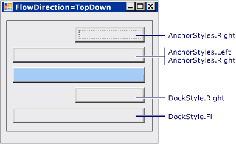

# How to: Anchor and Dock Child Controls in a FlowLayoutPanel Control
The <xref:System.Windows.Forms.FlowLayoutPanel> control supports the <xref:System.Windows.Forms.Control.Anchor%2A> and <xref:System.Windows.Forms.Control.Dock%2A> properties in its child controls.  
  
### To anchor and dock child controls in a FlowLayoutPanel control  
  
1.  Create a <xref:System.Windows.Forms.FlowLayoutPanel> control on your form.  
  
2.  Set the <xref:System.Windows.Forms.Control.Width%2A> of the <xref:System.Windows.Forms.FlowLayoutPanel> control to **300**, and set its <xref:System.Windows.Forms.FlowLayoutPanel.FlowDirection%2A> to <xref:System.Windows.Forms.FlowDirection.TopDown>.  
  
3.  Create two <xref:System.Windows.Forms.Button> controls, and place them in the <xref:System.Windows.Forms.FlowLayoutPanel> control.  
  
4.  Set the <xref:System.Windows.Forms.Control.Width%2A> of the first button to **200**.  
  
5.  Set the <xref:System.Windows.Forms.Control.Dock%2A> property of the second button to <xref:System.Windows.Forms.DockStyle.Fill>.  
  
    > [!NOTE]
    >  The second button assumes the same width as the first button. It does not stretch across the width of the <xref:System.Windows.Forms.FlowLayoutPanel> control.  
  
6.  Set the <xref:System.Windows.Forms.Control.Dock%2A> property of the second button to `None`. This causes the button to assume its original width.  
  
7.  Set the <xref:System.Windows.Forms.Control.Anchor%2A> property of the second button to `Left, Right`.  
  
    > [!IMPORTANT]
    >  The second button assumes the same width as the first button. It does not stretch across the width of the <xref:System.Windows.Forms.FlowLayoutPanel> control. This is the general rule for anchoring and docking in the <xref:System.Windows.Forms.FlowLayoutPanel> control: for vertical flow directions, the <xref:System.Windows.Forms.FlowLayoutPanel> control calculates the width of an implied column from the widest child control in the column. All other controls in this column with <xref:System.Windows.Forms.Control.Anchor%2A> or <xref:System.Windows.Forms.Control.Dock%2A> properties are aligned or stretched to fit this implied column. The behavior works in a similar way for horizontal flow directions. The <xref:System.Windows.Forms.FlowLayoutPanel> control calculates the height of an implied row from the tallest child control in the row, and all docked or anchored child controls in this row are aligned or sized to fit the implied row.  
  
## Example  
 The following illustration shows four buttons that are anchored and docked relative to the blue button in a <xref:System.Windows.Forms.FlowLayoutPanel>. The <xref:System.Windows.Forms.FlowLayoutPanel.FlowDirection%2A> is <xref:System.Windows.Forms.FlowDirection.LeftToRight>.  
  
   
  
 The following illustration shows four buttons that are anchored and docked relative to the blue button in a <xref:System.Windows.Forms.FlowLayoutPanel>. The <xref:System.Windows.Forms.FlowLayoutPanel.FlowDirection%2A> is <xref:System.Windows.Forms.FlowDirection.TopDown>.  
  
   
  
 The following code example demonstrates various <xref:System.Windows.Forms.Control.Anchor%2A> property values for a <xref:System.Windows.Forms.Button> control in a <xref:System.Windows.Forms.FlowLayoutPanel> control.  
  
 [!code-csharp[System.Windows.Forms.FlowLayoutPanel.AnchorExampleForm#1](../../../../samples/snippets/csharp/VS_Snippets_Winforms/System.Windows.Forms.FlowLayoutPanel.AnchorExampleForm/CS/FlpAnchorExampleForm.cs#1)]
 [!code-vb[System.Windows.Forms.FlowLayoutPanel.AnchorExampleForm#1](../../../../samples/snippets/visualbasic/VS_Snippets_Winforms/System.Windows.Forms.FlowLayoutPanel.AnchorExampleForm/VB/FlpAnchorExampleForm.vb#1)]  
  
## Compiling the Code  
 This example requires:  
  
-   References to the System, System.Data, System.Drawing and System.Windows.Forms assemblies.  
  
 For information about building this example from the command line for [!INCLUDE[vbprvb](../../../../includes/vbprvb-md.md)] or [!INCLUDE[csprcs](../../../../includes/csprcs-md.md)], see [Building from the Command Line](~/docs/visual-basic/reference/command-line-compiler/building-from-the-command-line.md) or [Command-line Building With csc.exe](~/docs/csharp/language-reference/compiler-options/command-line-building-with-csc-exe.md). You can also build this example in [!INCLUDE[vsprvs](../../../../includes/vsprvs-md.md)] by pasting the code into a new project.  Also see [How to: Compile and Run a Complete Windows Forms Code Example Using Visual Studio](http://msdn.microsoft.com/library/Bb129228\(v=vs.110\)).  
  
## See Also  
 <xref:System.Windows.Forms.FlowLayoutPanel>  
 [FlowLayoutPanel Control Overview](../../../../docs/framework/winforms/controls/flowlayoutpanel-control-overview.md)
