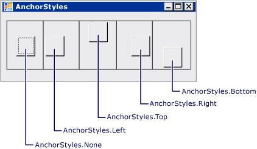
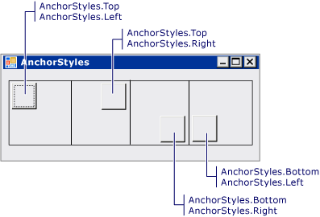
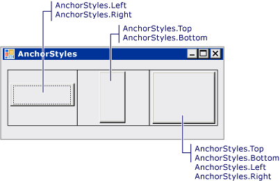

# How to: Anchor and Dock Child Controls in a TableLayoutPanel Control
The <xref:System.Windows.Forms.TableLayoutPanel> control supports the <xref:System.Windows.Forms.Control.Anchor%2A> and <xref:System.Windows.Forms.Control.Dock%2A> properties in its child controls.  
  
### To align a child control in a TableLayoutPanel cell  
  
1.  Create a <xref:System.Windows.Forms.TableLayoutPanel> control on your form.  
  
2.  Set the value of the <xref:System.Windows.Forms.TableLayoutPanel> control's <xref:System.Windows.Forms.TableLayoutPanel.ColumnCount%2A> and <xref:System.Windows.Forms.TableLayoutPanel.RowCount%2A> properties to **1**.  
  
3.  Create a <xref:System.Windows.Forms.Button> control in the <xref:System.Windows.Forms.TableLayoutPanel> control. The <xref:System.Windows.Forms.Button> occupies the upper-left corner of the cell.  
  
4.  Change the value of the <xref:System.Windows.Forms.Button> control's <xref:System.Windows.Forms.Control.Anchor%2A> property to `Left`. The <xref:System.Windows.Forms.Button> control moves to align with the left border of the cell.  
  
    > [!NOTE]
    >  This behavior differs from the behavior of other container controls. In other container controls, the child control does not move when the <xref:System.Windows.Forms.Control.Anchor%2A> property is set, and the distance between the anchored control and the parent container's boundary is fixed at the time the <xref:System.Windows.Forms.Control.Anchor%2A> property is set.  
  
5.  Change the value of the <xref:System.Windows.Forms.Button> control's <xref:System.Windows.Forms.Control.Anchor%2A> property to `Top, Left`. The <xref:System.Windows.Forms.Button> control moves to occupy the top-left corner of the cell.  
  
6.  Repeat step 5 with a value of `Top, Right` to move the <xref:System.Windows.Forms.Button> control to the top-right corner of the cell. Repeat with values of `Bottom, Left` and `Bottom, Right`.  
  
### To stretch a child control in a TableLayoutPanel cell  
  
1.  Change the value of the <xref:System.Windows.Forms.Button> control's <xref:System.Windows.Forms.Control.Anchor%2A> property to `Left, Right`. The <xref:System.Windows.Forms.Button> control is resized to stretch across the cell.  
  
    > [!NOTE]
    >  This behavior differs from the behavior of other container controls. In other container controls, the child control is not resized when the <xref:System.Windows.Forms.Control.Anchor%2A> property is set to `Left, Right` or `Top, Bottom`.  
  
2.  Change the value of the <xref:System.Windows.Forms.Button> control's <xref:System.Windows.Forms.Control.Anchor%2A> property to `Top, Bottom`. The <xref:System.Windows.Forms.Button> control is resized to stretch from the top to the bottom of the cell.  
  
3.  Change the value of the <xref:System.Windows.Forms.Button> control's <xref:System.Windows.Forms.Control.Anchor%2A> property to `Top, Bottom, Left, Right`. The <xref:System.Windows.Forms.Button> control is resized to fill the cell.  
  
4.  Change the value of the <xref:System.Windows.Forms.Button> control's <xref:System.Windows.Forms.Control.Anchor%2A> property to `None`. The <xref:System.Windows.Forms.Button> control is resized and centered in the cell.  
  
5.  Change the value of the <xref:System.Windows.Forms.Button> control's <xref:System.Windows.Forms.Control.Dock%2A> property to <xref:System.Windows.Forms.DockStyle.Left>. The <xref:System.Windows.Forms.Button> control moves to align with the left border of the cell. The <xref:System.Windows.Forms.Button> control retains its width, but its height is resized to fill the cell vertically.  
  
    > [!NOTE]
    >  This is the same behavior that occurs in other container controls.  
  
6.  Change the value of the <xref:System.Windows.Forms.Button> control's <xref:System.Windows.Forms.Control.Dock%2A> property to <xref:System.Windows.Forms.DockStyle.Fill>. The <xref:System.Windows.Forms.Button> control is resized to fill the cell.  
  
## Example  
 The following illustration shows five buttons anchored in five separate <xref:System.Windows.Forms.TableLayoutPanel> cells.  
  
   
  
 The following illustration shows four buttons anchored in the corners of four separate <xref:System.Windows.Forms.TableLayoutPanel> cells.  
  
   
  
 The following illustration shows three buttons stretched by anchoring in three separate <xref:System.Windows.Forms.TableLayoutPanel> cells.  
  
   
  
 The following code example demonstrates all the combinations of <xref:System.Windows.Forms.Control.Anchor%2A> property values for a <xref:System.Windows.Forms.Button> control in a <xref:System.Windows.Forms.TableLayoutPanel> control.  
  
 [!code-csharp[System.Windows.Forms.TableLayoutPanel.AnchorExampleForm#1](../../../../samples/snippets/csharp/VS_Snippets_Winforms/System.Windows.Forms.TableLayoutPanel.AnchorExampleForm/CS/TlpAnchorExampleForm.cs#1)]
 [!code-vb[System.Windows.Forms.TableLayoutPanel.AnchorExampleForm#1](../../../../samples/snippets/visualbasic/VS_Snippets_Winforms/System.Windows.Forms.TableLayoutPanel.AnchorExampleForm/VB/TlpAnchorExampleForm.vb#1)]  
  
## Compiling the Code  
 This example requires:  
  
-   References to the System, System.Data, System.Drawing and System.Windows.Forms assemblies.  
  
 For information about building this example from the command line for [!INCLUDE[vbprvb](../../../../includes/vbprvb-md.md)] or [!INCLUDE[csprcs](../../../../includes/csprcs-md.md)], see [Building from the Command Line](~/docs/visual-basic/reference/command-line-compiler/building-from-the-command-line.md) or [Command-line Building With csc.exe](~/docs/csharp/language-reference/compiler-options/command-line-building-with-csc-exe.md). You can also build this example in [!INCLUDE[vsprvs](../../../../includes/vsprvs-md.md)] by pasting the code into a new project.  Also see [How to: Compile and Run a Complete Windows Forms Code Example Using Visual Studio](http://msdn.microsoft.com/library/Bb129228\(v=vs.110\)).  
  
## See Also  
 <xref:System.Windows.Forms.TableLayoutPanel>  
 [TableLayoutPanel Control](../../../../docs/framework/winforms/controls/tablelayoutpanel-control-windows-forms.md)
