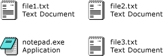

# How to: Enable Tile View in a Windows Forms ListView Control
With the tile view feature of the <xref:System.Windows.Forms.ListView> control, you can provide a visual balance between graphical and textual information. The textual information displayed for an item in tile view is the same as the column information defined for details view. Tile view works in combination with either the grouping or insertion mark features in the <xref:System.Windows.Forms.ListView> control.  
  
 The tile view uses a 32 x 32 pixel icon and several lines of text, as shown in the following images.  
  
   
 
 To enable tile view, set the <xref:System.Windows.Forms.ListView.View%2A> property to <xref:System.Windows.Forms.View.Tile>. You can adjust the size of the tiles by setting the <xref:System.Windows.Forms.ListView.TileSize%2A> property, and the number of text lines displayed in the tile by adjusting the <xref:System.Windows.Forms.ListView.Columns%2A> collection.  
  
> [!NOTE]
> The tile view is available only on [!INCLUDE[WinXpFamily](../../../../includes/winxpfamily-md.md)] when your application calls the <xref:System.Windows.Forms.Application.EnableVisualStyles%2A?displayProperty=nameWithType> method. On earlier operating systems, any code related to the tile view has no effect, and the <xref:System.Windows.Forms.ListView> control displays in the large icon view. For more information, see <xref:System.Windows.Forms.ListView.View%2A?displayProperty=nameWithType>.  
  
### To set tile view programmatically  
  
1. Use the <xref:System.Windows.Forms.View> enumeration of the <xref:System.Windows.Forms.ListView> control.  
  
    ```vb  
    ListView1.View = View.Tile  
    ```  
  
    ```csharp  
    listView1.View = View.Tile;  
    ```  
  
## Example  
 The following complete code example demonstrates Tile view with tiles modified to show three lines of text. The tile size has been adjusted to prevent line-wrapping.  
  
 [!code-cpp[System.Windows.Forms.ListView.Tiling#1](~/samples/snippets/cpp/VS_Snippets_Winforms/System.Windows.Forms.ListView.Tiling/CPP/listviewtilingexample.cpp#1)]
 [!code-csharp[System.Windows.Forms.ListView.Tiling#1](~/samples/snippets/csharp/VS_Snippets_Winforms/System.Windows.Forms.ListView.Tiling/CS/listviewtilingexample.cs#1)]
 [!code-vb[System.Windows.Forms.ListView.Tiling#1](~/samples/snippets/visualbasic/VS_Snippets_Winforms/System.Windows.Forms.ListView.Tiling/VB/listviewtilingexample.vb#1)]  
  
## Compiling the Code  
 This example requires:  
  
- References to the System and System.Windows.Forms assemblies.  
  
- An icon file named book.ico in the same directory as the executable file.  
  
## See also

- <xref:System.Windows.Forms.ListView>
- <xref:System.Windows.Forms.ListView.TileSize%2A>
- [ListView Control](listview-control-windows-forms.md)
- [ListView Control Overview](listview-control-overview-windows-forms.md)
