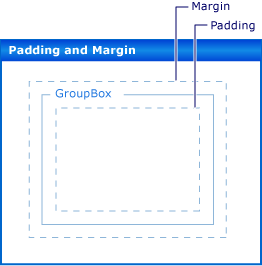

# Walkthrough: Laying Out Windows Forms Controls with Padding, Margins, and the AutoSize Property
Precise placement of controls on your form is a high priority for many applications. The **Windows Forms Designer** gives you many layout tools to accomplish this. Three of the most important are the <xref:System.Windows.Forms.Control.Margin%2A>, <xref:System.Windows.Forms.Control.Padding%2A>, and <xref:System.Windows.Forms.Control.AutoSize%2A> properties, which are present on all Windows Forms controls.  
  
 The <xref:System.Windows.Forms.Control.Margin%2A> property defines the space around the control that keeps other controls a specified distance from the control's borders.  
  
 The <xref:System.Windows.Forms.Control.Padding%2A> property defines the space in the interior of a control that keeps the control's content (for example, the value of its <xref:System.Windows.Forms.Control.Text%2A> property) a specified distance from the control's borders.  
  
 The following illustration shows the <xref:System.Windows.Forms.Control.Padding%2A> and <xref:System.Windows.Forms.Control.Margin%2A> properties on a control.  
  
   
  
 The <xref:System.Windows.Forms.Control.AutoSize%2A> property tells a control to automatically size itself to its contents. It will not resize itself to be smaller than the value of its original <xref:System.Windows.Forms.Control.Size%2A> property, and it will account for the value of its <xref:System.Windows.Forms.Control.Padding%2A> property.  
  
 Tasks illustrated in this walkthrough include:  
  
-   Creating a Windows Forms project  
  
-   Setting Margins for Your Controls  
  
-   Setting Padding for Your Controls  
  
-   Automatically Sizing Your Controls  
  
 When you are finished, you will have an understanding of the role played by these important layout features.  
  
> [!NOTE]
>  The dialog boxes and menu commands you see might differ from those described in Help depending on your active settings or edition. To change your settings, choose **Import and Export Settings** on the **Tools** menu. For more information, see [Customizing Development Settings in Visual Studio](http://msdn.microsoft.com/library/22c4debb-4e31-47a8-8f19-16f328d7dcd3).  
  
## Prerequisites  
 In order to complete this walkthrough, you will need:  
  
-   Sufficient permissions to be able to create and run Windows Forms application projects on the computer where Visual Studio is installed.  
  
## Creating the Project  
 The first step is to create the project and set up the form.  
  
#### To create the project  
  
1.  Create a **Windows Application** project called `LayoutExample`. For more information, see [How to: Create a Windows Application Project](http://msdn.microsoft.com/library/b2f93fed-c635-4705-8d0e-cf079a264efa) .  
  
2.  Select the form in the **Windows Forms Designer**.  
  
## Setting Margins for Your Controls  
 You can set the default distance between your controls using the <xref:System.Windows.Forms.Control.Margin%2A> property. When you move a control close enough to another control, you will see a snapline that shows the margins for the two controls. The control you are moving will also snap to the distance defined by the margins.  
  
#### To arrange controls on your form using the Margin property  
  
1.  Drag two <xref:System.Windows.Forms.Button> controls from the **Toolbox** onto your form.  
  
2.  Select one of the <xref:System.Windows.Forms.Button> controls and move it close to the other, until they are almost touching.  
  
     Observe the snapline that appears between them. This distance is the sum of the two controls' <xref:System.Windows.Forms.Control.Margin%2A> values. The control you are moving snaps to this distance. For details, see [Walkthrough: Arranging Controls on Windows Forms Using Snaplines](../../../../docs/framework/winforms/controls/walkthrough-arranging-controls-on-windows-forms-using-snaplines.md).  
  
3.  Change the <xref:System.Windows.Forms.Control.Margin%2A> property of one of the controls by expanding the <xref:System.Windows.Forms.Control.Margin%2A> entry in the **Properties** window and setting the <xref:System.Windows.Forms.Padding.All%2A> property to 20.  
  
4.  Select one of the <xref:System.Windows.Forms.Button> controls and move it close to the other.  
  
     The snapline defining the sum of the margin values is longer and that the control snaps to a greater distance from the other control.  
  
5.  Change the <xref:System.Windows.Forms.Control.Margin%2A> property of the selected control by expanding the <xref:System.Windows.Forms.Control.Margin%2A> entry in the **Properties** window and setting the <xref:System.Windows.Forms.Padding.Top%2A> property to 5.  
  
6.  Move the selected control below the other control and observe that the snapline is shorter. Move the selected control to the left of the other control and observe that the snapline retains the value observed in step 4.  
  
7.  You can set each of the aspects of the <xref:System.Windows.Forms.Control.Margin%2A> property, <xref:System.Windows.Forms.Padding.Left%2A>, <xref:System.Windows.Forms.Padding.Top%2A>, <xref:System.Windows.Forms.Padding.Right%2A>, <xref:System.Windows.Forms.Padding.Bottom%2A>, to different values, or you can set them all to the same value with the <xref:System.Windows.Forms.Padding.All%2A> property.  
  
## Setting Padding for Your Controls  
 To achieve the precise layout required for your application, your controls will often contain child controls. When you want to specify the proximity of the child control's border to the parent control's border, use the parent control's <xref:System.Windows.Forms.Control.Padding%2A> property in conjunction with the child control's <xref:System.Windows.Forms.Control.Margin%2A> property. The <xref:System.Windows.Forms.Control.Padding%2A> property is also used to control the proximity of a control's content (for example, a <xref:System.Windows.Forms.Button> control's <xref:System.Windows.Forms.Control.Text%2A> property) to its borders.  
  
#### To arrange controls on your form using padding  
  
1.  Drag a <xref:System.Windows.Forms.Button> control from the **Toolbox** onto your form.  
  
2.  Change the value of the <xref:System.Windows.Forms.Button> control's <xref:System.Windows.Forms.Control.AutoSize%2A> property to `true`.  
  
3.  Change the <xref:System.Windows.Forms.Control.Padding%2A> property by expanding the <xref:System.Windows.Forms.Control.Padding%2A> entry in the **Properties** window and setting the <xref:System.Windows.Forms.Padding.All%2A> property to 5.  
  
     The control expands to provide room for the new padding.  
  
4.  Drag a <xref:System.Windows.Forms.GroupBox> control from the **Toolbox** onto your form. Drag a <xref:System.Windows.Forms.Button> control from the **Toolbox** into the <xref:System.Windows.Forms.GroupBox> control. Position the <xref:System.Windows.Forms.Button> control so it is flush with the lower-right corner of the <xref:System.Windows.Forms.GroupBox> control.  
  
     Observe the snaplines that appear as the <xref:System.Windows.Forms.Button> control approaches the bottom and right borders of the <xref:System.Windows.Forms.GroupBox> control. These snaplines correspond to the <xref:System.Windows.Forms.Control.Margin%2A> property of the <xref:System.Windows.Forms.Button>.  
  
5.  Change the <xref:System.Windows.Forms.GroupBox> control's <xref:System.Windows.Forms.Control.Padding%2A> property by expanding the <xref:System.Windows.Forms.Control.Padding%2A> entry in the **Properties** window and setting the <xref:System.Windows.Forms.Padding.All%2A> property to 20.  
  
6.  Select the <xref:System.Windows.Forms.Button> control within the <xref:System.Windows.Forms.GroupBox> control and move it toward the center of the <xref:System.Windows.Forms.GroupBox>.  
  
     The snaplines appear at a greater distance from the borders of the <xref:System.Windows.Forms.GroupBox> control. This distance is the sum of the <xref:System.Windows.Forms.Button> control's <xref:System.Windows.Forms.Control.Margin%2A> property and the <xref:System.Windows.Forms.GroupBox> control's <xref:System.Windows.Forms.Control.Padding%2A> property.  
  
## Automatically Sizing Your Controls  
 In some applications, the size of a control will not be the same at run time as it was at design time. The text of a <xref:System.Windows.Forms.Button> control, for example, may be taken from a database, and its length will not be known in advance.  
  
 When the <xref:System.Windows.Forms.Control.AutoSize%2A> property is set to `true`, the control will size itself to its content. For more information, see [AutoSize Property Overview](../../../../docs/framework/winforms/controls/autosize-property-overview.md).  
  
#### To arrange controls on your form using the AutoSize property  
  
1.  Drag a <xref:System.Windows.Forms.Button> control from the **Toolbox** onto your form.  
  
2.  Change the value of the <xref:System.Windows.Forms.Button> control's <xref:System.Windows.Forms.Control.AutoSize%2A> property to `true`.  
  
3.  Change the <xref:System.Windows.Forms.Button> control's <xref:System.Windows.Forms.Control.Text%2A> property to "**This button has a long string for its Text property**."  
  
     When you commit the change, the <xref:System.Windows.Forms.Button> control resizes itself to fit the new text.  
  
4.  Drag another <xref:System.Windows.Forms.Button> control from the **Toolbox** onto your form.  
  
5.  Change the <xref:System.Windows.Forms.Button> control's <xref:System.Windows.Forms.Control.Text%2A> property to "**This button has a long string for its Text property.**"  
  
     When you commit the change, the <xref:System.Windows.Forms.Button> control does not resize itself, and the text is clipped by the right edge of the control.  
  
6.  Change the <xref:System.Windows.Forms.Control.Padding%2A> property by expanding the <xref:System.Windows.Forms.Control.Padding%2A> entry in the **Properties** window and setting the <xref:System.Windows.Forms.Padding.All%2A> property to 5.  
  
     The text in the control's interior is clipped on all four sides.  
  
7.  Change the <xref:System.Windows.Forms.Button> control's <xref:System.Windows.Forms.Control.AutoSize%2A> property to `true`.  
  
     The <xref:System.Windows.Forms.Button> control resizes itself to encompass the entire string. Also, padding has been added around the text, causing the <xref:System.Windows.Forms.Button> control to expand in all four directions.  
  
8.  Drag a <xref:System.Windows.Forms.Button> control from the **Toolbox** onto your form. Position it near the lower-right corner of the form.  
  
9. Change the value of the <xref:System.Windows.Forms.Button> control's <xref:System.Windows.Forms.Control.AutoSize%2A> property to `true`.  
  
10. Set the <xref:System.Windows.Forms.Button> control's <xref:System.Windows.Forms.Control.Anchor%2A> property to <xref:System.Windows.Forms.AnchorStyles.Right>, <xref:System.Windows.Forms.AnchorStyles.Bottom>.  
  
11. Change the <xref:System.Windows.Forms.Button> control's <xref:System.Windows.Forms.Control.Text%2A> property to "**This button has a long string for its Text property.**"  
  
     When you commit the change, the <xref:System.Windows.Forms.Button> control resizes itself toward the left. In general, automatic sizing will increase the size of a control in the direction opposite its <xref:System.Windows.Forms.Control.Anchor%2A> property setting.  
  
## AutoSize and AutoSizeMode Properties  
 Some controls support the `AutoSizeMode` property, which gives you more fine-grained control over the automatic sizing behavior of a control.  
  
#### To use the AutoSizeMode property  
  
1.  Drag a <xref:System.Windows.Forms.Panel> control from the **Toolbox** onto your form.  
  
2.  Set the value of the <xref:System.Windows.Forms.Panel> control's <xref:System.Windows.Forms.Control.AutoSize%2A> property to `true`.  
  
3.  Drag a <xref:System.Windows.Forms.Button> control from the **Toolbox** into the <xref:System.Windows.Forms.Panel> control.  
  
4.  Place the <xref:System.Windows.Forms.Button> control near the lower-right corner of the <xref:System.Windows.Forms.Panel> control.  
  
5.  Select the <xref:System.Windows.Forms.Panel> control and grab the lower-right sizing handle. Resize the <xref:System.Windows.Forms.Panel> control to be larger and smaller.  
  
    > [!NOTE]
    >  You can freely resize the <xref:System.Windows.Forms.Panel> control, but you cannot size it smaller than the position of the <xref:System.Windows.Forms.Button> control's lower-right corner. This behavior is specified by the default value of the `AutoSizeMode` property, which is <xref:System.Windows.Forms.AutoSizeMode.GrowOnly>.  
  
6.  Set the value of the <xref:System.Windows.Forms.Panel> control's `AutoSizeMode` property to <xref:System.Windows.Forms.AutoSizeMode.GrowAndShrink>.  
  
     The <xref:System.Windows.Forms.Panel> control sizes itself to surround the <xref:System.Windows.Forms.Button> control. You cannot resize the <xref:System.Windows.Forms.Panel> control.  
  
7.  Drag the <xref:System.Windows.Forms.Button> control toward the upper-left corner of the <xref:System.Windows.Forms.Panel> control.  
  
     The <xref:System.Windows.Forms.Panel> control resizes to the <xref:System.Windows.Forms.Button> control's new position.  
  
## Next Steps  
 There are many other layout features for arranging controls in your Windows Forms applications. Here are some combinations you might try:  
  
-   Build a form using a <xref:System.Windows.Forms.TableLayoutPanel> control. For details, see [Walkthrough: Arranging Controls on Windows Forms Using a TableLayoutPanel](../../../../docs/framework/winforms/controls/walkthrough-arranging-controls-on-windows-forms-using-a-tablelayoutpanel.md). Try changing the values of the <xref:System.Windows.Forms.TableLayoutPanel> control's <xref:System.Windows.Forms.Control.Padding%2A> property, as well as the <xref:System.Windows.Forms.Control.Margin%2A> property on its child controls.  
  
-   Try the same experiment using a <xref:System.Windows.Forms.FlowLayoutPanel> control. For details, see [Walkthrough: Arranging Controls on Windows Forms Using a FlowLayoutPanel](../../../../docs/framework/winforms/controls/walkthrough-arranging-controls-on-windows-forms-using-a-flowlayoutpanel.md).  
  
-   Experiment with docking child controls in a <xref:System.Windows.Forms.Panel> control. The <xref:System.Windows.Forms.Control.Padding%2A> property is a more general realization of the <xref:System.Windows.Forms.ScrollableControl.DockPadding%2A> property, and you can satisfy yourself that this is the case by putting a child control in a <xref:System.Windows.Forms.Panel> control and setting the child control's <xref:System.Windows.Forms.Control.Dock%2A> property to <xref:System.Windows.Forms.DockStyle.Fill>. Set the <xref:System.Windows.Forms.Panel> control's <xref:System.Windows.Forms.Control.Padding%2A> property to various values and note the effect.  
  
## See Also  
 <xref:System.Windows.Forms.Control.AutoSize%2A>  
 <xref:System.Windows.Forms.ScrollableControl.DockPadding%2A>  
 <xref:System.Windows.Forms.Control.Margin%2A>  
 <xref:System.Windows.Forms.Control.Padding%2A>  
 [AutoSize Property Overview](../../../../docs/framework/winforms/controls/autosize-property-overview.md)  
 [Walkthrough: Arranging Controls on Windows Forms Using a TableLayoutPanel](../../../../docs/framework/winforms/controls/walkthrough-arranging-controls-on-windows-forms-using-a-tablelayoutpanel.md)  
 [Walkthrough: Arranging Controls on Windows Forms Using a FlowLayoutPanel](../../../../docs/framework/winforms/controls/walkthrough-arranging-controls-on-windows-forms-using-a-flowlayoutpanel.md)  
 [Walkthrough: Arranging Controls on Windows Forms Using Snaplines](../../../../docs/framework/winforms/controls/walkthrough-arranging-controls-on-windows-forms-using-snaplines.md)
