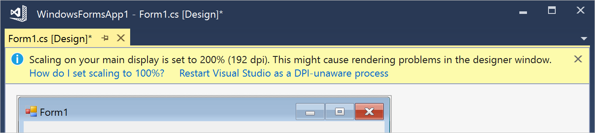

# Disable DPI-awareness in Visual Studio

Visual Studio is a dots per inch (DPI) aware application, which means the display scales automatically. If an application states that it's not DPI-aware, the operating system scales the application as a bitmap. This behavior is also called DPI virtualization. The application still thinks that it's running at 100% scaling, or 96 dpi.

## Windows Forms Designer on HDPI monitors

The **Windows Forms Designer** in Visual Studio doesn't have scaling support. This causes display issues when you open some forms in the **Windows Forms Designer** on high dots per inch (HDPI) monitors. For examples, controls can appear to overlap as shown in the following image:

In Visual Studio 2017 version 15.8 and later, when you open a form in the **Windows Forms Designer** on an HDPI monitor, Visual Studio displays a yellow informational bar at the top of the designer:

The message reads **Scaling on your main display is set to 200% (192 dpi). This might cause rendering problems in the designer window.**

If you aren't working in the designer and don't need to adjust the layout of your form, you can ignore the informational bar and continue working in the code editor or in other types of designers. Only the **Windows Forms Designer** is affected. If you do need to work in the **Windows Forms Designer**, the next section helps you [resolve the problem](#to-resolve-the-problem).

## To resolve the problem

There are three options to resolve the display problem.

### Restart Visual Studio as a DPI-unaware process

You can restart Visual Studio as a DPI-unaware process by selecting the option on the yellow informational bar. This is the preferred way of resolving the problem.

When Visual Studio runs as a DPI-unaware process, the designer layout issues are resolved, but fonts may appear blurry. Visual Studio displays a different yellow informational message when it runs as a DPI-unaware process that says **Visual Studio is running as a DPI-unaware process. WPF and XAML designers might not display correctly.** The informational bar also provides an option to **Restart Visual Studio as a DPI-aware process**.

> [!NOTE]
> - If you had undocked tool windows in Visual Studio when you selected the option to restart as a DPI-unaware process, the position of those tool windows may change.
> - If you use the default Visual Basic profile, or if you have the **Save new projects when created** option deselected in **Tools** > **Options** > **Projects and Solutions**, Visual Studio cannot reopen your project when it restarts as a DPI-unaware process. However, you can open the project by selecting it under **File** > **Recent Projects and Solutions**.

It's important to restart Visual Studio as a DPI-aware process when you're finished working in the **Windows Forms Designer**. When it's running as a DPI-unaware process, fonts can look blurry and you may see issues in other designers such as the **XAML Designer**. If you close and reopen Visual Studio when it's running in DPI-unaware mode, it becomes DPI-aware again. You can also click the **Restart Visual Studio as a DPI-aware process** option in the informational bar.

### Add a registry entry

You can mark Visual Studio as DPI-unaware by modifying the registry. Open **Registry Editor** and add an entry to the **HKEY_CURRENT_USER\SOFTWARE\Microsoft\Windows NT\CurrentVersion\AppCompatFlags\Layers** subkey:

**Entry**: %ProgramFiles(x86)%\Microsoft Visual Studio\2017\Community\Common7\IDE\devenv.exe

   > [!NOTE]
   > If you're using the Professional or Enterprise edition of Visual Studio 2017, replace **Community** with **Professional** or **Enterprise** in the entry.

**Type**: REG_SZ

**Value**: DPIUNAWARE

> [!NOTE]
> Visual Studio remains in DPI-unaware mode until you remove the registry entry.

### Set your display scaling setting to 100%

To set your display scaling setting to 100% in Windows 10, type **display settings** in the task bar search box, and then select **Change display settings**. In the **Settings** window, set **Change the size of text, apps, and other items** to **100%**.

Setting your display scaling to 100% may be undesirable, because it can make the user interface too small to be usable.

## Troubleshoot

If the DPI-awareness transition isn't working as expected in Visual Studio, check to see if you have the `dpiAwareness` value in the **HKEY_LOCAL_MACHINE\SOFTWARE\Microsoft\Windows NT\CurrentVersion\Image File Execution Options\devenv.exe** subkey in Registry Editor. Delete the value if it's present.

## See also

- [Automatic scaling in Windows Forms](automatic-scaling-in-windows-forms.md)