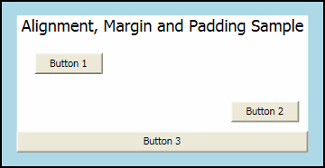
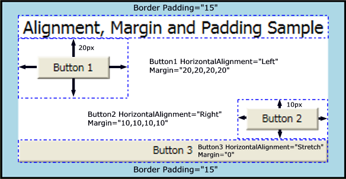
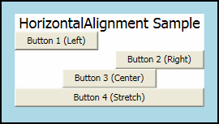
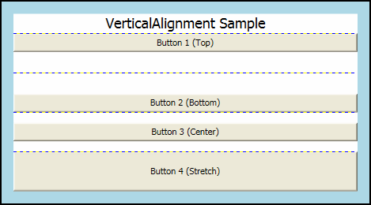
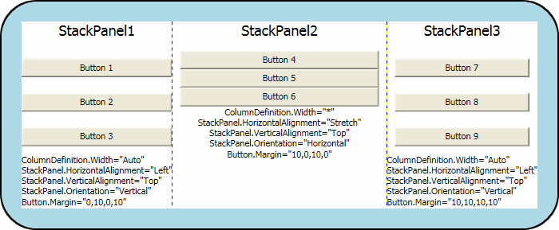

# Alignment, Margins, and Padding Overview
The <xref:System.Windows.FrameworkElement> class exposes several properties that are used to precisely position child elements. This topic discusses four of the most important properties: <xref:System.Windows.FrameworkElement.HorizontalAlignment%2A>, <xref:System.Windows.FrameworkElement.Margin%2A>, <xref:System.Windows.Controls.Border.Padding%2A>, and <xref:System.Windows.FrameworkElement.VerticalAlignment%2A>. The effects of these properties are important to understand, because they provide the basis for controlling the position of elements in [!INCLUDE[TLA#tla_winclient](../../../../includes/tlasharptla-winclient-md.md)] applications.  
  
  
   
## Introduction to Element Positioning  
 There are numerous ways to position elements using [!INCLUDE[TLA2#tla_winclient](../../../../includes/tla2sharptla-winclient-md.md)]. However, achieving ideal layout goes beyond simply choosing the right <xref:System.Windows.Controls.Panel> element. Fine control of positioning requires an understanding of the <xref:System.Windows.FrameworkElement.HorizontalAlignment%2A>, <xref:System.Windows.FrameworkElement.Margin%2A>, <xref:System.Windows.Controls.Border.Padding%2A>, and <xref:System.Windows.FrameworkElement.VerticalAlignment%2A> properties.  
  
 The following illustration shows a layout scenario that utilizes several positioning properties.  
  
   
  
 At first glance, the <xref:System.Windows.Controls.Button> elements in this illustration may appear to be placed randomly. However, their positions are actually precisely controlled by using a combination of margins, alignments, and padding.  
  
 The following example describes how to create the layout in the preceding illustration. A <xref:System.Windows.Controls.Border> element encapsulates a parent <xref:System.Windows.Controls.StackPanel>, with a <xref:System.Windows.Controls.Border.Padding%2A> value of 15 device independent pixels. This accounts for the narrow <xref:System.Windows.Media.Brushes.LightBlue%2A> band that surrounds the child <xref:System.Windows.Controls.StackPanel>. Child elements of the <xref:System.Windows.Controls.StackPanel> are used to illustrate each of the various positioning properties that are detailed in this topic. Three <xref:System.Windows.Controls.Button> elements are used to demonstrate both the <xref:System.Windows.FrameworkElement.Margin%2A> and <xref:System.Windows.FrameworkElement.HorizontalAlignment%2A> properties.  
  
 [!code-csharp[MPALayoutSampleIntro#1](../../../../samples/snippets/csharp/VS_Snippets_Wpf/MPALayoutSampleIntro/CSharp/MPA_Layout_Sample_Intro.cs#1)]
 [!code-vb[MPALayoutSampleIntro#1](../../../../samples/snippets/visualbasic/VS_Snippets_Wpf/MPALayoutSampleIntro/VisualBasic/MPALayoutIntro.vb#1)]  
  
 The following diagram provides a close-up view of the various positioning properties that are used in the preceding sample. Subsequent sections in this topic describe in greater detail how to use each positioning property.  
  
   
  
   
## Understanding Alignment Properties  
 The <xref:System.Windows.FrameworkElement.HorizontalAlignment%2A> and <xref:System.Windows.FrameworkElement.VerticalAlignment%2A> properties describe how a child element should be positioned within a parent element's allocated layout space. By using these properties together, you can position child elements precisely. For example, child elements of a <xref:System.Windows.Controls.DockPanel> can specify four different horizontal alignments: <xref:System.Windows.HorizontalAlignment.Left>, <xref:System.Windows.HorizontalAlignment.Right>, or <xref:System.Windows.HorizontalAlignment.Center>, or to <xref:System.Windows.HorizontalAlignment.Stretch> to fill available space. Similar values are available for vertical positioning.  
  
> [!NOTE]
>  Explicitly-set <xref:System.Windows.FrameworkElement.Height%2A> and <xref:System.Windows.FrameworkElement.Width%2A> properties on an element take precedence over the <xref:System.Windows.HorizontalAlignment.Stretch> property value. Attempting to set <xref:System.Windows.FrameworkElement.Height%2A>, <xref:System.Windows.FrameworkElement.Width%2A>, and a <xref:System.Windows.FrameworkElement.HorizontalAlignment%2A> value of `Stretch` results in the `Stretch` request being ignored.  
  
   
### HorizontalAlignment Property  
 The <xref:System.Windows.FrameworkElement.HorizontalAlignment%2A> property declares the horizontal alignment characteristics to apply to child elements. The following table shows each of the possible values of the <xref:System.Windows.FrameworkElement.HorizontalAlignment%2A> property.  
  
|Member|Description|  
|------------|-----------------|  
|<xref:System.Windows.HorizontalAlignment.Left>|Child elements are aligned to the left of the parent element's allocated layout space.|  
|<xref:System.Windows.HorizontalAlignment.Center>|Child elements are aligned to the center of the parent element's allocated layout space.|  
|<xref:System.Windows.HorizontalAlignment.Right>|Child elements are aligned to the right of the parent element's allocated layout space.|  
|<xref:System.Windows.HorizontalAlignment.Stretch> (Default)|Child elements are stretched to fill the parent element's allocated layout space. Explicit <xref:System.Windows.FrameworkElement.Width%2A> and <xref:System.Windows.FrameworkElement.Height%2A> values take precedence.|  
  
 The following example shows how to apply the <xref:System.Windows.FrameworkElement.HorizontalAlignment%2A> property to <xref:System.Windows.Controls.Button> elements. Each attribute value is shown, to better illustrate the various rendering behaviors.  
  
 [!code-csharp[MPALayoutHorizontalAlignment#2](../../../../samples/snippets/csharp/VS_Snippets_Wpf/MPALayoutHorizontalAlignment/CSharp/MPA_Layout_HorizontalAlignment.cs#2)]
 [!code-vb[MPALayoutHorizontalAlignment#2](../../../../samples/snippets/visualbasic/VS_Snippets_Wpf/MPALayoutHorizontalAlignment/VisualBasic/MPA_Layout_HorizontalAlignment.vb#2)]  
  
 The preceding code yields a layout similar to the following image. The positioning effects of each <xref:System.Windows.FrameworkElement.HorizontalAlignment%2A> value are visible in the illustration.  
  
   
  
   
### VerticalAlignment Property  
 The <xref:System.Windows.FrameworkElement.VerticalAlignment%2A> property describes the vertical alignment characteristics to apply to child elements. The following table shows each of the possible values for the <xref:System.Windows.FrameworkElement.VerticalAlignment%2A> property.  
  
|Member|Description|  
|------------|-----------------|  
|<xref:System.Windows.VerticalAlignment.Top>|Child elements are aligned to the top of the parent element's allocated layout space.|  
|<xref:System.Windows.VerticalAlignment.Center>|Child elements are aligned to the center of the parent element's allocated layout space.|  
|<xref:System.Windows.VerticalAlignment.Bottom>|Child elements are aligned to the bottom of the parent element's allocated layout space.|  
|<xref:System.Windows.VerticalAlignment.Stretch> (Default)|Child elements are stretched to fill the parent element's allocated layout space. Explicit <xref:System.Windows.FrameworkElement.Width%2A> and <xref:System.Windows.FrameworkElement.Height%2A> values take precedence.|  
  
 The following example shows how to apply the <xref:System.Windows.FrameworkElement.VerticalAlignment%2A> property to <xref:System.Windows.Controls.Button> elements. Each attribute value is shown, to better illustrate the various rendering behaviors. For purposes of this sample, a <xref:System.Windows.Controls.Grid> element with visible gridlines is used as the parent, to better illustrate the layout behavior of each property value.  
  
 [!code-csharp[MPALayoutVerticalAlignment#2](../../../../samples/snippets/csharp/VS_Snippets_Wpf/MPALayoutVerticalAlignment/CSharp/MPA_Layout_VerticalAlignment.cs#2)]
 [!code-vb[MPALayoutVerticalAlignment#2](../../../../samples/snippets/visualbasic/VS_Snippets_Wpf/MPALayoutVerticalAlignment/VisualBasic/MPA_Layout_VerticalAlignment.vb#2)]
 [!code-xaml[MPALayoutVerticalAlignment#2](../../../../samples/snippets/xaml/VS_Snippets_Wpf/MPALayoutVerticalAlignment/XAML/default.xaml#2)]  
  
 The preceding code yields a layout similar to the following image. The positioning effects of each <xref:System.Windows.FrameworkElement.VerticalAlignment%2A> value are visible in the illustration.  
  
   
  
   
## Understanding Margin Properties  
 The <xref:System.Windows.FrameworkElement.Margin%2A> property describes the distance between an element and its child or peers. <xref:System.Windows.FrameworkElement.Margin%2A> values can be uniform, by using syntax like `Margin="20"`. With this syntax, a uniform <xref:System.Windows.FrameworkElement.Margin%2A> of 20 device independent pixels would be applied to the element. <xref:System.Windows.FrameworkElement.Margin%2A> values can also take the form of four distinct values, each value describing a distinct margin to apply to the left, top, right, and bottom (in that order), like `Margin="0,10,5,25"`. Proper use of the <xref:System.Windows.FrameworkElement.Margin%2A> property enables very fine control of an element's rendering position and the rendering position of its neighbor elements and children.  
  
> [!NOTE]
>  A non-zero margin applies space outside the element's <xref:System.Windows.FrameworkElement.ActualWidth%2A> and <xref:System.Windows.FrameworkElement.ActualHeight%2A>.  
  
 The following example shows how to apply uniform margins around a group of <xref:System.Windows.Controls.Button> elements. The <xref:System.Windows.Controls.Button> elements are spaced evenly with a ten-pixel margin buffer in each direction.  
  
 [!code-cpp[MarginPaddingAlignmentSample#1](../../../../samples/snippets/cpp/VS_Snippets_Wpf/MarginPaddingAlignmentSample/CPP/Margin_Padding_Alignment_Sample.cpp#1)]
 [!code-csharp[MarginPaddingAlignmentSample#1](../../../../samples/snippets/csharp/VS_Snippets_Wpf/MarginPaddingAlignmentSample/CSharp/Margin_Padding_Alignment_Sample.cs#1)]
 [!code-vb[MarginPaddingAlignmentSample#1](../../../../samples/snippets/visualbasic/VS_Snippets_Wpf/MarginPaddingAlignmentSample/VisualBasic/MarginPaddingAlignment.vb#1)]
 [!code-xaml[MarginPaddingAlignmentSample#1](../../../../samples/snippets/xaml/VS_Snippets_Wpf/MarginPaddingAlignmentSample/XAML/default.xaml#1)]  
  
 In many instances, a uniform margin is not appropriate. In these cases, non-uniform spacing can be applied. The following example shows how to apply non-uniform margin spacing to child elements. Margins are described in this order: left, top, right, bottom.  
  
 [!code-cpp[MarginPaddingAlignmentSample#2](../../../../samples/snippets/cpp/VS_Snippets_Wpf/MarginPaddingAlignmentSample/CPP/Margin_Padding_Alignment_Sample.cpp#2)]
 [!code-csharp[MarginPaddingAlignmentSample#2](../../../../samples/snippets/csharp/VS_Snippets_Wpf/MarginPaddingAlignmentSample/CSharp/Margin_Padding_Alignment_Sample.cs#2)]
 [!code-vb[MarginPaddingAlignmentSample#2](../../../../samples/snippets/visualbasic/VS_Snippets_Wpf/MarginPaddingAlignmentSample/VisualBasic/MarginPaddingAlignment.vb#2)]
 [!code-xaml[MarginPaddingAlignmentSample#2](../../../../samples/snippets/xaml/VS_Snippets_Wpf/MarginPaddingAlignmentSample/XAML/default.xaml#2)]  
  
   
## Understanding the Padding Property  
 Padding is similar to <xref:System.Windows.FrameworkElement.Margin%2A> in most respects. The Padding property is exposed on only on a few classes, primarily as a convenience: <xref:System.Windows.Documents.Block>, <xref:System.Windows.Controls.Border>, <xref:System.Windows.Controls.Control>, and <xref:System.Windows.Controls.TextBlock> are samples of classes that expose a Padding property. The <xref:System.Windows.Controls.Border.Padding%2A> property enlarges the effective size of a child element by the specified <xref:System.Windows.Thickness> value.  
  
 The following example shows how to apply <xref:System.Windows.Controls.Border.Padding%2A> to a parent <xref:System.Windows.Controls.Border> element.  
  
 [!code-cpp[MarginPaddingAlignmentSample#3](../../../../samples/snippets/cpp/VS_Snippets_Wpf/MarginPaddingAlignmentSample/CPP/Margin_Padding_Alignment_Sample.cpp#3)]
 [!code-csharp[MarginPaddingAlignmentSample#3](../../../../samples/snippets/csharp/VS_Snippets_Wpf/MarginPaddingAlignmentSample/CSharp/Margin_Padding_Alignment_Sample.cs#3)]
 [!code-vb[MarginPaddingAlignmentSample#3](../../../../samples/snippets/visualbasic/VS_Snippets_Wpf/MarginPaddingAlignmentSample/VisualBasic/MarginPaddingAlignment.vb#3)]
 [!code-xaml[MarginPaddingAlignmentSample#3](../../../../samples/snippets/xaml/VS_Snippets_Wpf/MarginPaddingAlignmentSample/XAML/default.xaml#3)]  
  
   
## Using Alignment, Margins, and Padding in an Application  
 <xref:System.Windows.FrameworkElement.HorizontalAlignment%2A>, <xref:System.Windows.FrameworkElement.Margin%2A>, <xref:System.Windows.Controls.Border.Padding%2A>, and <xref:System.Windows.FrameworkElement.VerticalAlignment%2A> provide the positioning control necessary to create a complex [!INCLUDE[TLA#tla_ui](../../../../includes/tlasharptla-ui-md.md)]. You can use the effects of each property to change child-element positioning, enabling flexibility in creating dynamic applications and user experiences.  
  
 The following example demonstrates each of the concepts that are detailed in this topic. Building on the infrastructure found in the first sample in this topic, this example adds a <xref:System.Windows.Controls.Grid> element as a child of the <xref:System.Windows.Controls.Border> in the first sample. <xref:System.Windows.Controls.Border.Padding%2A> is applied to the parent <xref:System.Windows.Controls.Border> element. The <xref:System.Windows.Controls.Grid> is used to partition space between three child <xref:System.Windows.Controls.StackPanel> elements. <xref:System.Windows.Controls.Button> elements are again used to show the various effects of <xref:System.Windows.FrameworkElement.Margin%2A> and <xref:System.Windows.FrameworkElement.HorizontalAlignment%2A>. <xref:System.Windows.Controls.TextBlock> elements are added to each <xref:System.Windows.Controls.ColumnDefinition> to better define the various properties applied to the <xref:System.Windows.Controls.Button> elements in each column.  
  
 [!code-cpp[MarginPaddingAlignmentSample#4](../../../../samples/snippets/cpp/VS_Snippets_Wpf/MarginPaddingAlignmentSample/CPP/Margin_Padding_Alignment_Sample.cpp#4)]
 [!code-csharp[MarginPaddingAlignmentSample#4](../../../../samples/snippets/csharp/VS_Snippets_Wpf/MarginPaddingAlignmentSample/CSharp/Margin_Padding_Alignment_Sample.cs#4)]
 [!code-vb[MarginPaddingAlignmentSample#4](../../../../samples/snippets/visualbasic/VS_Snippets_Wpf/MarginPaddingAlignmentSample/VisualBasic/MarginPaddingAlignment.vb#4)]
 [!code-xaml[MarginPaddingAlignmentSample#4](../../../../samples/snippets/xaml/VS_Snippets_Wpf/MarginPaddingAlignmentSample/XAML/default.xaml#4)]  
  
 When compiled, the preceding application yields a [!INCLUDE[TLA2#tla_ui](../../../../includes/tla2sharptla-ui-md.md)] that looks like the following illustration. The effects of the various property values are evident in the spacing between elements, and significant property values for elements in each column are shown within <xref:System.Windows.Controls.TextBlock> elements.  
  
   
  
   
## What's Next  
 Positioning properties defined by the <xref:System.Windows.FrameworkElement> class enable fine control of element placement within [!INCLUDE[TLA2#tla_winclient](../../../../includes/tla2sharptla-winclient-md.md)] applications. You now have several techniques you can use to better position elements using [!INCLUDE[TLA2#tla_winclient](../../../../includes/tla2sharptla-winclient-md.md)].  
  
 Additional resources are available that explain [!INCLUDE[TLA2#tla_winclient](../../../../includes/tla2sharptla-winclient-md.md)] layout in greater detail. The [Panels Overview](../../../../docs/framework/wpf/controls/panels-overview.md) topic contains more detail about the various <xref:System.Windows.Controls.Panel> elements. The topic [Walkthrough: My first WPF desktop application](../../../../docs/framework/wpf/getting-started/walkthrough-my-first-wpf-desktop-application.md) introduces advanced techniques that use layout elements to position components and bind their actions to data sources.  
  
## See Also  
 <xref:System.Windows.FrameworkElement>  
 <xref:System.Windows.FrameworkElement.HorizontalAlignment%2A>  
 <xref:System.Windows.FrameworkElement.VerticalAlignment%2A>  
 <xref:System.Windows.FrameworkElement.Margin%2A>  
 [Panels Overview](../../../../docs/framework/wpf/controls/panels-overview.md)  
 [Layout](../../../../docs/framework/wpf/advanced/layout.md)  
 [WPF Layout Gallery Sample](http://go.microsoft.com/fwlink/?LinkID=160054)
