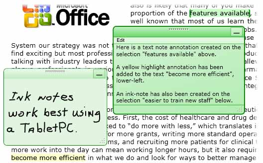
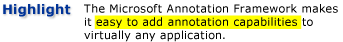
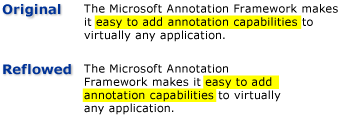

# Annotations Overview
Writing notes or comments on paper documents is such a commonplace activity that we almost take it for granted. These notes or comments are "annotations" that we add to a document to flag information or to highlight items of interest for later reference. Although writing notes on printed documents is easy and commonplace, the ability to add personal comments to electronic documents is typically very limited, if available at all.  
  
 This topic reviews several common types of annotations, specifically sticky notes and highlights, and illustrates how the [!INCLUDE[TLA#tla_caf](../../../../includes/tlasharptla-caf-md.md)] facilitates these types of annotations in applications through the [!INCLUDE[TLA#tla_wpf](../../../../includes/tlasharptla-wpf-md.md)] document viewing controls.  [!INCLUDE[TLA2#tla_wpf](../../../../includes/tla2sharptla-wpf-md.md)] document viewing controls that support annotations include <xref:System.Windows.Controls.FlowDocumentReader> and <xref:System.Windows.Controls.FlowDocumentScrollViewer>, as well as controls derived from <xref:System.Windows.Controls.Primitives.DocumentViewerBase> such as <xref:System.Windows.Controls.DocumentViewer> and <xref:System.Windows.Controls.FlowDocumentPageViewer>.  
  
  
   
## Sticky Notes  
 A typical sticky note contains information written on a small piece of colored paper that is then "stuck" to a document. Digital sticky notes provide similar functionality for electronic documents, but with the added flexibility to include many other types of content such as typed text, handwritten notes (for example, [!INCLUDE[TLA#tla_tpc](../../../../includes/tlasharptla-tpc-md.md)] "ink" strokes), or Web links.  
  
 The following illustration shows some examples of highlight, text sticky note, and ink sticky note annotations.  
  
   
  
 The following example shows the method that you can use to enable annotation support in your application.  
  
 [!code-csharp[DocViewerAnnotationsXml#DocViewXmlStartAnnotations](../../../../samples/snippets/csharp/VS_Snippets_Wpf/DocViewerAnnotationsXml/CSharp/Window1.xaml.cs#docviewxmlstartannotations)]
 [!code-vb[DocViewerAnnotationsXml#DocViewXmlStartAnnotations](../../../../samples/snippets/visualbasic/VS_Snippets_Wpf/DocViewerAnnotationsXml/visualbasic/window1.xaml.vb#docviewxmlstartannotations)]  
  
   
## Highlights  
 People use creative methods to draw attention to items of interest when they mark up a paper document, such as underlining, highlighting, circling words in a sentence, or drawing marks or notations in the margin.  Highlight annotations in [!INCLUDE[TLA#tla_caf](../../../../includes/tlasharptla-caf-md.md)] provide a similar feature for marking up information displayed in [!INCLUDE[TLA2#tla_wpf](../../../../includes/tla2sharptla-wpf-md.md)] document viewing controls.  
  
 The following illustration shows an example of a highlight annotation.  
  
   
  
 Users typically create annotations by first selecting some text or an item of interest, and then right-clicking to display a <xref:System.Windows.Controls.ContextMenu> of annotation options.  The following example shows the [!INCLUDE[TLA#tla_xaml](../../../../includes/tlasharptla-xaml-md.md)] you can use to declare a <xref:System.Windows.Controls.ContextMenu> with routed commands that users can access to create and manage annotations.  
  
 [!code-xaml[DocViewerAnnotationsXps#CreateDeleteAnnotations](../../../../samples/snippets/csharp/VS_Snippets_Wpf/DocViewerAnnotationsXps/CSharp/Window1.xaml#createdeleteannotations)]  
  
   
## Data Anchoring  
 The [!INCLUDE[TLA2#tla_caf](../../../../includes/tla2sharptla-caf-md.md)] binds annotations to the data that the user selects, not just to a position on the display view. Therefore, if the document view changes, such as when the user scrolls or resizes the display window, the annotation stays with the data selection to which it is bound. For example, the following graphic illustrates an annotation that the user has made on a text selection. When the document view changes (scrolls, resizes, scales, or otherwise moves), the highlight annotation moves with the original data selection.  
  
   
  
   
## Matching Annotations with Annotated Objects  
 You can match annotations with the corresponding annotated objects. For example, consider a simple document reader application that has a comments pane. The comments pane might be a list box that displays the text from a list of annotations that are anchored to a document. If the user selects an item in the list box, then the application brings into view the paragraph in the document that the corresponding annotation object is anchored to.  
  
 The following example demonstrates how to implement the event handler of such a list box that serves as the comments pane.  
  
 [!code-csharp[FlowDocumentAnnotatedViewer#Handler](../../../../samples/snippets/csharp/VS_Snippets_Wpf/FlowDocumentAnnotatedViewer/CSharp/Window1.xaml.cs#handler)]
 [!code-vb[FlowDocumentAnnotatedViewer#Handler](../../../../samples/snippets/visualbasic/VS_Snippets_Wpf/FlowDocumentAnnotatedViewer/visualbasic/window1.xaml.vb#handler)]  
  
 Another example scenario involves applications that enable the exchange of annotations and sticky notes between document readers through email. This feature enables these applications to navigate the reader to the page that contains the annotation that is being exchanged.  
  
## See Also  
 <xref:System.Windows.Controls.Primitives.DocumentViewerBase>  
 <xref:System.Windows.Controls.DocumentViewer>  
 <xref:System.Windows.Controls.FlowDocumentPageViewer>  
 <xref:System.Windows.Controls.FlowDocumentScrollViewer>  
 <xref:System.Windows.Controls.FlowDocumentReader>  
 <xref:System.Windows.Annotations.IAnchorInfo>  
 [Annotations Schema](../../../../docs/framework/wpf/advanced/annotations-schema.md)  
 [ContextMenu Overview](../../../../docs/framework/wpf/controls/contextmenu-overview.md)  
 [Commanding Overview](../../../../docs/framework/wpf/advanced/commanding-overview.md)  
 [Flow Document Overview](../../../../docs/framework/wpf/advanced/flow-document-overview.md)  
 [How to: Add a Command to a MenuItem](http://msdn.microsoft.com/library/013d68a0-5373-4a68-bd91-5de574307370)
