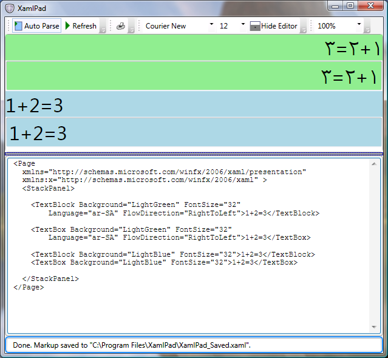

# Bidirectional Features in WPF Overview
Unlike any other development platform, [!INCLUDE[TLA2#tla_winclient](../../../../includes/tla2sharptla-winclient-md.md)] has many features that support rapid development of bidirectional content, for example, mixed left to right and right to left data in the same document. At the same time, [!INCLUDE[TLA2#tla_winclient](../../../../includes/tla2sharptla-winclient-md.md)] creates an excellent experience for users who require bidirectional features such as Arabic and Hebrew speaking users.  
  
 The following sections explain many bidirectional features together with examples illustrating how to achieve the best display of bidirectional content. Most of the samples use [!INCLUDE[TLA#tla_titlexaml](../../../../includes/tlasharptla-titlexaml-md.md)], though you can easily apply the concepts to [!INCLUDE[TLA#tla_cshrp](../../../../includes/tlasharptla-cshrp-md.md)] or [!INCLUDE[TLA#tla_visualb](../../../../includes/tlasharptla-visualb-md.md)] code.  
  

  
   
## FlowDirection  
 The basic property that defines the content flow direction in a [!INCLUDE[TLA2#tla_winclient](../../../../includes/tla2sharptla-winclient-md.md)] application is <xref:System.Windows.FrameworkElement.FlowDirection%2A>. This property can be set to one of two enumeration values, <xref:System.Windows.FlowDirection.LeftToRight> or <xref:System.Windows.FlowDirection.RightToLeft>. The property is available to all [!INCLUDE[TLA2#tla_winclient](../../../../includes/tla2sharptla-winclient-md.md)] elements that inherit from <xref:System.Windows.FrameworkElement>.  
  
 The following examples set the flow direction of a <xref:System.Windows.Controls.TextBox> element.  
  
 **Left-to-right flow direction**  
  
 [!code-xaml[LTRRTL#LTR](../../../../samples/snippets/csharp/VS_Snippets_Wpf/LTRRTL/CS/Pane1.xaml#ltr)]  
  
 **Right-to-left flow direction**  
  
 [!code-xaml[LTRRTL#RTL](../../../../samples/snippets/csharp/VS_Snippets_Wpf/LTRRTL/CS/Pane1.xaml#rtl)]  
  
 The following graphic shows how the previous code renders.  
  
 **Graphic That Illustrates FlowDirection**  
  
   
  
 An element within a [!INCLUDE[TLA#tla_ui](../../../../includes/tlasharptla-ui-md.md)] tree will inherit the <xref:System.Windows.FrameworkElement.FlowDirection%2A> from its container. In the following example, the <xref:System.Windows.Controls.TextBlock> is inside a <xref:System.Windows.Controls.Grid>, which resides in a <xref:System.Windows.Window>. Setting the <xref:System.Windows.FrameworkElement.FlowDirection%2A> for the <xref:System.Windows.Window> implies setting it for the <xref:System.Windows.Controls.Grid> and <xref:System.Windows.Controls.TextBlock> as well.  
  
 The following example demonstrates setting <xref:System.Windows.FrameworkElement.FlowDirection%2A>.  
  
 [!code-xaml[FlowDirection#FlowDirection](../../../../samples/snippets/csharp/VS_Snippets_Wpf/FlowDirection/CS/Window1.xaml#flowdirection)]  
  
 The top level <xref:System.Windows.Window> has a <xref:System.Windows.FlowDirection.RightToLeft><xref:System.Windows.FlowDirection>, so all elements contained within it also inherit the same <xref:System.Windows.FrameworkElement.FlowDirection%2A>. For an element to override a specified <xref:System.Windows.FrameworkElement.FlowDirection%2A> it must add an explicit direction change such as the second <xref:System.Windows.Controls.TextBlock> in the previous example which changes to <xref:System.Windows.FlowDirection.LeftToRight>. When no <xref:System.Windows.FrameworkElement.FlowDirection%2A> is defined, the default <xref:System.Windows.FlowDirection.LeftToRight> applies.  
  
 The following graphic shows the output of the previous example.  
  
 **Graphic That Illustrates Explicitly Assigned FlowDirection**  
  
   
  
   
## FlowDocument  
 Many development platforms such as [!INCLUDE[TLA#tla_html](../../../../includes/tlasharptla-html-md.md)], [!INCLUDE[TLA#tla_win32](../../../../includes/tlasharptla-win32-md.md)] and Java provide special support for bidirectional content development. Markup languages such as [!INCLUDE[TLA#tla_html](../../../../includes/tlasharptla-html-md.md)] give content writers the necessary markup to display text in any required direction, for example the [!INCLUDE[TLA#tla_html](../../../../includes/tlasharptla-html-md.md)] 4.0 tag, "dir" that takes "rtl" or "ltr" as values. This tag is similar to the <xref:System.Windows.FrameworkElement.FlowDirection%2A> property, but the <xref:System.Windows.FrameworkElement.FlowDirection%2A> property works in a more advanced way to layout textual content and can be used for content other than text.  
  
 In [!INCLUDE[TLA2#tla_winclient](../../../../includes/tla2sharptla-winclient-md.md)], a <xref:System.Windows.Documents.FlowDocument> is a versatile [!INCLUDE[TLA2#tla_ui](../../../../includes/tla2sharptla-ui-md.md)] element that can host a combination of text, tables, images and other elements. The samples in the following sections use this element.  
  
 Adding text to a <xref:System.Windows.Documents.FlowDocument> can be done in more that one way. A simple way to do so is through a <xref:System.Windows.Documents.Paragraph> which is a block-level element used to group content such as text. To add text to inline-level elements the samples use <xref:System.Windows.Documents.Span> and <xref:System.Windows.Documents.Run>. <xref:System.Windows.Documents.Span> is an inline-level flow content element used for grouping other inline elements, while a <xref:System.Windows.Documents.Run> is an inline-level flow content element intended to contain a run of unformatted text. A <xref:System.Windows.Documents.Span> can contain multiple <xref:System.Windows.Documents.Run> elements.  
  
 The first document example contains a document that has a number of network share names; for example `\\server1\folder\file.ext`. Whether you have this network link in an Arabic or English document, you always want it to appear in the same way. The following graphic shows the link in an Arabic <xref:System.Windows.FlowDirection.RightToLeft> document.  
  
 **Graphic That Illustrates Using the Span Element**  
  
   
  
 Because the text is <xref:System.Windows.FlowDirection.RightToLeft>, all special characters, such as the "\\", separate the text in a right to left order. That results in the link not being shown in the correct order, therefore to solve the problem, the text must be embedded to preserve a separate <xref:System.Windows.Documents.Run> flowing <xref:System.Windows.FlowDirection.LeftToRight>. Instead of having a separate <xref:System.Windows.Documents.Run> for each language, a better way to solve the problem is to embed the less frequently used English text into a larger Arabic <xref:System.Windows.Documents.Span>.  
  
 The following graphic illustrates this.  
  
 **Graphic That Illustrates Using the Run Element Embedded in a Span Element**  
  
   
  
 The following example demonstrates using <xref:System.Windows.Documents.Run> and <xref:System.Windows.Documents.Span> elements in documents.  
  
 [!code-xaml[RunSpan#RunSpan](../../../../samples/snippets/csharp/VS_Snippets_Wpf/RunSpan/CS/Window1.xaml#runspan)]  
  
   
## Span Elements  
 The <xref:System.Windows.Documents.Span> element works as a boundary separator between texts with different flow directions.  Even <xref:System.Windows.Documents.Span> elements with the same flow direction are considered to have different bidirectional scopes which means that the <xref:System.Windows.Documents.Span> elements are ordered in the container’s <xref:System.Windows.FlowDirection>, only the content within the <xref:System.Windows.Documents.Span> element follows the <xref:System.Windows.FlowDirection> of the <xref:System.Windows.Documents.Span>.  
  
 The following graphic shows the flow direction of several <xref:System.Windows.Controls.TextBlock> elements.  
  
 **Graphic That Illustrates FlowDirection in Several TextBlock Elements**  
  
   
  
 The following example shows how to use the <xref:System.Windows.Documents.Span> and <xref:System.Windows.Documents.Run> elements to produce the results shown in the previous graphic.  
  
 [!code-xaml[Span#Span](../../../../samples/snippets/csharp/VS_Snippets_Wpf/Span/CS/Window1.xaml#span)]  
  
 In the <xref:System.Windows.Controls.TextBlock> elements in the sample, the <xref:System.Windows.Documents.Span> elements are laid out according to the <xref:System.Windows.FlowDirection> of their parents, but the text within each <xref:System.Windows.Documents.Span> element flows according to its own <xref:System.Windows.FlowDirection>. This is applicable to Latin and Arabic – or any other language.  
  
### Adding xml:lang  
 The following graphic shows another example that uses numbers and arithmetic expressions, such as `"200.0+21.4=221.4"`. Notice that only the <xref:System.Windows.FlowDirection> is set.  
  
 **Graphic That Displays Numbers Using Only FlowDirection**  
  
   
  
 Users of this application will be disappointed by the output, even though the <xref:System.Windows.FlowDirection> is correct the numbers are not shaped as Arabic numbers should be shaped.  
  
 XAML elements can include an [!INCLUDE[TLA#tla_xml](../../../../includes/tlasharptla-xml-md.md)] attribute (`xml:lang`) that defines the language of each element. XAML also supports a [!INCLUDE[TLA2#tla_xml](../../../../includes/tla2sharptla-xml-md.md)] language principle whereby `xml:lang` values applied to parent elements in the tree are used by child elements. In the previous example, because a language was not defined for the <xref:System.Windows.Documents.Run> element or any of its top level elements, the default `xml:lang` was used, which is `en-US` for XAML. The internal number shaping algorithm of [!INCLUDE[TLA#tla_winclient](../../../../includes/tlasharptla-winclient-md.md)] selects numbers in the corresponding language – in this case English. To make the Arabic numbers render correctly `xml:lang` needs to be set.  
  
 The following graphic shows the example with `xml:lang` added.  
  
 **Graphic That Illustrates Using the xml:lang Attribute**  
  
   
  
 The following example adds `xml:lang` to the application.  
  
 [!code-xaml[LangAttribute#LangAttribute](../../../../samples/snippets/csharp/VS_Snippets_Wpf/LangAttribute/CS/Window1.xaml#langattribute)]  
  
 Be aware that many languages have different `xml:lang` values depending on the targeted region, for example, `"ar-SA"` and `"ar-EG"` represent two variations of Arabic. The previous examples illustrate that you need to define both the `xml:lang` and <xref:System.Windows.FlowDirection> values.  
  
   
## FlowDirection with Non-text Elements  
 <xref:System.Windows.FlowDirection> defines not only how text flows in a textual element but also the flow direction of almost every other [!INCLUDE[TLA2#tla_ui](../../../../includes/tla2sharptla-ui-md.md)] element. The following graphic shows a <xref:System.Windows.Controls.ToolBar> that uses a horizontal <xref:System.Windows.Media.LinearGradientBrush> to draw its background.  
  
 **Graphic That Shows a ToolBar with a Left to Right Gradient**  
  
   
  
 After setting the <xref:System.Windows.FlowDirection> to <xref:System.Windows.FlowDirection.RightToLeft>, not only the <xref:System.Windows.Controls.ToolBar> buttons are arranged from right to left, but even the <xref:System.Windows.Media.LinearGradientBrush> realigns its offsets to flow from right to left.  
  
 The following graphic shows the realignment of the <xref:System.Windows.Media.LinearGradientBrush>.  
  
 **Graphic That Shows a ToolBar with a Right to Left Gradient**  
  
   
  
 The following example draws a <xref:System.Windows.FlowDirection.RightToLeft><xref:System.Windows.Controls.ToolBar>. (To draw it left to right, remove the <xref:System.Windows.FlowDirection> attribute on the <xref:System.Windows.Controls.ToolBar>.  
  
 [!code-xaml[Gradient#Gradient](../../../../samples/snippets/csharp/VS_Snippets_Wpf/Gradient/CS/Window1.xaml#gradient)]  
  
   
### FlowDirection Exceptions  
 There are a few cases where <xref:System.Windows.FlowDirection> does not behave as expected. This section covers two of these exceptions.  
  
 **Image**  
  
 An <xref:System.Windows.Controls.Image> represents a control that displays an image. In [!INCLUDE[TLA#tla_titlexaml](../../../../includes/tlasharptla-titlexaml-md.md)] it can be used with a <xref:System.Windows.Controls.Image.Source%2A> property that defines the [!INCLUDE[TLA#tla_uri](../../../../includes/tlasharptla-uri-md.md)] of the <xref:System.Windows.Controls.Image> to display.  
  
 Unlike other [!INCLUDE[TLA2#tla_ui](../../../../includes/tla2sharptla-ui-md.md)] elements, an <xref:System.Windows.Controls.Image> does not inherit the <xref:System.Windows.FlowDirection> from the container. However, if the <xref:System.Windows.FlowDirection> is set explicitly to <xref:System.Windows.FlowDirection.RightToLeft>, an <xref:System.Windows.Controls.Image> is displayed flipped horizontally. This is implemented as a convenient feature for developers of bidirectional content; because in some cases, horizontally flipping the image produces the desired effect.  
  
 The following graphic shows a flipped <xref:System.Windows.Controls.Image>.  
  
 **Graphic That Illustrates a Flipped Image**  
  
   
  
 The following example demonstrates that the <xref:System.Windows.Controls.Image> fails to inherit the <xref:System.Windows.FlowDirection> from the <xref:System.Windows.Controls.StackPanel> that contains it. **Note** You must have a file named **ms_logo.jpg** on your C:\ drive to run this example.  
  
 [!code-xaml[Image#Image](../../../../samples/snippets/csharp/VS_Snippets_Wpf/Image/CS/Window1.xaml#image)]  
  
 **Note** Included in the download files is an **ms_logo.jpg** file. The code assumes that the .jpg file is not inside your project but somewhere on the C:\ drive. You must copy the .jpg from the project files to your C:\ drive or change the code to look for the file inside the project. To do this change `Source="file://c:/ms_logo.jpg"` to `Source="ms_logo.jpg"`.  
  
 **Paths**  
  
 In addition to an <xref:System.Windows.Controls.Image>, another interesting element is <xref:System.Windows.Shapes.Path>. A Path is an object that can draw a series of connected lines and curves. It behaves in a manner similar to an <xref:System.Windows.Controls.Image> regarding its <xref:System.Windows.FlowDirection>; for example its <xref:System.Windows.FlowDirection.RightToLeft><xref:System.Windows.FlowDirection> is a horizontal mirror of its <xref:System.Windows.FlowDirection.LeftToRight> one. However, unlike an <xref:System.Windows.Controls.Image>, <xref:System.Windows.Shapes.Path> inherits its <xref:System.Windows.FlowDirection> from the container and one does not need to specify it explicitly.  
  
 The following example draws a simple arrow using 3 lines. The first arrow inherits the <xref:System.Windows.FlowDirection.RightToLeft> flow direction from the <xref:System.Windows.Controls.StackPanel> so that its start and end points are measured from a root on the right side. The second arrow which has an explicit <xref:System.Windows.FlowDirection.RightToLeft><xref:System.Windows.FlowDirection> also starts on the right side. However, the third arrow has its starting root on the left side. For more information on drawing see <xref:System.Windows.Media.LineGeometry> and <xref:System.Windows.Media.GeometryGroup>.  
  
 [!code-xaml[Paths#Paths](../../../../samples/snippets/csharp/VS_Snippets_Wpf/Paths/CS/Window1.xaml#paths)]  
  
 The following graphic shows the output of the previous example.  
  
 **Graphic That Illustrates Arrows Drawn Using the Path Element**  
  
   
  
 The <xref:System.Windows.Controls.Image> and <xref:System.Windows.Shapes.Path> are two examples of a how [!INCLUDE[TLA#tla_winclient](../../../../includes/tlasharptla-winclient-md.md)] uses <xref:System.Windows.FlowDirection>. Beside laying out [!INCLUDE[TLA2#tla_ui](../../../../includes/tla2sharptla-ui-md.md)] elements in a specific direction within a container, <xref:System.Windows.FlowDirection> can be used with elements such as <xref:System.Windows.Controls.InkPresenter> which renders ink on a surface, <xref:System.Windows.Media.LinearGradientBrush>, <xref:System.Windows.Media.RadialGradientBrush>. Whenever you need a right to left behavior for your content that mimics a left to right behavior, or vice versa, [!INCLUDE[TLA#tla_winclient](../../../../includes/tlasharptla-winclient-md.md)] provides that capability.  
  
   
## Number Substitution  
 Historically, [!INCLUDE[TLA#tla_mswin](../../../../includes/tlasharptla-mswin-md.md)] has supported number substitution by allowing the representation of different cultural shapes for the same digits while keeping the internal storage of these digits unified among different locales, for example numbers are stored in their well known hexadecimal values, 0x40, 0x41, but displayed according to the selected language.  
  
 This has allowed applications to process numerical values without the need to convert them from one language to another, for example a user can open an [!INCLUDE[TLA#tla_xl](../../../../includes/tlasharptla-xl-md.md)] spreadsheet in a localized Arabic [!INCLUDE[TLA#tla_mswin](../../../../includes/tlasharptla-mswin-md.md)] and see the numbers shaped in Arabic, but open it in a European version of [!INCLUDE[TLA#tla_mswin](../../../../includes/tlasharptla-mswin-md.md)] and see European representation of the same numbers. This is also necessary for other symbols such as comma separators and percentage symbol because they usually accompany numbers in the same document.  
  
 [!INCLUDE[TLA#tla_winclient](../../../../includes/tlasharptla-winclient-md.md)] continues the same tradition, and adds further support for this feature that allows more user control over when and how substitution is used. While this feature is designed for any language, it is particularly useful in bidirectional content where shaping digits for a specific language is usually a challenge for application developers because of the various cultures an application might run on.  
  
 The core property controlling how number substitution works in [!INCLUDE[TLA#tla_winclient](../../../../includes/tlasharptla-winclient-md.md)] is the <xref:System.Windows.Media.NumberSubstitution.Substitution%2A> dependency property. The <xref:System.Windows.Media.NumberSubstitution> class specifies how numbers in text are to be displayed. It has three public properties that define its behavior. Following is a summary of each of the properties.  
  
 **CultureSource:**  
  
 This property specifies how the culture for numbers is determined. It takes one of three <xref:System.Windows.Media.NumberCultureSource> enumeration values.  
  
-   Override: Number culture is that of <xref:System.Windows.Media.NumberSubstitution.CultureOverride%2A> property.  
  
-   Text: Number culture is the culture of the text run. In markup, this would be `xml:lang`, or its alias `Language` property (<xref:System.Windows.FrameworkElement.Language%2A> or <xref:System.Windows.FrameworkContentElement.Language%2A>). Also, it is the default for classes deriving from <xref:System.Windows.FrameworkContentElement>. Such classes include <xref:System.Windows.Documents.Paragraph?displayProperty=nameWithType>, <xref:System.Windows.Documents.Table?displayProperty=nameWithType>, <xref:System.Windows.Documents.TableCell?displayProperty=nameWithType> and so forth.  
  
-   User: Number culture is the culture of the current thread. This property is the default for all subclasses of <xref:System.Windows.FrameworkElement> such as <xref:System.Windows.Controls.Page>, <xref:System.Windows.Window> and <xref:System.Windows.Controls.TextBlock>.  
  
 **CultureOverride**:  
  
 The <xref:System.Windows.Media.NumberSubstitution.CultureOverride%2A> property is used only if the <xref:System.Windows.Media.NumberSubstitution.CultureSource%2A> property is set to <xref:System.Windows.Media.NumberCultureSource.Override> and is ignored otherwise. It specifies the number culture. A value of `null`, the default value, is interpreted as en-US.  
  
 **Substitution**:  
  
 This property specifies the type of number substitution to perform. It takes one of the following <xref:System.Windows.Media.NumberSubstitutionMethod> enumeration values.  
  
-   <xref:System.Windows.Media.NumberSubstitutionMethod.AsCulture>: The substitution method is determined based on the number culture's <xref:System.Globalization.NumberFormatInfo.DigitSubstitution%2A?displayProperty=nameWithType> property. This is the default.  
  
-   <xref:System.Windows.Media.NumberSubstitutionMethod.Context>: If the number culture is an Arabic or Farsi culture, it specifies that the digits depend on the context.  
  
-   <xref:System.Windows.Media.NumberSubstitutionMethod.European>: Numbers are always rendered as European digits.  
  
-   <xref:System.Windows.Media.NumberSubstitutionMethod.NativeNational>: Numbers are rendered using the national digits for the number culture, as specified by the culture's <xref:System.Globalization.CultureInfo.NumberFormat%2A>.  
  
-   <xref:System.Windows.Media.NumberSubstitutionMethod.Traditional>: Numbers are rendered using the traditional digits for the number culture. For most cultures, this is the same as <xref:System.Windows.Media.NumberSubstitutionMethod.NativeNational>. However, <xref:System.Windows.Media.NumberSubstitutionMethod.NativeNational> results in Latin digits for some Arabic cultures, whereas this value results in Arabic digits for all Arabic cultures.  
  
 What do those values mean for a bidirectional content developer? In most cases, the developer might need only to define <xref:System.Windows.FlowDirection> and the language of each textual [!INCLUDE[TLA2#tla_ui](../../../../includes/tla2sharptla-ui-md.md)] element, for example `Language="ar-SA"` and the <xref:System.Windows.Media.NumberSubstitution> logic takes care of displaying the numbers according to the correct [!INCLUDE[TLA2#tla_ui](../../../../includes/tla2sharptla-ui-md.md)]. The following example demonstrates using Arabic and English numbers in a [!INCLUDE[TLA#tla_winclient](../../../../includes/tlasharptla-winclient-md.md)] application running in an Arabic version of [!INCLUDE[TLA#tla_mswin](../../../../includes/tlasharptla-mswin-md.md)].  
  
 [!code-xaml[Numbers#Numbers](../../../../samples/snippets/csharp/VS_Snippets_Wpf/Numbers/CS/Window1.xaml#numbers)]  
  
 The following graphic shows the output of the previous sample if you are running in an Arabic version of [!INCLUDE[TLA#tla_mswin](../../../../includes/tlasharptla-mswin-md.md)].  
  
 **Graphic That Shows Arabic and English Numbers Displayed**  
  
   
  
 The <xref:System.Windows.FlowDirection> was important in this case because setting the <xref:System.Windows.FlowDirection> to <xref:System.Windows.FlowDirection.LeftToRight> instead would have yielded European digits. The following sections discuss how to have a unified display of digits throughout your document. If this example is not running on Arabic Windows, all the digits display as European digits.  
  
 **Defining Substitution Rules**  
  
 In a real application you might need to set the Language programmatically. For example, you want to set the `xml:lang` attribute to be the same as the one used by the system’s [!INCLUDE[TLA2#tla_ui](../../../../includes/tla2sharptla-ui-md.md)], or maybe change the language depending on the application state.  
  
 If you want to make changes based on the application's state, make use of other features provided by [!INCLUDE[TLA#tla_winclient](../../../../includes/tlasharptla-winclient-md.md)].  
  
 First, set the application component’s `NumberSubstitution.CultureSource="Text"`. Using this setting makes sure that the settings do not come from the [!INCLUDE[TLA2#tla_ui](../../../../includes/tla2sharptla-ui-md.md)] for text elements that have "User" as the default, such as <xref:System.Windows.Controls.TextBlock>.  
  
 For example:  
  
||  
|-|  
|`<TextBlock`   `Name="text1" NumberSubstitution.CultureSource="Text">`   `1234+5679=6913`   `</TextBlock>`|  
  
 In the corresponding [!INCLUDE[TLA2#tla_lhcshrp](../../../../includes/tla2sharptla-lhcshrp-md.md)] code, set the `Language` property for example, to `"ar-SA"`.  
  
||  
|-|  
|`text1.Language =`   `System.Windows.Markup.XmlLanguage.GetLanguage("ar-SA");`|  
  
 If you need to set the `Language` property to the current user’s [!INCLUDE[TLA2#tla_ui](../../../../includes/tla2sharptla-ui-md.md)] language use the following code.  
  
||  
|-|  
|`text1.Language =`   `System.Windows.Markup.XmlLanguage.GetLanguage(`   `System.Globalization.CultureInfo.CurrentUICulture.IetfLanguageTag);`|  
  
 <xref:System.Globalization.CultureInfo.CurrentCulture%2A> represents the current culture used by the current thread at run time.  
  
 Your final [!INCLUDE[TLA#tla_titlexaml](../../../../includes/tlasharptla-titlexaml-md.md)] example should be similar to the following example.  
  
 [!code-xaml[Numbers2#Numbers2](../../../../samples/snippets/csharp/VS_Snippets_Wpf/Numbers2/CS/Window1.xaml#numbers2)]  
  
 Your final [!INCLUDE[TLA#tla_cshrp](../../../../includes/tlasharptla-cshrp-md.md)] example should be similar to the following.  
  
 [!code-csharp[NumbersCSharp#NumbersCSharp](../../../../samples/snippets/csharp/VS_Snippets_Wpf/NumbersCSharp/CSharp/Window1.xaml.cs#numberscsharp)]  
  
 The following graphic shows what the window looks like for either programming language.  
  
 **Graphic That Displays Arabic Numbers**  
  
   
  
 **Using the Substitution Property**  
  
 The way number substitution works in [!INCLUDE[TLA#tla_winclient](../../../../includes/tlasharptla-winclient-md.md)] depends on both the Language of the text element and its <xref:System.Windows.FlowDirection>. If the <xref:System.Windows.FlowDirection> is left to right, then European digits are rendered. However if it is preceded by Arabic text, or has the language set to "ar" and the <xref:System.Windows.FlowDirection> is <xref:System.Windows.FlowDirection.RightToLeft>, Arabic digits are rendered instead.  
  
 In some cases, however, you might want to create a unified application, for example European digits for all users. Or Arabic digits in <xref:System.Windows.Documents.Table> cells with a specific <xref:System.Windows.Style>. One easy way to do that is using the <xref:System.Windows.Media.NumberSubstitution.Substitution%2A> property.  
  
 In the following example, the first <xref:System.Windows.Controls.TextBlock> does not have the <xref:System.Windows.Media.NumberSubstitution.Substitution%2A> property set, so the algorithm displays Arabic digits as expected. However in the second <xref:System.Windows.Controls.TextBlock>, the substitution is set to European overriding the default substitution for Arabic numbers, and European digits are displayed.  
  
 [!code-xaml[Numbers3#Numbers3](../../../../samples/snippets/csharp/VS_Snippets_Wpf/Numbers3/CS/Window1.xaml#numbers3)]
