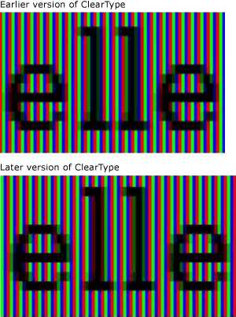
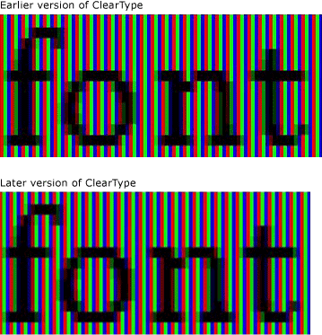
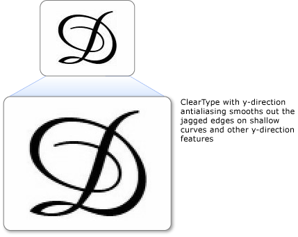

# ClearType Overview
This topic provides an overview of the Microsoft ClearType technology found in the [!INCLUDE[TLA#tla_winclient](../../../../includes/tlasharptla-winclient-md.md)].  

   
## Technology Overview  
 ClearType is a software technology developed by [!INCLUDE[TLA#tla_ms](../../../../includes/tlasharptla-ms-md.md)] that improves the readability of text on existing LCDs (Liquid Crystal Displays), such as laptop screens, Pocket PC screens and flat panel monitors.  ClearType works by accessing the individual vertical color stripe elements in every pixel of an LCD screen. Before ClearType, the smallest level of detail that a computer could display was a single pixel, but with ClearType running on an LCD monitor, we can now display features of text as small as a fraction of a pixel in width. The extra resolution increases the sharpness of the tiny details in text display, making it much easier to read over long durations.  
  
 The ClearType available in [!INCLUDE[TLA#tla_winclient](../../../../includes/tlasharptla-winclient-md.md)] is the latest generation of ClearType which has several improvements over version found in Microsoft Windows Graphics Device Interface (GDI).  
  
   
## Sub-pixel Positioning  
 A significant improvement over the previous version of ClearType is the use of sub-pixel positioning. Unlike the ClearType implementation found in GDI, the ClearType found in [!INCLUDE[TLA#tla_winclient](../../../../includes/tlasharptla-winclient-md.md)] allows glyphs to start within the pixel and not just the beginning boundary of the pixel. Because of this extra resolution in positioning glyphs, the spacing and proportions of the glyphs is more precise and consistent.  
  
 The following two examples show how glyphs may begin on any sub-pixel boundary when sub-pixel positioning is used. The example on the left is rendered using the earlier version of the ClearType renderer, which did not employ sub-pixel positioning. The example on the right is rendered using the new version of the ClearType renderer, using sub-pixel positioning. Note how each **e** and **l** in the right-hand image is rendered slightly differently because each starts on a different sub-pixel. When viewing the text at its normal size on the screen, this difference is not noticeable because of the high contrast of the glyph image. This is only possible because of sophisticated color filtering that is incorporated in ClearType.  
  
   
Text displayed with earlier and later versions of ClearType  
  
 The following two examples compare output from the earlier ClearType renderer with the new version of the ClearType renderer. The subpixel positioning, shown on the right, greatly improves the spacing of type on screen, especially at small sizes where the difference between a sub-pixel and a whole pixel represents a significant proportion of glyph width. Note that spacing between the letters is more even in the second image. The cumulative benefit of sub-pixel positioning to the overall appearance of a screen of text is greatly increased, and represents a significant evolution in ClearType technology.  
  
   
Text with earlier and later versions of ClearType  
  
   
## Y-Direction Antialiasing  
 Another improvement of ClearType in [!INCLUDE[TLA#tla_winclient](../../../../includes/tlasharptla-winclient-md.md)] is y-direction anti-aliasing. The ClearType in GDI without y-direction anti-aliasing provides better resolution on the x-axis but not the y-axis. On the tops and bottoms of shallow curves, the jagged edges detract from its readability.  
  
 The following example shows the effect of having no y-direction antialiasing. In this case, the jagged edges on the top and bottom of the letter are apparent.  
  
   
Text with jagged edges on shallow curves  
  
 ClearType in [!INCLUDE[TLA#tla_winclient](../../../../includes/tlasharptla-winclient-md.md)] provides antialiasing on the y-direction level to smooth out any jagged edges. This is particularly important for improving the readability of East Asian languages where ideographs have an almost equal amount of horizontal and vertical shallow curves.  
  
 The following example shows the effect of y-direction antialiasing. In this case, the top and bottom of the letter show a smooth curve.  
  
   
Text with ClearType y-direction antialiasing  
  
   
## Hardware Acceleration  
 ClearType in [!INCLUDE[TLA#tla_winclient](../../../../includes/tlasharptla-winclient-md.md)] can take advantage of hardware acceleration for better performance and to reduce CPU load and system memory requirements. By using the pixel shaders and video memory of a graphics card, ClearType provides faster rendering of text, particularly when animation is used.  
  
 ClearType in [!INCLUDE[TLA#tla_winclient](../../../../includes/tlasharptla-winclient-md.md)] does not modify the system-wide ClearType settings. Disabling ClearType in Windows sets [!INCLUDE[TLA#tla_winclient](../../../../includes/tlasharptla-winclient-md.md)] antialiasing to grayscale mode. In addition, ClearType in [!INCLUDE[TLA#tla_winclient](../../../../includes/tlasharptla-winclient-md.md)] does not modify the settings of the [ClearType Tuner PowerToy](https://www.microsoft.com/typography/ClearTypePowerToy.mspx).  
  
 One of the [!INCLUDE[TLA#tla_winclient](../../../../includes/tlasharptla-winclient-md.md)] architectural design decisions is to have resolution independent layout better support higher resolution DPI monitors, which are becoming more widespread. This has the consequence of [!INCLUDE[TLA#tla_winclient](../../../../includes/tlasharptla-winclient-md.md)] not supporting aliased text rendering or the bitmaps in some East Asian fonts because they are both resolution dependent.  
  
   
## Further Information  
 [ClearType Information](https://www.microsoft.com/typography/ClearTypeInfo.mspx)  
  
 [ClearType Tuner PowerToy](https://www.microsoft.com/typography/ClearTypePowerToy.mspx)  
  
## See also

- [ClearType Registry Settings](cleartype-registry-settings.md)
