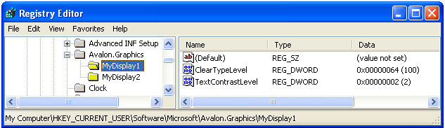

# ClearType Registry Settings
This topic provides an overview of the [!INCLUDE[TLA2#tla_winclient](../../../../includes/tla2sharptla-winclient-md.md)][!INCLUDE[TLA#tla_ct](../../../../includes/tlasharptla-ct-md.md)] registry settings that are used by [!INCLUDE[TLA2#tla_winclient](../../../../includes/tla2sharptla-winclient-md.md)] applications.  
  
  
   
## Technology Overview  
 [!INCLUDE[TLA2#tla_winclient](../../../../includes/tla2sharptla-winclient-md.md)] applications that render text to a display device use [!INCLUDE[TLA2#tla_ct](../../../../includes/tla2sharptla-ct-md.md)] features to provide an enhanced reading experience. [!INCLUDE[TLA2#tla_ct](../../../../includes/tla2sharptla-ct-md.md)] is a software technology developed by [!INCLUDE[TLA#tla_ms](../../../../includes/tlasharptla-ms-md.md)] that improves the readability of text on existing LCDs (Liquid Crystal Displays), such as laptop screens, Pocket PC screens and flat panel monitors. [!INCLUDE[TLA2#tla_ct](../../../../includes/tla2sharptla-ct-md.md)] works by accessing the individual vertical color stripe elements in every pixel of an LCD screen. For more information on [!INCLUDE[TLA2#tla_ct](../../../../includes/tla2sharptla-ct-md.md)], see [ClearType Overview](../../../../docs/framework/wpf/advanced/cleartype-overview.md).  
  
 Text that is rendered with [!INCLUDE[TLA2#tla_ct](../../../../includes/tla2sharptla-ct-md.md)] can appear significantly different when viewed on various display devices. For example, a small number of monitors implement the color stripe elements in blue, green, red order rather than the more common red, green, blue (    [!INCLUDE[TLA#tla_rgb](../../../../includes/tlasharptla-rgb-md.md)]) order.  
  
 Text that is rendered with [!INCLUDE[TLA2#tla_ct](../../../../includes/tla2sharptla-ct-md.md)] can also appear significantly different when viewed by individuals with varying levels of color sensitivity. Some individuals can detect slight differences in color better than others.  
  
 In each of these cases, [!INCLUDE[TLA2#tla_ct](../../../../includes/tla2sharptla-ct-md.md)] features need to be modified in order to provide the best reading experience for each individual.  
  
   
## Registry Settings  
 [!INCLUDE[TLA2#tla_winclient](../../../../includes/tla2sharptla-winclient-md.md)] specifies four registry settings for controlling [!INCLUDE[TLA2#tla_ct](../../../../includes/tla2sharptla-ct-md.md)] features:  
  
|Setting|Description|  
|-------------|-----------------|  
|[!INCLUDE[TLA2#tla_ct](../../../../includes/tla2sharptla-ct-md.md)] level|Describes the level of [!INCLUDE[TLA2#tla_ct](../../../../includes/tla2sharptla-ct-md.md)] color clarity.|  
|Gamma level|Describes the level of the pixel color component for a display device.|  
|Pixel structure|Describes the arrangement of pixels for a display device.|  
|Text contrast level|Describes the level of contrast for displayed text.|  
  
 These settings can be accessed by an external configuration utility that knows how to reference the identified [!INCLUDE[TLA2#tla_winclient](../../../../includes/tla2sharptla-winclient-md.md)][!INCLUDE[TLA2#tla_ct](../../../../includes/tla2sharptla-ct-md.md)] registry settings. These settings can also be created or modified by accessing the values directly by using the [!INCLUDE[TLA#tla_mswin](../../../../includes/tlasharptla-mswin-md.md)] Registry Editor.  
  
 If the [!INCLUDE[TLA2#tla_winclient](../../../../includes/tla2sharptla-winclient-md.md)][!INCLUDE[TLA2#tla_ct](../../../../includes/tla2sharptla-ct-md.md)] registry settings are not set (which is the default state), the [!INCLUDE[TLA2#tla_winclient](../../../../includes/tla2sharptla-winclient-md.md)] application queries the [!INCLUDE[TLA#tla_mswin](../../../../includes/tlasharptla-mswin-md.md)] system parameters information for font smoothing settings.  
  
> [!NOTE]
>  For information on enumerating display device names, see the `SystemParametersInfo`[!INCLUDE[TLA2#tla_win32](../../../../includes/tla2sharptla-win32-md.md)] function.  
  
   
## ClearType Level  
 The [!INCLUDE[TLA2#tla_ct](../../../../includes/tla2sharptla-ct-md.md)] level allows you to adjust the rendering of text based on the color sensitivity and perception of an individual. For some individuals, the rendering of text that uses [!INCLUDE[TLA2#tla_ct](../../../../includes/tla2sharptla-ct-md.md)] at its highest level does not produce the best reading experience.  
  
 The [!INCLUDE[TLA2#tla_ct](../../../../includes/tla2sharptla-ct-md.md)] level is an integer value that ranges from 0 to 100. The default level is 100, which means [!INCLUDE[TLA2#tla_ct](../../../../includes/tla2sharptla-ct-md.md)] uses the maximum capability of the color stripe elements of the display device. However, a [!INCLUDE[TLA2#tla_ct](../../../../includes/tla2sharptla-ct-md.md)] level of 0 renders text as gray scale. By setting the [!INCLUDE[TLA2#tla_ct](../../../../includes/tla2sharptla-ct-md.md)] level somewhere between 0 and 100, you can create an intermediate level that is suitable to an individual's color sensitivity.  
  
### Registry Setting  
 The registry setting location for the [!INCLUDE[TLA2#tla_ct](../../../../includes/tla2sharptla-ct-md.md)] level is an individual user setting that corresponds to a specific display device name:  
  
 `HKEY_CURRENT_USER\SOFTWARE\Microsoft\Avalon.Graphics\<displayName>`  
  
 For each display device name for a user, a `ClearTypeLevel` DWORD value is defined. The following screenshot shows the Registry Editor setting for the [!INCLUDE[TLA2#tla_ct](../../../../includes/tla2sharptla-ct-md.md)] level.  
  
   
  
> [!NOTE]
>  [!INCLUDE[TLA2#tla_winclient](../../../../includes/tla2sharptla-winclient-md.md)] applications render text in one of either two modes, with and without [!INCLUDE[TLA2#tla_ct](../../../../includes/tla2sharptla-ct-md.md)]. When text is rendered without [!INCLUDE[TLA2#tla_ct](../../../../includes/tla2sharptla-ct-md.md)], it is referred to as gray scale rendering.  
  
   
## Gamma Level  
 The gamma level refers to the nonlinear relationship between a pixel value and luminance. The gamma level setting should correspond to the physical characteristics of the display device; otherwise, distortions in rendered output may occur. For example, test may appear too wide or too narrow, or color fringes may appear on the edges of vertical stems of glyphs.  
  
 The gamma level is an integer value that ranges from 1000 to 2200. The default level is 1900.  
  
### Registry Setting  
 The registry setting location for the gamma level is a local machine setting that corresponds to a specific display device name:  
  
 `HKEY_LOCAL_MACHINE\SOFTWARE\Microsoft\Avalon.Graphics\<displayName>`  
  
 For each display device name for a user, a `GammaLevel` DWORD value is defined. The following screenshot shows the Registry Editor setting for the gamma level.  
  
   
  
   
## Pixel Structure  
 The pixel structure describes the type of pixels that make up a display device. The pixel structure is defined as one of three types:  
  
|Type|Value|Description|  
|----------|-----------|-----------------|  
|Flat|0|The display device has no pixel structure. This means that light sources for each color are spread equally on the pixel area—this is referred to as gray scale rendering. This is how a standard display device works. [!INCLUDE[TLA2#tla_ct](../../../../includes/tla2sharptla-ct-md.md)] is never applied to the rendered text.|  
|RGB|1|The display device has pixels that consist of three stripes in the following order: red, green, and blue. [!INCLUDE[TLA2#tla_ct](../../../../includes/tla2sharptla-ct-md.md)] is applied to the rendered text.|  
|BGR|2|The display device has pixels that consist of three stripes in the following order: blue, green, and red. [!INCLUDE[TLA2#tla_ct](../../../../includes/tla2sharptla-ct-md.md)] is applied to the rendered text. Notice how the order is inverted from the RGB type.|  
  
 The pixel structure corresponds to an integer value that ranges from 0 to 2. The default level is 0, which represents a flat pixel structure.  
  
> [!NOTE]
>  For information on enumerating display device names, see the `EnumDisplayDevices`[!INCLUDE[TLA2#tla_win32](../../../../includes/tla2sharptla-win32-md.md)] function.  
  
### Registry Setting  
 The registry setting location for the pixel structure is a local machine setting that corresponds to a specific display device name:  
  
 `HKEY_LOCAL_MACHINE\SOFTWARE\Microsoft\Avalon.Graphics\<displayName>`  
  
 For each display device name for a user, a `PixelStructure` DWORD value is defined. The following screenshot shows the Registry Editor setting for the pixel structure.  
  
   
  
   
## Text Contrast Level  
 The text contrast level allows you to adjust the rendering of text based on the stem widths of glyphs. The text contrast level is an integer value that ranges from 0 to 6—the larger the integer value, the wider the stem. The default level is 1.  
  
### Registry Setting  
 The registry setting location for the text contrast level is an individual user setting that corresponds to a specific display device name:  
  
 `HKEY_CURRENT_USER\Software\Microsoft\Avalon.Graphics\<displayName>`  
  
 For each display device name for a user, a `TextContrastLevel` DWORD value is defined. The following screenshot shows the Registry Editor setting for the text contrast level.  
  
   
  
## See Also  
 [ClearType Overview](../../../../docs/framework/wpf/advanced/cleartype-overview.md)  
 [ClearType Antialiasing](https://msdn.microsoft.com/library/dd183433(v=vs.85).aspx)
