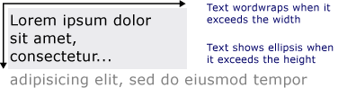

# Drawing Formatted Text
This topic provides an overview of the features of the <xref:System.Windows.Media.FormattedText> object. This object provides low-level control for drawing text in [!INCLUDE[TLA#tla_winclient](../../../../includes/tlasharptla-winclient-md.md)] applications.  
  
  
## Technology Overview  
 The <xref:System.Windows.Media.FormattedText> object allows you to draw multi-line text, in which each character in the text can be individually formatted. The following example shows text that has several formats applied to it.  
  
   
Displayed text using FormattedText method  
  
> [!NOTE]
>  For those developers migrating from the [!INCLUDE[TLA#tla_win32](../../../../includes/tlasharptla-win32-md.md)] API, the table in the [Win32 Migration](#win32_migration) section lists the [!INCLUDE[TLA#tla_win32](../../../../includes/tlasharptla-win32-md.md)] DrawText flags and the approximate equivalent in [!INCLUDE[TLA#tla_winclient](../../../../includes/tlasharptla-winclient-md.md)].  
  
### Reasons for Using Formatted Text  
 [!INCLUDE[TLA2#tla_winclient](../../../../includes/tla2sharptla-winclient-md.md)] includes multiple controls for drawing text to the screen. Each control is targeted to a different scenario and has its own list of features and limitations. In general, the <xref:System.Windows.Controls.TextBlock> element should be used when limited text support is required, such as a brief sentence in a [!INCLUDE[TLA#tla_ui](../../../../includes/tlasharptla-ui-md.md)]. <xref:System.Windows.Controls.Label> can be used when minimal text support is required. For more information, see [Documents in WPF](../../../../docs/framework/wpf/advanced/documents-in-wpf.md).  
  
 The <xref:System.Windows.Media.FormattedText> object provides greater text formatting features than [!INCLUDE[TLA#tla_winclient](../../../../includes/tlasharptla-winclient-md.md)] text controls, and can be useful in cases where you want to use text as a decorative element. For more information, see the following section [Converting Formatted Text to a Geometry](#converting_formatted_text).  
  
 In addition, the <xref:System.Windows.Media.FormattedText> object is useful for creating text-oriented <xref:System.Windows.Media.DrawingVisual>-derived objects. <xref:System.Windows.Media.DrawingVisual> is a lightweight drawing class that is used to render shapes, images, or text. For more information, see [Hit Test Using DrawingVisuals Sample](http://go.microsoft.com/fwlink/?LinkID=159994).  
  
## Using the FormattedText Object  
 To create formatted text, call the <xref:System.Windows.Media.FormattedText.%23ctor%2A> constructor to create a <xref:System.Windows.Media.FormattedText> object. Once you have created the initial formatted text string, you can apply a range of formatting styles.  
  
 Use the <xref:System.Windows.Media.FormattedText.MaxTextWidth%2A> property to constrain the text to a specific width. The text will automatically wrap to avoid exceeding the specified width. Use the <xref:System.Windows.Media.FormattedText.MaxTextHeight%2A> property to constrain the text to a specific height. The text will display an ellipsis, "…" for the text that exceeds the specified height.  
  
   
Displayed text showing wordwrapping and ellipsis  
  
 You can apply multiple formatting styles to one or more characters. For example, you could call both the <xref:System.Windows.Media.FormattedText.SetFontSize%2A> and <xref:System.Windows.Media.FormattedText.SetForegroundBrush%2A> methods to change the formatting of the first five characters in the text.  
  
 The following code example creates a <xref:System.Windows.Media.FormattedText> object and then applies several formatting styles to the text.  
  
 [!code-csharp[FormattedTextSnippets#FormattedTextSnippets1](../../../../samples/snippets/csharp/VS_Snippets_Wpf/FormattedTextSnippets/CSharp/Window1.xaml.cs#formattedtextsnippets1)]
 [!code-vb[FormattedTextSnippets#FormattedTextSnippets1](../../../../samples/snippets/visualbasic/VS_Snippets_Wpf/FormattedTextSnippets/visualbasic/window1.xaml.vb#formattedtextsnippets1)]  
  
### Font Size Unit of Measure  
 As with other text objects in [!INCLUDE[TLA#tla_winclient](../../../../includes/tlasharptla-winclient-md.md)] applications, the <xref:System.Windows.Media.FormattedText> object uses device-independent pixels as the unit of measure. However, most [!INCLUDE[TLA#tla_win32](../../../../includes/tlasharptla-win32-md.md)] applications use points as the unit of measure. If you want to use display text in units of points in [!INCLUDE[TLA#tla_winclient](../../../../includes/tlasharptla-winclient-md.md)] applications, you need to convert [!INCLUDE[TLA#tla_dipixel#plural](../../../../includes/tlasharptla-dipixelsharpplural-md.md)] to points. The following code example shows how to perform this conversion.  
  
 [!code-csharp[FormattedTextSnippets#FormattedTextSnippets2](../../../../samples/snippets/csharp/VS_Snippets_Wpf/FormattedTextSnippets/CSharp/Window1.xaml.cs#formattedtextsnippets2)]
 [!code-vb[FormattedTextSnippets#FormattedTextSnippets2](../../../../samples/snippets/visualbasic/VS_Snippets_Wpf/FormattedTextSnippets/visualbasic/window1.xaml.vb#formattedtextsnippets2)]  
  
   
### Converting Formatted Text to a Geometry  
 You can convert formatted text into <xref:System.Windows.Media.Geometry> objects, allowing you to create other types of visually interesting text. For example, you could create a <xref:System.Windows.Media.Geometry> object based on the outline of a text string.  
  
   
Text outline using a linear gradient brush  
  
 The following examples illustrate several ways of creating interesting visual effects by modifying the stroke, fill, and highlight of converted text.  
  
   
Example of setting stroke and fill to different colors  
  
   
Example of an image brush applied to the stroke  
  
   
Example of an image brush applied to the stroke and highlight  
  
 When text is converted to a <xref:System.Windows.Media.Geometry> object, it is no longer a collection of characters—you cannot modify the characters in the text string. However, you can affect the appearance of the converted text by modifying its stroke and fill properties. The stroke refers to the outline of the converted text; the fill refers to the area inside the outline of the converted text. For more information, see [Create Outlined Text](../../../../docs/framework/wpf/advanced/how-to-create-outlined-text.md).  
  
 You can also convert formatted text to a <xref:System.Windows.Media.PathGeometry> object, and use the object for highlighting the text. For example, you could apply an animation to the <xref:System.Windows.Media.PathGeometry> object so that the animation follows the outline of the formatted text.  
  
 The following example shows formatted text that has been converted to a <xref:System.Windows.Media.PathGeometry> object. An animated ellipse follows the path of the strokes of the rendered text.  
  
   
Sphere following the path geometry of text  
  
 For more information, see [How to: Create a PathGeometry Animation for Text](http://msdn.microsoft.com/library/29f8051e-798a-463f-a926-a099a99e9c67).  
  
 You can create other interesting uses for formatted text once it has been converted to a <xref:System.Windows.Media.PathGeometry> object. For example, you can clip video to display inside it.  
  
   
Video displaying in the path geometry of text  
  
   
## Win32 Migration  
 The features of <xref:System.Windows.Media.FormattedText> for drawing text are similar to the features of the [!INCLUDE[TLA#tla_win32](../../../../includes/tlasharptla-win32-md.md)] DrawText function. For those developers migrating from the [!INCLUDE[TLA#tla_win32](../../../../includes/tlasharptla-win32-md.md)] API, the following table lists the [!INCLUDE[TLA#tla_win32](../../../../includes/tlasharptla-win32-md.md)] DrawText flags and the approximate equivalent in [!INCLUDE[TLA#tla_winclient](../../../../includes/tlasharptla-winclient-md.md)].  
  
|DrawText flag|WPF equivalent|Notes|  
|-------------------|--------------------|-----------|  
|DT_BOTTOM|<xref:System.Windows.Media.FormattedText.Height%2A>|Use the <xref:System.Windows.Media.FormattedText.Height%2A> property to compute an appropriate [!INCLUDE[TLA#tla_win32](../../../../includes/tlasharptla-win32-md.md)] DrawText 'y' position.|  
|DT_CALCRECT|<xref:System.Windows.Media.FormattedText.Height%2A>, <xref:System.Windows.Media.FormattedText.Width%2A>|Use the <xref:System.Windows.Media.FormattedText.Height%2A> and <xref:System.Windows.Media.FormattedText.Width%2A> properties to calculate the output rectangle.|  
|DT_CENTER|<xref:System.Windows.Media.FormattedText.TextAlignment%2A>|Use the <xref:System.Windows.Media.FormattedText.TextAlignment%2A> property with the value set to <xref:System.Windows.TextAlignment.Center>.|  
|DT_EDITCONTROL|None|Not required. Space width and last line rendering are the same as in the framework edit control.|  
|DT_END_ELLIPSIS|<xref:System.Windows.Media.FormattedText.Trimming%2A>|Use the <xref:System.Windows.Media.FormattedText.Trimming%2A> property with the value <xref:System.Windows.TextTrimming.CharacterEllipsis>.   Use <xref:System.Windows.TextTrimming.WordEllipsis> to get [!INCLUDE[TLA#tla_win32](../../../../includes/tlasharptla-win32-md.md)] DT_END_ELLIPSIS with DT_WORD_ELIPSIS end ellipsis—in this case, character ellipsis only occurs on words that do not fit on a single line.|  
|DT_EXPAND_TABS|None|Not required. Tabs are automatically expanded to stops every 4 ems, which is approximately the width of 8 language-independent characters.|  
|DT_EXTERNALLEADING|None|Not required. External leading is always included in line spacing. Use the <xref:System.Windows.Media.FormattedText.LineHeight%2A> property to create user-defined line spacing.|  
|DT_HIDEPREFIX|None|Not supported. Remove the '&' from the string before constructing the <xref:System.Windows.Media.FormattedText> object.|  
|DT_LEFT|<xref:System.Windows.Media.FormattedText.TextAlignment%2A>|This is the default text alignment. Use the <xref:System.Windows.Media.FormattedText.TextAlignment%2A> property with the value set to <xref:System.Windows.TextAlignment.Left>. (WPF only)|  
|DT_MODIFYSTRING|None|Not supported.|  
|DT_NOCLIP|<xref:System.Windows.Media.Visual.VisualClip%2A>|Clipping does not happen automatically. If you want to clip text, use the <xref:System.Windows.Media.Visual.VisualClip%2A> property.|  
|DT_NOFULLWIDTHCHARBREAK|None|Not supported.|  
|DT_NOPREFIX|None|Not required. The '&' character in strings is always treated as a normal character.|  
|DT_PATHELLIPSIS|None|Use the <xref:System.Windows.Media.FormattedText.Trimming%2A> property with the value <xref:System.Windows.TextTrimming.WordEllipsis>.|  
|DT_PREFIX|None|Not supported. If you want to use underscores for text, such as an accelerator key or link, use the <xref:System.Windows.Media.FormattedText.SetTextDecorations%2A> method.|  
|DT_PREFIXONLY|None|Not supported.|  
|DT_RIGHT|<xref:System.Windows.Media.FormattedText.TextAlignment%2A>|Use the <xref:System.Windows.Media.FormattedText.TextAlignment%2A> property with the value set to <xref:System.Windows.TextAlignment.Right>. (WPF only)|  
|DT_RTLREADING|<xref:System.Windows.Media.FormattedText.FlowDirection%2A>|Set the <xref:System.Windows.Media.FormattedText.FlowDirection%2A> property to <xref:System.Windows.FlowDirection.RightToLeft>.|  
|DT_SINGLELINE|None|Not required. <xref:System.Windows.Media.FormattedText> objects behave as a single line control, unless either the <xref:System.Windows.Media.FormattedText.MaxTextWidth%2A> property is set or the text contains a carriage return/line feed (CR/LF).|  
|DT_TABSTOP|None|No support for user-defined tab stop positions.|  
|DT_TOP|<xref:System.Windows.Media.FormattedText.Height%2A>|Not required. Top justification is the default. Other vertical positioning values can be defined by using the <xref:System.Windows.Media.FormattedText.Height%2A> property to compute an appropriate [!INCLUDE[TLA#tla_win32](../../../../includes/tlasharptla-win32-md.md)] DrawText 'y' position.|  
|DT_VCENTER|<xref:System.Windows.Media.FormattedText.Height%2A>|Use the <xref:System.Windows.Media.FormattedText.Height%2A> property to compute an appropriate [!INCLUDE[TLA#tla_win32](../../../../includes/tlasharptla-win32-md.md)] DrawText 'y' position.|  
|DT_WORDBREAK|None|Not required. Word breaking happens automatically with <xref:System.Windows.Media.FormattedText> objects. You cannot disable it.|  
|DT_WORD_ELLIPSIS|<xref:System.Windows.Media.FormattedText.Trimming%2A>|Use the <xref:System.Windows.Media.FormattedText.Trimming%2A> property with the value <xref:System.Windows.TextTrimming.WordEllipsis>.|  
  
## See Also  
 <xref:System.Windows.Media.FormattedText>  
 [Documents in WPF](../../../../docs/framework/wpf/advanced/documents-in-wpf.md)  
 [Typography in WPF](../../../../docs/framework/wpf/advanced/typography-in-wpf.md)  
 [Create Outlined Text](../../../../docs/framework/wpf/advanced/how-to-create-outlined-text.md)  
 [How to: Create a PathGeometry Animation for Text](http://msdn.microsoft.com/library/29f8051e-798a-463f-a926-a099a99e9c67)
