# Flow Document Overview
Flow documents are designed to optimize viewing and readability. Rather than being set to one predefined layout, flow documents dynamically adjust and reflow their content based on run-time variables such as window size, device resolution, and optional user preferences. In addition, flow documents offer advanced document features, such as pagination and columns. This topic provides an overview of flow documents and how to create them.  
  

  
   
## What is a Flow Document  
 A flow document is designed to "reflow content" depending on window size, device resolution, and other environment variables. In addition, flow documents have a number of built in features including search, viewing modes that optimize readability, and the ability to change the size and appearance of fonts. Flow Documents are best utilized when ease of reading is the primary document consumption scenario. In contrast, Fixed Documents are designed to have a static presentation. Fixed Documents are useful when fidelity of the source content is essential. See [Documents in WPF](../../../../docs/framework/wpf/advanced/documents-in-wpf.md) for more information on different types of documents.  
  
 The following illustration shows a sample flow document viewed in several windows of different sizes. As the display area changes, the content reflows to make the best use of the available space.  
  
 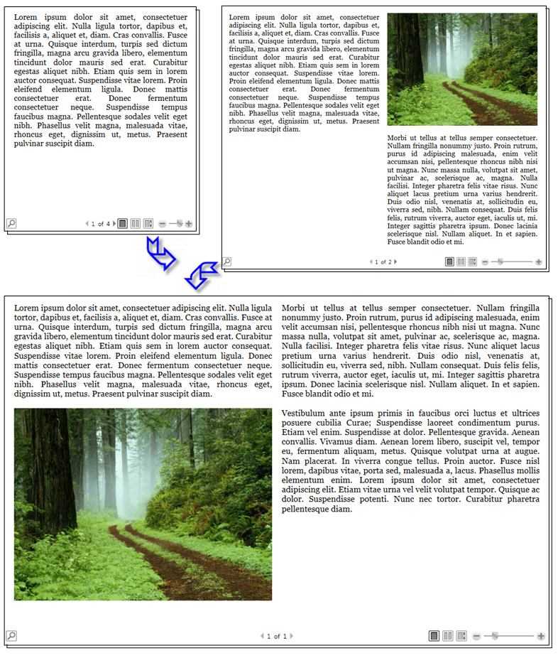  
  
 As seen in the image above, flow content can include many components including paragraphs, lists, images, and more. These components correspond to elements in markup and objects in procedural code. We will go over these classes in detail later in the [Flow Related Classes](#flow_related_classes) section of this overview. For now, here is a simple code example that creates a flow document consisting of a paragraph with some bold text and a list.
  
 [!code-xaml[FlowOvwSnippets_snip#SimpleFlowExampleWholePage](../../../../samples/snippets/csharp/VS_Snippets_Wpf/FlowOvwSnippets_snip/CS/SimpleFlowExample.xaml#simpleflowexamplewholepage)]  
  
 [!code-csharp[FlowOvwSnippets_procedural_snip#SimpleFlowCodeOnlyExampleWholePage](../../../../samples/snippets/csharp/VS_Snippets_Wpf/FlowOvwSnippets_procedural_snip/CSharp/SimpleFlowExample.cs#simpleflowcodeonlyexamplewholepage)]
 [!code-vb[FlowOvwSnippets_procedural_snip#SimpleFlowCodeOnlyExampleWholePage](../../../../samples/snippets/visualbasic/VS_Snippets_Wpf/FlowOvwSnippets_procedural_snip/VisualBasic/SimpleFlowExample.vb#simpleflowcodeonlyexamplewholepage)]  
  
 The illustration below shows what this code snippet looks like.  
  
 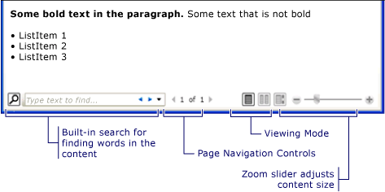  
  
 In this example, the <xref:System.Windows.Controls.FlowDocumentReader> control is used to host the flow content. See [Flow Document Types](#flow_document_types) for more information on flow content hosting controls. <xref:System.Windows.Documents.Paragraph>, <xref:System.Windows.Documents.List>, <xref:System.Windows.Documents.ListItem>, and <xref:System.Windows.Documents.Bold> elements are used to control content formatting, based on their order in markup. For example, the <xref:System.Windows.Documents.Bold> element spans across only part of the text in the paragraph; as a result, only that part of the text is bold. If you have used HTML, this will be familiar to you.  
  
 As highlighted in the illustration above, there are several features built into Flow Documents:
  
-   Search: Allows the user to perform a full text search of an entire document.  
  
-   Viewing Mode: The user can select their preferred viewing mode including a single-page (page-at-a-time) viewing mode, a two-page-at-a-time (book reading format) viewing mode, and a continuous scrolling (bottomless) viewing mode.  For more information about these viewing modes, see <xref:System.Windows.Controls.FlowDocumentReaderViewingMode>.  
  
-   Page Navigation Controls: If the viewing mode of the document uses pages, the page navigation controls include a button to jump to the next page (the down arrow) or previous page (the up arrow), as well as indicators for the current page number and total number of pages. Flipping through pages can also be accomplished using the keyboard arrow keys.  
  
-   Zoom: The zoom controls enable the user to increase or decrease the zoom level by clicking the plus or minus buttons, respectively. The zoom controls also include a slider for adjusting the zoom level. For more information, see <xref:System.Windows.Controls.FlowDocumentReader.Zoom%2A>.  
  
 These features can be modified based upon the control used to host the flow content. The next section describes the different controls.  
  
   
## Flow Document Types  
 Display of flow document content and how it appears is dependent upon what object is used to host the flow content. There are four controls that support viewing of flow content: <xref:System.Windows.Controls.FlowDocumentReader>, <xref:System.Windows.Controls.FlowDocumentPageViewer>, <xref:System.Windows.Controls.RichTextBox>, and <xref:System.Windows.Controls.FlowDocumentScrollViewer>. These controls are briefly described below.  
  
 **Note:**  <xref:System.Windows.Documents.FlowDocument> is required to directly host flow content, so all of these viewing controls consume a <xref:System.Windows.Documents.FlowDocument> to enable flow content hosting.
  
### FlowDocumentReader  
 <xref:System.Windows.Controls.FlowDocumentReader> includes features that enable the user to dynamically choose between various viewing modes, including a single-page (page-at-a-time) viewing mode, a two-page-at-a-time (book reading format) viewing mode, and a continuous scrolling (bottomless) viewing mode. For more information about these viewing modes, see <xref:System.Windows.Controls.FlowDocumentReaderViewingMode>. If you do not need the ability to dynamically switch between different viewing modes, <xref:System.Windows.Controls.FlowDocumentPageViewer> and <xref:System.Windows.Controls.FlowDocumentScrollViewer> provide lighter-weight flow content viewers that are fixed in a particular viewing mode.  
  
### FlowDocumentPageViewer and FlowDocumentScrollViewer  
 <xref:System.Windows.Controls.FlowDocumentPageViewer> shows content in page-at-a-time viewing mode, while <xref:System.Windows.Controls.FlowDocumentScrollViewer> shows content in continuous scrolling mode. Both <xref:System.Windows.Controls.FlowDocumentPageViewer> and <xref:System.Windows.Controls.FlowDocumentScrollViewer> are fixed to a particular viewing mode. Compare to <xref:System.Windows.Controls.FlowDocumentReader>, which includes features that enable the user to dynamically choose between various viewing modes (as provided by the <xref:System.Windows.Controls.FlowDocumentReaderViewingMode> enumeration), at the cost of being more resource intensive than <xref:System.Windows.Controls.FlowDocumentPageViewer> or <xref:System.Windows.Controls.FlowDocumentScrollViewer>.  
  
 By default, a vertical scrollbar is always shown, and a horizontal scrollbar becomes visible if needed. The default UI for <xref:System.Windows.Controls.FlowDocumentScrollViewer> does not include a toolbar; however, the <xref:System.Windows.Controls.FlowDocumentScrollViewer.IsToolBarVisible%2A> property can be used to enable a built-in toolbar.  
  
### RichTextBox  
 You use a <xref:System.Windows.Controls.RichTextBox> when you want to allow the user to edit flow content. For example, if you wanted to create an editor that allowed a user to manipulate things like tables, italic and bold formatting, etc, you would use a <xref:System.Windows.Controls.RichTextBox>. See [RichTextBox Overview](../../../../docs/framework/wpf/controls/richtextbox-overview.md) for more information.  
  
 **Note:** Flow content inside a <xref:System.Windows.Controls.RichTextBox> does not behave exactly like flow content contained in other controls. For example, there are no columns in a <xref:System.Windows.Controls.RichTextBox> and hence no automatic resizing behavior. Also, the typically built in features of flow content like search, viewing mode, page navigation, and zoom are not available within a <xref:System.Windows.Controls.RichTextBox>.  
  
   
## Creating Flow Content  
 Flow content can be complex, consisting of various elements including text, images, tables, and even <xref:System.Windows.UIElement> derived classes like controls. To understand how to create complex flow content, the following points are critical:  
  
-   **Flow-related Classes**: Each class used in flow content has a specific purpose. In addition, the hierarchical relation between flow classes helps you understand how they are used. For example, classes derived from the <xref:System.Windows.Documents.Block> class are used to contain other objects while classes derived from <xref:System.Windows.Documents.Inline> contain objects that are displayed.  
  
-   **Content Schema**: A flow document can require a substantial number of nested elements. The content schema specifies possible parent/child relationships between elements.  
  
 The following sections will go over each of these areas in more detail.  
  
   
## Flow Related Classes  
 The diagram below shows the objects most typically used with flow content:  
  
 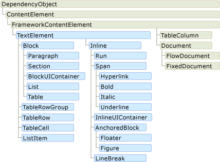  
  
 For the purposes of flow content, there are two important categories:  
  
1.  **Block-derived classes**: Also called "Block content elements" or just "Block Elements". Elements that inherit from <xref:System.Windows.Documents.Block> can be used to group elements under a common parent or to apply common attributes to a group.  
  
2.  **Inline-derived classes**: Also called "Inline content elements" or just "Inline Elements". Elements that inherit from <xref:System.Windows.Documents.Inline> are either contained within a Block Element or another Inline Element. Inline Elements are often used as the direct container of content that is rendered to the screen. For example, a <xref:System.Windows.Documents.Paragraph> (Block Element) can contain a <xref:System.Windows.Documents.Run> (Inline Element) but the <xref:System.Windows.Documents.Run> actually contains the text that is rendered on the screen.  
  
 Each class in these two categories is briefly described below.  
  
### Block-derived Classes  
 **Paragraph**  
  
 <xref:System.Windows.Documents.Paragraph> is typically used to group content into a paragraph. The simplest and most common use of Paragraph is to create a paragraph of text.  
  
 [!code-xaml[FlowOvwSnippets_snip#ParagraphExampleWholePage](../../../../samples/snippets/csharp/VS_Snippets_Wpf/FlowOvwSnippets_snip/CS/ParagraphExample.xaml#paragraphexamplewholepage)]  
  
 [!code-csharp[FlowOvwSnippets_procedural_snip#ParagraphCodeOnlyExampleWholePage](../../../../samples/snippets/csharp/VS_Snippets_Wpf/FlowOvwSnippets_procedural_snip/CSharp/ParagraphExample.cs#paragraphcodeonlyexamplewholepage)]
 [!code-vb[FlowOvwSnippets_procedural_snip#ParagraphCodeOnlyExampleWholePage](../../../../samples/snippets/visualbasic/VS_Snippets_Wpf/FlowOvwSnippets_procedural_snip/VisualBasic/ParagraphExample.vb#paragraphcodeonlyexamplewholepage)]  
  
 However, you can also contain other inline-derived elements as you will see below. 
  
 **Section**  
  
 <xref:System.Windows.Documents.Section> is used only to contain other <xref:System.Windows.Documents.Block>-derived elements. It does not apply any default formatting to the elements it contains. However, any property values set on a <xref:System.Windows.Documents.Section> applies to its child elements. A section also enables you to programmatically iterate through its child collection. <xref:System.Windows.Documents.Section> is used in a similar manner to the \
 tag in HTML.  
  
 In the example below, three paragraphs are defined under one <xref:System.Windows.Documents.Section>. The section has a <xref:System.Windows.Documents.TextElement.Background%2A> property value of Red, therefore the background color of the paragraphs is also red.  
  
 [!code-xaml[FlowOvwSnippets_snip#SectionExampleWholePage](../../../../samples/snippets/csharp/VS_Snippets_Wpf/FlowOvwSnippets_snip/CS/SectionExample.xaml#sectionexamplewholepage)]  
  
 [!code-csharp[FlowOvwSnippets_procedural_snip#SectionCodeOnlyExampleWholePage](../../../../samples/snippets/csharp/VS_Snippets_Wpf/FlowOvwSnippets_procedural_snip/CSharp/SectionExample.cs#sectioncodeonlyexamplewholepage)]
 [!code-vb[FlowOvwSnippets_procedural_snip#SectionCodeOnlyExampleWholePage](../../../../samples/snippets/visualbasic/VS_Snippets_Wpf/FlowOvwSnippets_procedural_snip/VisualBasic/SectionExample.vb#sectioncodeonlyexamplewholepage)]  
  
 **BlockUIContainer**  
  
 <xref:System.Windows.Documents.BlockUIContainer> enables <xref:System.Windows.UIElement> elements (i.e. a <xref:System.Windows.Controls.Button>) to be embedded  in block-derived flow content. <xref:System.Windows.Documents.InlineUIContainer> (see below) is used to embed <xref:System.Windows.UIElement> elements in inline-derived flow content. <xref:System.Windows.Documents.BlockUIContainer> and <xref:System.Windows.Documents.InlineUIContainer> are important because there is no other way to use a <xref:System.Windows.UIElement> in flow content unless it is contained within one of these two elements.  
  
 The following example shows how to use the <xref:System.Windows.Documents.BlockUIContainer> element to host <xref:System.Windows.UIElement> objects within flow content.  
  
 [!code-xaml[SpanSnippets#_BlockUIXAML](../../../../samples/snippets/csharp/VS_Snippets_Wpf/SpanSnippets/CSharp/Window1.xaml#_blockuixaml)]  
  
 The following figure shows how this example renders.  
  
   
  
 **List**  
  
 <xref:System.Windows.Documents.List> is used to create a bulleted or numeric list. Set the <xref:System.Windows.Documents.List.MarkerStyle%2A> property to a <xref:System.Windows.TextMarkerStyle> enumeration value to determine the style of the list. The example below shows how to create a simple list.  
  
 [!code-xaml[FlowOvwSnippets_snip#ListExampleWholePage](../../../../samples/snippets/csharp/VS_Snippets_Wpf/FlowOvwSnippets_snip/CS/ListExample.xaml#listexamplewholepage)]  
  
 [!code-csharp[FlowOvwSnippets_procedural_snip#ListCodeOnlyExampleWholePage](../../../../samples/snippets/csharp/VS_Snippets_Wpf/FlowOvwSnippets_procedural_snip/CSharp/ListExample.cs#listcodeonlyexamplewholepage)]
 [!code-vb[FlowOvwSnippets_procedural_snip#ListCodeOnlyExampleWholePage](../../../../samples/snippets/visualbasic/VS_Snippets_Wpf/FlowOvwSnippets_procedural_snip/VisualBasic/ListExample.vb#listcodeonlyexamplewholepage)]  
  
 **Note:** <xref:System.Windows.Documents.List> is the only flow element that uses the <xref:System.Windows.Documents.ListItemCollection> to manage child elements.  
  
 **Table**  
  
 <xref:System.Windows.Documents.Table> is used to create a table. <xref:System.Windows.Documents.Table> is similar to the <xref:System.Windows.Controls.Grid> element but it has more capabilities and, therefore, requires greater resource overhead. Because <xref:System.Windows.Controls.Grid> is a <xref:System.Windows.UIElement>, it cannot be used in flow content unless it is contained in a <xref:System.Windows.Documents.BlockUIContainer> or <xref:System.Windows.Documents.InlineUIContainer>. For more information on <xref:System.Windows.Documents.Table>, see [Table Overview](../../../../docs/framework/wpf/advanced/table-overview.md).  
  
### Inline-derived Classes  
 **Run**  
  
 <xref:System.Windows.Documents.Run> is used to contain unformatted text. You might expect <xref:System.Windows.Documents.Run> objects to be used extensively in flow content. However, in markup, <xref:System.Windows.Documents.Run> elements are not required to be used explicitly. <xref:System.Windows.Documents.Run> is required to be used when creating or manipulating flow documents by using code. For example, in the markup below, the first <xref:System.Windows.Documents.Paragraph> specifies the <xref:System.Windows.Documents.Run> element explicitly while the second does not. Both paragraphs generate identical output.  
  
 [!code-xaml[FlowOvwSnippets_snip#RunExample1](../../../../samples/snippets/csharp/VS_Snippets_Wpf/FlowOvwSnippets_snip/CS/RunSnippetsExample.xaml#runexample1)]  
  
 **Note:**  Starting in the [!INCLUDE[net_v40_short](../../../../includes/net-v40-short-md.md)], the <xref:System.Windows.Documents.Run.Text%2A> property of the <xref:System.Windows.Documents.Run> object is a dependency property. You can bind the <xref:System.Windows.Documents.Run.Text%2A> property to a data source, such as a <xref:System.Windows.Controls.TextBlock>. The <xref:System.Windows.Documents.Run.Text%2A> property fully supports one-way binding. The <xref:System.Windows.Documents.Run.Text%2A> property also supports two-way binding, except for <xref:System.Windows.Controls.RichTextBox>. For an example, see <xref:System.Windows.Documents.Run.Text%2A?displayProperty=nameWithType>.  
  
 **Span**  
  
 <xref:System.Windows.Documents.Span> groups other inline content elements together. No inherent rendering is applied to content within a <xref:System.Windows.Documents.Span> element. However, elements that inherit from <xref:System.Windows.Documents.Span> including <xref:System.Windows.Documents.Hyperlink>, <xref:System.Windows.Documents.Bold>, <xref:System.Windows.Documents.Italic> and <xref:System.Windows.Documents.Underline> do apply formatting to text.  
  
 Below is an example of a <xref:System.Windows.Documents.Span> being used to contain inline content including text, a <xref:System.Windows.Documents.Bold> element, and a <xref:System.Windows.Controls.Button>.  
  
 [!code-xaml[FlowOvwSnippets_snip#SpanExampleWholePage](../../../../samples/snippets/csharp/VS_Snippets_Wpf/FlowOvwSnippets_snip/CS/SpanExample.xaml#spanexamplewholepage)]  
  
 The following screenshot shows how this example renders.  
  
 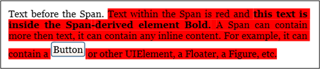  
  
 **InlineUIContainer**  
  
 <xref:System.Windows.Documents.InlineUIContainer> enables <xref:System.Windows.UIElement> elements (i.e. a control like <xref:System.Windows.Controls.Button>) to be embedded in an <xref:System.Windows.Documents.Inline> content element. This element is the inline equivalent to <xref:System.Windows.Documents.BlockUIContainer> described above. Below is an example that uses <xref:System.Windows.Documents.InlineUIContainer> to insert a <xref:System.Windows.Controls.Button> inline in a <xref:System.Windows.Documents.Paragraph>.  
  
 [!code-xaml[FlowOvwSnippets_snip#InlineUIContainerExampleWholePage](../../../../samples/snippets/csharp/VS_Snippets_Wpf/FlowOvwSnippets_snip/CS/InlineUIContainerExample.xaml#inlineuicontainerexamplewholepage)]  
  
 [!code-csharp[FlowOvwSnippets_procedural_snip#InlineUIContainerCodeOnlyExampleWholePage](../../../../samples/snippets/csharp/VS_Snippets_Wpf/FlowOvwSnippets_procedural_snip/CSharp/InlineUIContainerExample.cs#inlineuicontainercodeonlyexamplewholepage)]
 [!code-vb[FlowOvwSnippets_procedural_snip#InlineUIContainerCodeOnlyExampleWholePage](../../../../samples/snippets/visualbasic/VS_Snippets_Wpf/FlowOvwSnippets_procedural_snip/VisualBasic/InlineUIContainerExample.vb#inlineuicontainercodeonlyexamplewholepage)]  
  
 **Note:** <xref:System.Windows.Documents.InlineUIContainer> does not need to be used explicitly in markup. If you omit it, an <xref:System.Windows.Documents.InlineUIContainer> will be created anyway when the code is compiled.  
  
 **Figure and Floater**  
  
 <xref:System.Windows.Documents.Figure> and <xref:System.Windows.Documents.Floater> are used to embed content in Flow Documents with placement properties that can be customized independent of the primary content flow. <xref:System.Windows.Documents.Figure> or <xref:System.Windows.Documents.Floater> elements are often used to highlight or accentuate portions of content, to host supporting images or other content within the main content flow, or to inject loosely related content such as advertisements.  
  
 The following example shows how to embed a <xref:System.Windows.Documents.Figure> into a paragraph of text.  
  
 [!code-xaml[FlowOvwSnippets_snip#FigureExampleWholePage](../../../../samples/snippets/csharp/VS_Snippets_Wpf/FlowOvwSnippets_snip/CS/FigureExample.xaml#figureexamplewholepage)]  
  
 [!code-csharp[FlowOvwSnippets_procedural_snip#FigureCodeOnlyExampleWholePage](../../../../samples/snippets/csharp/VS_Snippets_Wpf/FlowOvwSnippets_procedural_snip/CSharp/FigureExample.cs#figurecodeonlyexamplewholepage)]
 [!code-vb[FlowOvwSnippets_procedural_snip#FigureCodeOnlyExampleWholePage](../../../../samples/snippets/visualbasic/VS_Snippets_Wpf/FlowOvwSnippets_procedural_snip/VisualBasic/FigureExample.vb#figurecodeonlyexamplewholepage)]  
  
 The following illustration shows how this example renders.  
  
 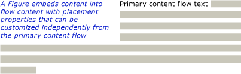  
  
 <xref:System.Windows.Documents.Figure> and <xref:System.Windows.Documents.Floater> differ in several ways and are used for different scenarios.  
  
 **Figure:**  
  
-   Can be positioned: You can set its horizontal and vertical anchors to dock it relative to the page, content, column or paragraph. You can also use its <xref:System.Windows.Documents.Figure.HorizontalOffset%2A> and <xref:System.Windows.Documents.Figure.VerticalOffset%2A> properties to specify arbitrary offsets.  
  
-   Is sizable to more than one column: You can set <xref:System.Windows.Documents.Figure> height and width to multiples of page, content or column height or width. Note that in the case of page and content, multiples greater than 1 are not allowed. For example, you can set the width of a <xref:System.Windows.Documents.Figure> to be "0.5 page" or "0.25 content" or "2 Column". You can also set height and width to absolute pixel values.  
  
-   Does not paginate: If the content inside a <xref:System.Windows.Documents.Figure> does not fit inside the <xref:System.Windows.Documents.Figure>, it will render whatever content does fit and the remaining content is lost  
  
 **Floater:**  
  
-   Cannot be positioned and will render wherever space can be made available for it. You cannot set the offset or anchor a <xref:System.Windows.Documents.Floater>.  
  
-   Cannot be sized to more than one column: By default, <xref:System.Windows.Documents.Floater> sizes at one column. It has a <xref:System.Windows.Documents.Floater.Width%2A> property that can be set to an absolute pixel value, but if this value is greater than one column width it is ignored and the floater is sized at one column. You can size it to less than one column by setting the correct pixel width, but sizing is not column-relative, so "0.5Column" is not a valid expression for <xref:System.Windows.Documents.Floater> width. <xref:System.Windows.Documents.Floater> has no height property and it's height cannot be set, it’s height depends on the content  
  
-   <xref:System.Windows.Documents.Floater> paginates: If its content at its specified width extends to more than 1 column height, floater breaks and paginates to the next column, the next page, etc.  
  
 <xref:System.Windows.Documents.Figure> is a good place to put standalone content where you want to control the size and positioning, and are confident that the content will fit in the specified size. <xref:System.Windows.Documents.Floater> is a good place to put more free-flowing content that flows similar to the main page content, but is separated from it.  
  
 **LineBreak**  
  
 <xref:System.Windows.Documents.LineBreak> causes a line break to occur in flow content. The following example demonstrates the use of <xref:System.Windows.Documents.LineBreak>.  
  
 [!code-xaml[FlowOvwSnippets_snip#LineBreakExampleWholePage](../../../../samples/snippets/csharp/VS_Snippets_Wpf/FlowOvwSnippets_snip/CS/LineBreakExample.xaml#linebreakexamplewholepage)]  
  
 The following screenshot shows how this example renders.  
  
 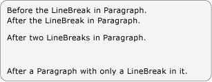  
  
### Flow Collection Elements  
 In many of the examples above, the <xref:System.Windows.Documents.BlockCollection> and <xref:System.Windows.Documents.InlineCollection> are used to construct flow content programmatically. For example, to add elements to a <xref:System.Windows.Documents.Paragraph>, you can use the syntax:  
  
 `…`  
  
 `myParagraph.Inlines.Add(new Run("Some text"));`  
  
 `…`  
  
 This adds a <xref:System.Windows.Documents.Run> to the <xref:System.Windows.Documents.InlineCollection> of the <xref:System.Windows.Documents.Paragraph>.  This is the same as the implicit <xref:System.Windows.Documents.Run> found inside a <xref:System.Windows.Documents.Paragraph> in markup:  
  
 `…`  
  
 `<Paragraph>`  
  
 `Some Text`  
  
 `</Paragraph>`  
  
 `…`  
  
 As an example of using the <xref:System.Windows.Documents.BlockCollection>, the following example creates a new <xref:System.Windows.Documents.Section> and then uses the **Add** method to add a new <xref:System.Windows.Documents.Paragraph> to the <xref:System.Windows.Documents.Section> contents.  
  
 [!code-csharp[FlowDocumentSnippets#_SectionBlocksAdd](../../../../samples/snippets/csharp/VS_Snippets_Wpf/FlowDocumentSnippets/CSharp/Window1.xaml.cs#_sectionblocksadd)]
 [!code-vb[FlowDocumentSnippets#_SectionBlocksAdd](../../../../samples/snippets/visualbasic/VS_Snippets_Wpf/FlowDocumentSnippets/visualbasic/window1.xaml.vb#_sectionblocksadd)]  
  
 In addition to adding items to a flow collection, you can remove items as well.  The following example deletes the last <xref:System.Windows.Documents.Inline> element in the <xref:System.Windows.Documents.Span>.  
  
 [!code-csharp[SpanSnippets#_SpanInlinesRemoveLast](../../../../samples/snippets/csharp/VS_Snippets_Wpf/SpanSnippets/CSharp/Window1.xaml.cs#_spaninlinesremovelast)]
 [!code-vb[SpanSnippets#_SpanInlinesRemoveLast](../../../../samples/snippets/visualbasic/VS_Snippets_Wpf/SpanSnippets/visualbasic/window1.xaml.vb#_spaninlinesremovelast)]  
  
 The following example clears all of the contents (<xref:System.Windows.Documents.Inline> elements) from the <xref:System.Windows.Documents.Span>.  
  
 [!code-csharp[SpanSnippets#_SpanInlinesClear](../../../../samples/snippets/csharp/VS_Snippets_Wpf/SpanSnippets/CSharp/Window1.xaml.cs#_spaninlinesclear)]
 [!code-vb[SpanSnippets#_SpanInlinesClear](../../../../samples/snippets/visualbasic/VS_Snippets_Wpf/SpanSnippets/visualbasic/window1.xaml.vb#_spaninlinesclear)]  
  
 When working with flow content programmatically, you will likely make extensive use of these collections.  
  
 Whether a flow element uses an <xref:System.Windows.Documents.InlineCollection> (Inlines) or <xref:System.Windows.Documents.BlockCollection> (Blocks) to contain its child elements depends on what type of child elements (<xref:System.Windows.Documents.Block> or <xref:System.Windows.Documents.Inline>) can be contained by the parent. Containment rules for flow content elements are summarized in the content schema in the next section.  
  
 **Note:** There is a third type of collection used with flow content, the <xref:System.Windows.Documents.ListItemCollection>, but this collection is only used with a <xref:System.Windows.Documents.List>. In addition, there are several collections used with <xref:System.Windows.Documents.Table>. See [Table Overview](../../../../docs/framework/wpf/advanced/table-overview.md) for more information.  
  
   
## Content Schema  
 Given the number of different flow content elements, it can be overwhelming to keep track of what type of child elements an element can contain. The diagram below summarizes the containment rules for flow elements. The arrows represent the possible parent/child relationships.  
  
 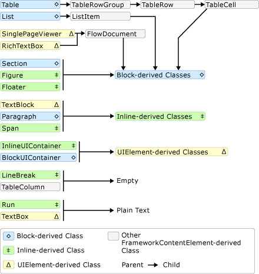  
  
 As can be seen from the diagram above, the children allowed for an element are not necessarily determined by whether it is a <xref:System.Windows.Documents.Block> element or an <xref:System.Windows.Documents.Inline> element. For example, a <xref:System.Windows.Documents.Span> (an <xref:System.Windows.Documents.Inline> element) can only have <xref:System.Windows.Documents.Inline> child elements while a <xref:System.Windows.Documents.Figure> (also an <xref:System.Windows.Documents.Inline> element) can only have <xref:System.Windows.Documents.Block> child elements. Therefore, a diagram is useful for quickly determining what element can be contained in another. As an example, let's use the diagram to determine how to construct the flow content of a <xref:System.Windows.Controls.RichTextBox>.  
  
 **1.** A <xref:System.Windows.Controls.RichTextBox> must contain a <xref:System.Windows.Documents.FlowDocument> which in turn must contain a <xref:System.Windows.Documents.Block>-derived object. Below is the corresponding segment from the diagram above.  
  
 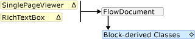  
  
 Thus far, this is what the markup might look like.  
  
 [!code-xaml[FlowOvwSnippets_snip#SchemaWalkThrough1](../../../../samples/snippets/csharp/VS_Snippets_Wpf/FlowOvwSnippets_snip/CS/MiscSnippets.xaml#schemawalkthrough1)]  
  
 **2.** According to the diagram, there are several <xref:System.Windows.Documents.Block> elements to choose from including <xref:System.Windows.Documents.Paragraph>, <xref:System.Windows.Documents.Section>, <xref:System.Windows.Documents.Table>, <xref:System.Windows.Documents.List>, and <xref:System.Windows.Documents.BlockUIContainer> (see Block-derived classes above). Let's say we want a <xref:System.Windows.Documents.Table>. According to the diagram above, a <xref:System.Windows.Documents.Table> contains a <xref:System.Windows.Documents.TableRowGroup> containing <xref:System.Windows.Documents.TableRow> elements, which contain <xref:System.Windows.Documents.TableCell> elements which contain a <xref:System.Windows.Documents.Block>-derived object. Below is the corresponding segment for <xref:System.Windows.Documents.Table> taken from the diagram above.  
  
   
  
 Below is the corresponding markup.  
  
 [!code-xaml[FlowOvwSnippets_snip#SchemaWalkThrough2](../../../../samples/snippets/csharp/VS_Snippets_Wpf/FlowOvwSnippets_snip/CS/MiscSnippets.xaml#schemawalkthrough2)]  
  
 **3.** Again, one or more <xref:System.Windows.Documents.Block> elements are required underneath a <xref:System.Windows.Documents.TableCell>. To make it simple, let's place some text inside the cell. We can do this using a <xref:System.Windows.Documents.Paragraph> with a <xref:System.Windows.Documents.Run> element. Below is the corresponding segments from the diagram showing that a <xref:System.Windows.Documents.Paragraph> can take an <xref:System.Windows.Documents.Inline> element and that a <xref:System.Windows.Documents.Run> (an <xref:System.Windows.Documents.Inline> element) can only take plain text.  
  
 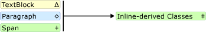  
  
 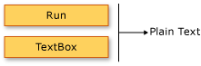  
  
 Below is the entire example in markup.  
  
 [!code-xaml[FlowOvwSnippets_snip#SchemaExampleWholePage](../../../../samples/snippets/csharp/VS_Snippets_Wpf/FlowOvwSnippets_snip/CS/SchemaExample.xaml#schemaexamplewholepage)]  
  
   
## Customizing Text  
 Usually text is the most prevalent type of content in a flow document. Although the objects introduced above can be used to control most aspects of how text is rendered, there are some other methods for customizing text that is covered in this section.  
  
### Text Decorations  
 Text decorations allow you to apply the underline, overline, baseline, and strikethrough effects to text (see pictures below). These decorations are added using the <xref:System.Windows.Documents.Inline.TextDecorations%2A> property that is exposed by a number of objects including <xref:System.Windows.Documents.Inline>, <xref:System.Windows.Documents.Paragraph>, <xref:System.Windows.Controls.TextBlock>, and <xref:System.Windows.Controls.TextBox>.  
  
 The following example shows how to set the <xref:System.Windows.Documents.Paragraph.TextDecorations%2A> property of a <xref:System.Windows.Documents.Paragraph>.  
  
 [!code-xaml[InlineSnippets#_Paragraph_TextDecXAML](../../../../samples/snippets/csharp/VS_Snippets_Wpf/InlineSnippets/CSharp/Window1.xaml#_paragraph_textdecxaml)]  
  
 [!code-csharp[InlineSnippets#_Paragraph_TextDec](../../../../samples/snippets/csharp/VS_Snippets_Wpf/InlineSnippets/CSharp/Window1.xaml.cs#_paragraph_textdec)]
 [!code-vb[InlineSnippets#_Paragraph_TextDec](../../../../samples/snippets/visualbasic/VS_Snippets_Wpf/InlineSnippets/visualbasic/window1.xaml.vb#_paragraph_textdec)]  
  
 The following figure shows how this example renders.  
  
 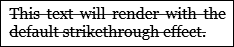  
  
 The following figures show how the **Overline**, **Baseline**, and **Underline** decorations render, respectively.  
  
 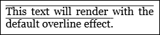  
  
 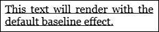  
  
 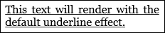  
  
### Typography  
 The <xref:System.Windows.Documents.TextElement.Typography%2A> property is exposed by most flow-related content including <xref:System.Windows.Documents.TextElement>, <xref:System.Windows.Documents.FlowDocument>, <xref:System.Windows.Controls.TextBlock>, and <xref:System.Windows.Controls.TextBox>. This property is used to control typographical characteristics/variations of text (i.e. small or large caps, making superscripts and subscripts, etc).  
  
 The following example shows how to set the <xref:System.Windows.Documents.TextElement.Typography%2A> attribute, using <xref:System.Windows.Documents.Paragraph> as the example element.  
  
 [!code-xaml[TextElementSnippets#_TextElement_TypogXAML](../../../../samples/snippets/csharp/VS_Snippets_Wpf/TextElementSnippets/CSharp/Window1.xaml#_textelement_typogxaml)]  
  
 The following figure shows how this example renders.  
  
   
  
 In contrast, the following figure shows how a similar example with default typographic properties renders.  
  
 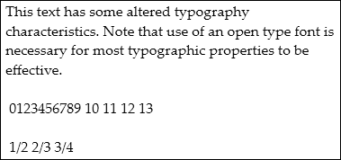  
  
 The following example shows how to set the <xref:System.Windows.Controls.TextBox.Typography%2A> property programmatically.  
  
 [!code-csharp[TextElementSnippets#_TextElement_Typog](../../../../samples/snippets/csharp/VS_Snippets_Wpf/TextElementSnippets/CSharp/Window1.xaml.cs#_textelement_typog)]
 [!code-vb[TextElementSnippets#_TextElement_Typog](../../../../samples/snippets/visualbasic/VS_Snippets_Wpf/TextElementSnippets/visualbasic/window1.xaml.vb#_textelement_typog)]  
  
 See [Typography in WPF](../../../../docs/framework/wpf/advanced/typography-in-wpf.md) for more information on typography.  
  
## See Also  
 [Text](../../../../docs/framework/wpf/advanced/optimizing-performance-text.md)  
 [Typography in WPF](../../../../docs/framework/wpf/advanced/typography-in-wpf.md)  
 [How-to Topics](../../../../docs/framework/wpf/advanced/flow-content-elements-how-to-topics.md)  
 [TextElement Content Model Overview](../../../../docs/framework/wpf/advanced/textelement-content-model-overview.md)  
 [RichTextBox Overview](../../../../docs/framework/wpf/controls/richtextbox-overview.md)  
 [Documents in WPF](../../../../docs/framework/wpf/advanced/documents-in-wpf.md)  
 [Table Overview](../../../../docs/framework/wpf/advanced/table-overview.md)  
 [Annotations Overview](../../../../docs/framework/wpf/advanced/annotations-overview.md)
