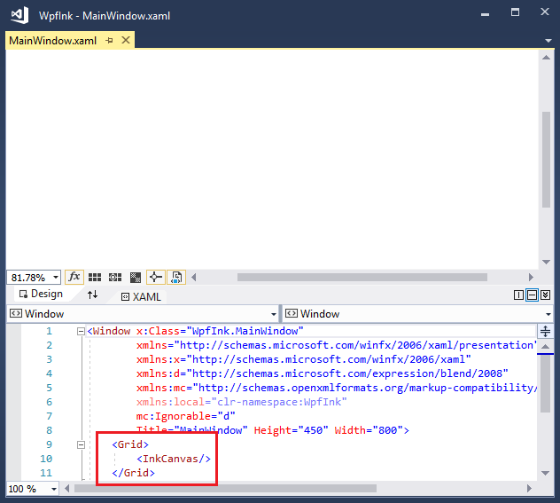
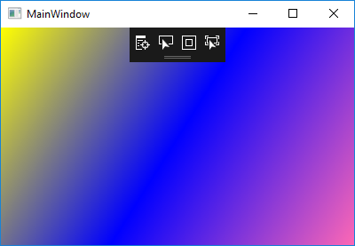

# Get Started with Ink in WPF

Windows Presentation Foundation (WPF) has an ink feature that makes it easy to incorporate digital ink into your app.

## Prerequisites

To use the following examples, first [install Microsoft Visual Studio](https://visualstudio.microsoft.com/downloads/?utm_medium=microsoft&utm_source=docs.microsoft.com&utm_campaign=button+cta&utm_content=download+vs2017). It also helps to know how to write basic WPF apps. For help getting started with WPF, see [Walkthrough: My first WPF desktop application](../../../../docs/framework/wpf/getting-started/walkthrough-my-first-wpf-desktop-application.md).

## Quick Start

This section helps you write a simple WPF application that collects ink.

### Got Ink?

To create a WPF app that supports ink:

1. Open Visual Studio.

2. Create a new **WPF App**.

   In the **New Project** dialog, expand the **Installed** > **Visual C#** or **Visual Basic** > **Windows Desktop** category. Then, select the **WPF App (.NET Framework)** app template. Enter a name, and then select **OK**.

   Visual Studio creates the project, and *MainWindow.xaml* opens in the designer.

3. Type `<InkCanvas/>` between the `<Grid>` tags.

   

4. Press **F5** to launch your application in the debugger.

5. Using a stylus or mouse, write **hello world** in the window.

You've written the ink equivalent of a "hello world" application with only 12 keystrokes!

### Spice Up Your App

Let’s take advantage of some features of the WPF. Replace everything between the opening and closing \<Window> tags with the following markup:

```xaml
<Page>
  <InkCanvas Name="myInkCanvas" MouseRightButtonUp="RightMouseUpHandler">
    <InkCanvas.Background>
      <LinearGradientBrush>
        <GradientStop Color="Yellow" Offset="0.0" />
          <GradientStop Color="Blue" Offset="0.5" />
            <GradientStop Color="HotPink" Offset="1.0" />
              </LinearGradientBrush>
    </InkCanvas.Background>
  </InkCanvas>
</Page>
```

This XAML creates a gradient brush background on your inking surface.



### Add Some Code Behind the XAML

While XAML makes it very easy to design the user interface, any real-world application needs to add code to handle events. Here is a simple example that zooms in on the ink in response to a right-click from a mouse.

1. Set the `MouseRightButtonUp` handler in your XAML:

   [!code-xaml[DigitalInkTopics#3](../../../../samples/snippets/csharp/VS_Snippets_Wpf/DigitalInkTopics/CSharp/Window2.xaml#3)]

1. In **Solution Explorer**, expand MainWindow.xaml and open the code-behind file (MainWindow.xaml.cs or MainWindow.xaml.vb). Add the following event handler code:

   [!code-csharp[DigitalInkTopics#4](../../../../samples/snippets/csharp/VS_Snippets_Wpf/DigitalInkTopics/CSharp/Window2.xaml.cs#4)]
   [!code-vb[DigitalInkTopics#4](../../../../samples/snippets/visualbasic/VS_Snippets_Wpf/DigitalInkTopics/VisualBasic/Window2.xaml.vb#4)]

1. Run the application. Add some ink, and then right-click with the mouse or perform a press-and-hold equivalent with a stylus.

   The display zooms in each time you click with the right mouse button.

### Use Procedural Code Instead of XAML

You can access all WPF features from procedural code. Follow these steps to create a "Hello Ink World" application for WPF that doesn’t use any XAML at all.

1. Create a new console application project in Visual Studio.

   In the **New Project** dialog, expand the **Installed** > **Visual C#** or **Visual Basic** > **Windows Desktop** category. Then, select the **Console App (.NET Framework)** app template. Enter a name, and then select **OK**.

1. Paste the following code into the Program.cs or Program.vb file:

   [!code-csharp[InkCanvasConsoleApp#1](../../../../samples/snippets/csharp/VS_Snippets_Wpf/InkCanvasConsoleApp/CSharp/Program.cs#1)]
   [!code-vb[InkCanvasConsoleApp#1](../../../../samples/snippets/visualbasic/VS_Snippets_Wpf/InkCanvasConsoleApp/VisualBasic/Module1.vb#1)]

1. Add references to the PresentationCore, PresentationFramework, and WindowsBase assemblies by right-clicking on **References** in **Solution Explorer** and choosing **Add Reference**.

   

1. Build the application by pressing **F5**.

## See also

- [Digital Ink](../../../../docs/framework/wpf/advanced/digital-ink.md)
- [Collecting Ink](../../../../docs/framework/wpf/advanced/collecting-ink.md)
- [Handwriting Recognition](../../../../docs/framework/wpf/advanced/handwriting-recognition.md)
- [Storing Ink](../../../../docs/framework/wpf/advanced/storing-ink.md)
