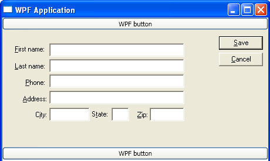

# Hosting Win32 Content in WPF
## Prerequisites  
 See [WPF and Win32 Interoperation](../../../../docs/framework/wpf/advanced/wpf-and-win32-interoperation.md).  
  
## A Walkthrough of Win32 Inside Windows Presentation Framework (HwndHost)  
 To reuse [!INCLUDE[TLA2#tla_win32](../../../../includes/tla2sharptla-win32-md.md)] content inside [!INCLUDE[TLA2#tla_winclient](../../../../includes/tla2sharptla-winclient-md.md)] applications, use <xref:System.Windows.Interop.HwndHost>, which is a control that makes HWNDs look like [!INCLUDE[TLA2#tla_winclient](../../../../includes/tla2sharptla-winclient-md.md)] content.  Like <xref:System.Windows.Interop.HwndSource>, <xref:System.Windows.Interop.HwndHost> is straightforward to use: derive from <xref:System.Windows.Interop.HwndHost> and implement `BuildWindowCore` and `DestroyWindowCore` methods, then instantiate your <xref:System.Windows.Interop.HwndHost> derived class and place it inside your [!INCLUDE[TLA2#tla_winclient](../../../../includes/tla2sharptla-winclient-md.md)] application.  
  
 If your [!INCLUDE[TLA2#tla_win32](../../../../includes/tla2sharptla-win32-md.md)] logic is already packaged as a control, then your `BuildWindowCore` implementation is little more than a call to `CreateWindow`.  For example, to create a [!INCLUDE[TLA2#tla_win32](../../../../includes/tla2sharptla-win32-md.md)] LISTBOX control in [!INCLUDE[TLA#tla_cpp](../../../../includes/tlasharptla-cpp-md.md)]:  
  
```  
virtual HandleRef BuildWindowCore(HandleRef hwndParent) override {  
    HWND handle = CreateWindowEx(0, L"LISTBOX",   
    L"this is a Win32 listbox",  
    WS_CHILD | WS_VISIBLE | LBS_NOTIFY  
    | WS_VSCROLL | WS_BORDER,  
    0, 0, // x, y  
    30, 70, // height, width  
    (HWND) hwndParent.Handle.ToPointer(), // parent hwnd  
    0, // hmenu  
    0, // hinstance  
    0); // lparam  
  
    return HandleRef(this, IntPtr(handle));  
}  
  
virtual void DestroyWindowCore(HandleRef hwnd) override {  
    // HwndHost will dispose the hwnd for us  
}  
```  
  
 But suppose the [!INCLUDE[TLA2#tla_win32](../../../../includes/tla2sharptla-win32-md.md)] code is not quite so self-contained? If so, you can create a [!INCLUDE[TLA2#tla_win32](../../../../includes/tla2sharptla-win32-md.md)] dialog box and embed its contents into a larger [!INCLUDE[TLA2#tla_winclient](../../../../includes/tla2sharptla-winclient-md.md)] application.  The sample shows this in [!INCLUDE[TLA#tla_visualstu](../../../../includes/tlasharptla-visualstu-md.md)] and [!INCLUDE[TLA#tla_cpp](../../../../includes/tlasharptla-cpp-md.md)], although it is also possible to do this in a different language or at the command line.  
  
 Start with a simple dialog, which is compiled into a [!INCLUDE[TLA#tla_cpp](../../../../includes/tlasharptla-cpp-md.md)] [!INCLUDE[TLA2#tla_dll](../../../../includes/tla2sharptla-dll-md.md)] project.  
  
 Next, introduce the dialog into the larger [!INCLUDE[TLA2#tla_winclient](../../../../includes/tla2sharptla-winclient-md.md)] application:  
  
-   Compile the [!INCLUDE[TLA2#tla_dll](../../../../includes/tla2sharptla-dll-md.md)] as managed (`/clr`)  
  
-   Turn the dialog into a control  
  
-   Define the derived class of <xref:System.Windows.Interop.HwndHost> with `BuildWindowCore` and `DestroyWindowCore` methods  
  
-   Override `TranslateAccelerator` method to handle dialog keys  
  
-   Override `TabInto` method to support tabbing  
  
-   Override `OnMnemonic` method to support mnemonics  
  
-   Instantiate the <xref:System.Windows.Interop.HwndHost> subclass and put it under the right [!INCLUDE[TLA2#tla_winclient](../../../../includes/tla2sharptla-winclient-md.md)] element  
  
### Turn the Dialog into a Control  
 You can turn a dialog box into a child HWND using the WS_CHILD and DS_CONTROL styles.  Go into the resource file (.rc) where the dialog is defined, and find the beginning of the definition of the dialog:  
  
```  
IDD_DIALOG1 DIALOGEX 0, 0, 303, 121  
STYLE DS_SETFONT | DS_MODALFRAME | DS_FIXEDSYS | WS_POPUP | WS_CAPTION | WS_SYSMENU  
```  
  
 Change the second line to:  
  
```  
STYLE DS_SETFONT | WS_CHILD | WS_BORDER | DS_CONTROL  
```  
  
 This action does not fully package it into a self-contained control; you still need to call `IsDialogMessage()` so [!INCLUDE[TLA2#tla_win32](../../../../includes/tla2sharptla-win32-md.md)] can process certain messages, but the control change does provide a straightforward way of putting those controls inside another HWND.  
  
## Subclass HwndHost  
 Import the following namespaces:  
  
```  
namespace ManagedCpp  
{  
    using namespace System;  
    using namespace System::Windows;  
    using namespace System::Windows::Interop;  
    using namespace System::Windows::Input;  
    using namespace System::Windows::Media;  
    using namespace System::Runtime::InteropServices;  
```  
  
 Then create a derived class of <xref:System.Windows.Interop.HwndHost> and override the `BuildWindowCore` and `DestroyWindowCore` methods:  
  
```  
public ref class MyHwndHost : public HwndHost, IKeyboardInputSink {  
    private:  
        HWND dialog;  
  
    protected:   
        virtual HandleRef BuildWindowCore(HandleRef hwndParent) override {  
            InitializeGlobals();   
            dialog = CreateDialog(hInstance,   
                MAKEINTRESOURCE(IDD_DIALOG1),   
                (HWND) hwndParent.Handle.ToPointer(),  
                (DLGPROC) About);   
            return HandleRef(this, IntPtr(dialog));  
        }  
  
        virtual void DestroyWindowCore(HandleRef hwnd) override {  
            // hwnd will be disposed for us  
        }  
```  
  
 Here you use the `CreateDialog` to create the dialog box that is really a control.  Since this is one of the first methods called inside the [!INCLUDE[TLA2#tla_dll](../../../../includes/tla2sharptla-dll-md.md)], you should also do some standard [!INCLUDE[TLA2#tla_win32](../../../../includes/tla2sharptla-win32-md.md)] initialization by calling a function you will define later, called `InitializeGlobals()`:  
  
```  
bool initialized = false;  
    void InitializeGlobals() {  
        if (initialized) return;  
        initialized = true;  
  
        // TODO: Place code here.  
        MSG msg;  
        HACCEL hAccelTable;  
  
        // Initialize global strings  
        LoadString(hInstance, IDS_APP_TITLE, szTitle, MAX_LOADSTRING);  
        LoadString(hInstance, IDC_TYPICALWIN32DIALOG, szWindowClass, MAX_LOADSTRING);  
        MyRegisterClass(hInstance);  
```  
  
### Override TranslateAccelerator Method to Handle Dialog Keys  
 If you ran this sample now, you would get a dialog control that displays, but it would ignore all of the keyboard processing that makes a dialog box a functional dialog box.  You should now override the `TranslateAccelerator` implementation (which comes from `IKeyboardInputSink`, an interface that <xref:System.Windows.Interop.HwndHost> implements).  This method gets called when the application receives WM_KEYDOWN and WM_SYSKEYDOWN.  
  
```  
#undef TranslateAccelerator  
        virtual bool TranslateAccelerator(System::Windows::Interop::MSG% msg,   
            ModifierKeys modifiers) override   
        {  
            ::MSG m = ConvertMessage(msg);  
  
            // Win32's IsDialogMessage() will handle most of our tabbing, but doesn't know   
            // what to do when it reaches the last tab stop  
            if (m.message == WM_KEYDOWN && m.wParam == VK_TAB) {  
                HWND firstTabStop = GetDlgItem(dialog, IDC_EDIT1);  
                HWND lastTabStop = GetDlgItem(dialog, IDCANCEL);  
                TraversalRequest^ request = nullptr;  
  
                if (GetKeyState(VK_SHIFT) && GetFocus() == firstTabStop) {  
                    // this code should work, but there’s a bug with interop shift-tab in current builds                      
                    request = gcnew TraversalRequest(FocusNavigationDirection::Last);  
                }  
                else if (!GetKeyState(VK_SHIFT) && GetFocus() == lastTabStop) {  
                    request = gcnew TraversalRequest(FocusNavigationDirection::Next);  
                }  
  
                if (request != nullptr)  
                    return ((IKeyboardInputSink^) this)->KeyboardInputSite->OnNoMoreTabStops(request);  
  
            }  
  
            // Only call IsDialogMessage for keys it will do something with.  
            if (msg.message == WM_SYSKEYDOWN || msg.message == WM_KEYDOWN) {  
                switch (m.wParam) {  
                    case VK_TAB:  
                    case VK_LEFT:  
                    case VK_UP:  
                    case VK_RIGHT:  
                    case VK_DOWN:  
                    case VK_EXECUTE:  
                    case VK_RETURN:  
                    case VK_ESCAPE:  
                    case VK_CANCEL:  
                        IsDialogMessage(dialog, &m);  
                        // IsDialogMessage should be called ProcessDialogMessage --  
                        // it processes messages without ever really telling you  
                        // if it handled a specific message or not  
                        return true;  
                }  
            }  
  
            return false; // not a key we handled  
        }  
```  
  
 This is a lot of code in one piece, so it could use some more detailed explanations.  First, the code using [!INCLUDE[TLA#tla_cpp](../../../../includes/tlasharptla-cpp-md.md)] and [!INCLUDE[TLA#tla_cpp](../../../../includes/tlasharptla-cpp-md.md)] macros; you need to be aware that there is already a macro named `TranslateAccelerator`, which is defined in winuser.h:  
  
```  
#define TranslateAccelerator  TranslateAcceleratorW  
```  
  
 So make sure to define a `TranslateAccelerator` method and not a `TranslateAcceleratorW` method.  
  
 Similarly, there is both the unmanaged winuser.h MSG and the managed `Microsoft::Win32::MSG` struct.  You can disambiguate between the two using the [!INCLUDE[TLA#tla_cpp](../../../../includes/tlasharptla-cpp-md.md)] `::` operator.  
  
```  
virtual bool TranslateAccelerator(System::Windows::Interop::MSG% msg,   
    ModifierKeys modifiers) override   
{  
    ::MSG m = ConvertMessage(msg);  
```  
  
 Both MSGs have the same data, but sometimes it is easier to work with the unmanaged definition, so in this sample you can define the obvious conversion routine:  
  
```  
::MSG ConvertMessage(System::Windows::Interop::MSG% msg) {  
    ::MSG m;  
    m.hwnd = (HWND) msg.hwnd.ToPointer();  
    m.lParam = (LPARAM) msg.lParam.ToPointer();  
    m.message = msg.message;  
    m.wParam = (WPARAM) msg.wParam.ToPointer();  
  
    m.time = msg.time;  
  
    POINT pt;  
    pt.x = msg.pt_x;  
    pt.y = msg.pt_y;  
    m.pt = pt;  
  
    return m;  
}  
```  
  
 Back to `TranslateAccelerator`.  The basic principle is to call the [!INCLUDE[TLA2#tla_win32](../../../../includes/tla2sharptla-win32-md.md)] function `IsDialogMessage` to do as much work as possible, but `IsDialogMessage` does not have access to anything outside the dialog. As a user tab around the dialog, when tabbing runs past the last control in our dialog, you need to set focus to the [!INCLUDE[TLA2#tla_winclient](../../../../includes/tla2sharptla-winclient-md.md)] portion by calling `IKeyboardInputSite::OnNoMoreStops`.  
  
```  
// Win32's IsDialogMessage() will handle most of the tabbing, but doesn't know   
// what to do when it reaches the last tab stop  
if (m.message == WM_KEYDOWN && m.wParam == VK_TAB) {  
    HWND firstTabStop = GetDlgItem(dialog, IDC_EDIT1);  
    HWND lastTabStop = GetDlgItem(dialog, IDCANCEL);  
    TraversalRequest^ request = nullptr;  
  
    if (GetKeyState(VK_SHIFT) && GetFocus() == firstTabStop) {  
        request = gcnew TraversalRequest(FocusNavigationDirection::Last);  
    }  
    else if (!GetKeyState(VK_SHIFT) && GetFocus() ==  lastTabStop) { {  
        request = gcnew TraversalRequest(FocusNavigationDirection::Next);  
    }  
  
    if (request != nullptr)  
        return ((IKeyboardInputSink^) this)->KeyboardInputSite->OnNoMoreTabStops(request);  
}  
```  
  
 Finally, call `IsDialogMessage`.  But one of the responsibilities of a `TranslateAccelerator` method is telling [!INCLUDE[TLA2#tla_winclient](../../../../includes/tla2sharptla-winclient-md.md)] whether you handled the keystroke or not. If you did not handle it, the input event can tunnel and bubble through the rest of the application. Here, you will expose a quirk of keyboard messange handling and the nature of the input architecture in [!INCLUDE[TLA2#tla_win32](../../../../includes/tla2sharptla-win32-md.md)]. Unfortunately, `IsDialogMessage` does not return in any way whether it handles a particular keystroke.  Even worse, it will call `DispatchMessage()` on keystrokes it should not handle!  So you will have to reverse-engineer `IsDialogMessage`, and only call it for the keys you know it will handle:  
  
```  
// Only call IsDialogMessage for keys it will do something with.  
if (msg.message == WM_SYSKEYDOWN || msg.message == WM_KEYDOWN) {  
    switch (m.wParam) {  
        case VK_TAB:  
        case VK_LEFT:  
        case VK_UP:  
        case VK_RIGHT:  
        case VK_DOWN:  
        case VK_EXECUTE:  
        case VK_RETURN:  
        case VK_ESCAPE:  
        case VK_CANCEL:  
            IsDialogMessage(dialog, &m);  
            // IsDialogMessage should be called ProcessDialogMessage --  
            // it processes messages without ever really telling you  
            // if it handled a specific message or not  
            return true;  
    }  
```  
  
### Override TabInto Method to Support Tabbing  
 Now that you have implemented `TranslateAccelerator`, a user can tab around inside the dialog box and tab out of it into the greater [!INCLUDE[TLA2#tla_winclient](../../../../includes/tla2sharptla-winclient-md.md)] application.  But a user cannot tab back into the dialog box.  To solve that, you override `TabInto`:  
  
```  
public:   
    virtual bool TabInto(TraversalRequest^ request) override {  
        if (request->FocusNavigationDirection == FocusNavigationDirection::Last) {  
            HWND lastTabStop = GetDlgItem(dialog, IDCANCEL);  
            SetFocus(lastTabStop);  
        }  
        else {  
            HWND firstTabStop = GetDlgItem(dialog, IDC_EDIT1);  
            SetFocus(firstTabStop);  
        }  
        return true;  
    }  
```  
  
 The `TraversalRequest` parameter tells you whether the tab action is a tab or shift tab.  
  
### Override OnMnemonic Method to Support Mnemonics  
 Keyboard handling is almost complete, but there is one thing missing – mnemonics do not work.  If a user presses alt-F, focus doe not jump to the "First name:" edit box. So, you override the `OnMnemonic` method:  
  
```  
virtual bool OnMnemonic(System::Windows::Interop::MSG% msg, ModifierKeys modifiers) override {  
    ::MSG m = ConvertMessage(msg);  
  
    // If it's one of our mnemonics, set focus to the appropriate hwnd  
    if (msg.message == WM_SYSCHAR && GetKeyState(VK_MENU /*alt*/)) {  
        int dialogitem = 9999;  
        switch (m.wParam) {  
            case 's': dialogitem = IDOK; break;  
            case 'c': dialogitem = IDCANCEL; break;  
            case 'f': dialogitem = IDC_EDIT1; break;  
            case 'l': dialogitem = IDC_EDIT2; break;  
            case 'p': dialogitem = IDC_EDIT3; break;  
            case 'a': dialogitem = IDC_EDIT4; break;  
            case 'i': dialogitem = IDC_EDIT5; break;  
            case 't': dialogitem = IDC_EDIT6; break;  
            case 'z': dialogitem = IDC_EDIT7; break;  
        }  
        if (dialogitem != 9999) {  
            HWND hwnd = GetDlgItem(dialog, dialogitem);  
            SetFocus(hwnd);  
            return true;  
        }  
    }  
    return false; // key unhandled  
};  
```  
  
 Why not call `IsDialogMessage` here?  You have the same issue as before--you need to be able to inform [!INCLUDE[TLA2#tla_winclient](../../../../includes/tla2sharptla-winclient-md.md)] code whether your code handled the keystroke or not, and `IsDialogMessage` cannot do that.  There is also a second issue, because `IsDialogMessage` refuses to process the mnemonic if the focused HWND is not inside the dialog box.  
  
### Instantiate the HwndHost Derived Class  
 Finally, now that all the key and tab support is in place, you can put your <xref:System.Windows.Interop.HwndHost> into the larger [!INCLUDE[TLA2#tla_winclient](../../../../includes/tla2sharptla-winclient-md.md)] application.  If the main application is written in [!INCLUDE[TLA2#tla_xaml](../../../../includes/tla2sharptla-xaml-md.md)], the easiest way to put it in the right place is to leave an empty <xref:System.Windows.Controls.Border> element where you want to put the <xref:System.Windows.Interop.HwndHost>.  Here you create a <xref:System.Windows.Controls.Border> named `insertHwndHostHere`:  
  
```  
<Window x:Class="WPFApplication1.Window1"  
    xmlns="http://schemas.microsoft.com/winfx/2006/xaml/presentation"  
    xmlns:x="http://schemas.microsoft.com/winfx/2006/xaml"  
    Title="Windows Presentation Framework Application"  
    Loaded="Window1_Loaded"  
    >  
    <StackPanel>  
        <Button Content="WPF button"/>  
        <Border Name="insertHwndHostHere" Height="200" Width="500"/>  
        <Button Content="WPF button"/>  
    </StackPanel>  
</Window>  
```  
  
 Then all that remains is to find a good place in code sequence to instantiate the <xref:System.Windows.Interop.HwndHost> and connect it to the <xref:System.Windows.Controls.Border>.  In this example, you will put it inside the constructor for the <xref:System.Windows.Window> derived class:  
  
```  
public partial class Window1 : Window {  
    public Window1() {  
    }  
  
    void Window1_Loaded(object sender, RoutedEventArgs e) {  
        HwndHost host = new ManagedCpp.MyHwndHost();  
        insertHwndHostHere.Child = host;  
    }  
}  
```  
  
 Which gives you:  
  
   
  
## See Also  
 [WPF and Win32 Interoperation](../../../../docs/framework/wpf/advanced/wpf-and-win32-interoperation.md)
