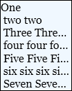
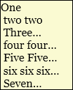
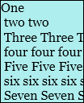

# How to: Enable Text Trimming

This example demonstrates the usage and effects of the values available in the <xref:System.Windows.TextTrimming> enumeration.

## Example

The following example defines a <xref:System.Windows.Controls.TextBlock> element with the <xref:System.Windows.Controls.TextBlock.TextTrimming%2A> attribute set.

[!code-xaml[TextTrimmingSnippets#_TextTrimmingXAML](~/samples/snippets/csharp/VS_Snippets_Wpf/TextTrimmingSnippets/CSharp/Window1.xaml#_texttrimmingxaml)]

Setting the corresponding <xref:System.Windows.TextTrimming> property in code is demonstrated below.

[!code-csharp[TextTrimmingSnippets#_TextTrimmingSetTextTrimming](~/samples/snippets/csharp/VS_Snippets_Wpf/TextTrimmingSnippets/CSharp/Window1.xaml.cs#_texttrimmingsettexttrimming)]
[!code-vb[TextTrimmingSnippets#_TextTrimmingSetTextTrimming](~/samples/snippets/visualbasic/VS_Snippets_Wpf/TextTrimmingSnippets/VisualBasic/Window1.xaml.vb#_texttrimmingsettexttrimming)]

There are currently three options for trimming text: **CharacterEllipsis**, **WordEllipsis**, and **None**.

When <xref:System.Windows.Controls.TextBlock.TextTrimming%2A> is set to **CharacterEllipsis**, text is trimmed and continued with an ellipsis at the character closest to the trimming edge.  This setting tends to trim text to fit more closely to the trimming boundary, but may result in words being partially trimmed.  The following figure shows the effect of this setting on a <xref:System.Windows.Controls.TextBlock> similar to the one defined above.

When <xref:System.Windows.Controls.TextBlock.TextTrimming%2A> is set to **WordEllipsis**, text is trimmed and continued with an ellipsis at the end of the first full word closest to the trimming edge.  This setting will not show partially trimmed words, but tends not to trim text as closely to the trimming edge as the **CharacterEllipsis** setting.  The following figure shows the effect of this setting on the <xref:System.Windows.Controls.TextBlock> defined above.

When <xref:System.Windows.Controls.TextBlock.TextTrimming%2A> is set to **None**, no text trimming is performed.  In this case, text is simply cropped to the boundary of the parent text container.  The following figure shows the effect of this setting on a <xref:System.Windows.Controls.TextBlock> similar to the one defined above.

