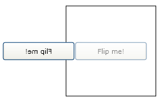
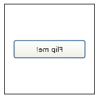
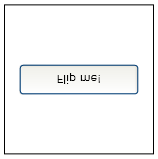

# How to: Flip a UIElement Horizontally or Vertically
This example shows how to use a <xref:System.Windows.Media.ScaleTransform> to flip a <xref:System.Windows.UIElement> horizontally or vertically. In this example, a <xref:System.Windows.Controls.Button> control (a type of <xref:System.Windows.UIElement>) is flipped by applying a <xref:System.Windows.Media.ScaleTransform> to its <xref:System.Windows.UIElement.RenderTransform%2A> property.  
  
## Example  
 The following illustration shows the button to flip.  
  
   
The UIElement to flip  
  
 The following shows the code that creates the button.  
  
 [!code-xaml[Transforms_snip#GraphicsMMButtonWithoutFlip](../../../../samples/snippets/csharp/VS_Snippets_Wpf/Transforms_snip/CS/FlipExample.xaml#graphicsmmbuttonwithoutflip)]  
  
## Example  
 To flip the button horizontally, create a <xref:System.Windows.Media.ScaleTransform> and set its <xref:System.Windows.Media.ScaleTransform.ScaleX%2A> property to -1. Apply the <xref:System.Windows.Media.ScaleTransform> to the button's <xref:System.Windows.UIElement.RenderTransform%2A> property.  
  
 [!code-xaml[Transforms_snip#GraphicsMMFlipButtonExample1](../../../../samples/snippets/csharp/VS_Snippets_Wpf/Transforms_snip/CS/FlipExample.xaml#graphicsmmflipbuttonexample1)]  
  
   
The button after applying the ScaleTransform  
  
## Example  
 As you can see from the previous illustration, the button was flipped, but it was also moved. That's because the button was flipped from its top left corner. To flip the button in place, you want to apply the <xref:System.Windows.Media.ScaleTransform> to its center, not its corner. An easy way to apply the <xref:System.Windows.Media.ScaleTransform> to the buttons center is to set the button's <xref:System.Windows.UIElement.RenderTransformOrigin%2A> property to 0.5, 0.5.  
  
 [!code-xaml[Transforms_snip#GraphicsMMFlipButtonExample2](../../../../samples/snippets/csharp/VS_Snippets_Wpf/Transforms_snip/CS/FlipExample.xaml#graphicsmmflipbuttonexample2)]  
  
   
The button with a RenderTransformOrigin of 0.5, 0.5  
  
## Example  
 To flip the button vertically, set the <xref:System.Windows.Media.ScaleTransform> object's <xref:System.Windows.Media.ScaleTransform.ScaleY%2A> property instead of its <xref:System.Windows.Media.ScaleTransform.ScaleX%2A> property.  
  
 [!code-xaml[Transforms_snip#GraphicsMMVerticalFlipButtonExample2](../../../../samples/snippets/csharp/VS_Snippets_Wpf/Transforms_snip/CS/FlipExample.xaml#graphicsmmverticalflipbuttonexample2)]  
  
   
The vertically flipped button  
  
## See Also  
 [Transforms Overview](../../../../docs/framework/wpf/graphics-multimedia/transforms-overview.md)
