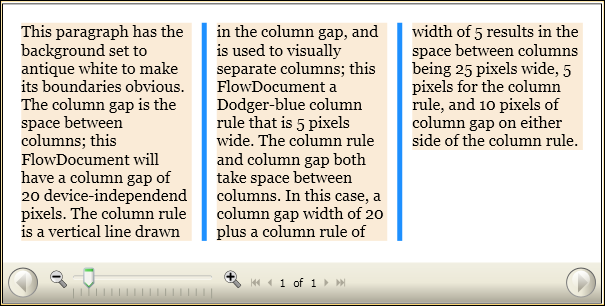

# How to: Use FlowDocument Column-Separating Attributes
This example shows how to use the column-separating features of a <xref:System.Windows.Documents.FlowDocument>.  
  
## Example  
 The following example defines a <xref:System.Windows.Documents.FlowDocument>, and sets the <xref:System.Windows.Documents.FlowDocument.ColumnGap%2A>, <xref:System.Windows.Documents.FlowDocument.ColumnRuleBrush%2A>, and <xref:System.Windows.Documents.FlowDocument.ColumnRuleWidth%2A> attributes.  The <xref:System.Windows.Documents.FlowDocument> contains a single paragraph of sample content.  
  
 [!code-xaml[FlowDocumentSnippets#_FlowDocumentColumnStuffXAML](../../../../samples/snippets/csharp/VS_Snippets_Wpf/FlowDocumentSnippets/CSharp/Window1.xaml#_flowdocumentcolumnstuffxaml)]  
  
 The following figure shows the effects of the <xref:System.Windows.Documents.FlowDocument.ColumnGap%2A>, <xref:System.Windows.Documents.FlowDocument.ColumnRuleBrush%2A>, and <xref:System.Windows.Documents.FlowDocument.ColumnRuleWidth%2A> attributes in a rendered <xref:System.Windows.Documents.FlowDocument>.  
  
 
