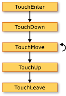
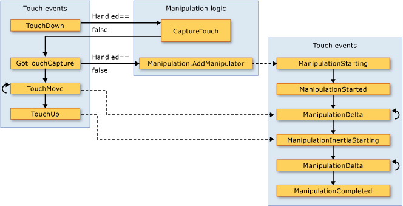

# Input Overview
 The[!INCLUDE[TLA#tla_winclient](../../../../includes/tlasharptla-winclient-md.md)] subsystem provides a powerful [!INCLUDE[TLA#tla_api](../../../../includes/tlasharptla-api-md.md)] for obtaining input from a variety of devices, including the mouse, keyboard, touch, and stylus. This topic describes the services provided by [!INCLUDE[TLA2#tla_winclient](../../../../includes/tla2sharptla-winclient-md.md)] and explains the architecture of the input systems.  
  
  
   
## Input API  
 The primary input [!INCLUDE[TLA2#tla_api](../../../../includes/tla2sharptla-api-md.md)] exposure is found on the base element classes: <xref:System.Windows.UIElement>, <xref:System.Windows.ContentElement>, <xref:System.Windows.FrameworkElement>, and <xref:System.Windows.FrameworkContentElement>.  For more information about the base elements, see [Base Elements Overview](../../../../docs/framework/wpf/advanced/base-elements-overview.md).  These classes provide functionality for input events related to key presses, mouse buttons, mouse wheel, mouse movement, focus management, and mouse capture, to name a few. By placing the input [!INCLUDE[TLA2#tla_api](../../../../includes/tla2sharptla-api-md.md)] on the base elements, rather than treating all input events as a service, the input architecture enables the input events to be sourced by a particular object in the UI, and to support an event routing scheme whereby more than one element has an opportunity to handle an input event. Many input events have a pair of events associated with them.  For example, the key down event is associated with the <xref:System.Windows.Input.Keyboard.KeyDown> and <xref:System.Windows.Input.Keyboard.PreviewKeyDown> events.  The difference in these events is in how they are routed to the target element.  Preview events tunnel down the element tree from the root element to the target element.  Bubbling events bubble up from the target element to the root element.  Event routing in [!INCLUDE[TLA2#tla_winclient](../../../../includes/tla2sharptla-winclient-md.md)] is discussed in more detail later in this overview and in the [Routed Events Overview](../../../../docs/framework/wpf/advanced/routed-events-overview.md).  
  
### Keyboard and Mouse Classes  
 In addition to the input [!INCLUDE[TLA2#tla_api](../../../../includes/tla2sharptla-api-md.md)] on the base element classes, the <xref:System.Windows.Input.Keyboard> class and <xref:System.Windows.Input.Mouse> classes provide additional [!INCLUDE[TLA2#tla_api](../../../../includes/tla2sharptla-api-md.md)] for working with keyboard and mouse input.  
  
 Examples of input [!INCLUDE[TLA2#tla_api](../../../../includes/tla2sharptla-api-md.md)] on the <xref:System.Windows.Input.Keyboard> class are the <xref:System.Windows.Input.Keyboard.Modifiers%2A> property, which returns the <xref:System.Windows.Input.ModifierKeys> currently pressed, and the <xref:System.Windows.Input.Keyboard.IsKeyDown%2A> method, which determines whether a specified key is pressed.  
  
 The following example uses the <xref:System.Windows.Input.Keyboard.GetKeyStates%2A> method to determine if a <xref:System.Windows.Input.Key> is in the down state.  
  
 [!code-csharp[keyargssnippetsample#KeyEventArgsKeyBoardGetKeyStates](../../../../samples/snippets/csharp/VS_Snippets_Wpf/KeyArgsSnippetSample/CSharp/Window1.xaml.cs#keyeventargskeyboardgetkeystates)]
 [!code-vb[keyargssnippetsample#KeyEventArgsKeyBoardGetKeyStates](../../../../samples/snippets/visualbasic/VS_Snippets_Wpf/KeyArgsSnippetSample/visualbasic/window1.xaml.vb#keyeventargskeyboardgetkeystates)]  
  
 Examples of input [!INCLUDE[TLA2#tla_api](../../../../includes/tla2sharptla-api-md.md)] on the <xref:System.Windows.Input.Mouse> class are <xref:System.Windows.Input.Mouse.MiddleButton%2A>, which obtains the state of the middle mouse button, and <xref:System.Windows.Input.Mouse.DirectlyOver%2A>, which gets the element the mouse pointer is currently over.  
  
 The following example determines whether the <xref:System.Windows.Input.Mouse.LeftButton%2A> on the mouse is in the <xref:System.Windows.Input.MouseButtonState.Pressed> state.  
  
 [!code-csharp[mouserelatedsnippets#MouseRelatedSnippetsGetLeftButtonMouse](../../../../samples/snippets/csharp/VS_Snippets_Wpf/MouseRelatedSnippets/CSharp/Window1.xaml.cs#mouserelatedsnippetsgetleftbuttonmouse)]
 [!code-vb[mouserelatedsnippets#MouseRelatedSnippetsGetLeftButtonMouse](../../../../samples/snippets/visualbasic/VS_Snippets_Wpf/MouseRelatedSnippets/visualbasic/window1.xaml.vb#mouserelatedsnippetsgetleftbuttonmouse)]  
  
 The <xref:System.Windows.Input.Mouse> and <xref:System.Windows.Input.Keyboard> classes are covered in more detail throughout this overview.  
  
### Stylus Input  
 [!INCLUDE[TLA2#tla_winclient](../../../../includes/tla2sharptla-winclient-md.md)] has integrated support for the <xref:System.Windows.Input.Stylus>.  The <xref:System.Windows.Input.Stylus> is a pen input made popular by the [!INCLUDE[TLA#tla_tpc](../../../../includes/tlasharptla-tpc-md.md)].  [!INCLUDE[TLA2#tla_winclient](../../../../includes/tla2sharptla-winclient-md.md)] applications can treat the stylus as a mouse by using the mouse [!INCLUDE[TLA2#tla_api](../../../../includes/tla2sharptla-api-md.md)], but [!INCLUDE[TLA2#tla_winclient](../../../../includes/tla2sharptla-winclient-md.md)] also exposes a stylus device abstraction that use a model similar to the keyboard and mouse.  All stylus-related [!INCLUDE[TLA2#tla_api#plural](../../../../includes/tla2sharptla-apisharpplural-md.md)] contain the word "Stylus".  
  
 Because the stylus can act as a mouse, applications that support only mouse input can still obtain some level of stylus support automatically. When the stylus is used in such a manner, the application is given the opportunity to handle the appropriate stylus event and then handles the corresponding mouse event. In addition, higher-level services such as ink input are also available through the stylus device abstraction.  For more information about ink as input, see [Getting Started with Ink](../../../../docs/framework/wpf/advanced/getting-started-with-ink.md).  
  
   
## Event Routing  
 A <xref:System.Windows.FrameworkElement> can contain other elements as child elements in its content model, forming a tree of elements.  In [!INCLUDE[TLA2#tla_winclient](../../../../includes/tla2sharptla-winclient-md.md)], the parent element can participate in input directed to its child elements or other descendants by handing events. This is especially useful for building controls out of smaller controls, a process known as "control composition" or "compositing." For more information about element trees and how element trees relate to event routes, see [Trees in WPF](../../../../docs/framework/wpf/advanced/trees-in-wpf.md).  
  
 Event routing is the process of forwarding events to multiple elements, so that a particular object or element along the route can choose to offer a significant response (through handling) to an event that might have been sourced by a different element.  Routed events use one of three routing mechanisms: direct, bubbling, and tunneling.  In direct routing, the source element is the only element notified, and the event is not routed to any other elements. However, the direct routed event still offers some additional capabilities that are only present for routed events as opposed to standard [!INCLUDE[TLA2#tla_clr](../../../../includes/tla2sharptla-clr-md.md)] events. Bubbling works up the element tree by first notifying the element that sourced the event, then the parent element, and so on.  Tunneling starts at the root of the element tree and works down, ending with the original source element.  For more information about routed events, see [Routed Events Overview](../../../../docs/framework/wpf/advanced/routed-events-overview.md).  
  
 [!INCLUDE[TLA2#tla_winclient](../../../../includes/tla2sharptla-winclient-md.md)] input events generally come in pairs that consists of a tunneling event and a bubbling event.  Tunneling events are distinguished from bubbling events with the "Preview" prefix.  For instance, <xref:System.Windows.Input.Mouse.PreviewMouseMove> is the tunneling version of a mouse move event and <xref:System.Windows.Input.Mouse.MouseMove> is the bubbling version of this event. This event pairing is a convention that is implemented at the element level and is not an inherent capability of the [!INCLUDE[TLA2#tla_winclient](../../../../includes/tla2sharptla-winclient-md.md)] event system. For details, see the WPF Input Events section in [Routed Events Overview](../../../../docs/framework/wpf/advanced/routed-events-overview.md).  
  
   
## Handling Input Events  
 To receive input on an element, an event handler must be associated with that particular event.  In [!INCLUDE[TLA2#tla_xaml](../../../../includes/tla2sharptla-xaml-md.md)] this is straightforward: you reference the name of the event as an attribute of the element that will be listening for this event.  Then, you set the value of the attribute to the name of the event handler that you define, based on a delegate.  The event handler must be written in code such as [!INCLUDE[TLA#tla_cshrp](../../../../includes/tlasharptla-cshrp-md.md)] and can be included in a code-behind file.  
  
 Keyboard events occur when the operating system reports key actions that occur while keyboard focus is on an element. Mouse and stylus events each fall into two categories: events that report changes in pointer position relative to the element, and events that report changes in the state of device buttons.  
  
### Keyboard Input Event Example  
 The following example listens for a left arrow key press.  A <xref:System.Windows.Controls.StackPanel> is created that has a <xref:System.Windows.Controls.Button>.  An event handler to listen for the left arrow key press is attached to the <xref:System.Windows.Controls.Button> instance.  
  
 The first section of the example creates the <xref:System.Windows.Controls.StackPanel> and the <xref:System.Windows.Controls.Button> and attaches the event handler for the <xref:System.Windows.UIElement.KeyDown>.  
  
 [!code-xaml[InputOvw#Input_OvwKeyboardExampleXAML](../../../../samples/snippets/csharp/VS_Snippets_Wpf/InputOvw/CSharp/Page1.xaml#input_ovwkeyboardexamplexaml)]  
  
 [!code-csharp[InputOvw#Input_OvwKeyboardExampleUICodeBehind](../../../../samples/snippets/csharp/VS_Snippets_Wpf/InputOvw/CSharp/Page1.xaml.cs#input_ovwkeyboardexampleuicodebehind)]
 [!code-vb[InputOvw#Input_OvwKeyboardExampleUICodeBehind](../../../../samples/snippets/visualbasic/VS_Snippets_Wpf/InputOvw/VisualBasic/Page1.xaml.vb#input_ovwkeyboardexampleuicodebehind)]  
  
 The second section is written in code and defines the event handler.  When the left arrow key is pressed and the <xref:System.Windows.Controls.Button> has keyboard focus, the handler runs and the <xref:System.Windows.Controls.Control.Background%2A> color of the <xref:System.Windows.Controls.Button> is changed.  If the key is pressed, but it is not the left arrow key, the <xref:System.Windows.Controls.Control.Background%2A> color of the <xref:System.Windows.Controls.Button> is changed back to its starting color.  
  
 [!code-csharp[InputOvw#Input_OvwKeyboardExampleHandlerCodeBehind](../../../../samples/snippets/csharp/VS_Snippets_Wpf/InputOvw/CSharp/Page1.xaml.cs#input_ovwkeyboardexamplehandlercodebehind)]
 [!code-vb[InputOvw#Input_OvwKeyboardExampleHandlerCodeBehind](../../../../samples/snippets/visualbasic/VS_Snippets_Wpf/InputOvw/VisualBasic/Page1.xaml.vb#input_ovwkeyboardexamplehandlercodebehind)]  
  
### Mouse Input Event Example  
 In the following example, the <xref:System.Windows.Controls.Control.Background%2A> color of a <xref:System.Windows.Controls.Button> is changed when the mouse pointer enters the <xref:System.Windows.Controls.Button>.  The <xref:System.Windows.Controls.Control.Background%2A> color is restored when the mouse leaves the <xref:System.Windows.Controls.Button>.  
  
 The first section of the example creates the <xref:System.Windows.Controls.StackPanel> and the <xref:System.Windows.Controls.Button> control and attaches the event handlers for the <xref:System.Windows.UIElement.MouseEnter> and <xref:System.Windows.UIElement.MouseLeave> events to the <xref:System.Windows.Controls.Button>.  
  
 [!code-xaml[InputOvw#Input_OvwMouseExampleXAML](../../../../samples/snippets/csharp/VS_Snippets_Wpf/InputOvw/CSharp/Page1.xaml#input_ovwmouseexamplexaml)]  
  
 [!code-csharp[InputOvw#Input_OvwMouseExampleUICodeBehind](../../../../samples/snippets/csharp/VS_Snippets_Wpf/InputOvw/CSharp/Page1.xaml.cs#input_ovwmouseexampleuicodebehind)]
 [!code-vb[InputOvw#Input_OvwMouseExampleUICodeBehind](../../../../samples/snippets/visualbasic/VS_Snippets_Wpf/InputOvw/VisualBasic/Page1.xaml.vb#input_ovwmouseexampleuicodebehind)]  
  
 The second section of the example is written in code and defines the event handlers.  When the mouse enters the <xref:System.Windows.Controls.Button>, the <xref:System.Windows.Controls.Control.Background%2A> color of the <xref:System.Windows.Controls.Button> is changed to <xref:System.Windows.Media.Brushes.SlateGray%2A>.  When the mouse leaves the <xref:System.Windows.Controls.Button>, the <xref:System.Windows.Controls.Control.Background%2A> color of the <xref:System.Windows.Controls.Button> is changed back to <xref:System.Windows.Media.Brushes.AliceBlue%2A>.  
  
 [!code-csharp[InputOvw#Input_OvwMouseExampleEneterHandler](../../../../samples/snippets/csharp/VS_Snippets_Wpf/InputOvw/CSharp/Page1.xaml.cs#input_ovwmouseexampleeneterhandler)]
 [!code-vb[InputOvw#Input_OvwMouseExampleEneterHandler](../../../../samples/snippets/visualbasic/VS_Snippets_Wpf/InputOvw/VisualBasic/Page1.xaml.vb#input_ovwmouseexampleeneterhandler)]  
  
 [!code-csharp[InputOvw#Input_OvwMouseExampleLeaveHandler](../../../../samples/snippets/csharp/VS_Snippets_Wpf/InputOvw/CSharp/Page1.xaml.cs#input_ovwmouseexampleleavehandler)]
 [!code-vb[InputOvw#Input_OvwMouseExampleLeaveHandler](../../../../samples/snippets/visualbasic/VS_Snippets_Wpf/InputOvw/VisualBasic/Page1.xaml.vb#input_ovwmouseexampleleavehandler)]  
  
   
## Text Input  
 The <xref:System.Windows.ContentElement.TextInput> event enables you to listen for text input in a device-independent manner. The keyboard is the primary means of text input, but speech, handwriting, and other input devices can generate text input also.  
  
 For keyboard input, [!INCLUDE[TLA2#tla_winclient](../../../../includes/tla2sharptla-winclient-md.md)] first sends the appropriate <xref:System.Windows.ContentElement.KeyDown>/<xref:System.Windows.ContentElement.KeyUp> events. If those events are not handled and the key is textual (rather than a control key such as directional arrows or function keys), then a <xref:System.Windows.ContentElement.TextInput> event is raised.  There is not always a simple one-to-one mapping between <xref:System.Windows.ContentElement.KeyDown>/<xref:System.Windows.ContentElement.KeyUp> and <xref:System.Windows.ContentElement.TextInput> events because multiple keystrokes can generate a single character of text input and single keystrokes can generate multi-character strings.  This is especially true for languages such as Chinese, Japanese, and Korean which use [!INCLUDE[TLA#tla_ime#plural](../../../../includes/tlasharptla-imesharpplural-md.md)] to generate the thousands of possible characters in their corresponding alphabets.  
  
 When [!INCLUDE[TLA2#tla_winclient](../../../../includes/tla2sharptla-winclient-md.md)] sends a <xref:System.Windows.ContentElement.KeyUp>/<xref:System.Windows.ContentElement.KeyDown> event, <xref:System.Windows.Input.KeyEventArgs.Key%2A> is set to <xref:System.Windows.Input.Key.System?displayProperty=nameWithType> if the keystrokes could become part of a <xref:System.Windows.ContentElement.TextInput> event (if ALT+S is pressed, for example). This allows code in a <xref:System.Windows.ContentElement.KeyDown> event handler to check for <xref:System.Windows.Input.Key.System?displayProperty=nameWithType> and, if found, leave processing for the handler of the subsequently raised <xref:System.Windows.ContentElement.TextInput> event. In these cases, the various properties of the <xref:System.Windows.Input.TextCompositionEventArgs> argument can be used to determine the original keystrokes. Similarly, if an [!INCLUDE[TLA2#tla_ime](../../../../includes/tla2sharptla-ime-md.md)] is active, <xref:System.Windows.Input.Key> has the value of <xref:System.Windows.Input.Key.ImeProcessed?displayProperty=nameWithType>, and <xref:System.Windows.Input.KeyEventArgs.ImeProcessedKey%2A> gives the original keystroke or keystrokes.  
  
 The following example defines a handler for the <xref:System.Windows.Controls.Primitives.ButtonBase.Click> event and a handler for the <xref:System.Windows.UIElement.KeyDown> event.  
  
 The first segment of code or markup creates the user interface.  
  
 [!code-xaml[InputOvw#Input_OvwTextInputXAML](../../../../samples/snippets/csharp/VS_Snippets_Wpf/InputOvw/CSharp/Page1.xaml#input_ovwtextinputxaml)]  
  
 [!code-csharp[InputOvw#Input_OvwTextInputUICodeBehind](../../../../samples/snippets/csharp/VS_Snippets_Wpf/InputOvw/CSharp/Page1.xaml.cs#input_ovwtextinputuicodebehind)]
 [!code-vb[InputOvw#Input_OvwTextInputUICodeBehind](../../../../samples/snippets/visualbasic/VS_Snippets_Wpf/InputOvw/VisualBasic/Page1.xaml.vb#input_ovwtextinputuicodebehind)]  
  
 The second segment of code contains the event handlers.  
  
 [!code-csharp[InputOvw#Input_OvwTextInputHandlersCodeBehind](../../../../samples/snippets/csharp/VS_Snippets_Wpf/InputOvw/CSharp/Page1.xaml.cs#input_ovwtextinputhandlerscodebehind)]
 [!code-vb[InputOvw#Input_OvwTextInputHandlersCodeBehind](../../../../samples/snippets/visualbasic/VS_Snippets_Wpf/InputOvw/VisualBasic/Page1.xaml.vb#input_ovwtextinputhandlerscodebehind)]  
  
 Because input events bubble up the event route, the <xref:System.Windows.Controls.StackPanel> receives the input regardless of which element has keyboard focus. The <xref:System.Windows.Controls.TextBox> control is notified first and the `OnTextInputKeyDown` handler is called only if the <xref:System.Windows.Controls.TextBox> did not handle the input. If the <xref:System.Windows.UIElement.PreviewKeyDown> event is used instead of the <xref:System.Windows.UIElement.KeyDown> event, the `OnTextInputKeyDown` handler is called first.  
  
 In this example, the handling logic is written two times—one time for CTRL+O, and again for button's click event. This can be simplified by using commands, instead of handling the input events directly.  Commands are discussed in this overview and in [Commanding Overview](../../../../docs/framework/wpf/advanced/commanding-overview.md).  
  
   
## Touch and Manipulation  
 New hardware and API in the Windows 7 operating system provide applications the ability to receive input from multiple touches simultaneously. [!INCLUDE[TLA2#tla_winclient](../../../../includes/tla2sharptla-winclient-md.md)] enables applications to detect and respond to touch in a manner similar to responding to other input, such as the mouse or keyboard, by raising events when touch occurs.  
  
 [!INCLUDE[TLA2#tla_winclient](../../../../includes/tla2sharptla-winclient-md.md)] exposes two types of events when touch occurs: touch events and manipulation events. Touch events provide raw data about each finger on a touchscreen and its movement. Manipulation events interpret the input as certain actions. Both types of events are discussed in this section.  
  
### Prerequisites  
 You need the following components to develop an application that responds to touch.  
  
-   [!INCLUDE[vs_dev10_ext](../../../../includes/vs-dev10-ext-md.md)].  
  
-   Windows 7.  
  
-   A device, such as a touchscreen, that supports Windows Touch.  
  
### Terminology  
 The following terms are used when touch is discussed.  
  
-   **Touch** is a type of user input that is recognized by Windows 7. Usually, touch is initiated by putting fingers on a touch-sensitive screen. Note that devices such as a touchpad that is common on laptop computers do not support touch if the device merely converts the finger's position and movement as mouse input.  
  
-   **Multitouch** is touch that occurs from more than one point simultaneously. Windows 7 and [!INCLUDE[TLA2#tla_winclient](../../../../includes/tla2sharptla-winclient-md.md)] supports multitouch. Whenever touch is discussed in the documentation for [!INCLUDE[TLA2#tla_winclient](../../../../includes/tla2sharptla-winclient-md.md)], the concepts apply to multitouch.  
  
-   A **manipulation** occurs when touch is interpreted as a physical action that is applied to an object. In [!INCLUDE[TLA2#tla_winclient](../../../../includes/tla2sharptla-winclient-md.md)], manipulation events interpret input as a translation, expansion, or rotation manipulation.  
  
-   A `touch device` represents a device that produces touch input, such as a single finger on a touchscreen.  
  
### Controls that Respond to Touch  
 The following controls can be scrolled by dragging a finger across the control if it has content that is scrolled out of view.  
  
-   <xref:System.Windows.Controls.ComboBox>  
  
-   <xref:System.Windows.Controls.ContextMenu>  
  
-   <xref:System.Windows.Controls.DataGrid>  
  
-   <xref:System.Windows.Controls.ListBox>  
  
-   <xref:System.Windows.Controls.ListView>  
  
-   <xref:System.Windows.Controls.MenuItem>  
  
-   <xref:System.Windows.Controls.TextBox>  
  
-   <xref:System.Windows.Controls.ToolBar>  
  
-   <xref:System.Windows.Controls.TreeView>  
  
 The <xref:System.Windows.Controls.ScrollViewer> defines the <xref:System.Windows.Controls.ScrollViewer.PanningMode%2A?displayProperty=nameWithType> attached property that enables you to specify whether touch panning is enabled horizontally, vertically, both, or neither. The <xref:System.Windows.Controls.ScrollViewer.PanningDeceleration%2A?displayProperty=nameWithType> property specifies how quickly the scrolling slows down when the user lifts the finger from the touchscreen. The <xref:System.Windows.Controls.ScrollViewer.PanningRatio%2A?displayProperty=nameWithType> attached property specifies the ratio of scrolling offset to translate manipulation offset.  
  
### Touch Events  
 The base classes, <xref:System.Windows.UIElement>, <xref:System.Windows.UIElement3D>, and <xref:System.Windows.ContentElement>, define events that you can subscribe to so your application will respond to touch. Touch events are useful when your application interprets touch as something other than manipulating an object. For example, an application that enables a user to draw with one or more fingers would subscribe to touch events.  
  
 All three classes define the following events, which behave similarly, regardless of the defining class.  
  
-   <xref:System.Windows.UIElement.TouchDown>  
  
-   <xref:System.Windows.UIElement.TouchMove>  
  
-   <xref:System.Windows.UIElement.TouchUp>  
  
-   <xref:System.Windows.UIElement.TouchEnter>  
  
-   <xref:System.Windows.UIElement.TouchLeave>  
  
-   <xref:System.Windows.UIElement.PreviewTouchDown>  
  
-   <xref:System.Windows.UIElement.PreviewTouchMove>  
  
-   <xref:System.Windows.UIElement.PreviewTouchUp>  
  
-   <xref:System.Windows.UIElement.GotTouchCapture>  
  
-   <xref:System.Windows.UIElement.LostTouchCapture>  
  
 Like keyboard and mouse events, the touch events are routed events. The events that begin with `Preview` are tunneling events and the events that begin with `Touch` are bubbling events. For more information about routed events, see [Routed Events Overview](../../../../docs/framework/wpf/advanced/routed-events-overview.md). When you handle these events, you can get the position of the input, relative to any element, by calling the <xref:System.Windows.Input.TouchEventArgs.GetTouchPoint%2A> or <xref:System.Windows.Input.TouchEventArgs.GetIntermediateTouchPoints%2A> method.  
  
 To understand the interaction among the touch events, consider the scenario where a user puts one finger on an element, moves the finger in the element, and then lifts the finger from the element. The following illustration shows the execution of the bubbling events (the tunneling events are omitted for simplicity).  
  
   
Touch events  
  
 The following list describes the sequence of the events in the preceding illustration.  
  
1.  The <xref:System.Windows.UIElement.TouchEnter> event occurs one time when the user puts a finger on the element.  
  
2.  The <xref:System.Windows.UIElement.TouchDown> event occurs one time.  
  
3.  The <xref:System.Windows.UIElement.TouchMove> event occurs multiple times as the user moves the finger within the element.  
  
4.  The <xref:System.Windows.UIElement.TouchUp> event occurs one time when the user lifts the finger from the element.  
  
5.  The <xref:System.Windows.UIElement.TouchLeave> event occurs one time.  
  
 When more than two fingers are used, the events occur for each finger.  
  
### Manipulation Events  
 For cases where an application enables a user to manipulate an object, the <xref:System.Windows.UIElement> class defines manipulation events. Unlike the touch events that simply report the position of touch, the manipulation events report how the input can be interpreted. There are three types of manipulations, translation, expansion, and rotation. The following list describes how to invoke the three types of manipulations.  
  
-   Put a finger on an object and move the finger across the touchscreen to invoke a translation manipulation. This usually moves the object.  
  
-   Put two fingers on an object and move the fingers closer together or farther apart from one another to invoke an expansion manipulation. This usually resizes the object.  
  
-   Put two fingers on an object and rotate the fingers around each other to invoke a rotation manipulation. This usually rotates the object.  
  
 More than one type of manipulation can occur simultaneously.  
  
 When you cause objects to respond to manipulations, you can have the object appear to have inertia. This can make your objects simulate the physical world. For example, when you push a book across a table, if you push hard enough the book will continue to move after you release it. [!INCLUDE[TLA2#tla_winclient](../../../../includes/tla2sharptla-winclient-md.md)] enables you to simulate this behavior by raising manipulation events after the user's fingers releases the object.  
  
 For information about how to create an application that enables the user to move, resize, and rotate an object, see [Walkthrough: Creating Your First Touch Application](../../../../docs/framework/wpf/advanced/walkthrough-creating-your-first-touch-application.md).  
  
 The <xref:System.Windows.UIElement> defines the following manipulation events.  
  
-   <xref:System.Windows.UIElement.ManipulationStarting>  
  
-   <xref:System.Windows.UIElement.ManipulationStarted>  
  
-   <xref:System.Windows.UIElement.ManipulationDelta>  
  
-   <xref:System.Windows.UIElement.ManipulationInertiaStarting>  
  
-   <xref:System.Windows.UIElement.ManipulationCompleted>  
  
-   <xref:System.Windows.UIElement.ManipulationBoundaryFeedback>  
  
 By default, a <xref:System.Windows.UIElement> does not receive these manipulation events. To receive manipulation events on a <xref:System.Windows.UIElement>, set <xref:System.Windows.UIElement.IsManipulationEnabled%2A?displayProperty=nameWithType> to `true`.  
  
#### The Execution Path of Manipulation Events  
 Consider a scenario where a user "throws" an object. The user puts a finger on the object, moves the finger across the touchscreen for a short distance, and then lifts the finger while it is moving. The result of this is that the object will move under the user's finger and continue to move after the user lifts the finger.  
  
 The following illustration shows the execution path of manipulation events and important information about each event.  
  
   
Manipulation events  
  
 The following list describes the sequence of the events in the preceding illustration.  
  
1.  The <xref:System.Windows.UIElement.ManipulationStarting> event occurs when the user places a finger on the object. Among other things, this event allows you to set the <xref:System.Windows.Input.ManipulationStartingEventArgs.ManipulationContainer%2A> property. In the subsequent events, the position of the manipulation will be relative to the <xref:System.Windows.Input.ManipulationStartingEventArgs.ManipulationContainer%2A>. In events other than <xref:System.Windows.UIElement.ManipulationStarting>, this property is read-only, so the <xref:System.Windows.UIElement.ManipulationStarting> event is the only time that you can set this property.  
  
2.  The <xref:System.Windows.UIElement.ManipulationStarted> event occurs next. This event reports the origin of the manipulation.  
  
3.  The <xref:System.Windows.UIElement.ManipulationDelta> event occurs multiple times as a user's fingers move on a touchscreen. The <xref:System.Windows.Input.ManipulationDeltaEventArgs.DeltaManipulation%2A> property of the <xref:System.Windows.Input.ManipulationDeltaEventArgs> class reports whether the manipulation is interpreted as movement, expansion, or translation. This is where you perform most of the work of manipulating an object.  
  
4.  The <xref:System.Windows.UIElement.ManipulationInertiaStarting> event occurs when the user's fingers lose contact with the object. This event enables you to specify the deceleration of the manipulations during inertia. This is so your object can emulate different physical spaces or attributes if you choose. For example, suppose your application has two objects that represent items in the physical world, and one is heavier than the other. You can make the heavier object decelerate faster than the lighter object.  
  
5.  The <xref:System.Windows.UIElement.ManipulationDelta> event occurs multiple times as inertia occurs. Note that this event occurs when the user's fingers move across the touchscreen and when [!INCLUDE[TLA2#tla_winclient](../../../../includes/tla2sharptla-winclient-md.md)] simulates inertia. In other words, <xref:System.Windows.UIElement.ManipulationDelta> occurs before and after the <xref:System.Windows.UIElement.ManipulationInertiaStarting> event. The <xref:System.Windows.Input.ManipulationDeltaEventArgs.IsInertial%2A?displayProperty=nameWithType> property reports whether the <xref:System.Windows.UIElement.ManipulationDelta> event occurs during inertia, so you can check that property and perform different actions, depending on its value.  
  
6.  The <xref:System.Windows.UIElement.ManipulationCompleted> event occurs when the manipulation and any inertia ends. That is, after all the <xref:System.Windows.UIElement.ManipulationDelta> events occur, the <xref:System.Windows.UIElement.ManipulationCompleted> event occurs to signal that the manipulation is complete.  
  
 The <xref:System.Windows.UIElement> also defines the <xref:System.Windows.UIElement.ManipulationBoundaryFeedback> event. This event occurs when the <xref:System.Windows.Input.ManipulationDeltaEventArgs.ReportBoundaryFeedback%2A> method is called in the <xref:System.Windows.UIElement.ManipulationDelta> event. The <xref:System.Windows.UIElement.ManipulationBoundaryFeedback> event enables applications or components to provide visual feedback when an object hits a boundary. For example, the <xref:System.Windows.Window> class handles the <xref:System.Windows.UIElement.ManipulationBoundaryFeedback> event to cause the window to slightly move when its edge is encountered.  
  
 You can cancel the manipulation by calling the <xref:System.Windows.Input.ManipulationStartingEventArgs.Cancel%2A> method on the event arguments in any manipulation event except <xref:System.Windows.UIElement.ManipulationBoundaryFeedback> event. When you call <xref:System.Windows.Input.ManipulationStartingEventArgs.Cancel%2A>, the manipulation events are no longer raised and mouse events occur for touch. The following table describes the relationship between the time the manipulation is canceled and the mouse events that occur.  
  
|The event that Cancel is called in|The mouse events that occur for input that already occurred|  
|----------------------------------------|-----------------------------------------------------------------|  
|<xref:System.Windows.UIElement.ManipulationStarting> and <xref:System.Windows.UIElement.ManipulationStarted>|Mouse down events.|  
|<xref:System.Windows.UIElement.ManipulationDelta>|Mouse down and mouse move events.|  
|<xref:System.Windows.UIElement.ManipulationInertiaStarting> and <xref:System.Windows.UIElement.ManipulationCompleted>|Mouse down, mouse move, and mouse up events.|  
  
 Note that if you call <xref:System.Windows.Input.ManipulationStartingEventArgs.Cancel%2A> when the manipulation is in inertia, the method returns `false` and the input does not raise mouse events.  
  
### The Relationship Between Touch and Manipulation Events  
 A <xref:System.Windows.UIElement> can always receive touch events. When the <xref:System.Windows.UIElement.IsManipulationEnabled%2A> property is set to `true`, a <xref:System.Windows.UIElement> can receive both touch and manipulation events.  If the <xref:System.Windows.UIElement.TouchDown> event is not handled (that is, the <xref:System.Windows.RoutedEventArgs.Handled%2A> property is `false`), the manipulation logic captures the touch to the element and generates the manipulation events. If the <xref:System.Windows.RoutedEventArgs.Handled%2A> property is set to `true` in the <xref:System.Windows.UIElement.TouchDown> event, the manipulation logic does not generate manipulation events. The following illustration shows the relationship between touch events and manipulation events.  
  
   
Touch and manipulation events  
  
 The following list describes the relationship between the touch and manipulation events that is shown in the preceding illustration.  
  
-   When the first touch device generates a <xref:System.Windows.UIElement.TouchDown> event on a <xref:System.Windows.UIElement>, the manipulation logic calls the <xref:System.Windows.UIElement.CaptureTouch%2A> method, which generates the <xref:System.Windows.UIElement.GotTouchCapture> event.  
  
-   When the <xref:System.Windows.UIElement.GotTouchCapture> occurs, the manipulation logic calls the <xref:System.Windows.Input.Manipulation.AddManipulator%2A?displayProperty=nameWithType> method, which generates the <xref:System.Windows.UIElement.ManipulationStarting> event.  
  
-   When the <xref:System.Windows.UIElement.TouchMove> events occur, the manipulation logic generates the <xref:System.Windows.UIElement.ManipulationDelta> events that occur before the <xref:System.Windows.UIElement.ManipulationInertiaStarting> event.  
  
-   When the last touch device on the element raises the <xref:System.Windows.UIElement.TouchUp> event, the manipulation logic generates the <xref:System.Windows.UIElement.ManipulationInertiaStarting> event.  
  
   
## Focus  
 There are two main concepts that pertain to focus in [!INCLUDE[TLA2#tla_winclient](../../../../includes/tla2sharptla-winclient-md.md)]: keyboard focus and logical focus.  
  
### Keyboard Focus  
 Keyboard focus refers to the element that is receiving keyboard input.  There can be only one element on the whole desktop that has keyboard focus.  In [!INCLUDE[TLA2#tla_winclient](../../../../includes/tla2sharptla-winclient-md.md)], the element that has keyboard focus will have <xref:System.Windows.IInputElement.IsKeyboardFocused%2A> set to `true`.  The static <xref:System.Windows.Input.Keyboard> method <xref:System.Windows.Input.Keyboard.FocusedElement%2A> returns the element that currently has keyboard focus.  
  
 Keyboard focus can be obtained by tabbing to an element or by clicking the mouse on certain elements, such as a <xref:System.Windows.Controls.TextBox>.  Keyboard focus can also be obtained programmatically by using the <xref:System.Windows.Input.Keyboard.Focus%2A> method on the <xref:System.Windows.Input.Keyboard> class.  <xref:System.Windows.Input.Keyboard.Focus%2A> attempts to give the specified element keyboard focus.  The element returned by <xref:System.Windows.Input.Keyboard.Focus%2A> is the element that currently has keyboard focus.  
  
 In order for an element to obtain keyboard focus the <xref:System.Windows.UIElement.Focusable%2A> property and the <xref:System.Windows.UIElement.IsVisible%2A> properties must be set to **true**.  Some classes, such as <xref:System.Windows.Controls.Panel>, have <xref:System.Windows.UIElement.Focusable%2A> set to `false` by default; therefore, you may have to set this property to `true` if you want that element to be able to obtain focus.  
  
 The following example uses <xref:System.Windows.Input.Keyboard.Focus%2A> to set keyboard focus on a <xref:System.Windows.Controls.Button>.  The recommended place to set initial focus in an application is in the <xref:System.Windows.FrameworkElement.Loaded> event handler.  
  
 [!code-csharp[focussample#FocusSampleSetFocus](../../../../samples/snippets/csharp/VS_Snippets_Wpf/FocusSample/CSharp/Window1.xaml.cs#focussamplesetfocus)]
 [!code-vb[focussample#FocusSampleSetFocus](../../../../samples/snippets/visualbasic/VS_Snippets_Wpf/FocusSample/visualbasic/window1.xaml.vb#focussamplesetfocus)]  
  
 For more information about keyboard focus, see [Focus Overview](../../../../docs/framework/wpf/advanced/focus-overview.md).  
  
### Logical Focus  
 Logical focus refers to the <xref:System.Windows.Input.FocusManager.FocusedElement%2A?displayProperty=nameWithType> in a focus scope.  There can be multiple elements that have logical focus in an application, but there may only be one element that has logical focus in a particular focus scope.  
  
 A focus scope is a container element that keeps track of the <xref:System.Windows.Input.FocusManager.FocusedElement%2A> within its scope.  When focus leaves a focus scope, the focused element will lose keyboard focus but will retain logical focus.  When focus returns to the focus scope, the focused element will obtain keyboard focus.  This allows for keyboard focus to be changed between multiple focus scopes but insures that the focused element within the focus scope remains the focused element when focus returns.  
  
 An element can be turned into a focus scope in [!INCLUDE[TLA#tla_xaml](../../../../includes/tlasharptla-xaml-md.md)] by setting the <xref:System.Windows.Input.FocusManager> attached property <xref:System.Windows.Input.FocusManager.IsFocusScope%2A> to `true`, or in code by setting the attached property by using the <xref:System.Windows.Input.FocusManager.SetIsFocusScope%2A> method.  
  
 The following example makes a <xref:System.Windows.Controls.StackPanel> into a focus scope by setting the <xref:System.Windows.Input.FocusManager.IsFocusScope%2A> attached property.  
  
 [!code-xaml[MarkupSnippets#MarkupIsFocusScopeXAML](../../../../samples/snippets/csharp/VS_Snippets_Wpf/MarkupSnippets/CSharp/Window1.xaml#markupisfocusscopexaml)]  
  
 [!code-csharp[FocusSnippets#FocusSetIsFocusScope](../../../../samples/snippets/csharp/VS_Snippets_Wpf/FocusSnippets/CSharp/Window1.xaml.cs#focussetisfocusscope)]
 [!code-vb[FocusSnippets#FocusSetIsFocusScope](../../../../samples/snippets/visualbasic/VS_Snippets_Wpf/FocusSnippets/visualbasic/window1.xaml.vb#focussetisfocusscope)]  
  
 Classes in [!INCLUDE[TLA2#tla_winclient](../../../../includes/tla2sharptla-winclient-md.md)] which are focus scopes by default are <xref:System.Windows.Window>, <xref:System.Windows.Controls.Menu>, <xref:System.Windows.Controls.ToolBar>, and <xref:System.Windows.Controls.ContextMenu>.  
  
 An element that has keyboard focus will also have logical focus for the focus scope it belongs to; therefore, setting focus on an element with the <xref:System.Windows.Input.Keyboard.Focus%2A> method on the <xref:System.Windows.Input.Keyboard> class or the base element classes will attempt to give the element keyboard focus and logical focus.  
  
 To determine the focused element in a focus scope, use <xref:System.Windows.Input.FocusManager.GetFocusedElement%2A>. To change the focused element for a focus scope, use <xref:System.Windows.Input.FocusManager.SetFocusedElement%2A>.  
  
 For more information about logical focus, see [Focus Overview](../../../../docs/framework/wpf/advanced/focus-overview.md).  
  
   
## Mouse Position  
 The [!INCLUDE[TLA2#tla_winclient](../../../../includes/tla2sharptla-winclient-md.md)] input [!INCLUDE[TLA2#tla_api](../../../../includes/tla2sharptla-api-md.md)] provides helpful information with regard to coordinate spaces.  For example, coordinate `(0,0)` is the upper-left coordinate, but the upper-left of which element in the tree? The element that is the input target? The element you attached your event handler to? Or something else? To avoid confusion, the [!INCLUDE[TLA2#tla_winclient](../../../../includes/tla2sharptla-winclient-md.md)] input [!INCLUDE[TLA2#tla_api](../../../../includes/tla2sharptla-api-md.md)] requires that you specify your frame of reference when you work with coordinates obtained through the mouse. The <xref:System.Windows.Input.Mouse.GetPosition%2A> method returns the coordinate of the mouse pointer relative to the specified element.  
  
   
## Mouse Capture  
 Mouse devices specifically hold a modal characteristic known as mouse capture. Mouse capture is used to maintain a transitional input state when a drag-and-drop operation is started, so that other operations involving the nominal on-screen position of the mouse pointer do not necessarily occur. During the drag, the user cannot click without aborting the drag-and-drop, which makes most mouseover cues inappropriate while the mouse capture is held by the drag origin. The input system exposes [!INCLUDE[TLA2#tla_api#plural](../../../../includes/tla2sharptla-apisharpplural-md.md)] that can determine mouse capture state, as well as [!INCLUDE[TLA2#tla_api#plural](../../../../includes/tla2sharptla-apisharpplural-md.md)] that can force mouse capture to a specific element, or clear mouse capture state. For more information on drag-and-drop operations, see [Drag and Drop Overview](../../../../docs/framework/wpf/advanced/drag-and-drop-overview.md).  
  
   
## Commands  
 Commands enable input handling at a more semantic level than device input.  Commands are simple directives, such as `Cut`, `Copy`, `Paste`, or `Open`.  Commands are useful for centralizing your command logic.  The same command might be accessed from a <xref:System.Windows.Controls.Menu>, on a <xref:System.Windows.Controls.ToolBar>, or through a keyboard shortcut. Commands also provide a mechanism for disabling controls when the command becomes unavailable.  
  
 <xref:System.Windows.Input.RoutedCommand> is the [!INCLUDE[TLA2#tla_winclient](../../../../includes/tla2sharptla-winclient-md.md)] implementation of <xref:System.Windows.Input.ICommand>.  When a <xref:System.Windows.Input.RoutedCommand> is executed, a <xref:System.Windows.Input.CommandManager.PreviewExecuted> and an <xref:System.Windows.Input.CommandManager.Executed> event are raised on the command target, which tunnel and bubble through the element tree like other input.  If a command target is not set, the element with keyboard focus will be the command target.  The logic that performs the command is attached to a <xref:System.Windows.Input.CommandBinding>.  When an <xref:System.Windows.Input.CommandManager.Executed> event reaches a <xref:System.Windows.Input.CommandBinding> for that specific command, the <xref:System.Windows.Input.ExecutedRoutedEventHandler> on the <xref:System.Windows.Input.CommandBinding> is called.  This handler performs the action of the command.  
  
 For more information on commanding, see [Commanding Overview](../../../../docs/framework/wpf/advanced/commanding-overview.md).  
  
 [!INCLUDE[TLA2#tla_winclient](../../../../includes/tla2sharptla-winclient-md.md)] provides a library of common commands which consists of <xref:System.Windows.Input.ApplicationCommands>, <xref:System.Windows.Input.MediaCommands>, <xref:System.Windows.Input.ComponentCommands>, <xref:System.Windows.Input.NavigationCommands>, and <xref:System.Windows.Documents.EditingCommands>, or you can define your own.  
  
 The following example shows how to set up a <xref:System.Windows.Controls.MenuItem> so that when it is clicked it will invoke the <xref:System.Windows.Input.ApplicationCommands.Paste%2A> command on the <xref:System.Windows.Controls.TextBox>, assuming the <xref:System.Windows.Controls.TextBox> has keyboard focus.  
  
 [!code-xaml[CommandingOverviewSnippets#CommandingOverviewSimpleCommand](../../../../samples/snippets/csharp/VS_Snippets_Wpf/CommandingOverviewSnippets/CSharp/Window1.xaml#commandingoverviewsimplecommand)]  
  
 [!code-csharp[CommandingOverviewSnippets#CommandingOverviewCommandTargetCodeBehind](../../../../samples/snippets/csharp/VS_Snippets_Wpf/CommandingOverviewSnippets/CSharp/Window1.xaml.cs#commandingoverviewcommandtargetcodebehind)]
 [!code-vb[CommandingOverviewSnippets#CommandingOverviewCommandTargetCodeBehind](../../../../samples/snippets/visualbasic/VS_Snippets_Wpf/CommandingOverviewSnippets/visualbasic/window1.xaml.vb#commandingoverviewcommandtargetcodebehind)]  
  
 For more information about commands in [!INCLUDE[TLA2#tla_winclient](../../../../includes/tla2sharptla-winclient-md.md)], see [Commanding Overview](../../../../docs/framework/wpf/advanced/commanding-overview.md).  
  
   
## The Input System and Base Elements  
 Input events such as the attached events defined by the <xref:System.Windows.Input.Mouse>, <xref:System.Windows.Input.Keyboard>, and <xref:System.Windows.Input.Stylus> classes are raised by the input system and injected into a particular position in the object model based on hit testing the visual tree at run time.  
  
 Each of the events that <xref:System.Windows.Input.Mouse>, <xref:System.Windows.Input.Keyboard>, and <xref:System.Windows.Input.Stylus> define as an attached event is also re-exposed by the base element classes <xref:System.Windows.UIElement> and <xref:System.Windows.ContentElement> as a new routed event. The base element routed events are generated by classes handling the original attached event and reusing the event data.  
  
 When the input event becomes associated with a particular source element through its base element input event implementation, it can be routed through the remainder of an event route that is based on a combination of logical and visual tree objects, and be handled by application code.  Generally, it is more convenient to handle these device-related input events using the routed events on <xref:System.Windows.UIElement> and <xref:System.Windows.ContentElement>, because you can use more intuitive event handler syntax both in [!INCLUDE[TLA2#tla_xaml](../../../../includes/tla2sharptla-xaml-md.md)] and in code. You could choose to handle the attached event that initiated the process instead, but you would face several issues: the attached event may be marked handled by the base element class handling, and you need to use accessor methods rather than true event syntax in order to attach handlers for attached events.  
  
   
## What's Next  
 You now have several techniques to handle input in [!INCLUDE[TLA2#tla_winclient](../../../../includes/tla2sharptla-winclient-md.md)].  You should also have an improved understanding of the various types of input events and the routed event mechanisms used by [!INCLUDE[TLA2#tla_winclient](../../../../includes/tla2sharptla-winclient-md.md)].  
  
 Additional resources are available that explain [!INCLUDE[TLA2#tla_winclient](../../../../includes/tla2sharptla-winclient-md.md)] framework elements and event routing in more detail. See the following overviews for more information, [Commanding Overview](../../../../docs/framework/wpf/advanced/commanding-overview.md), [Focus Overview](../../../../docs/framework/wpf/advanced/focus-overview.md), [Base Elements Overview](../../../../docs/framework/wpf/advanced/base-elements-overview.md), [Trees in WPF](../../../../docs/framework/wpf/advanced/trees-in-wpf.md), and [Routed Events Overview](../../../../docs/framework/wpf/advanced/routed-events-overview.md).  
  
## See Also  
 [Focus Overview](../../../../docs/framework/wpf/advanced/focus-overview.md)  
 [Commanding Overview](../../../../docs/framework/wpf/advanced/commanding-overview.md)  
 [Routed Events Overview](../../../../docs/framework/wpf/advanced/routed-events-overview.md)  
 [Base Elements Overview](../../../../docs/framework/wpf/advanced/base-elements-overview.md)  
 [Properties](../../../../docs/framework/wpf/advanced/properties-wpf.md)
