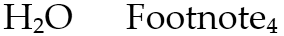
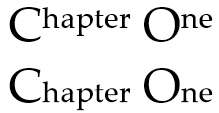
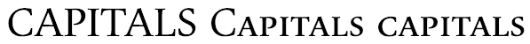
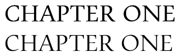
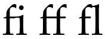
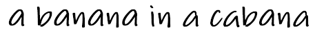
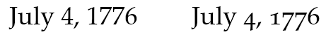

# OpenType Font Features
This topic provides an overview of some of the key features of [!INCLUDE[TLA#tla_opentype](../../../../includes/tlasharptla-opentype-md.md)] font technology in [!INCLUDE[TLA#tla_winclient](../../../../includes/tlasharptla-winclient-md.md)].  
  

  
   
## OpenType Font Format  
 The [!INCLUDE[TLA#tla_opentype](../../../../includes/tlasharptla-opentype-md.md)] font format is an extension of the [!INCLUDE[TLA#tla_truetype](../../../../includes/tlasharptla-truetype-md.md)] font format, adding support for PostScript font data. The [!INCLUDE[TLA#tla_opentype](../../../../includes/tlasharptla-opentype-md.md)] font format was developed jointly by [!INCLUDE[TLA#tla_ms](../../../../includes/tlasharptla-ms-md.md)] and Adobe Corporation. [!INCLUDE[TLA#tla_opentype](../../../../includes/tlasharptla-opentype-md.md)] fonts and the operating system services which support [!INCLUDE[TLA#tla_opentype](../../../../includes/tlasharptla-opentype-md.md)] fonts provide users with a simple way to install and use fonts, whether the fonts contain [!INCLUDE[TLA2#tla_truetype](../../../../includes/tla2sharptla-truetype-md.md)] outlines or CFF (PostScript) outlines.  
  
 The [!INCLUDE[TLA#tla_opentype](../../../../includes/tlasharptla-opentype-md.md)] font format addresses the following developer challenges:  
  
-   Broader multi-platform support.  
  
-   Better support for international character sets.  
  
-   Better protection for font data.  
  
-   Smaller file sizes to make font distribution more efficient.  
  
-   Broader support for advanced typographic control.  
  
> [!NOTE]
>  The Windows SDK contains a set of sample [!INCLUDE[TLA#tla_opentype](../../../../includes/tlasharptla-opentype-md.md)] fonts that you can use with [!INCLUDE[TLA#tla_winclient](../../../../includes/tlasharptla-winclient-md.md)] applications. These fonts provide most of the features illustrated in the rest of this topic. For more information, see [Sample OpenType Font Pack](../../../../docs/framework/wpf/advanced/sample-opentype-font-pack.md).  
  
 See the [OpenType Specification](http://go.microsoft.com/fwlink/?LinkId=96731) for details of the [!INCLUDE[TLA#tla_opentype](../../../../includes/tlasharptla-opentype-md.md)] font format.  
  
### Advanced Typographic Extensions  
 The Advanced Typographic tables ([!INCLUDE[TLA#tla_opentype](../../../../includes/tlasharptla-opentype-md.md)] Layout tables) extend the functionality of fonts with either [!INCLUDE[TLA2#tla_truetype](../../../../includes/tla2sharptla-truetype-md.md)] or CFF outlines. [!INCLUDE[TLA#tla_opentype](../../../../includes/tlasharptla-opentype-md.md)] Layout fonts contain additional information that extends the capabilities of the fonts to support high-quality international typography. Most [!INCLUDE[TLA#tla_opentype](../../../../includes/tlasharptla-opentype-md.md)] fonts expose only a subset of the total [!INCLUDE[TLA#tla_opentype](../../../../includes/tlasharptla-opentype-md.md)] features available. [!INCLUDE[TLA#tla_opentype](../../../../includes/tlasharptla-opentype-md.md)] fonts provide the following features.  
  
-   Rich mapping between characters and glyphs that support ligatures, positional forms, alternates, and other font substitutions.  
  
-   Support for two-dimensional positioning and glyph attachment.  
  
-   Explicit script and language information contained in font, so a text-processing application can adjust its behavior accordingly.  
  
 The [!INCLUDE[TLA#tla_opentype](../../../../includes/tlasharptla-opentype-md.md)] Layout tables are described in more detail in the ["Font File Tables"](http://www.microsoft.com/typography/otspec/otff.htm) section of the [!INCLUDE[TLA#tla_opentype](../../../../includes/tlasharptla-opentype-md.md)] specification.  
  
 The remainder of this overview introduces the breadth and flexibility of some of the visually-interesting [!INCLUDE[TLA#tla_opentype](../../../../includes/tlasharptla-opentype-md.md)] features that are exposed by the properties of the <xref:System.Windows.Documents.Typography> object. For more information on this object, see [Typography Class](#typography_class).  
  
   
## Variants  
 Variants are used to render different typographic styles, such as superscripts and subscripts.  
  
### Superscripts and Subscripts  
 The <xref:System.Windows.Documents.Typography.Variants%2A> property allows you to set superscript and subscript values for an [!INCLUDE[TLA#tla_opentype](../../../../includes/tlasharptla-opentype-md.md)] font.  
  
 The following text displays superscripts for the Palatino Linotype font.  
  
   
Text using OpenType superscripts  
  
 The following markup example shows how to define superscripts for the Palatino Linotype font, using properties of the <xref:System.Windows.Documents.Typography> object.  
  
 [!code-xaml[OpenTypeFontSamples#12](../../../../samples/snippets/csharp/VS_Snippets_Wpf/OpenTypeFontSamples/CS/PageOne.xaml#12)]  
  
 The following text displays subscripts for the Palatino Linotype font.  
  
   
Text using OpenType subscripts  
  
 The following markup example shows how to define subscripts for the Palatino Linotype font, using properties of the <xref:System.Windows.Documents.Typography> object.  
  
 [!code-xaml[OpenTypeFontSamples#13](../../../../samples/snippets/csharp/VS_Snippets_Wpf/OpenTypeFontSamples/CS/PageOne.xaml#13)]  
  
### Decorative Uses of Superscripts and Subscripts  
 You can also use superscripts and subscripts to create decorative effects of mixed case text. The following text displays superscript and subscript text for the Palatino Linotype font. Note that the capitals are not affected.  
  
   
Text using OpenType superscripts and subscripts  
  
 The following markup example shows how to define superscripts and subscripts for a font, using properties of the <xref:System.Windows.Documents.Typography> object.  
  
 [!code-xaml[OpenTypeFontSamples#14](../../../../samples/snippets/csharp/VS_Snippets_Wpf/OpenTypeFontSamples/CS/PageOne.xaml#14)]  
  
   
## Capitals  
 Capitals are a set of typographical forms that render text in capital-styled glyphs. Typically, when text is rendered as all capitals, the spacing between letters can appear too tight, and the weight and proportion of the letters too heavy. [!INCLUDE[TLA#tla_opentype](../../../../includes/tlasharptla-opentype-md.md)] supports a number of styling formats for capitals, including small capitals, petite capitals, titling, and capital spacing. These styling formats allow you to control the appearance of capitals.  
  
 The following text displays standard capital letters for the Pescadero font, followed by the letters styled as "SmallCaps" and "AllSmallCaps". In this case, the same font size is used for all three words.  
  
   
Text using OpenType capitals  
  
 The following markup example shows how to define capitals for the Pescadero font, using properties of the <xref:System.Windows.Documents.Typography> object. When the "SmallCaps" format is used, any leading capital letter is ignored.  
  
 [!code-xaml[OpenTypeFontSamples#9](../../../../samples/snippets/csharp/VS_Snippets_Wpf/OpenTypeFontSamples/CS/PageOne.xaml#9)]  
  
### Titling Capitals  
 Titling capitals are lighter in weight and proportion and designed to give a more elegant look than normal capitals. Titling capitals are typically used in larger font sizes as headings. The following text displays normal and titling capitals for the Pescadero font. Notice the narrower stem widths of the text on the second line.  
  
   
Text using OpenType titling capitals  
  
 The following markup example shows how to define titling capitals for the Pescadero font, using properties of the <xref:System.Windows.Documents.Typography> object.  
  
 [!code-xaml[OpenTypeFontSamples#OpenTypeFontSnippet17](../../../../samples/snippets/csharp/VS_Snippets_Wpf/OpenTypeFontSamples/CS/PageOne.xaml#opentypefontsnippet17)]  
  
### Capital Spacing  
 Capital spacing is a feature that allows you to provide more spacing when using all capitals in text. Capital letters are typically designed to blend with lowercase letters. Spacing that appears attractive between and a capital letter and a lowercase letter may look too tight when all capital letters are used. The following text displays normal and capital spacing for the Pescadero font.  
  
   
Text using OpenType capital spacing  
  
 The following markup example shows how to define capital spacing for the Pescadero font, using properties of the <xref:System.Windows.Documents.Typography> object.  
  
 [!code-xaml[OpenTypeFontSamples#OpenTypeFontSnippet18](../../../../samples/snippets/csharp/VS_Snippets_Wpf/OpenTypeFontSamples/CS/PageOne.xaml#opentypefontsnippet18)]  
  
   
## Ligatures  
 Ligatures are two or more glyphs that are formed into a single glyph in order to create more readable or attractive text. [!INCLUDE[TLA#tla_opentype](../../../../includes/tlasharptla-opentype-md.md)] fonts support four types of ligatures:  
  
-   **Standard ligatures**. Designed to enhance readability. Standard ligatures include "fi", "fl", and "ff".  
  
-   **Contextual ligatures**. Designed to enhance readability by providing better joining behavior between the characters that make up the ligature.  
  
-   **Discretionary ligatures**. Designed to be ornamental, and not specifically designed for readability.  
  
-   **Historical ligatures**. Designed to be historical, and not specifically designed for readability.  
  
 The following text displays standard ligature glyphs for the Pericles font.  
  
   
Text using OpenType standard ligatures  
  
 The following markup example shows how to define standard ligature glyphs for the Pericles font, using properties of the <xref:System.Windows.Documents.Typography> object.  
  
 [!code-xaml[OpenTypeFontSamples#4](../../../../samples/snippets/csharp/VS_Snippets_Wpf/OpenTypeFontSamples/CS/PageOne.xaml#4)]  
  
 The following text displays discretionary ligature glyphs for the Pericles font.  
  
   
Text using OpenType discretionary ligatures  
  
 The following markup example shows how to define discretionary ligature glyphs for the Pericles font, using properties of the <xref:System.Windows.Documents.Typography> object.  
  
 [!code-xaml[OpenTypeFontSamples#5](../../../../samples/snippets/csharp/VS_Snippets_Wpf/OpenTypeFontSamples/CS/PageOne.xaml#5)]  
  
 By default, [!INCLUDE[TLA#tla_opentype](../../../../includes/tlasharptla-opentype-md.md)] fonts in [!INCLUDE[TLA#tla_winclient](../../../../includes/tlasharptla-winclient-md.md)] enable standard ligatures. For example, if you use the Palatino Linotype font, the standard ligatures "fi", "ff", and "fl" appear as a combined character glyph. Notice that the pair of characters for each standard ligature touch each other.  
  
   
Text using OpenType standard ligatures  
  
 However, you can disable standard ligature features so that a standard ligature such as "ff" displays as two separate glyphs, rather than as a combined character glyph.  
  
   
Text using disabled OpenType standard ligatures  
  
 The following markup example shows how to disable standard ligature glyphs for the Palatino Linotype font, using properties of the <xref:System.Windows.Documents.Typography> object.  
  
 [!code-xaml[OpenTypeFontSamples#6](../../../../samples/snippets/csharp/VS_Snippets_Wpf/OpenTypeFontSamples/CS/PageOne.xaml#6)]  
  
   
## Swashes  
 Swashes are decorative glyphs that use elaborate ornamentation often associated with calligraphy. The following text displays standard and swash glyphs for the Pescadero font.  
  
   
Text using OpenType standard and swash glyphs  
  
 Swashes are often used as decorative elements in short phrases such as event announcements. The following text uses swashes to emphasize the capital letters of the name of the event.  
  
   
Text using OpenType swashes  
  
 The following markup example shows how to define swashes for a font, using properties of the <xref:System.Windows.Documents.Typography> object.  
  
 [!code-xaml[OpenTypeFontSamples#7](../../../../samples/snippets/csharp/VS_Snippets_Wpf/OpenTypeFontSamples/CS/PageOne.xaml#7)]  
  
### Contextual Swashes  
 Certain combinations of swash glyphs can cause an unattractive appearance, such as overlapping descenders on adjacent letters. Using a contextual swash allows you to use a substitute swash glyph that produces a better appearance. The following text shows the same word before and after a contextual swash is applied.  
  
   
Text using OpenType contextual swashes  
  
 The following markup example shows how to define a contextual swash for the Pescadero font, using properties of the <xref:System.Windows.Documents.Typography> object.  
  
 [!code-xaml[OpenTypeFontSamples#OpenTypeFontSnippet16](../../../../samples/snippets/csharp/VS_Snippets_Wpf/OpenTypeFontSamples/CS/PageOne.xaml#opentypefontsnippet16)]  
  
   
## Alternates  
 Alternates are glyphs that can be substituted for a standard glyph. [!INCLUDE[TLA#tla_opentype](../../../../includes/tlasharptla-opentype-md.md)] fonts, such as the Pericles font used in the following examples, can contain alternate glyphs that you can use to create different appearances for text. The following text displays standard glyphs for the Pericles font.  
  
   
Text using OpenType standard glyphs  
  
 The Pericles [!INCLUDE[TLA#tla_opentype](../../../../includes/tlasharptla-opentype-md.md)] font contains additional glyphs that provide stylistic alternates to the standard set of glyphs. The following text displays stylistic alternate glyphs.  
  
   
Text using OpenType stylistic alternate glyphs  
  
 The following markup example shows how to define stylistic alternate glyphs for the Pericles font, using properties of the <xref:System.Windows.Documents.Typography> object.  
  
 [!code-xaml[OpenTypeFontSamples#2](../../../../samples/snippets/csharp/VS_Snippets_Wpf/OpenTypeFontSamples/CS/PageOne.xaml#2)]  
  
 The following text displays several other stylistic alternate glyphs for the Pericles font.  
  
   
Text using OpenType stylistic alternate glyphs  
  
 The following markup example shows how to define these other stylistic alternate glyphs.  
  
 [!code-xaml[OpenTypeFontSamples#3](../../../../samples/snippets/csharp/VS_Snippets_Wpf/OpenTypeFontSamples/CS/PageOne.xaml#3)]  
  
### Random Contextual Alternates  
 Random contextual alternates provide multiple substitute glyphs for a single character. When implemented with script-type fonts, this feature can simulate handwriting by using of a set of randomly chosen glyphs with slight differences in appearance. The following text uses random contextual alternates for the Lindsey font. Notice that the letter "a" varies slightly in appearance  
  
   
Text using OpenType random contextual alternates  
  
 The following markup example shows how to define random contextual alternates for the Lindsey font, using properties of the <xref:System.Windows.Documents.Typography> object.  
  
 [!code-xaml[OpenTypeFontSamples#OpenTypeFontSnippet20](../../../../samples/snippets/csharp/VS_Snippets_Wpf/OpenTypeFontSamples/CS/Window1.xaml#opentypefontsnippet20)]  
  
### Historical Forms  
 Historical forms are typographic conventions that were common in the past. The following text displays the phrase, "Boston, Massachusetts", using an historical form of glyphs for the Palatino Linotype font.  
  
   
Text using OpenType historical forms  
  
 The following markup example shows how to define historical forms for the Palatino Linotype font, using properties of the <xref:System.Windows.Documents.Typography> object.  
  
 [!code-xaml[OpenTypeFontSamples#8](../../../../samples/snippets/csharp/VS_Snippets_Wpf/OpenTypeFontSamples/CS/PageOne.xaml#8)]  
  
   
## Numerical Styles  
 OpenType fonts support a large number of features that can be used with numerical values in text.  
  
### Fractions  
 [!INCLUDE[TLA#tla_opentype](../../../../includes/tlasharptla-opentype-md.md)] fonts support styles for fractions, including slashed and stacked.  
  
 The following text displays fraction styles for the Palatino Linotype font.  
  
   
Text using OpenType slashed and stacked fractions  
  
 The following markup example shows how to define fraction styles for the Palatino Linotype font, using properties of the <xref:System.Windows.Documents.Typography> object.  
  
 [!code-xaml[OpenTypeFontSamples#10](../../../../samples/snippets/csharp/VS_Snippets_Wpf/OpenTypeFontSamples/CS/PageOne.xaml#10)]  
  
### Old Style Numerals  
 [!INCLUDE[TLA#tla_opentype](../../../../includes/tlasharptla-opentype-md.md)] fonts support an old style numeral format. This format is useful for displaying numerals in styles that are no longer standard. The following text displays an 18th century date in standard and old style numeral formats for the Palatino Linotype font.  
  
   
Text using OpenType old style numerals  
  
 The following text displays standard numerals for the Palatino Linotype font, followed by old style numerals.  
  
   
Text using OpenType old style numeral sets  
  
 The following markup example shows how to define old style numerals for the Palatino Linotype font, using properties of the <xref:System.Windows.Documents.Typography> object.  
  
 [!code-xaml[OpenTypeFontSamples#11](../../../../samples/snippets/csharp/VS_Snippets_Wpf/OpenTypeFontSamples/CS/PageOne.xaml#11)]  
  
### Proportional and Tabular Figures  
 [!INCLUDE[TLA#tla_opentype](../../../../includes/tlasharptla-opentype-md.md)] fonts support a proportional and tabular figure feature to control the alignment of widths when using numerals. Proportional figures treat each numeral as having a different width—"1" is narrower than "5". Tabular figures are treated as equal-width numerals so that they align vertically, which increases the readability of financial type information.  
  
 The following text displays two proportional figures in the first column using the Miramonte font. Note the difference in width between the numerals "5" and "1". The second column shows the same two numeric values with the widths adjusted by using the tabular figure feature.  
  
   
Text using OpenType proportional and tabular figures  
  
 The following markup example shows how to define proportional and tabular figures for the Miramonte font, using properties of the <xref:System.Windows.Documents.Typography> object.  
  
 [!code-xaml[OpenTypeFontSamples#OpenTypeFontSnippet19](../../../../samples/snippets/csharp/VS_Snippets_Wpf/OpenTypeFontSamples/CS/Window1.xaml#opentypefontsnippet19)]  
  
### Slashed Zero  
 [!INCLUDE[TLA#tla_opentype](../../../../includes/tlasharptla-opentype-md.md)] fonts support a slashed zero numeral format to emphasize the difference between the letter "O" and the numeral "0". The slashed zero numeral is often used for identifiers in financial and business information.  
  
 The following text displays a sample order identifier using the Miramonte font. The first line uses standard numerals. The second line used slashed zero numerals to provide better contrast with the uppercase "O" letter.  
  
   
Text using OpenType slashed zero numerals  
  
 The following markup example shows how to define slashed zero numerals for the Miramonte font, using properties of the <xref:System.Windows.Documents.Typography> object.  
  
 [!code-xaml[OpenTypeFontSamples#OpenTypeFontSnippet15](../../../../samples/snippets/csharp/VS_Snippets_Wpf/OpenTypeFontSamples/CS/PageOne.xaml#opentypefontsnippet15)]  
  
   
## Typography Class  
 The <xref:System.Windows.Documents.Typography> object exposes the set of features that an [!INCLUDE[TLA#tla_opentype](../../../../includes/tlasharptla-opentype-md.md)] font supports. By setting the properties of <xref:System.Windows.Documents.Typography> in markup, you can easily author documents that take advantage of [!INCLUDE[TLA#tla_opentype](../../../../includes/tlasharptla-opentype-md.md)] features.  
  
 The following text displays standard capital letters for the Pescadero font, followed by the letters styled as "SmallCaps" and "AllSmallCaps". In this case, the same font size is used for all three words.  
  
   
Text using OpenType capitals  
  
 The following markup example shows how to define capitals for the Pescadero font, using properties of the <xref:System.Windows.Documents.Typography> object. When the "SmallCaps" format is used, any leading capital letter is ignored.  
  
 [!code-xaml[OpenTypeFontSamples#9](../../../../samples/snippets/csharp/VS_Snippets_Wpf/OpenTypeFontSamples/CS/PageOne.xaml#9)]  
  
 The following code example accomplishes the same task as the previous markup example.  
  
 [!code-csharp[TypographyCodeSnippets#TypographyCodeSnippet1](../../../../samples/snippets/csharp/VS_Snippets_Wpf/TypographyCodeSnippets/CSharp/Page1.xaml.cs#typographycodesnippet1)]
 [!code-vb[TypographyCodeSnippets#TypographyCodeSnippet1](../../../../samples/snippets/visualbasic/VS_Snippets_Wpf/TypographyCodeSnippets/visualbasic/page1.xaml.vb#typographycodesnippet1)]  
  
### Typography Class Properties  
 The following table lists the properties, values, and default settings of the <xref:System.Windows.Documents.Typography> object.  
  
|Property|Value(s)|Default Value|  
|--------------|----------------|-------------------|  
|<xref:System.Windows.Documents.Typography.AnnotationAlternates%2A>|Numeric value - byte|0|  
|<xref:System.Windows.Documents.Typography.Capitals%2A>|<xref:System.Windows.FontCapitals.AllPetiteCaps> &#124; <xref:System.Windows.FontCapitals.AllSmallCaps> &#124; <xref:System.Windows.FontCapitals.Normal> &#124; <xref:System.Windows.FontCapitals.PetiteCaps> &#124; <xref:System.Windows.FontCapitals.SmallCaps> &#124; <xref:System.Windows.FontCapitals.Titling> &#124; <xref:System.Windows.FontCapitals.Unicase>|<xref:System.Windows.FontCapitals.Normal?displayProperty=nameWithType>|  
|<xref:System.Windows.Documents.Typography.CapitalSpacing%2A>|<xref:System.Boolean>|`false`|  
|<xref:System.Windows.Documents.Typography.CaseSensitiveForms%2A>|<xref:System.Boolean>|`false`|  
|<xref:System.Windows.Documents.Typography.ContextualAlternates%2A>|<xref:System.Boolean>|`true`|  
|<xref:System.Windows.Documents.Typography.ContextualLigatures%2A>|<xref:System.Boolean>|`true`|  
|<xref:System.Windows.Documents.Typography.ContextualSwashes%2A>|Numeric value - byte|0|  
|<xref:System.Windows.Documents.Typography.DiscretionaryLigatures%2A>|<xref:System.Boolean>|`false`|  
|<xref:System.Windows.Documents.Typography.EastAsianExpertForms%2A>|<xref:System.Boolean>|`false`|  
|<xref:System.Windows.Documents.Typography.EastAsianLanguage%2A>|<xref:System.Windows.FontEastAsianLanguage.HojoKanji> &#124; <xref:System.Windows.FontEastAsianLanguage.Jis04> &#124; <xref:System.Windows.FontEastAsianLanguage.Jis78> &#124; <xref:System.Windows.FontEastAsianLanguage.Jis83> &#124; <xref:System.Windows.FontEastAsianLanguage.Jis90> &#124; <xref:System.Windows.FontEastAsianLanguage.NlcKanji> &#124; <xref:System.Windows.FontEastAsianLanguage.Normal> &#124; <xref:System.Windows.FontEastAsianLanguage.Simplified> &#124; <xref:System.Windows.FontEastAsianLanguage.Traditional> &#124; <xref:System.Windows.FontEastAsianLanguage.TraditionalNames>|<xref:System.Windows.FontEastAsianLanguage.Normal?displayProperty=nameWithType>|  
|<xref:System.Windows.Documents.Typography.EastAsianWidths%2A>|<xref:System.Windows.FontEastAsianWidths.Full> &#124; <xref:System.Windows.FontEastAsianWidths.Half> &#124; <xref:System.Windows.FontEastAsianWidths.Normal> &#124; <xref:System.Windows.FontEastAsianWidths.Proportional> &#124; <xref:System.Windows.FontEastAsianWidths.Quarter> &#124; <xref:System.Windows.FontEastAsianWidths.Third>|<xref:System.Windows.FontEastAsianWidths.Normal?displayProperty=nameWithType>|  
|<xref:System.Windows.Documents.Typography.Fraction%2A>|<xref:System.Windows.FontFraction.Normal> &#124; <xref:System.Windows.FontFraction.Slashed> &#124; <xref:System.Windows.FontFraction.Stacked>|<xref:System.Windows.FontFraction.Normal?displayProperty=nameWithType>|  
|<xref:System.Windows.Documents.Typography.HistoricalForms%2A>|<xref:System.Boolean>|`false`|  
|<xref:System.Windows.Documents.Typography.HistoricalLigatures%2A>|<xref:System.Boolean>|`false`|  
|<xref:System.Windows.Documents.Typography.Kerning%2A>|<xref:System.Boolean>|`true`|  
|<xref:System.Windows.Documents.Typography.MathematicalGreek%2A>|<xref:System.Boolean>|`false`|  
|<xref:System.Windows.Documents.Typography.NumeralAlignment%2A>|<xref:System.Windows.FontNumeralAlignment.Normal> &#124; <xref:System.Windows.FontNumeralAlignment.Proportional> &#124; <xref:System.Windows.FontNumeralAlignment.Tabular>|<xref:System.Windows.FontNumeralAlignment.Normal?displayProperty=nameWithType>|  
|<xref:System.Windows.Documents.Typography.NumeralStyle%2A>|<xref:System.Boolean>|<xref:System.Windows.FontNumeralStyle.Normal?displayProperty=nameWithType>|  
|<xref:System.Windows.Documents.Typography.SlashedZero%2A>|<xref:System.Boolean>|`false`|  
|<xref:System.Windows.Documents.Typography.StandardLigatures%2A>|<xref:System.Boolean>|`true`|  
|<xref:System.Windows.Documents.Typography.StandardSwashes%2A>|numeric value – byte|0|  
|<xref:System.Windows.Documents.Typography.StylisticAlternates%2A>|numeric value – byte|0|  
|<xref:System.Windows.Documents.Typography.StylisticSet1%2A>|<xref:System.Boolean>|`false`|  
|<xref:System.Windows.Documents.Typography.StylisticSet2%2A>|<xref:System.Boolean>|`false`|  
|<xref:System.Windows.Documents.Typography.StylisticSet3%2A>|<xref:System.Boolean>|`false`|  
|<xref:System.Windows.Documents.Typography.StylisticSet4%2A>|<xref:System.Boolean>|`false`|  
|<xref:System.Windows.Documents.Typography.StylisticSet5%2A>|<xref:System.Boolean>|`false`|  
|<xref:System.Windows.Documents.Typography.StylisticSet6%2A>|<xref:System.Boolean>|`false`|  
|<xref:System.Windows.Documents.Typography.StylisticSet7%2A>|<xref:System.Boolean>|`false`|  
|<xref:System.Windows.Documents.Typography.StylisticSet8%2A>|<xref:System.Boolean>|`false`|  
|<xref:System.Windows.Documents.Typography.StylisticSet9%2A>|<xref:System.Boolean>|`false`|  
|<xref:System.Windows.Documents.Typography.StylisticSet10%2A>|<xref:System.Boolean>|`false`|  
|<xref:System.Windows.Documents.Typography.StylisticSet11%2A>|<xref:System.Boolean>|`false`|  
|<xref:System.Windows.Documents.Typography.StylisticSet12%2A>|<xref:System.Boolean>|`false`|  
|<xref:System.Windows.Documents.Typography.StylisticSet13%2A>|<xref:System.Boolean>|`false`|  
|<xref:System.Windows.Documents.Typography.StylisticSet14%2A>|<xref:System.Boolean>|`false`|  
|<xref:System.Windows.Documents.Typography.StylisticSet15%2A>|<xref:System.Boolean>|`false`|  
|<xref:System.Windows.Documents.Typography.StylisticSet16%2A>|<xref:System.Boolean>|`false`|  
|<xref:System.Windows.Documents.Typography.StylisticSet17%2A>|<xref:System.Boolean>|`false`|  
|<xref:System.Windows.Documents.Typography.StylisticSet18%2A>|<xref:System.Boolean>|`false`|  
|<xref:System.Windows.Documents.Typography.StylisticSet19%2A>|<xref:System.Boolean>|`false`|  
|<xref:System.Windows.Documents.Typography.StylisticSet20%2A>|<xref:System.Boolean>|`false`|  
|<xref:System.Windows.Documents.Typography.Variants%2A>|<xref:System.Windows.FontVariants.Inferior> &#124; <xref:System.Windows.FontVariants.Normal> &#124; <xref:System.Windows.FontVariants.Ordinal> &#124; <xref:System.Windows.FontVariants.Ruby> &#124; <xref:System.Windows.FontVariants.Subscript> &#124; <xref:System.Windows.FontVariants.Superscript>|<xref:System.Windows.FontVariants.Normal?displayProperty=nameWithType>|  
  
## See Also  
 <xref:System.Windows.Documents.Typography>  
 [OpenType Specification](http://go.microsoft.com/fwlink/?LinkId=96731)  
 [Typography in WPF](../../../../docs/framework/wpf/advanced/typography-in-wpf.md)  
 [Sample OpenType Font Pack](../../../../docs/framework/wpf/advanced/sample-opentype-font-pack.md)  
 [Packaging Fonts with Applications](../../../../docs/framework/wpf/advanced/packaging-fonts-with-applications.md)
