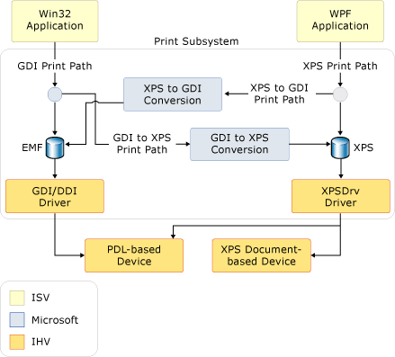

# Printing Overview
With Microsoft .NET Framework, application developers using Windows Presentation Foundation (WPF) have a rich new set of printing and print system management APIs. With [!INCLUDE[TLA#tla_winvista](../../../../includes/tlasharptla-winvista-md.md)], some of these print system enhancements are also available to developers creating [!INCLUDE[TLA#tla_winforms](../../../../includes/tlasharptla-winforms-md.md)] applications and developers using unmanaged code. At the core of this new functionality is the new XML Paper Specification (XPS) file format and the XPS print path.  
  
 This topic contains the following sections.  
  
   
## About XPS  
 XPS is an electronic document format, a spool file format and a page description language. It is an open document format that uses [!INCLUDE[TLA#tla_xml](../../../../includes/tlasharptla-xml-md.md)], Open Packaging Conventions (OPC), and other industry standards to create cross-platform documents. XPS simplifies the process by which digital documents are created, shared, printed, viewed, and archived. For additional information on XPS, see [XPS Documents](/windows/desktop/printdocs/documents).  
  
 Several techniques for printing XPS-based content using [!INCLUDE[TLA2#tla_wpf](../../../../includes/tla2sharptla-wpf-md.md)] are demonstrated in [Programmatically Print XPS Files](how-to-programmatically-print-xps-files.md). You may find it useful to reference these samples during review of content contained in this topic. (Unmanaged code developers should see documentation for the [MXDC_ESCAPE function](/windows/desktop/printdocs/mxdc-escape). Windows Forms developers must use the API in the <xref:System.Drawing.Printing> namespace which does not support the full XPS print path, but does support a hybrid GDI-to-XPS print path. See **Print Path Architecture** below.)  
  
   
## XPS Print Path  
 The XML Paper Specification (XPS) print path is a new Windows feature that redefines how printing is handled in Windows applications. Because XPS can replace a document presentation language (such as RTF), a print spooler format (such as WMF), and a page description language (such as PCL or Postscript); the new print path maintains the XPS format from application publication to the final processing in the print driver or device.  
  
 The XPS print path is built upon the XPS printer driver model (XPSDrv), which provides several benefits for developers such as [!INCLUDE[TLA#tla_wys](../../../../includes/tlasharptla-wys-md.md)] printing, improved color support, and significantly improved print performance. (For more on XPSDrv, see the [Windows Driver Kit documentation](/windows-hardware/drivers/).)  
  
 The operation of the print spooler for XPS documents is essentially the same as in previous versions of Windows. However, it has been enhanced to support the XPS print path in addition to the existing GDI print path. The new print path natively consumes an XPS spool file. While user-mode printer drivers written for previous versions of Windows will continue to work, an XPS printer driver (XPSDrv) is required in order to use the XPS print path.  
  
 The benefits of the XPS print path are significant, and include:  
  
- [!INCLUDE[TLA2#tla_wys](../../../../includes/tla2sharptla-wys-md.md)] print support  
  
- Native support of advanced color profiles, which include 32 bits per channel (bpc), CMYK, named-colors, n-inks, and native support of transparency and gradients.  
  
- Improved print performance for both .NET Framework and [!INCLUDE[TLA#tla_win32](../../../../includes/tlasharptla-win32-md.md)] based applications.  
  
- Industry standard XPS format.  
  
 For basic print scenarios, a simple and intuitive API is available with a single entry point for user interface, configuration and job submission. For advanced scenarios, an additional support is added for [!INCLUDE[TLA#tla_ui](../../../../includes/tlasharptla-ui-md.md)] customization (or no [!INCLUDE[TLA2#tla_ui](../../../../includes/tla2sharptla-ui-md.md)] at all), synchronous or asynchronous printing, and batch printing capabilities. Both options provide print support in full or partial trust mode.  
  
 XPS was designed with extensibility in mind. By using the extensibility framework, features and capabilities can be added to XPS in a modular manner. Extensibility features include:  
  
- Print Schema. The public schema is updated regularly and enables rapid extension of device capabilities. (See **PrintTicket and PrintCapabilities** below.)  
  
- Extensible Filter Pipeline. The XPS printer driver (XPSDrv) filter pipeline was designed to enable both direct and scalable printing of XPS documents. For more information, see [XPSDrv Printer Drivers](/windows-hardware/drivers/print/xpsdrv-printer-drivers). 
  
### Print Path Architecture  
 While both [!INCLUDE[TLA2#tla_win32](../../../../includes/tla2sharptla-win32-md.md)] and .NET Framework applications support XPS, [!INCLUDE[TLA2#tla_win32](../../../../includes/tla2sharptla-win32-md.md)] and Windows Forms applications use a GDI to XPS conversion in order to create XPS formatted content for the XPS printer driver (XPSDrv). These applications are not required to use the XPS print path, and can continue to use Enhanced Metafile (EMF) based printing. However, most XPS features and enhancements are only available to applications that target the XPS print path.  
  
 To enable the use of XPSDrv-based printers by [!INCLUDE[TLA2#tla_win32](../../../../includes/tla2sharptla-win32-md.md)] and Windows Forms applications, the XPS printer driver (XPSDrv) supports conversion of GDI to XPS format. The XPSDrv model also provides a converter for XPS to GDI format so that [!INCLUDE[TLA2#tla_win32](../../../../includes/tla2sharptla-win32-md.md)] applications can print XPS Documents. For [!INCLUDE[TLA2#tla_wpf](../../../../includes/tla2sharptla-wpf-md.md)] applications, conversion of XPS to GDI format is done automatically by the <xref:System.Windows.Xps.XpsDocumentWriter.Write%2A> and <xref:System.Windows.Xps.XpsDocumentWriter.WriteAsync%2A> methods of the <xref:System.Windows.Xps.XpsDocumentWriter> class whenever the target print queue of the write operation does not have an XPSDrv driver. (Windows Forms applications cannot print XPS Documents.)  
  
 The following illustration depicts the print subsystem and defines the portions provided by Microsoft, and the portions defined by software and hardware vendors:  
  
   
  
### Basic XPS Printing  
 [!INCLUDE[TLA2#tla_wpf](../../../../includes/tla2sharptla-wpf-md.md)] defines both a basic and advanced API. For those applications that do not require extensive print customization or access to the complete XPS feature set, basic print support is available. Basic print support is exposed through a print dialog control that requires minimal configuration and features a familiar [!INCLUDE[TLA2#tla_ui](../../../../includes/tla2sharptla-ui-md.md)]. Many XPS features are available using this simplified print model.  
  
#### PrintDialog  
 The <xref:System.Windows.Controls.PrintDialog?displayProperty=nameWithType> control provides a single entry point for [!INCLUDE[TLA2#tla_ui](../../../../includes/tla2sharptla-ui-md.md)], configuration, and XPS job submission. For information about how to instantiate and use the control, see [Invoke a Print Dialog](how-to-invoke-a-print-dialog.md).  
  
### Advanced XPS Printing  
 To access the complete set of XPS features, the advanced print API must be used. Several relevant API are described in greater detail below. For a complete list of XPS print path APIs, see the <xref:System.Windows.Xps> and <xref:System.Printing> namespace references.  
  
#### PrintTicket and PrintCapabilities  
 The <xref:System.Printing.PrintTicket> and <xref:System.Printing.PrintCapabilities> classes are the foundation of the advanced XPS features. Both types of objects are [!INCLUDE[TLA#tla_xml](../../../../includes/tlasharptla-xml-md.md)] formatted structures of print-oriented features such as collation, two-sided printing, stapling, etc. These structures are defined by the print schema. A <xref:System.Printing.PrintTicket> instructs a printer how to process a print job. The <xref:System.Printing.PrintCapabilities> class defines the capabilities of a printer. By querying the capabilities of a printer, a <xref:System.Printing.PrintTicket> can be created that takes full advantage of a printer's supported features. Similarly, unsupported features can be avoided.  
  
 The following example demonstrates how to query the <xref:System.Printing.PrintCapabilities> of a printer and create a <xref:System.Printing.PrintTicket> using code.  
  
 [!code-cpp[xpscreate#PrinterCapabilities](~/samples/snippets/cpp/VS_Snippets_Wpf/XpsCreate/CPP/XpsCreate.cpp#printercapabilities)]
 [!code-csharp[xpscreate#PrinterCapabilities](~/samples/snippets/csharp/VS_Snippets_Wpf/XpsCreate/CSharp/XpsCreate.cs#printercapabilities)]
 [!code-vb[xpscreate#PrinterCapabilities](~/samples/snippets/visualbasic/VS_Snippets_Wpf/XpsCreate/visualbasic/xpscreate.vb#printercapabilities)]  
  
#### PrintServer and PrintQueue  
 The <xref:System.Printing.PrintServer> class represents a network print server and the <xref:System.Printing.PrintQueue> class represents a printer and the output job queue associated with it. Together, these APIs allow advanced management of a server's print jobs. A <xref:System.Printing.PrintServer>, or one of its derived classes, is used to manage a <xref:System.Printing.PrintQueue>. The <xref:System.Printing.PrintQueue.AddJob%2A> method is used to insert a new print job into the queue.  
  
 The following example demonstrates how to create a <xref:System.Printing.LocalPrintServer> and access its default <xref:System.Printing.PrintQueue> by using code.  
  
 [!code-csharp[xpsprint#PrintQueueSnip](~/samples/snippets/csharp/VS_Snippets_Wpf/XpsPrint/CSharp/XpsPrintHelper.cs#printqueuesnip)]
 [!code-vb[xpsprint#PrintQueueSnip](~/samples/snippets/visualbasic/VS_Snippets_Wpf/XpsPrint/visualbasic/xpsprinthelper.vb#printqueuesnip)]  
  
#### XpsDocumentWriter  
 An <xref:System.Windows.Xps.XpsDocumentWriter>, with its many the <xref:System.Windows.Xps.XpsDocumentWriter.Write%2A> and <xref:System.Windows.Xps.XpsDocumentWriter.WriteAsync%2A> methods, is used to write XPS documents to a <xref:System.Printing.PrintQueue>. For example, the <xref:System.Windows.Xps.XpsDocumentWriter.Write%28System.Windows.Documents.FixedPage%2CSystem.Printing.PrintTicket%29> method is used to output an XPS document and <xref:System.Printing.PrintTicket> synchronously. The <xref:System.Windows.Xps.XpsDocumentWriter.WriteAsync%28System.Windows.Documents.FixedDocument%2CSystem.Printing.PrintTicket%29> method is used to output an XPS document and <xref:System.Printing.PrintTicket> asynchronously.  
  
 The following example demonstrates how to create an <xref:System.Windows.Xps.XpsDocumentWriter> using code.  
  
 [!code-csharp[XpsPrint#PrintQueueSnip](~/samples/snippets/csharp/VS_Snippets_Wpf/XpsPrint/CSharp/XpsPrintHelper.cs#printqueuesnip)]
 [!code-vb[XpsPrint#PrintQueueSnip](~/samples/snippets/visualbasic/VS_Snippets_Wpf/XpsPrint/visualbasic/xpsprinthelper.vb#printqueuesnip)]  
  
 The <xref:System.Printing.PrintQueue.AddJob%2A> methods also provide ways to print. See [Programmatically Print XPS Files](how-to-programmatically-print-xps-files.md). for details.  
  
   
## GDI Print Path  
 While [!INCLUDE[TLA2#tla_wpf](../../../../includes/tla2sharptla-wpf-md.md)] applications natively support the XPS print path, [!INCLUDE[TLA2#tla_win32](../../../../includes/tla2sharptla-win32-md.md)] and Windows Forms applications can also take advantage of some XPS features. The XPS printer driver (XPSDrv) can convert GDI based output to XPS format. For advanced scenarios, custom conversion of content is supported using the [Microsoft XPS Document Converter (MXDC)](/windows/desktop/printdocs/microsoft-xps-document-converter--mxdc-). Similarly, [!INCLUDE[TLA2#tla_wpf](../../../../includes/tla2sharptla-wpf-md.md)] applications can also output to the GDI print path by calling one of the <xref:System.Windows.Xps.XpsDocumentWriter.Write%2A> or <xref:System.Windows.Xps.XpsDocumentWriter.WriteAsync%2A> methods of the <xref:System.Windows.Xps.XpsDocumentWriter> class and designating a non-XpsDrv printer as the target print queue.  

For applications that do not require XPS functionality or support, the current GDI print path remains unchanged.  
  
- For additional reference material on the GDI print path and the various XPS conversion options, see [Microsoft XPS Document Converter (MXDC)](/windows/desktop/printdocs/microsoft-xps-document-converter--mxdc-) and [XPSDrv Printer Drivers](/windows-hardware/drivers/print/xpsdrv-printer-drivers).  
  
   
## XPSDrv Driver Model  
 The XPS print path improves spooler efficiency by using XPS as the native print spool format when printing to an XPS -enabled printer or driver. The simplified spooling process eliminates the need to generate an intermediate spool file, such as an EMF data file, before the document is spooled. Through smaller spool file sizes, the XPS print path can reduce network traffic and improve print performance.  
  
 EMF is a closed format that represents application output as a series of calls into GDI for rendering services. Unlike EMF, the XPS spool format represents the actual document without requiring further interpretation when output to an XPS-based printer driver (XPSDrv). The drivers can operate directly on the data in the format. This capability eliminates the data and color space conversions required when you use EMF files and GDI-based print drivers.  
  
 Spool file sizes are usually reduced when you use XPS Documents that target an XPS printer driver (XPSDrv) compared with their EMF equivalents; however, there are exceptions:  
  
- A vector graphic that is very complex, multi-layered, or inefficiently written can be larger than a bitmapped version of the same graphic.  
  
- For screen display purposes, XPS files embed device fonts as well as computer-based fonts; whereas GDI spool files do not embed device fonts. But both kinds of fonts are subsetted (see below) and printer drivers can remove the device fonts before transmitting the file to the printer.  
  
 Spool size reduction is performed through several mechanisms:  
  
- **Font subsetting**. Only characters used within the actual document are stored in the XPS file.  
  
- **Advanced Graphics Support**. Native support for transparency and gradient primitives avoids rasterization of content in the XPS Document.  
  
- **Identification of common resources**. Resources that are used multiple times (such as an image that represents a corporate logo) are treated as shared resources and are loaded only once.  
  
- **ZIP compression**. All XPS documents use ZIP compression.  
  
## See also

- <xref:System.Windows.Controls.PrintDialog>
- <xref:System.Windows.Xps.XpsDocumentWriter>
- <xref:System.Windows.Xps.Packaging.XpsDocument>
- <xref:System.Printing.PrintTicket>
- <xref:System.Printing.PrintCapabilities>
- <xref:System.Printing.PrintServer>
- <xref:System.Printing.PrintQueue>
- [How-to Topics](printing-how-to-topics.md)
- [Documents in WPF](documents-in-wpf.md)
- [XPS Documents](/windows/desktop/printdocs/documents)
- [Document Serialization and Storage](document-serialization-and-storage.md)
- [Microsoft XPS Document Converter (MXDC)](/windows/desktop/printdocs/microsoft-xps-document-converter--mxdc-)
