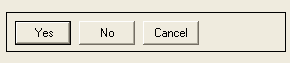
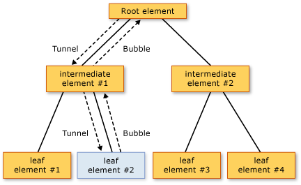

# Routed Events Overview
This topic describes the concept of routed events in [!INCLUDE[TLA#tla_winclient](../../../../includes/tlasharptla-winclient-md.md)]. The topic defines routed events terminology, describes how routed events are routed through a tree of elements, summarizes how you handle routed events, and introduces how to create your own custom routed events.
  
   
## Prerequisites  
 This topic assumes that you have basic knowledge of the [!INCLUDE[TLA#tla_clr](../../../../includes/tlasharptla-clr-md.md)] and object-oriented programming, as well as the concept of how the relationships between [!INCLUDE[TLA2#tla_winclient](../../../../includes/tla2sharptla-winclient-md.md)] elements can be conceptualized as a tree. In order to follow the examples in this topic, you should also understand [!INCLUDE[TLA#tla_xaml](../../../../includes/tlasharptla-xaml-md.md)] and know how to write very basic [!INCLUDE[TLA2#tla_winclient](../../../../includes/tla2sharptla-winclient-md.md)] applications or pages. For more information, see [Walkthrough: My first WPF desktop application](../../../../docs/framework/wpf/getting-started/walkthrough-my-first-wpf-desktop-application.md) and [XAML Overview (WPF)](../../../../docs/framework/wpf/advanced/xaml-overview-wpf.md).  
  
   
## What Is a Routed Event?  
 You can think about routed events either from a functional or implementation perspective. Both definitions are presented here, because some people find one or the other definition more useful.  
  
 Functional definition: A routed event is a type of event that can invoke handlers on multiple listeners in an element tree, rather than just on the object that raised the event.  
  
 Implementation definition: A routed event is a [!INCLUDE[TLA2#tla_clr](../../../../includes/tla2sharptla-clr-md.md)] event that is backed by an instance of the <xref:System.Windows.RoutedEvent> class and is processed by the [!INCLUDE[TLA#tla_winclient](../../../../includes/tlasharptla-winclient-md.md)] event system.  
  
 A typical [!INCLUDE[TLA2#tla_winclient](../../../../includes/tla2sharptla-winclient-md.md)] application contains many elements. Whether created in code or declared in [!INCLUDE[TLA2#tla_xaml](../../../../includes/tla2sharptla-xaml-md.md)], these elements exist in an element tree relationship to each other. The event route can travel in one of two directions depending on the event definition, but generally the route travels from the source element and then "bubbles" upward through the element tree until it reaches the element tree root (typically a page or a window). This bubbling concept might be familiar to you if you have worked with the DHTML object model previously.  
  
 Consider the following simple element tree:  
  
 [!code-xaml[EventOvwSupport#GroupButton](../../../../samples/snippets/csharp/VS_Snippets_Wpf/EventOvwSupport/CSharp/default.xaml#groupbutton)]  
  
 This element tree produces something like the following:  
  
   
  
 In this simplified element tree, the source of a <xref:System.Windows.Controls.Primitives.ButtonBase.Click> event is one of the <xref:System.Windows.Controls.Button> elements, and whichever <xref:System.Windows.Controls.Button> was clicked is the first element that has the opportunity to handle the event. But if no handler attached to the <xref:System.Windows.Controls.Button> acts on the event, then the event will bubble upwards to the <xref:System.Windows.Controls.Button> parent in the element tree, which is the <xref:System.Windows.Controls.StackPanel>. Potentially, the event bubbles to <xref:System.Windows.Controls.Border>, and then beyond to the page root of the element tree (not shown).  
  
 In other words, the event route for this <xref:System.Windows.Controls.Primitives.ButtonBase.Click> event is:  
  
 Button-->StackPanel-->Border-->...  
  
### Top-level Scenarios for Routed Events  
 The following is a brief summary of the scenarios that motivated the routed event concept, and why a typical [!INCLUDE[TLA2#tla_clr](../../../../includes/tla2sharptla-clr-md.md)] event was not adequate for these scenarios:  
  
 **Control composition and encapsulation:** Various controls in [!INCLUDE[TLA2#tla_winclient](../../../../includes/tla2sharptla-winclient-md.md)] have a rich content model. For example, you can place an image inside of a <xref:System.Windows.Controls.Button>, which effectively extends the visual tree of the button. However, the added image must not break the hit-testing behavior that causes a button to respond to a <xref:System.Windows.Controls.Primitives.ButtonBase.Click> of its content, even if the user clicks on pixels that are technically part of the image.  
  
 **Singular handler attachment points:** In [!INCLUDE[TLA#tla_winforms](../../../../includes/tlasharptla-winforms-md.md)], you would have to attach the same handler multiple times to process events that could be raised from multiple elements. Routed events enable you to attach that handler only once, as was shown in the previous example, and use handler logic to determine where the event came from if necessary. For instance, this might be the handler for the previously shown [!INCLUDE[TLA2#tla_xaml](../../../../includes/tla2sharptla-xaml-md.md)]:  
  
 [!code-csharp[EventOvwSupport#GroupButtonCodeBehind](../../../../samples/snippets/csharp/VS_Snippets_Wpf/EventOvwSupport/CSharp/default.xaml.cs#groupbuttoncodebehind)]
 [!code-vb[EventOvwSupport#GroupButtonCodeBehind](../../../../samples/snippets/visualbasic/VS_Snippets_Wpf/EventOvwSupport/visualbasic/default.xaml.vb#groupbuttoncodebehind)]  
  
 **Class handling:** Routed events permit a static handler that is defined by the class. This class handler has the opportunity to handle an event before any attached instance handlers can.  
  
 **Referencing an event without reflection:** Certain code and markup techniques require a way to identify a specific event. A routed event creates a <xref:System.Windows.RoutedEvent> field as an identifier, which provides a robust event identification technique that does not require static or run-time reflection.  
  
### How Routed Events Are Implemented  
 A routed event is a [!INCLUDE[TLA2#tla_clr](../../../../includes/tla2sharptla-clr-md.md)] event that is backed by an instance of the <xref:System.Windows.RoutedEvent> class and registered with the [!INCLUDE[TLA2#tla_winclient](../../../../includes/tla2sharptla-winclient-md.md)] event system. The <xref:System.Windows.RoutedEvent> instance obtained from registration is typically retained as a `public` `static` `readonly` field member of the class that registers and thus "owns" the routed event. The connection to the identically named [!INCLUDE[TLA2#tla_clr](../../../../includes/tla2sharptla-clr-md.md)] event (which is sometimes termed the "wrapper" event) is accomplished by overriding the `add` and `remove` implementations for the [!INCLUDE[TLA2#tla_clr](../../../../includes/tla2sharptla-clr-md.md)] event. Ordinarily, the `add` and `remove` are left as an implicit default that uses the appropriate language-specific event syntax for adding and removing handlers of that event. The routed event backing and connection mechanism is conceptually similar to how a dependency property is a [!INCLUDE[TLA2#tla_clr](../../../../includes/tla2sharptla-clr-md.md)] property that is backed by the <xref:System.Windows.DependencyProperty> class and registered with the [!INCLUDE[TLA2#tla_winclient](../../../../includes/tla2sharptla-winclient-md.md)] property system.  
  
 The following example shows the declaration for a custom `Tap` routed event, including the registration and exposure of the <xref:System.Windows.RoutedEvent> identifier field and the `add` and `remove` implementations for the `Tap` [!INCLUDE[TLA2#tla_clr](../../../../includes/tla2sharptla-clr-md.md)] event.  
  
 [!code-csharp[RoutedEventCustom#AddRemoveHandler](../../../../samples/snippets/csharp/VS_Snippets_Wpf/RoutedEventCustom/CSharp/SDKSampleLibrary/class1.cs#addremovehandler)]
 [!code-vb[RoutedEventCustom#AddRemoveHandler](../../../../samples/snippets/visualbasic/VS_Snippets_Wpf/RoutedEventCustom/VB/SDKSampleLibrary/Class1.vb#addremovehandler)]  
  
### Routed Event Handlers and XAML  
 To add a handler for an event using [!INCLUDE[TLA2#tla_xaml](../../../../includes/tla2sharptla-xaml-md.md)], you declare the event name as an attribute on the element that is an event listener. The value of the attribute is the name of your implemented handler method, which must exist in the partial class of the code-behind file.  
  
 [!code-xaml[EventOvwSupport#SimplestSyntax](../../../../samples/snippets/csharp/VS_Snippets_Wpf/EventOvwSupport/CSharp/default.xaml#simplestsyntax)]  
  
 The [!INCLUDE[TLA2#tla_xaml](../../../../includes/tla2sharptla-xaml-md.md)] syntax for adding standard [!INCLUDE[TLA2#tla_clr](../../../../includes/tla2sharptla-clr-md.md)] event handlers is the same for adding routed event handlers, because you are really adding handlers to the [!INCLUDE[TLA2#tla_clr](../../../../includes/tla2sharptla-clr-md.md)] event wrapper, which has a routed event implementation underneath. For more information about adding event handlers in [!INCLUDE[TLA2#tla_xaml](../../../../includes/tla2sharptla-xaml-md.md)], see [XAML Overview (WPF)](../../../../docs/framework/wpf/advanced/xaml-overview-wpf.md).  
  
   
## Routing Strategies  
 Routed events use one of three routing strategies:  
  
-   **Bubbling:** Event handlers on the event source are invoked. The routed event then routes to successive parent elements until reaching the element tree root. Most routed events use the bubbling routing strategy. Bubbling routed events are generally used to report input or state changes from distinct controls or other UI elements.  
  
-   **Direct:** Only the source element itself is given the opportunity to invoke handlers in response. This is analogous to the "routing" that [!INCLUDE[TLA#tla_winforms](../../../../includes/tlasharptla-winforms-md.md)] uses for events. However, unlike a standard [!INCLUDE[TLA2#tla_clr](../../../../includes/tla2sharptla-clr-md.md)] event, direct routed events support class handling (class handling is explained in an upcoming section) and can be used by <xref:System.Windows.EventSetter> and <xref:System.Windows.EventTrigger>.  
  
-   **Tunneling:** Initially, event handlers at the element tree root are invoked. The routed event then travels a route through successive child elements along the route, towards the node element that is the routed event source (the element that raised the routed event). Tunneling routed events are often used or handled as part of the compositing for a control, such that events from composite parts can be deliberately suppressed or replaced by events that are specific to the complete control. Input events provided in [!INCLUDE[TLA2#tla_winclient](../../../../includes/tla2sharptla-winclient-md.md)] often come implemented as a tunneling/bubbling pair. Tunneling events are also sometimes referred to as Preview events, because of a naming convention that is used for the pairs.  
  
   
## Why Use Routed Events?  
 As an application developer, you do not always need to know or care that the event you are handling is implemented as a routed event. Routed events have special behavior, but that behavior is largely invisible if you are handling an event on the element where it is raised.  
  
 Where routed events become powerful is if you use any of the suggested scenarios: defining common handlers at a common root, compositing your own control, or defining your own custom control class.  
  
 Routed event listeners and routed event sources do not need to share a common event in their hierarchy. Any <xref:System.Windows.UIElement> or <xref:System.Windows.ContentElement> can be an event listener for any routed event. Therefore, you can use the full set of routed events available throughout the working [!INCLUDE[TLA2#tla_api](../../../../includes/tla2sharptla-api-md.md)] set as a conceptual "interface" whereby disparate elements in the application can exchange event information. This "interface" concept for routed events is particularly applicable for input events.  
  
 Routed events can also be used to communicate through the element tree, because the event data for the event is perpetuated to each element in the route. One element could change something in the event data, and that change would be available to the next element in the route.  
  
 Other than the routing aspect, there are two other reasons that any given [!INCLUDE[TLA2#tla_winclient](../../../../includes/tla2sharptla-winclient-md.md)] event might be implemented as a routed event instead of a standard [!INCLUDE[TLA2#tla_clr](../../../../includes/tla2sharptla-clr-md.md)] event. If you are implementing your own events, you might also consider these principles:  
  
-   Certain [!INCLUDE[TLA2#tla_winclient](../../../../includes/tla2sharptla-winclient-md.md)] styling and templating features such as <xref:System.Windows.EventSetter> and <xref:System.Windows.EventTrigger> require the referenced event to be a routed event. This is the event identifier scenario mentioned earlier.  
  
-   Routed events support a class handling mechanism whereby the class can specify static methods that have the opportunity to handle routed events before any registered instance handlers can access them. This is very useful in control design, because your class can enforce event-driven class behaviors that cannot be accidentally suppressed by handling an event on an instance.  
  
 Each of the above considerations is discussed in a separate section of this topic.  
  
   
## Adding and Implementing an Event Handler for a Routed Event  
 To add an event handler in [!INCLUDE[TLA2#tla_xaml](../../../../includes/tla2sharptla-xaml-md.md)], you simply add the event name to an element as an attribute and set the attribute value as the name of the event handler that implements an appropriate delegate, as in the following example.  
  
 [!code-xaml[EventOvwSupport#SimplestSyntax](../../../../samples/snippets/csharp/VS_Snippets_Wpf/EventOvwSupport/CSharp/default.xaml#simplestsyntax)]  
  
 `b1SetColor` is the name of the implemented handler that contains the code that handles the <xref:System.Windows.Controls.Primitives.ButtonBase.Click> event. `b1SetColor` must have the same signature as the <xref:System.Windows.RoutedEventHandler> delegate, which is the event handler delegate for the <xref:System.Windows.Controls.Primitives.ButtonBase.Click> event. The first parameter of all routed event handler delegates specifies the element to which the event handler is added, and the second parameter specifies the data for the event.  
  
[!code-csharp[EventOvwSupport#SimpleHandlerA](../../../../samples/snippets/csharp/VS_Snippets_Wpf/EventOvwSupport/CSharp/default.xaml.cs#simplehandlera)]
[!code-vb[EventOvwSupport#SimpleHandlerA](../../../../samples/snippets/visualbasic/VS_Snippets_Wpf/EventOvwSupport/visualbasic/default.xaml.vb#simplehandlera)]  
  
 <xref:System.Windows.RoutedEventHandler> is the basic routed event handler delegate. For routed events that are specialized for certain controls or scenarios, the delegates to use for the routed event handlers also might become more specialized, so that they can transmit specialized event data. For instance, in a common input scenario, you might handle a <xref:System.Windows.UIElement.DragEnter> routed event. Your handler should implement the <xref:System.Windows.DragEventHandler> delegate. By using the most specific delegate, you can process the <xref:System.Windows.DragEventArgs> in the handler and read the <xref:System.Windows.DragEventArgs.Data%2A> property, which contains the clipboard payload of the drag operation.  
  
 For a complete example of how to add an event handler to an element using [!INCLUDE[TLA2#tla_xaml](../../../../includes/tla2sharptla-xaml-md.md)], see [Handle a Routed Event](../../../../docs/framework/wpf/advanced/how-to-handle-a-routed-event.md).  
  
 Adding a handler for a routed event in an application that is created in code is straightforward. Routed event handlers can always be added through a helper method <xref:System.Windows.UIElement.AddHandler%2A> (which is the same method that the existing backing calls for `add`.) However, existing [!INCLUDE[TLA2#tla_winclient](../../../../includes/tla2sharptla-winclient-md.md)] routed events generally have backing implementations of `add` and `remove` logic that allow the handlers for routed events to be added by a language-specific event syntax, which is more intuitive syntax than the helper method. The following is an example usage of the helper method:  
  
 [!code-csharp[EventOvwSupport#AddHandlerCode](../../../../samples/snippets/csharp/VS_Snippets_Wpf/EventOvwSupport/CSharp/default.xaml.cs#addhandlercode)]
 [!code-vb[EventOvwSupport#AddHandlerCode](../../../../samples/snippets/visualbasic/VS_Snippets_Wpf/EventOvwSupport/visualbasic/default.xaml.vb#addhandlercode)]  
  
 The next example shows the [!INCLUDE[TLA#tla_cshrp](../../../../includes/tlasharptla-cshrp-md.md)] operator syntax ([!INCLUDE[TLA2#tla_visualb](../../../../includes/tla2sharptla-visualb-md.md)] has slightly different operator syntax because of its handling of dereferencing):  
  
 [!code-csharp[EventOvwSupport#AddHandlerPlusEquals](../../../../samples/snippets/csharp/VS_Snippets_Wpf/EventOvwSupport/CSharp/default.xaml.cs#addhandlerplusequals)]
 [!code-vb[EventOvwSupport#AddHandlerPlusEquals](../../../../samples/snippets/visualbasic/VS_Snippets_Wpf/EventOvwSupport/visualbasic/default.xaml.vb#addhandlerplusequals)]  
  
 For an example of how to add an event handler in code, see [Add an Event Handler Using Code](../../../../docs/framework/wpf/advanced/how-to-add-an-event-handler-using-code.md).  
  
 If you are using [!INCLUDE[TLA2#tla_visualb](../../../../includes/tla2sharptla-visualb-md.md)], you can also use the `Handles` keyword to add handlers as part of the handler declarations. For more information, see [Visual Basic and WPF Event Handling](../../../../docs/framework/wpf/advanced/visual-basic-and-wpf-event-handling.md).  
  
   
### The Concept of Handled  
 All routed events share a common event data base class, <xref:System.Windows.RoutedEventArgs>. <xref:System.Windows.RoutedEventArgs> defines the <xref:System.Windows.RoutedEventArgs.Handled%2A> property, which takes a Boolean value. The purpose of the <xref:System.Windows.RoutedEventArgs.Handled%2A> property is to enable any event handler along the route to mark the routed event as *handled*, by setting the value of <xref:System.Windows.RoutedEventArgs.Handled%2A> to `true`. After being processed by the handler at one element along the route, the shared event data is again reported to each listener along the route.  
  
 The value of <xref:System.Windows.RoutedEventArgs.Handled%2A> affects how a routed event is reported or processed as it travels further along the route. If <xref:System.Windows.RoutedEventArgs.Handled%2A> is `true` in the event data for a routed event, then handlers that listen for that routed event on other elements are generally no longer invoked for that particular event instance. This is true both for handlers attached in [!INCLUDE[TLA2#tla_xaml](../../../../includes/tla2sharptla-xaml-md.md)] and for handlers added by language-specific event handler attachment syntaxes such as `+=` or `Handles`. For most common handler scenarios, marking an event as handled by setting <xref:System.Windows.RoutedEventArgs.Handled%2A> to `true` will "stop" routing for either a tunneling route or a bubbling route, and also for any event that is handled at a point in the route by a class handler.  
  
 However, there is a "handledEventsToo" mechanism whereby listeners can still run handlers in response to routed events where <xref:System.Windows.RoutedEventArgs.Handled%2A> is `true` in the event data. In other words, the event route is not truly stopped by marking the event data as handled. You can only use the handledEventsToo mechanism in code, or in an <xref:System.Windows.EventSetter>:  
  
-   In code, instead of using a language-specific event syntax that works for general [!INCLUDE[TLA2#tla_clr](../../../../includes/tla2sharptla-clr-md.md)] events, call the [!INCLUDE[TLA2#tla_winclient](../../../../includes/tla2sharptla-winclient-md.md)] method <xref:System.Windows.UIElement.AddHandler%28System.Windows.RoutedEvent%2CSystem.Delegate%2CSystem.Boolean%29> to add your handler. Specify the value of `handledEventsToo` as `true`.  
  
-   In an <xref:System.Windows.EventSetter>, set the <xref:System.Windows.EventSetter.HandledEventsToo%2A> attribute to be `true`.  
  
 In addition to the behavior that <xref:System.Windows.RoutedEventArgs.Handled%2A> state produces in routed events, the concept of <xref:System.Windows.RoutedEventArgs.Handled%2A> has implications for how you should design your application and write the event handler code. You can conceptualize <xref:System.Windows.RoutedEventArgs.Handled%2A> as being a simple protocol that is exposed by routed events. Exactly how you use this protocol is up to you, but the conceptual design for how the value of <xref:System.Windows.RoutedEventArgs.Handled%2A> is intended to be used is as follows:  
  
-   If a routed event is marked as handled, then it does not need to be handled again by other elements along that route.  
  
-   If a routed event is not marked as handled, then other listeners that were earlier along the route have chosen either not to register a handler, or the handlers that were registered chose not to manipulate the event data and set <xref:System.Windows.RoutedEventArgs.Handled%2A> to `true`. (Or, it is of course possible that the current listener is the first point in the route.) Handlers on the current listener now have three possible courses of action:  
  
    -   Take no action at all; the event remains unhandled, and the event routes to the next listener.  
  
    -   Execute code in response to the event, but make the determination that the action taken was not substantial enough to warrant marking the event as handled. The event routes to the next listener.  
  
    -   Execute code in response to the event. Mark the event as handled in the event data passed to the handler, because the action taken was deemed substantial enough to warrant marking as handled. The event still routes to the next listener, but with <xref:System.Windows.RoutedEventArgs.Handled%2A>=`true` in its event data, so only `handledEventsToo` listeners have the opportunity to invoke further handlers.  
  
 This conceptual design is reinforced by the routing behavior mentioned earlier: it is more difficult (although still possible in code or styles) to attach handlers for routed events that are invoked even if a previous handler along the route has already set <xref:System.Windows.RoutedEventArgs.Handled%2A> to `true`.  
  
 For more information about <xref:System.Windows.RoutedEventArgs.Handled%2A>, class handling of routed events, and recommendations about when it is appropriate to mark a routed event as <xref:System.Windows.RoutedEventArgs.Handled%2A>, see [Marking Routed Events as Handled, and Class Handling](../../../../docs/framework/wpf/advanced/marking-routed-events-as-handled-and-class-handling.md).  
  
 In applications, it is quite common to just handle a bubbling routed event on the object that raised it, and not be concerned with the event's routing characteristics at all. However, it is still a good practice to mark the routed event as handled in the event data, to prevent unanticipated side effects just in case an element that is further up the element tree also has a handler attached for that same routed event.  
  
   
## Class Handlers  
 If you are defining a class that derives in some way from <xref:System.Windows.DependencyObject>, you can also define and attach a class handler for a routed event that is a declared or inherited event member of your class. Class handlers are invoked before any instance listener handlers that are attached to an instance of that class, whenever a routed event reaches an element instance in its route.  
  
 Some [!INCLUDE[TLA2#tla_winclient](../../../../includes/tla2sharptla-winclient-md.md)] controls have inherent class handling for certain routed events. This might give the outward appearance that the routed event is not ever raised, but in reality it is being class handled, and the routed event can potentially still be handled by your instance handlers if you use certain techniques. Also, many base classes and controls expose virtual methods that can be used to override class handling behavior. For more information both on how to work around undesired class handling and on defining your own class handling in a custom class, see [Marking Routed Events as Handled, and Class Handling](../../../../docs/framework/wpf/advanced/marking-routed-events-as-handled-and-class-handling.md).  
  
   
## Attached Events in WPF  
 The [!INCLUDE[TLA2#tla_xaml](../../../../includes/tla2sharptla-xaml-md.md)] language also defines a special type of event called an *attached event*. An attached event enables you to add a handler for a particular event to an arbitrary element. The element handling the event need not define or inherit the attached event, and neither the object potentially raising the event nor the destination handling instance must define or otherwise "own" that event as a class member.  
  
 The [!INCLUDE[TLA2#tla_winclient](../../../../includes/tla2sharptla-winclient-md.md)] input system uses attached events extensively. However, nearly all of these attached events are forwarded through base elements. The input events then appear as equivalent non-attached routed events that are members of the base element class. For instance, the underlying attached event <xref:System.Windows.Input.Mouse.MouseDown?displayProperty=nameWithType> can more easily be handled on any given <xref:System.Windows.UIElement> by using <xref:System.Windows.UIElement.MouseDown> on that <xref:System.Windows.UIElement> rather than dealing with attached event syntax either in [!INCLUDE[TLA2#tla_xaml](../../../../includes/tla2sharptla-xaml-md.md)] or code.  
  
 For more information about attached events in [!INCLUDE[TLA2#tla_winclient](../../../../includes/tla2sharptla-winclient-md.md)], see [Attached Events Overview](../../../../docs/framework/wpf/advanced/attached-events-overview.md).  
  
   
## Qualified Event Names in XAML  
 Another syntax usage that resembles *typename*.*eventname* attached event syntax but is not strictly speaking an attached event usage is when you attach handlers for routed events that are raised by child elements. You attach the handlers to a common parent, to take advantage of event routing, even though the common parent might not have the relevant routed event as a member. Consider this example again:  
  
 [!code-xaml[EventOvwSupport#GroupButton](../../../../samples/snippets/csharp/VS_Snippets_Wpf/EventOvwSupport/CSharp/default.xaml#groupbutton)]  
  
 Here, the parent element listener where the handler is added is a <xref:System.Windows.Controls.StackPanel>. However, it is adding a handler for a routed event that was declared and will be raised by the <xref:System.Windows.Controls.Button> class (<xref:System.Windows.Controls.Primitives.ButtonBase> actually, but available to <xref:System.Windows.Controls.Button> through inheritance). <xref:System.Windows.Controls.Button> "owns" the event, but the routed event system permits handlers for any routed event to be attached to any <xref:System.Windows.UIElement> or <xref:System.Windows.ContentElement> instance listener that could otherwise attach listeners for a [!INCLUDE[TLA#tla_clr](../../../../includes/tlasharptla-clr-md.md)] event. The default xmlns namespace for these qualified event attribute names is typically the default [!INCLUDE[TLA2#tla_winclient](../../../../includes/tla2sharptla-winclient-md.md)] xmlns namespace, but you can also specify prefixed namespaces for custom routed events. For more information about xmlns, see [XAML Namespaces and Namespace Mapping for WPF XAML](../../../../docs/framework/wpf/advanced/xaml-namespaces-and-namespace-mapping-for-wpf-xaml.md).  
  
   
## WPF Input Events  
 One frequent application of routed events within the [!INCLUDE[TLA2#tla_winclient](../../../../includes/tla2sharptla-winclient-md.md)] platform is for input events. In [!INCLUDE[TLA2#tla_winclient](../../../../includes/tla2sharptla-winclient-md.md)], tunneling routed events names are prefixed with the word "Preview" by convention. Input events often come in pairs, with one being the bubbling event and the other being the tunneling event. For example, the <xref:System.Windows.ContentElement.KeyDown> event and the <xref:System.Windows.ContentElement.PreviewKeyDown> event have the same signature, with the former being the bubbling input event and the latter being the tunneling input event. Occasionally, input events only have a bubbling version, or perhaps only a direct routed version. In the documentation, routed event topics cross-reference similar routed events with alternative routing strategies if such routed events exist, and sections in the managed reference pages clarify the routing strategy of each routed event.  
  
 [!INCLUDE[TLA2#tla_winclient](../../../../includes/tla2sharptla-winclient-md.md)] input events that come in pairs are implemented so that a single user action from input, such as a mouse button press, will raise both routed events of the pair in sequence. First, the tunneling event is raised and travels its route. Then the bubbling event is raised and travels its route. The two events literally share the same event data instance, because the <xref:System.Windows.UIElement.RaiseEvent%2A> method call in the implementing class that raises the bubbling event listens for the event data from the tunneling event and reuses it in the new raised event. Listeners with handlers for the tunneling event have the first opportunity to mark the routed event handled (class handlers first, then instance handlers). If an element along the tunneling route marked the routed event as handled, the already-handled event data is sent on for the bubbling event, and typical handlers attached for the equivalent bubbling input events will not be invoked. To outward appearances it will be as if the handled bubbling event has not even been raised. This handling behavior is useful for control compositing, where you might want all hit-test based input events or focus-based input events to be reported by your final control, rather than its composite parts. The final control element is closer to the root in the compositing, and therefore has the opportunity to class handle the tunneling event first and perhaps to "replace" that routed event with a more control-specific event, as part of the code that backs the control class.  
  
 As an illustration of how input event processing works, consider the following input event example. In the following tree illustration, `leaf element #2` is the source of both a `PreviewMouseDown` and then a `MouseDown` event.  
  
   
Input Event Bubbling and Tunneling  
  
 The order of event processing is as follows:  
  
1.  `PreviewMouseDown` (tunnel) on root element.  
  
2.  `PreviewMouseDown` (tunnel) on intermediate element #1.  
  
3.  `PreviewMouseDown` (tunnel) on source element #2.  
  
4.  `MouseDown` (bubble) on source element #2.  
  
5.  `MouseDown` (bubble) on intermediate element #1.  
  
6.  `MouseDown` (bubble) on root element.  
  
 A routed event handler delegate provides references to two objects: the object that raised the event and the object where the handler was invoked. The object where the handler was invoked is the object reported by the `sender` parameter. The object where the event was first raised is reported by the <xref:System.Windows.RoutedEventArgs.Source%2A> property in the event data. A routed event can still be raised and handled by the same object, in which case `sender` and <xref:System.Windows.RoutedEventArgs.Source%2A> are identical (this is the case with Steps 3 and 4 in the event processing example list).  
  
 Because of tunneling and bubbling, parent elements receive input events where the <xref:System.Windows.RoutedEventArgs.Source%2A> is one of their child elements. When it is important to know what the source element is, you can identify the source element by accessing the <xref:System.Windows.RoutedEventArgs.Source%2A> property.  
  
 Usually, once the input event is marked <xref:System.Windows.RoutedEventArgs.Handled%2A>, further handlers are not invoked. Typically, you should mark input events as handled as soon as a handler is invoked that addresses your application-specific logical handling of the meaning of the input event.  
  
 The exception to this general statement about <xref:System.Windows.RoutedEventArgs.Handled%2A> state is that input event handlers that are registered to deliberately ignore <xref:System.Windows.RoutedEventArgs.Handled%2A> state of the event data would still be invoked along either route. For more information, see [Preview Events](../../../../docs/framework/wpf/advanced/preview-events.md) or [Marking Routed Events as Handled, and Class Handling](../../../../docs/framework/wpf/advanced/marking-routed-events-as-handled-and-class-handling.md).  
  
 The shared event data model between tunneling and bubbling events, and the sequential raising of first tunneling then bubbling events, is not a concept that is generally true for all routed events. That behavior is specifically implemented by how [!INCLUDE[TLA2#tla_winclient](../../../../includes/tla2sharptla-winclient-md.md)] input devices choose to raise and connect the input event pairs. Implementing your own input events is an advanced scenario, but you might choose to follow that model for your own input events also.  
  
 Certain classes choose to class-handle certain input events, usually with the intent of redefining what a particular user-driven input event means within that control and raising a new event. For more information, see [Marking Routed Events as Handled, and Class Handling](../../../../docs/framework/wpf/advanced/marking-routed-events-as-handled-and-class-handling.md).  
  
 For more information on input and how input and events interact in typical application scenarios, see [Input Overview](../../../../docs/framework/wpf/advanced/input-overview.md).  
  
   
## EventSetters and EventTriggers  
 In styles, you can include some pre-declared [!INCLUDE[TLA2#tla_xaml](../../../../includes/tla2sharptla-xaml-md.md)] event handling syntax in the markup by using an <xref:System.Windows.EventSetter>. When the style is applied, the referenced handler is added to the styled instance. You can declare an <xref:System.Windows.EventSetter> only for a routed event. The following is an example. Note that the `b1SetColor` method referenced here is in a code-behind file.  
  
 [!code-xaml[EventOvwSupport#XAML2](../../../../samples/snippets/csharp/VS_Snippets_Wpf/EventOvwSupport/CSharp/page2.xaml#xaml2)]  
  
 The advantage gained here is that the style is likely to contain a great deal of other information that could apply to any button in your application, and having the <xref:System.Windows.EventSetter> be part of that style promotes code reuse even at the markup level. Also, an <xref:System.Windows.EventSetter> abstracts method names for handlers one step further away from the general application and page markup.  
  
 Another specialized syntax that combines the routed event and animation features of [!INCLUDE[TLA2#tla_winclient](../../../../includes/tla2sharptla-winclient-md.md)] is an <xref:System.Windows.EventTrigger>. As with <xref:System.Windows.EventSetter>, only routed events may be used for an <xref:System.Windows.EventTrigger>. Typically, an <xref:System.Windows.EventTrigger> is declared as part of a style, but an <xref:System.Windows.EventTrigger> can also be declared on page-level elements as part of the <xref:System.Windows.FrameworkElement.Triggers%2A> collection, or in a <xref:System.Windows.Controls.ControlTemplate>. An <xref:System.Windows.EventTrigger> enables you to specify a <xref:System.Windows.Media.Animation.Storyboard> that runs whenever a routed event reaches an element in its route that declares an <xref:System.Windows.EventTrigger> for that event. The advantage of an <xref:System.Windows.EventTrigger> over just handling the event and causing it to start an existing storyboard is that an <xref:System.Windows.EventTrigger> provides better control over the storyboard and its run-time behavior. For more information, see [Use Event Triggers to Control a Storyboard After It Starts](../../../../docs/framework/wpf/graphics-multimedia/how-to-use-event-triggers-to-control-a-storyboard-after-it-starts.md).  
  
   
## More About Routed Events  
 This topic mainly discusses routed events from the perspective of describing the basic concepts and offering guidance on how and when to respond to the routed events that are already present in the various base elements and controls. However, you can create your own routed event on your custom class along with all the necessary support, such as specialized event data classes and delegates. The routed event owner can be any class, but routed events must be raised by and handled by <xref:System.Windows.UIElement> or <xref:System.Windows.ContentElement> derived classes in order to be useful. For more information about custom events, see [Create a Custom Routed Event](../../../../docs/framework/wpf/advanced/how-to-create-a-custom-routed-event.md).  
  
## See Also  
 <xref:System.Windows.EventManager>  
 <xref:System.Windows.RoutedEvent>  
 <xref:System.Windows.RoutedEventArgs>  
 [Marking Routed Events as Handled, and Class Handling](../../../../docs/framework/wpf/advanced/marking-routed-events-as-handled-and-class-handling.md)  
 [Input Overview](../../../../docs/framework/wpf/advanced/input-overview.md)  
 [Commanding Overview](../../../../docs/framework/wpf/advanced/commanding-overview.md)  
 [Custom Dependency Properties](../../../../docs/framework/wpf/advanced/custom-dependency-properties.md)  
 [Trees in WPF](../../../../docs/framework/wpf/advanced/trees-in-wpf.md)  
 [Weak Event Patterns](../../../../docs/framework/wpf/advanced/weak-event-patterns.md)
