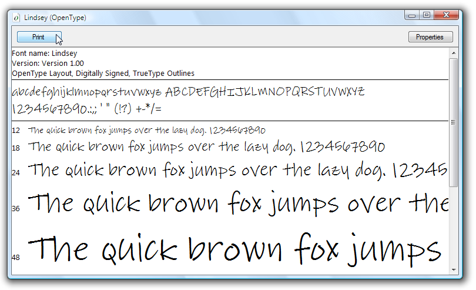

# Sample OpenType Font Pack
This topic provides an overview of the sample [!INCLUDE[TLA#tla_opentype](../../../../includes/tlasharptla-opentype-md.md)] fonts that are distributed with the [!INCLUDE[TLA2#tla_wcsdk](../../../../includes/tla2sharptla-wcsdk-md.md)]. The sample fonts support extended [!INCLUDE[TLA#tla_opentype](../../../../includes/tlasharptla-opentype-md.md)] features that can be used by [!INCLUDE[TLA#tla_winclient](../../../../includes/tlasharptla-winclient-md.md)] applications.  
  
  
   
## Fonts in the OpenType Font Pack  
 The [!INCLUDE[TLA2#tla_wcsdk](../../../../includes/tla2sharptla-wcsdk-md.md)] provides a set of sample [!INCLUDE[TLA#tla_opentype](../../../../includes/tlasharptla-opentype-md.md)] fonts that you can use in creating [!INCLUDE[TLA#tla_winclient](../../../../includes/tlasharptla-winclient-md.md)] applications. The sample fonts are supplied under license from Ascender Corporation. These fonts implement only a subset of the total features defined by the [!INCLUDE[TLA#tla_opentype](../../../../includes/tlasharptla-opentype-md.md)] format. The following table lists the names of the sample [!INCLUDE[TLA#tla_opentype](../../../../includes/tlasharptla-opentype-md.md)] fonts.  
  
|**Name**|**File**|  
|--------------|--------------|  
|Kootenay|Kooten.ttf|  
|Lindsey|Linds.ttf|  
|Miramonte|Miramo.ttf|  
|Miramonte Bold|Miramob.ttf|  
|Pericles|Peric.ttf|  
|Pericles Light|Pericl.ttf|  
|Pescadero|Pesca.ttf|  
|Pescadero Bold|Pescab.ttf|  
  
 The following illustration shows what the sample [!INCLUDE[TLA#tla_opentype](../../../../includes/tlasharptla-opentype-md.md)] fonts look like.  
  
   
Fonts in the OpenType Font Pack  
  
 The sample fonts are supplied under license from Ascender Corporation. Ascender is a provider of advanced font products. To license extended or custom versions of the sample fonts, see [Ascender Corporation's Web site](http://go.microsoft.com/fwlink/?LinkId=182627).  
  
> [!NOTE]
>  As a developer it is your responsibility to ensure that you have the required license rights for any font you embed within an application or otherwise redistribute.  
  
   
## Installing the Fonts  
 You have the option of installing the sample [!INCLUDE[TLA#tla_opentype](../../../../includes/tlasharptla-opentype-md.md)] fonts to the default [!INCLUDE[TLA#tla_mswin](../../../../includes/tlasharptla-mswin-md.md)] Fonts directory, **\WINDOWS\Fonts**. Use the Fonts control panel to install the fonts. Once these fonts are on your computer, they are accessible to all applications that reference default [!INCLUDE[TLA#tla_mswin](../../../../includes/tlasharptla-mswin-md.md)] fonts. You can display a representative set of characters in several font sizes by doubling-clicking the font file. The following screenshot shows the Lindsey font file, Linds.ttf.  
  
   
Displaying the Lindsey font  
  
   
## Using the Fonts  
 There are two ways that you can use fonts in your application. You can add fonts to your application as project content items that are not embedded as resources within an assembly. Alternatively, you can add fonts to your application as project resource items that are embedded within the application's assembly files. For more information, see [Packaging Fonts with Applications](../../../../docs/framework/wpf/advanced/packaging-fonts-with-applications.md).  
  
## See Also  
 <xref:System.Windows.Documents.Typography>  
 [OpenType Font Features](../../../../docs/framework/wpf/advanced/opentype-font-features.md)  
 [Packaging Fonts with Applications](../../../../docs/framework/wpf/advanced/packaging-fonts-with-applications.md)
