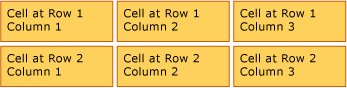
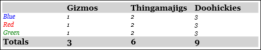
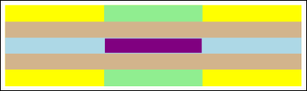

# Table Overview
<xref:System.Windows.Documents.Table> is a block level element that supports grid-based presentation of Flow document content. The flexibility of this element makes it very useful, but also makes it more complicated to understand and use correctly.  
  
 This topic contains the following sections.  
  
-   [Table Basics](#table_basics)  
  
-   [How is Table Different then Grid?](#table_vs_Grid)  
  
-   [Basic Table Structure](#basic_table_structure)  
  
-   [Table Containment](#table_containment)  
  
-   [Row Groupings](#row_groupings)  
  
-   [Background Rendering Precedence](#rendering_precedence)  
  
-   [Spanning Rows or Columns](#spanning_rows_or_columns)  
  
-   [Building a Table With Code](#building_a_table_with_code)  
  
-   [Related Topics] 
  
   
## Table Basics  
  
   
### How is Table Different then Grid?  
 <xref:System.Windows.Documents.Table> and <xref:System.Windows.Controls.Grid> share some common functionality, but each is best suited for different scenarios. A <xref:System.Windows.Documents.Table> is designed for use within flow content (see [Flow Document Overview](../../../../docs/framework/wpf/advanced/flow-document-overview.md) for more information on flow content). Grids are best used inside of forms (basically anywhere outside of flow content). Within a <xref:System.Windows.Documents.FlowDocument>, <xref:System.Windows.Documents.Table> supports flow content behaviors like pagination, column reflow, and content selection while a <xref:System.Windows.Controls.Grid> does not. A <xref:System.Windows.Controls.Grid> on the other hand is best used outside of a <xref:System.Windows.Documents.FlowDocument> for many reasons including <xref:System.Windows.Controls.Grid> adds elements based on a row and column index, <xref:System.Windows.Documents.Table> does not. The <xref:System.Windows.Controls.Grid> element allows layering of child content, allowing more than one element to exist within a single "cell." <xref:System.Windows.Documents.Table> does not support layering. Child elements of a <xref:System.Windows.Controls.Grid> can be absolutely positioned relative to the area of their "cell" boundaries. <xref:System.Windows.Documents.Table> does not support this feature. Finally, a <xref:System.Windows.Controls.Grid> requires less resources then a <xref:System.Windows.Documents.Table> so consider using a <xref:System.Windows.Controls.Grid> to improve performance.  
  
   
### Basic Table Structure  
 <xref:System.Windows.Documents.Table> provides a grid-based presentation consisting of columns (represented by <xref:System.Windows.Documents.TableColumn> elements) and rows (represented by <xref:System.Windows.Documents.TableRow> elements). <xref:System.Windows.Documents.TableColumn> elements do not host content; they simply define columns and characteristics of columns. <xref:System.Windows.Documents.TableRow> elements must be hosted in a <xref:System.Windows.Documents.TableRowGroup> element, which defines a grouping of rows for the table. <xref:System.Windows.Documents.TableCell> elements, which contain the actual content to be presented by the table, must be hosted in a <xref:System.Windows.Documents.TableRow> element. <xref:System.Windows.Documents.TableCell> may only contain elements that derive from <xref:System.Windows.Documents.Block>.  Valid child elements for a <xref:System.Windows.Documents.TableCell> include.  
  
-   <xref:System.Windows.Documents.BlockUIContainer>  
  
-   <xref:System.Windows.Documents.List>  
  
-   <xref:System.Windows.Documents.Paragraph>  
  
-   <xref:System.Windows.Documents.Section>  
  
-   <xref:System.Windows.Documents.Table>  
  
> [!NOTE]
>  <xref:System.Windows.Documents.TableCell> elements may not directly host text content. For more information about the containment rules for flow content elements like <xref:System.Windows.Documents.TableCell>, see [Flow Document Overview](../../../../docs/framework/wpf/advanced/flow-document-overview.md).  
  
> [!NOTE]
>  <xref:System.Windows.Documents.Table> is similar to the <xref:System.Windows.Controls.Grid> element but has more capabilities and, therefore, requires greater resource overhead.  
  
 The following example defines a simple 2 x 3 table with [!INCLUDE[TLA#tla_titlexaml](../../../../includes/tlasharptla-titlexaml-md.md)].  
  
 [!code-xaml[TableSnippets2#_Table_BasicLayout](../../../../samples/snippets/csharp/VS_Snippets_Wpf/TableSnippets2/CSharp/Window1.xaml#_table_basiclayout)]  
  
 The following figure shows how this example renders.  
  
   
  
   
### Table Containment  
 <xref:System.Windows.Documents.Table> derives from the <xref:System.Windows.Documents.Block> element, and adheres to the common rules for <xref:System.Windows.Documents.Block> level elements.  A <xref:System.Windows.Documents.Table> element may be contained by any of the following elements:  
  
-   <xref:System.Windows.Documents.FlowDocument>  
  
-   <xref:System.Windows.Documents.TableCell>  
  
-   <xref:System.Windows.Controls.ListBoxItem>  
  
-   <xref:System.Windows.Controls.ListViewItem>  
  
-   <xref:System.Windows.Documents.Section>  
  
-   <xref:System.Windows.Documents.Floater>  
  
-   <xref:System.Windows.Documents.Figure>  
  
   
### Row Groupings  
 The <xref:System.Windows.Documents.TableRowGroup> element provides a way to arbitrarily group rows within a table; every row in a table must belong to a row grouping.  Rows within a row group often share a common intent, and may be styled as a group.  A common use for row groupings is to separate special-purpose rows, such as a title, header, and footer rows, from the primary content contained by the table.  
  
 The following example uses [!INCLUDE[TLA#tla_titlexaml](../../../../includes/tlasharptla-titlexaml-md.md)] to define a table with styled header and footer rows.  
  
 [!code-xaml[TableSnippets2#_Table_RowGroups](../../../../samples/snippets/csharp/VS_Snippets_Wpf/TableSnippets2/CSharp/Window1.xaml#_table_rowgroups)]  
  
 The following figure shows how this example renders.  
  
   
  
   
### Background Rendering Precedence  
 Table elements render in the following order (z-order from lowest to highest). This order cannot be changed. For example, there is no "Z-order" property for these elements that you can use to override this established order.  
  
1.  <xref:System.Windows.Documents.Table>  
  
2.  <xref:System.Windows.Documents.TableColumn>  
  
3.  <xref:System.Windows.Documents.TableRowGroup>  
  
4.  <xref:System.Windows.Documents.TableRow>  
  
5.  <xref:System.Windows.Documents.TableCell>  
  
 Consider the following example, which defines background colors for each of these elements within a table.  
  
 [!code-xaml[TableSnippets2#_Table_ZOrder](../../../../samples/snippets/csharp/VS_Snippets_Wpf/TableSnippets2/CSharp/Window1.xaml#_table_zorder)]  
  
 The following figure shows how this example renders (showing background colors only).  
  
   
  
   
### Spanning Rows or Columns  
 Table cells may be configured to span multiple rows or columns by using the <xref:System.Windows.Documents.TableCell.RowSpan%2A> or <xref:System.Windows.Documents.TableCell.ColumnSpan%2A> attributes, respectively.  
  
 Consider the following example, in which a cell spans three columns.  
  
 [!code-xaml[TableSnippets2#_Table_ColumnSpan](../../../../samples/snippets/csharp/VS_Snippets_Wpf/TableSnippets2/CSharp/Window1.xaml#_table_columnspan)]  
  
 The following figure shows how this example renders.  
  
   
  
   
## Building a Table With Code  
 The following examples show how to programmatically create a <xref:System.Windows.Documents.Table> and populate it with content. The contents of the table are apportioned into five rows (represented by <xref:System.Windows.Documents.TableRow> objects contained in a <xref:System.Windows.Documents.Table.RowGroups%2A> object) and six columns (represented by <xref:System.Windows.Documents.TableColumn> objects). The rows are used for different presentation purposes, including a title row intended to title the entire table, a header row to describe the columns of data in the table, and a footer row with summary information.  Note that the notion of "title", "header", and "footer" rows are not inherent to the table; these are simply rows with different characteristics. Table cells contain the actual content, which can be comprised of text, images, or nearly any other [!INCLUDE[TLA#tla_ui](../../../../includes/tlasharptla-ui-md.md)] element.  
  
 First, a <xref:System.Windows.Documents.FlowDocument> is created to host the <xref:System.Windows.Documents.Table>, and a new <xref:System.Windows.Documents.Table> is created and added to the contents of the <xref:System.Windows.Documents.FlowDocument>.  
  
 [!code-csharp[TableSnippets#_TableCreate](../../../../samples/snippets/csharp/VS_Snippets_Wpf/TableSnippets/CSharp/Table.cs#_tablecreate)]
 [!code-vb[TableSnippets#_TableCreate](../../../../samples/snippets/visualbasic/VS_Snippets_Wpf/TableSnippets/VisualBasic/Table.vb#_tablecreate)]  
  
 Next, six <xref:System.Windows.Documents.TableColumn> objects are created and added to the table's <xref:System.Windows.Documents.Table.Columns%2A> collection, with some formatting applied.  
  
> [!NOTE]
>  Note that the table's <xref:System.Windows.Documents.Table.Columns%2A> collection uses standard zero-based indexing.  
  
 [!code-csharp[TableSnippets#_TableCreateColumns](../../../../samples/snippets/csharp/VS_Snippets_Wpf/TableSnippets/CSharp/Table.cs#_tablecreatecolumns)]
 [!code-vb[TableSnippets#_TableCreateColumns](../../../../samples/snippets/visualbasic/VS_Snippets_Wpf/TableSnippets/VisualBasic/Table.vb#_tablecreatecolumns)]  
  
 Next, a title row is created and added to the table with some formatting applied.  The title row happens to contain a single cell that spans all six columns in the table.  
  
 [!code-csharp[TableSnippets#_TableAddTitleRow](../../../../samples/snippets/csharp/VS_Snippets_Wpf/TableSnippets/CSharp/Table.cs#_tableaddtitlerow)]
 [!code-vb[TableSnippets#_TableAddTitleRow](../../../../samples/snippets/visualbasic/VS_Snippets_Wpf/TableSnippets/VisualBasic/Table.vb#_tableaddtitlerow)]  
  
 Next, a header row is created and added to the table, and the cells in the header row are created and populated with content.  
  
 [!code-csharp[TableSnippets#_TableAddHeaderRow](../../../../samples/snippets/csharp/VS_Snippets_Wpf/TableSnippets/CSharp/Table.cs#_tableaddheaderrow)]
 [!code-vb[TableSnippets#_TableAddHeaderRow](../../../../samples/snippets/visualbasic/VS_Snippets_Wpf/TableSnippets/VisualBasic/Table.vb#_tableaddheaderrow)]  
  
 Next, a row for data is created and added to the table, and the cells in this row are created and populated with content.  Building this row is similar to building the header row, with slightly different formatting applied.  
  
 [!code-csharp[TableSnippets#_TableAddDataRow](../../../../samples/snippets/csharp/VS_Snippets_Wpf/TableSnippets/CSharp/Table.cs#_tableadddatarow)]
 [!code-vb[TableSnippets#_TableAddDataRow](../../../../samples/snippets/visualbasic/VS_Snippets_Wpf/TableSnippets/VisualBasic/Table.vb#_tableadddatarow)]  
  
 Finally, a footer row is created, added, and formatted.  Like the title row, the footer contains a single cell that spans all six columns in the table.  
  
 [!code-csharp[TableSnippets#_TableAddFooterRow](../../../../samples/snippets/csharp/VS_Snippets_Wpf/TableSnippets/CSharp/Table.cs#_tableaddfooterrow)]
 [!code-vb[TableSnippets#_TableAddFooterRow](../../../../samples/snippets/visualbasic/VS_Snippets_Wpf/TableSnippets/VisualBasic/Table.vb#_tableaddfooterrow)]  
  
## See Also  
 [Flow Document Overview](../../../../docs/framework/wpf/advanced/flow-document-overview.md)  
 [Define a Table with XAML](../../../../docs/framework/wpf/advanced/how-to-define-a-table-with-xaml.md)  
 [Documents in WPF](../../../../docs/framework/wpf/advanced/documents-in-wpf.md)  
 [Use Flow Content Elements](../../../../docs/framework/wpf/advanced/how-to-use-flow-content-elements.md)
