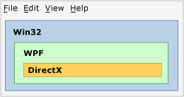
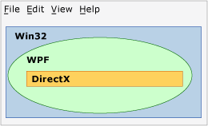

# Technology Regions Overview
If multiple presentation technologies are used in an application, such as WPF, Win32, or DirectX, they must share the rendering areas within a common top-level window. This topic describes issues that might influence the presentation and input for your WPF interoperation application.  
  
## Regions  
 Within a top-level window, you can conceptualize that each HWND that comprises one of the technologies of an interoperation application has its own region (also called "airspace"). Each pixel within the window belongs to exactly one HWND, which constitutes the region of that HWND. (Strictly speaking, there is more than one [!INCLUDE[TLA2#tla_winclient](../../../../includes/tla2sharptla-winclient-md.md)] region if there is more than one [!INCLUDE[TLA2#tla_winclient](../../../../includes/tla2sharptla-winclient-md.md)] HWND, but for purposes of this discussion, you can assume there is only one). The region implies that all layers or other windows that attempt to render above that pixel during application lifetime must be part of the same render-level technology. Attempting to render [!INCLUDE[TLA2#tla_winclient](../../../../includes/tla2sharptla-winclient-md.md)] pixels over [!INCLUDE[TLA2#tla_win32](../../../../includes/tla2sharptla-win32-md.md)] leads to undesirable results, and is disallowed as much as possible through the interoperation [!INCLUDE[TLA2#tla_api#plural](../../../../includes/tla2sharptla-apisharpplural-md.md)].  
  
### Region Examples  
 The following illustration shows an application that mixes [!INCLUDE[TLA2#tla_win32](../../../../includes/tla2sharptla-win32-md.md)], [!INCLUDE[TLA2#tla_dx](../../../../includes/tla2sharptla-dx-md.md)], and [!INCLUDE[TLA2#tla_winclient](../../../../includes/tla2sharptla-winclient-md.md)]. Each technology uses its own separate, non-overlapping set of pixels, and there are no region issues.  
  
   
  
 Suppose that this application uses the mouse pointer position to create an animation that attempts to render over any of these three regions. No matter which technology was responsible for the animation itself, that technology would violate the region of the other two. The following illustration shows an attempt to render a WPF circle over a Win32 region.  
  
   
  
 Another violation is if you try to use transparency/alpha blending between different technologies.  In the following illustration, the [!INCLUDE[TLA2#tla_winclient](../../../../includes/tla2sharptla-winclient-md.md)] box violates the [!INCLUDE[TLA2#tla_win32](../../../../includes/tla2sharptla-win32-md.md)] and [!INCLUDE[TLA2#tla_dx](../../../../includes/tla2sharptla-dx-md.md)] regions. Because pixels in that [!INCLUDE[TLA2#tla_winclient](../../../../includes/tla2sharptla-winclient-md.md)] box are semi-transparent, they would have to be owned jointly by both [!INCLUDE[TLA2#tla_dx](../../../../includes/tla2sharptla-dx-md.md)] and [!INCLUDE[TLA2#tla_winclient](../../../../includes/tla2sharptla-winclient-md.md)], which is not possible.  So this is another violation and cannot be built.  
  
   
  
 The previous three examples used rectangular regions, but different shapes are possible.  For example, a region can have a hole. The following illustration shows a [!INCLUDE[TLA2#tla_win32](../../../../includes/tla2sharptla-win32-md.md)] region with a rectangular hole this is the size of the [!INCLUDE[TLA2#tla_winclient](../../../../includes/tla2sharptla-winclient-md.md)] and [!INCLUDE[TLA2#tla_dx](../../../../includes/tla2sharptla-dx-md.md)] regions combined.  
  
   
  
 Regions can also be completely nonrectangular, or any shape describable by a [!INCLUDE[TLA2#tla_win32](../../../../includes/tla2sharptla-win32-md.md)] HRGN (region).  
  
   
  
## Transparency and Top-Level Windows  
 The window manager in Windows only really processes [!INCLUDE[TLA2#tla_win32](../../../../includes/tla2sharptla-win32-md.md)] HWNDs. Therefore, every [!INCLUDE[TLA2#tla_winclient](../../../../includes/tla2sharptla-winclient-md.md)] <xref:System.Windows.Window> is an HWND. The <xref:System.Windows.Window> HWND must abide by the general rules for any HWND. Within that HWND, [!INCLUDE[TLA2#tla_winclient](../../../../includes/tla2sharptla-winclient-md.md)] code can do whatever the overall [!INCLUDE[TLA2#tla_winclient](../../../../includes/tla2sharptla-winclient-md.md)] [!INCLUDE[TLA2#tla_api#plural](../../../../includes/tla2sharptla-apisharpplural-md.md)] support. But for interactions with other HWNDs on the desktop, [!INCLUDE[TLA2#tla_winclient](../../../../includes/tla2sharptla-winclient-md.md)] must abide by [!INCLUDE[TLA2#tla_win32](../../../../includes/tla2sharptla-win32-md.md)] processing and rendering rules.  [!INCLUDE[TLA2#tla_winclient](../../../../includes/tla2sharptla-winclient-md.md)] supports non-rectangular windows by using [!INCLUDE[TLA2#tla_win32](../../../../includes/tla2sharptla-win32-md.md)] [!INCLUDE[TLA2#tla_api#plural](../../../../includes/tla2sharptla-apisharpplural-md.md)]—HRGNs for non-rectangular windows, and layered windows for a per-pixel alpha.  
  
 Constant alpha and color keys are not supported.  [!INCLUDE[TLA2#tla_win32](../../../../includes/tla2sharptla-win32-md.md)] layered window capabilities vary by platform.  
  
 Layered windows can make the entire window translucent (semi-transparent) by specifying an alpha value to apply to every pixel in the window.  ([!INCLUDE[TLA2#tla_win32](../../../../includes/tla2sharptla-win32-md.md)] in fact supports per-pixel alpha, but this is very difficult to use in practical programs because in this mode you would need to draw any child HWND yourself, including dialogs and dropdowns).  
  
 [!INCLUDE[TLA2#tla_winclient](../../../../includes/tla2sharptla-winclient-md.md)] supports HRGNs; however, there are no managed [!INCLUDE[TLA2#tla_api#plural](../../../../includes/tla2sharptla-apisharpplural-md.md)] for this functionality. You can use platform invoke and <xref:System.Windows.Interop.HwndSource> to call the relevant [!INCLUDE[TLA2#tla_win32](../../../../includes/tla2sharptla-win32-md.md)] [!INCLUDE[TLA2#tla_api#plural](../../../../includes/tla2sharptla-apisharpplural-md.md)]. For more information, see [Calling Native Functions from Managed Code](/cpp/dotnet/calling-native-functions-from-managed-code).  
  
 [!INCLUDE[TLA2#tla_winclient](../../../../includes/tla2sharptla-winclient-md.md)] layered windows have different capabilities on different operating systems. This is because [!INCLUDE[TLA2#tla_winclient](../../../../includes/tla2sharptla-winclient-md.md)] uses [!INCLUDE[TLA2#tla_dx](../../../../includes/tla2sharptla-dx-md.md)] to render, and layered windows were primarily designed for [!INCLUDE[TLA2#tla_gdi](../../../../includes/tla2sharptla-gdi-md.md)] rendering, not [!INCLUDE[TLA2#tla_dx](../../../../includes/tla2sharptla-dx-md.md)] rendering.  
  
-   [!INCLUDE[TLA2#tla_winclient](../../../../includes/tla2sharptla-winclient-md.md)] supports hardware accelerated layered windows on [!INCLUDE[TLA#tla_longhorn](../../../../includes/tlasharptla-longhorn-md.md)] and later. Hardware accelerated layered windows on [!INCLUDE[TLA2#tla_winxp](../../../../includes/tla2sharptla-winxp-md.md)] require support from [!INCLUDE[TLA#tla_dx](../../../../includes/tlasharptla-dx-md.md)], so the capabilities will depend on the version of [!INCLUDE[TLA#tla_dx](../../../../includes/tlasharptla-dx-md.md)] on that machine.  
  
-   [!INCLUDE[TLA2#tla_winclient](../../../../includes/tla2sharptla-winclient-md.md)] does not support transparency color keys, because [!INCLUDE[TLA2#tla_winclient](../../../../includes/tla2sharptla-winclient-md.md)] cannot guarantee to render the exact color you requested, particularly when rendering is hardware-accelerated.  
  
-   If your application is running on [!INCLUDE[TLA2#tla_winxp](../../../../includes/tla2sharptla-winxp-md.md)], layered windows on top of [!INCLUDE[TLA2#tla_dx](../../../../includes/tla2sharptla-dx-md.md)] surfaces flicker when the [!INCLUDE[TLA2#tla_dx](../../../../includes/tla2sharptla-dx-md.md)] application renders.  (The actual rendering sequence is that [!INCLUDE[TLA#tla_gdi](../../../../includes/tlasharptla-gdi-md.md)] hides the layered window, then [!INCLUDE[TLA2#tla_dx](../../../../includes/tla2sharptla-dx-md.md)] draws, and then [!INCLUDE[TLA#tla_gdi](../../../../includes/tlasharptla-gdi-md.md)] puts the layered window back).  Non-[!INCLUDE[TLA2#tla_winclient](../../../../includes/tla2sharptla-winclient-md.md)] layered windows also have this limitation.  
  
## See Also  
 [WPF and Win32 Interoperation](../../../../docs/framework/wpf/advanced/wpf-and-win32-interoperation.md)  
 [Walkthrough: Hosting a WPF Clock in Win32](../../../../docs/framework/wpf/advanced/walkthrough-hosting-a-wpf-clock-in-win32.md)  
 [Hosting Win32 Content in WPF](../../../../docs/framework/wpf/advanced/hosting-win32-content-in-wpf.md)
