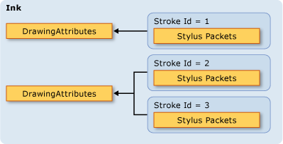
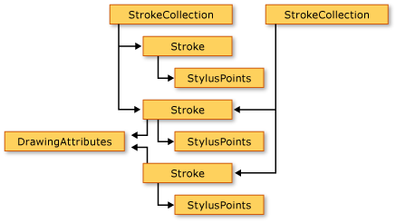
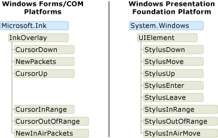
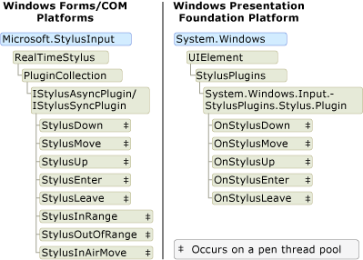

# The Ink Object Model: Windows Forms and COM versus WPF

There are essentially three platforms that support digital ink: the Tablet PC Windows Forms platform, the Tablet PC COM platform, and the [!INCLUDE[TLA#tla_wpf](../../../../includes/tlasharptla-wpf-md.md)] platform.  The Windows Forms and COM platforms share a similar object model, but the object model for the [!INCLUDE[TLA2#tla_wpf](../../../../includes/tla2sharptla-wpf-md.md)] platform is substantially different.  This topic discusses the differences at a high-level so that developers that have worked with one object model can better understand the other.  
  
## Enabling Ink in an Application  
 All three platforms ship objects and controls that enable an application to receive input from a tablet pen.  The Windows Forms and COM platforms ship with [Microsoft.Ink.InkPicture](https://msdn.microsoft.com/library/aa514604.aspx), [Microsoft.Ink.InkEdit](https://msdn.microsoft.com/library/ms835842.aspx), [Microsoft.Ink.InkOverlay](https://msdn.microsoft.com/library/ms833057.aspx) and [Microsoft.Ink.InkCollector](https://msdn.microsoft.com/library/ms836493.aspx) classes.  [Microsoft.Ink.InkPicture](https://msdn.microsoft.com/library/aa514604.aspx) and [Microsoft.Ink.InkEdit](https://msdn.microsoft.com/library/ms835842.aspx) are controls that you can add to an application to collect ink.  The [Microsoft.Ink.InkOverlay](https://msdn.microsoft.com/library/ms833057.aspx) and [Microsoft.Ink.InkCollector](https://msdn.microsoft.com/library/ms836493.aspx) can be attached to an existing window to ink-enable windows and custom controls.  
  
 The WPF platform includes the <xref:System.Windows.Controls.InkCanvas> control.  You can add an <xref:System.Windows.Controls.InkCanvas> to your application and begin collecting ink immediately. With the <xref:System.Windows.Controls.InkCanvas>, the user can copy, select, and resize ink.  You can add other controls to the <xref:System.Windows.Controls.InkCanvas>, and the user can handwrite over those controls, too.  You can create an ink-enabled custom control by adding an <xref:System.Windows.Controls.InkPresenter> to it and collecting its stylus points.  
  
 The following table lists where to learn more about enabling ink in an application:  
  
|To do this…|On the WPF Platform…|On the Windows Forms/COM Platforms…|  
|-----------------|--------------------------|------------------------------------------|  
|Add an ink-enabled control to an application|See [Getting Started with Ink](../../../../docs/framework/wpf/advanced/getting-started-with-ink.md).|See [Auto Claims Form Sample](http://msdn.microsoft.com/bec4333a-62ca-4254-a39b-04bc2c556992)|  
|Enable ink on a custom control|See [Creating an Ink Input Control](../../../../docs/framework/wpf/advanced/creating-an-ink-input-control.md).|See [Ink Clipboard Sample](http://msdn.microsoft.com/a0c42f1c-543d-44f8-83d9-fe810de410ff).|  
  
## Ink Data  
 On the Windows Forms and COM platforms, [Microsoft.Ink.InkCollector](https://msdn.microsoft.com/library/ms836493.aspx), [Microsoft.Ink.InkOverlay](https://msdn.microsoft.com/library/ms833057.aspx), [Microsoft.Ink.InkEdit](https://msdn.microsoft.com/library/ms835842.aspx), and [Microsoft.Ink.InkPicture](https://msdn.microsoft.com/library/aa514604.aspx) each expose a [Microsoft.Ink.Ink](https://msdn.microsoft.com/library/aa515768.aspx?displayProperty=nameWithType) object. The [Microsoft.Ink.Ink](https://msdn.microsoft.com/library/aa515768.aspx) object contains the data for one or more [Microsoft.Ink.Stroke](https://msdn.microsoft.com/library/ms827842.aspx?displayProperty=nameWithType) objects and exposes common methods and properties to manage and manipulate those strokes.  The [Microsoft.Ink.Ink](https://msdn.microsoft.com/library/aa515768.aspx) object manages the lifetime of the strokes it contains; the [Microsoft.Ink.Ink](https://msdn.microsoft.com/library/aa515768.aspx) object creates and deletes the strokes that it owns.  Each [Microsoft.Ink.Stroke](https://msdn.microsoft.com/library/ms827842.aspx) has an identifier that is unique within its parent [Microsoft.Ink.Ink](https://msdn.microsoft.com/library/aa515768.aspx) object.  
  
 On the WPF platform, the <xref:System.Windows.Ink.Stroke?displayProperty=nameWithType> class owns and manages its own lifetime. A group of <xref:System.Windows.Ink.Stroke> objects can be collected together in a <xref:System.Windows.Ink.StrokeCollection>, which provides methods for common ink data management operations such as hit testing, erasing, transforming, and serializing the ink. A <xref:System.Windows.Ink.Stroke> can belong to zero, one, or more <xref:System.Windows.Ink.StrokeCollection> objects at any give time.  Instead of having a [Microsoft.Ink.Ink](https://msdn.microsoft.com/library/aa515768.aspx?displayProperty=nameWithType) object, the <xref:System.Windows.Controls.InkCanvas> and <xref:System.Windows.Controls.InkPresenter> contain a <xref:System.Windows.Ink.StrokeCollection?displayProperty=nameWithType>.  
  
 The following pair of illustrations compares the ink data object models.  On the Windows Forms and COM platforms, the [Microsoft.Ink.Ink](https://msdn.microsoft.com/library/aa515768.aspx?displayProperty=nameWithType) object constrains the lifetime of the [Microsoft.Ink.Stroke](https://msdn.microsoft.com/library/ms827842.aspx?displayProperty=nameWithType) objects, and the stylus packets belong to the individual strokes.  Two or more strokes can reference the same [Microsoft.Ink.DrawingAttributes](https://msdn.microsoft.com/library/ms837931.aspx?displayProperty=nameWithType) object, as shown in the following illustration.  
  
   
  
 On the [!INCLUDE[TLA2#tla_winclient](../../../../includes/tla2sharptla-winclient-md.md)], each <xref:System.Windows.Ink.Stroke?displayProperty=nameWithType> is a common language runtime object that exists as long as something has a reference to it.  Each <xref:System.Windows.Ink.Stroke> references a <xref:System.Windows.Input.StylusPointCollection> and <xref:System.Windows.Ink.DrawingAttributes?displayProperty=nameWithType> object, which are also common language runtime objects.  
  
   
  
 The following table compares how to accomplish some common tasks on the [!INCLUDE[TLA2#tla_wpf](../../../../includes/tla2sharptla-wpf-md.md)] platform and the Windows Forms and COM platforms.  
  
|Task|Windows Presentation Foundation|Windows Forms and COM|  
|----------|-------------------------------------|---------------------------|  
|Save Ink|<xref:System.Windows.Ink.StrokeCollection.Save%2A>|[Microsoft.Ink.Ink.Save](https://technet.microsoft.com/library/security/microsoft.ink.ink.save(v=vs.90))|  
|Load Ink|Create a <xref:System.Windows.Ink.StrokeCollection> with the <xref:System.Windows.Ink.StrokeCollection.%23ctor%2A> constructor.|[Microsoft.Ink.Ink.Load](https://msdn.microsoft.com/library/microsoft.ink.ink.load(v=vs.90).aspx)|  
|Hit test|<xref:System.Windows.Ink.StrokeCollection.HitTest%2A>|[Microsoft.Ink.Ink.HitTest](https://msdn.microsoft.com/library/aa515934.aspx)|  
|Copy Ink|<xref:System.Windows.Controls.InkCanvas.CopySelection%2A>|[Microsoft.Ink.Ink.ClipboardCopy](https://msdn.microsoft.com/library/microsoft.ink.ink.clipboardcopy(v=vs.100).aspx)|  
|Paste Ink|<xref:System.Windows.Controls.InkCanvas.Paste%2A>|[Microsoft.Ink.Ink.ClipboardPaste](https://msdn.microsoft.com/library/microsoft.ink.ink.clipboardpaste(v=vs.100).aspx)|  
|Access custom properties on a collection of strokes|<xref:System.Windows.Ink.StrokeCollection.AddPropertyData%2A> (the properties are stored internally and accessed via <xref:System.Windows.Ink.StrokeCollection.AddPropertyData%2A>, <xref:System.Windows.Ink.StrokeCollection.RemovePropertyData%2A>, and <xref:System.Windows.Ink.StrokeCollection.ContainsPropertyData%2A>)|Use [Microsoft.Ink.Ink.ExtendedProperties](https://msdn.microsoft.com/library/microsoft.ink.ink.extendedproperties(v=vs.100).aspx)|  
  
### Sharing ink between platforms  
 Although the platforms have different object models for the ink data, sharing the data between the platforms is very easy. The following examples save ink from a Windows Forms application and load the ink into a Windows Presentation Foundation application.  
  
 [!code-csharp[WinFormWPFInk#UsingWinforms](../../../../samples/snippets/csharp/VS_Snippets_Wpf/WinformWPFInk/CSharp/Program.cs#usingwinforms)]
 [!code-vb[WinFormWPFInk#UsingWinforms](../../../../samples/snippets/visualbasic/VS_Snippets_Wpf/WinformWPFInk/VisualBasic/Module1.vb#usingwinforms)]  
[!code-csharp[WinFormWPFInk#SaveWinforms](../../../../samples/snippets/csharp/VS_Snippets_Wpf/WinformWPFInk/CSharp/Program.cs#savewinforms)]
[!code-vb[WinFormWPFInk#SaveWinforms](../../../../samples/snippets/visualbasic/VS_Snippets_Wpf/WinformWPFInk/VisualBasic/Module1.vb#savewinforms)]  
  
 [!code-csharp[WinFormWPFInk#UsingWPF](../../../../samples/snippets/csharp/VS_Snippets_Wpf/WinformWPFInk/CSharp/Program.cs#usingwpf)]
 [!code-vb[WinFormWPFInk#UsingWPF](../../../../samples/snippets/visualbasic/VS_Snippets_Wpf/WinformWPFInk/VisualBasic/Module1.vb#usingwpf)]  
[!code-csharp[WinFormWPFInk#LoadWPF](../../../../samples/snippets/csharp/VS_Snippets_Wpf/WinformWPFInk/CSharp/Program.cs#loadwpf)]
[!code-vb[WinFormWPFInk#LoadWPF](../../../../samples/snippets/visualbasic/VS_Snippets_Wpf/WinformWPFInk/VisualBasic/Module1.vb#loadwpf)]  
  
 The following examples save ink from a Windows Presentation Foundation application and load the ink into a Windows Forms application.  
  
 [!code-csharp[WinFormWPFInk#UsingWPF](../../../../samples/snippets/csharp/VS_Snippets_Wpf/WinformWPFInk/CSharp/Program.cs#usingwpf)]
 [!code-vb[WinFormWPFInk#UsingWPF](../../../../samples/snippets/visualbasic/VS_Snippets_Wpf/WinformWPFInk/VisualBasic/Module1.vb#usingwpf)]  
[!code-csharp[WinFormWPFInk#SaveWPF](../../../../samples/snippets/csharp/VS_Snippets_Wpf/WinformWPFInk/CSharp/Program.cs#savewpf)]
[!code-vb[WinFormWPFInk#SaveWPF](../../../../samples/snippets/visualbasic/VS_Snippets_Wpf/WinformWPFInk/VisualBasic/Module1.vb#savewpf)]  
  
 [!code-csharp[WinFormWPFInk#UsingWinforms](../../../../samples/snippets/csharp/VS_Snippets_Wpf/WinformWPFInk/CSharp/Program.cs#usingwinforms)]
 [!code-vb[WinFormWPFInk#UsingWinforms](../../../../samples/snippets/visualbasic/VS_Snippets_Wpf/WinformWPFInk/VisualBasic/Module1.vb#usingwinforms)]  
[!code-csharp[WinFormWPFInk#LoadWinforms](../../../../samples/snippets/csharp/VS_Snippets_Wpf/WinformWPFInk/CSharp/Program.cs#loadwinforms)]
[!code-vb[WinFormWPFInk#LoadWinforms](../../../../samples/snippets/visualbasic/VS_Snippets_Wpf/WinformWPFInk/VisualBasic/Module1.vb#loadwinforms)]
## Events from the Tablet Pen  
 The [Microsoft.Ink.InkOverlay](https://msdn.microsoft.com/library/ms833057.aspx), [Microsoft.Ink.InkCollector](https://msdn.microsoft.com/library/ms836493.aspx), and [Microsoft.Ink.InkPicture](https://msdn.microsoft.com/library/aa514604.aspx) on the Windows Forms and COM platforms receive events when the user inputs pen data.  The [Microsoft.Ink.InkOverlay](https://msdn.microsoft.com/library/ms833057.aspx) or [Microsoft.Ink.InkCollector](https://msdn.microsoft.com/library/ms836493.aspx) is attached to a window or a control, and can subscribe to the events raised by the tablet input data.  The thread on which these events occurs depends on whether the events are raised with a pen, a mouse, or programmatically.  For more information about threading in relation to these events, see [General Threading Considerations](http://msdn.microsoft.com/cf35724f-5f80-4b3e-992a-a9d5ea99aae9) and [Threads on Which an Event Can Fire](http://msdn.microsoft.com/d1a5ab9b-d474-4ed7-9aa8-b5bdb771934f).  
  
 On the Windows Presentation Foundation platform, the <xref:System.Windows.UIElement> class has events for pen input. This means that every control exposes the full set of stylus events.  The stylus events have tunneling/bubbling event pairs and always occur on the application thread.  For more information, see [Routed Events Overview](../../../../docs/framework/wpf/advanced/routed-events-overview.md).  
  
 The following diagram shows compares the object models for the classes that raise stylus events. The Windows Presentation Foundation object model shows only the bubbling events, not the tunneling event counterparts.  
  
   
  
## Pen Data  
 All three platforms provide you with ways to intercept and manipulate the data that comes in from a tablet pen.  On the Windows Forms and COM Platforms, this is achieved by creating a [Microsoft.StylusInput.RealTimeStylus](https://msdn.microsoft.com/library/microsoft.stylusinput.realtimestylus(v=vs.100).aspx), attaching a window or control to it, and creating a class that implements the [Microsoft.StylusInput.IStylusSyncPlugin](https://msdn.microsoft.com/library/microsoft.stylusinput.istylussyncplugin(v=vs.100).aspx) or [Microsoft.StylusInput.IStylusAsyncPlugin](https://msdn.microsoft.com/library/microsoft.stylusinput.istylusasyncplugin(v=vs.100).aspx) interface. The custom plug-in is then added to the plug-in collection of the [Microsoft.StylusInput.RealTimeStylus](https://msdn.microsoft.com/library/microsoft.stylusinput.realtimestylus(v=vs.100).aspx). For more information about this object model, see [Architecture of the StylusInput APIs](http://msdn.microsoft.com/88bab0ab-df9f-4813-9a9f-9a137813f0b4).  
  
 On the [!INCLUDE[TLA2#tla_wpf](../../../../includes/tla2sharptla-wpf-md.md)] platform, the <xref:System.Windows.UIElement> class exposes a collection of plug-ins, similar in design to the [Microsoft.StylusInput.RealTimeStylus](https://msdn.microsoft.com/library/microsoft.stylusinput.realtimestylus(v=vs.100).aspx).  To intercept pen data, create a class that inherits from <xref:System.Windows.Input.StylusPlugIns.StylusPlugIn> and add the object to the <xref:System.Windows.UIElement.StylusPlugIns%2A> collection of the <xref:System.Windows.UIElement>. For more information about this interaction, see [Intercepting Input from the Stylus](../../../../docs/framework/wpf/advanced/intercepting-input-from-the-stylus.md).  
  
 On all platforms, a thread pool receives the ink data via stylus events and sends it to the application thread.  For more information about threading on the COM and Windows Platforms, see [Threading Considerations for the StylusInput APIs](http://msdn.microsoft.com/5d98768a-c60b-4bb0-8640-9bf38254d41f).  For more information about threading on the Windows Presentation Software, see [The Ink Threading Model](../../../../docs/framework/wpf/advanced/the-ink-threading-model.md).  
  
 The following illustration compares the object models for the classes that receive pen data on the pen thread pool.  
  
 
