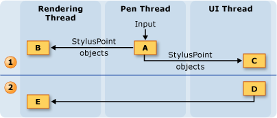
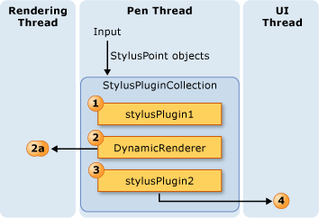
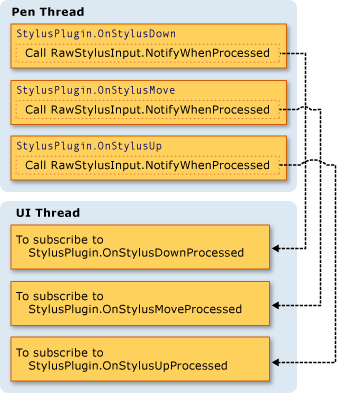
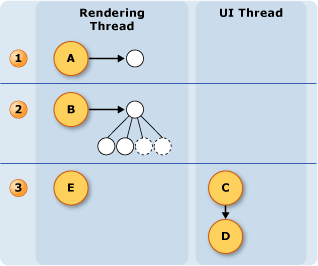

# The Ink Threading Model
One of the benefits of ink on a Tablet PC is that it feels a lot like writing with a regular pen and paper.  To accomplish this, the tablet pen collects input data at a much higher rate than a mouse does and renders the ink as the user writes.  The application's user interface (UI) thread is not sufficient for collecting pen data and rendering ink, because it can become blocked.  To solve this, a [!INCLUDE[TLA2#tla_winclient](../../../../includes/tla2sharptla-winclient-md.md)] application uses two additional threads when a user writes ink.  
  
 The following list describes the threads that take part in collecting and rendering digital ink:  
  
-   Pen thread - the thread that takes input from the stylus.  (In reality, this is a thread pool, but this topic refers to it as a pen thread.)  
  
-   Application user interface thread - the thread that controls the user interface of the application.  
  
-   Dynamic rendering thread - the thread that renders the ink while the user draws a stroke. The dynamic rendering thread is different than the thread that renders other UI elements for the application, as mentioned in Window Presentation Foundation [Threading Model](../../../../docs/framework/wpf/advanced/threading-model.md).  
  
 The inking model is the same whether the application uses the <xref:System.Windows.Controls.InkCanvas> or a custom control similar to the one in [Creating an Ink Input Control](../../../../docs/framework/wpf/advanced/creating-an-ink-input-control.md).  Although this topic discusses threading in terms of the <xref:System.Windows.Controls.InkCanvas>, the same concepts apply when you create a custom control.  
  
## Threading Overview  
 The following diagram illustrates the threading model when a user draws a stroke:  
  
   
  
1.  Actions occurring while the user draws the stroke  
  
    1.  When the user draws a stroke, the stylus points come in on the pen thread.  Stylus plug-ins, including the <xref:System.Windows.Input.StylusPlugIns.DynamicRenderer>, accept the stylus points on the pen thread and have the chance to modify them before the <xref:System.Windows.Controls.InkCanvas> receives them.  
  
    2.  The <xref:System.Windows.Input.StylusPlugIns.DynamicRenderer> renders the stylus points on the dynamic rendering thread. This happens at the same time as the previous step.  
  
    3.  The <xref:System.Windows.Controls.InkCanvas> receives the stylus points on the UI thread.  
  
2.  Actions occurring after the user ends the stroke  
  
    1.  When the user finishes drawing the stroke, the <xref:System.Windows.Controls.InkCanvas> creates a <xref:System.Windows.Ink.Stroke> object and adds it to the <xref:System.Windows.Controls.InkPresenter>, which statically renders it.  
  
    2.  The UI thread alerts the <xref:System.Windows.Input.StylusPlugIns.DynamicRenderer> that the stroke is statically rendered, so the <xref:System.Windows.Input.StylusPlugIns.DynamicRenderer> removes its visual representation of the stroke.  
  
## Ink collection and Stylus Plug-ins  
 Each <xref:System.Windows.UIElement> has a <xref:System.Windows.Input.StylusPlugIns.StylusPlugInCollection>.  The <xref:System.Windows.Input.StylusPlugIns.StylusPlugIn> objects in the <xref:System.Windows.Input.StylusPlugIns.StylusPlugInCollection> receive and can modify the stylus points on the pen thread. The <xref:System.Windows.Input.StylusPlugIns.StylusPlugIn> objects receive the stylus points according to their order in the <xref:System.Windows.Input.StylusPlugIns.StylusPlugInCollection>.  
  
 The following diagram illustrates the hypothetical situation where the <xref:System.Windows.UIElement.StylusPlugIns%2A> collection of a <xref:System.Windows.UIElement> contains `stylusPlugin1`, a <xref:System.Windows.Input.StylusPlugIns.DynamicRenderer>, and `stylusPlugin2`, in that order.  
  
   
  
 In the previous diagram, the following behavior takes place:  
  
1.  `StylusPlugin1` modifies the values for x and y.  
  
2.  <xref:System.Windows.Input.StylusPlugIns.DynamicRenderer> receives the modified stylus points and renders them on the dynamic rendering thread.  
  
3.  `StylusPlugin2` receives the modified stylus points and further modifies the values for x and y.  
  
4.  The application collects the stylus points, and, when the user finishes the stroke, statically renders the stroke.  
  
 Suppose that `stylusPlugin1` restricts the stylus points to a rectangle and `stylusPlugin2` translates the stylus points to the right.  In the previous scenario, the <xref:System.Windows.Input.StylusPlugIns.DynamicRenderer> receives the restricted stylus points, but not the translated stylus points.  When the user draws the stroke, the stroke is rendered within the bounds of the rectangle, but the stroke doesn't appear to be translated until the user lifts the pen.  
  
### Performing operations with a Stylus Plug-in on the UI thread  
 Because accurate hit-testing cannot be performed on the pen thread, some elements might occasionally receive stylus input intended for other elements. If you need to make sure the input was routed correctly before performing an operation, subscribe to and perform the operation in the <xref:System.Windows.Input.StylusPlugIns.StylusPlugIn.OnStylusDownProcessed%2A>, <xref:System.Windows.Input.StylusPlugIns.StylusPlugIn.OnStylusMoveProcessed%2A>, or <xref:System.Windows.Input.StylusPlugIns.StylusPlugIn.OnStylusUpProcessed%2A> method. These methods are invoked by the application thread after accurate hit-testing has been performed. To subscribe to these methods, call the <xref:System.Windows.Input.StylusPlugIns.RawStylusInput.NotifyWhenProcessed%2A> method in the method that occurs on the pen thread.  
  
 The following diagram illustrates the relationship between the pen thread and UI thread with respect to the stylus events of a <xref:System.Windows.Input.StylusPlugIns.StylusPlugIn>.  
  
   
  
## Rendering Ink  
 As the user draws a stroke, <xref:System.Windows.Input.StylusPlugIns.DynamicRenderer> renders the ink on a separate thread so the ink appears to "flow" from the pen even when the UI thread is busy.  The <xref:System.Windows.Input.StylusPlugIns.DynamicRenderer> builds a visual tree on the dynamic rendering thread as it collects stylus points.  When the user finishes the stroke, the <xref:System.Windows.Input.StylusPlugIns.DynamicRenderer> asks to be notified when the application does the next rendering pass.  After the application completes the next rendering pass, the <xref:System.Windows.Input.StylusPlugIns.DynamicRenderer> cleans up its visual tree.  The following diagram illustrates this process.  
  
   
  
1.  The user begins the stroke.  
  
    1.  The <xref:System.Windows.Input.StylusPlugIns.DynamicRenderer> creates the visual tree.  
  
2.  The user is drawing the stroke.  
  
    1.  The <xref:System.Windows.Input.StylusPlugIns.DynamicRenderer> builds the visual tree.  
  
3.  The user ends the stroke.  
  
    1.  The <xref:System.Windows.Controls.InkPresenter> adds the stroke to its visual tree.  
  
    2.  The Media Integration Layer (MIL) statically renders the strokes.  
  
    3.  The <xref:System.Windows.Input.StylusPlugIns.DynamicRenderer> cleans up the visuals.
