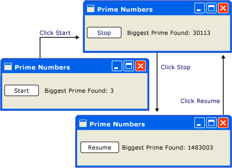
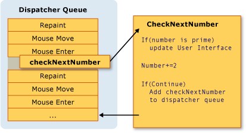
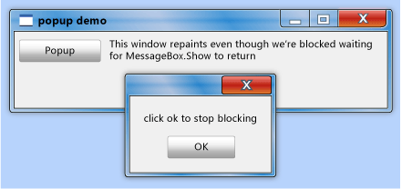

# Threading Model
[!INCLUDE[TLA#tla_winclient](../../../../includes/tlasharptla-winclient-md.md)] is designed to save developers from the difficulties of threading. As a result, the majority of [!INCLUDE[TLA2#tla_winclient](../../../../includes/tla2sharptla-winclient-md.md)] developers won't have to write an interface that uses more than one thread. Because multithreaded programs are complex and difficult to debug, they should be avoided when single-threaded solutions exist.  
  
 No matter how well architected, however, no [!INCLUDE[TLA2#tla_ui](../../../../includes/tla2sharptla-ui-md.md)] framework will ever be able to provide a single-threaded solution for every sort of problem. [!INCLUDE[TLA2#tla_winclient](../../../../includes/tla2sharptla-winclient-md.md)] comes close, but there are still situations where multiple threads improve [!INCLUDE[TLA#tla_ui](../../../../includes/tlasharptla-ui-md.md)] responsiveness or application performance. After discussing some background material, this paper explores some of these situations and then concludes with a discussion of some lower-level details.  
  

  
> [!NOTE]
>  This topic discusses threading by using the <xref:System.Windows.Threading.Dispatcher.BeginInvoke%2A> method for asynchronous calls. You can also make asynchronous calls by calling the <xref:System.Windows.Threading.Dispatcher.InvokeAsync%2A> method, which take an <xref:System.Action> or <xref:System.Func%601> as a parameter.  The <xref:System.Windows.Threading.Dispatcher.InvokeAsync%2A> method returns a <xref:System.Windows.Threading.DispatcherOperation> or <xref:System.Windows.Threading.DispatcherOperation%601>, which has a <xref:System.Windows.Threading.DispatcherOperation.Task%2A> property. You can use the `await` keyword with either the <xref:System.Windows.Threading.DispatcherOperation> or the associated <xref:System.Threading.Tasks.Task>. If you need to wait synchronously for the <xref:System.Threading.Tasks.Task> that is returned by a <xref:System.Windows.Threading.DispatcherOperation> or <xref:System.Windows.Threading.DispatcherOperation%601>, call the <xref:System.Windows.Threading.TaskExtensions.DispatcherOperationWait%2A> extension method.  Calling <xref:System.Threading.Tasks.Task.Wait%2A?displayProperty=nameWithType> will result in a deadlock. For more information about using a <xref:System.Threading.Tasks.Task> to perform asynchronous operations, see Task Parallelism.  The <xref:System.Windows.Threading.Dispatcher.Invoke%2A> method also has overloads that take an <xref:System.Action> or <xref:System.Func%601> as a parameter.  You can use the <xref:System.Windows.Threading.Dispatcher.Invoke%2A> method to make synchronous calls by passing in a delegate, <xref:System.Action> or <xref:System.Func%601>.  
  
   
## Overview and the Dispatcher  
 Typically, [!INCLUDE[TLA2#tla_winclient](../../../../includes/tla2sharptla-winclient-md.md)] applications start with two threads: one for handling rendering and another for managing the [!INCLUDE[TLA2#tla_ui](../../../../includes/tla2sharptla-ui-md.md)]. The rendering thread effectively runs hidden in the background while the [!INCLUDE[TLA2#tla_ui](../../../../includes/tla2sharptla-ui-md.md)] thread receives input, handles events, paints the screen, and runs application code. Most applications use a single [!INCLUDE[TLA2#tla_ui](../../../../includes/tla2sharptla-ui-md.md)] thread, although in some situations it is best to use several. We’ll discuss this with an example later.  
  
 The [!INCLUDE[TLA2#tla_ui](../../../../includes/tla2sharptla-ui-md.md)] thread queues work items inside an object called a <xref:System.Windows.Threading.Dispatcher>. The <xref:System.Windows.Threading.Dispatcher> selects work items on a priority basis and runs each one to completion.  Every [!INCLUDE[TLA2#tla_ui](../../../../includes/tla2sharptla-ui-md.md)] thread must have at least one <xref:System.Windows.Threading.Dispatcher>, and each <xref:System.Windows.Threading.Dispatcher> can execute work items in exactly one thread.  
  
 The trick to building responsive, user-friendly applications is to maximize the <xref:System.Windows.Threading.Dispatcher> throughput by keeping the work items small. This way items never get stale sitting in the <xref:System.Windows.Threading.Dispatcher> queue waiting for processing. Any perceivable delay between input and response can frustrate a user.  
  
 How then are [!INCLUDE[TLA2#tla_winclient](../../../../includes/tla2sharptla-winclient-md.md)] applications supposed to handle big operations? What if your code involves a large calculation or needs to query a database on some remote server? Usually, the answer is to handle the big operation in a separate thread, leaving the [!INCLUDE[TLA2#tla_ui](../../../../includes/tla2sharptla-ui-md.md)] thread free to tend to items in the <xref:System.Windows.Threading.Dispatcher> queue. When the big operation is complete, it can report its result back to the [!INCLUDE[TLA2#tla_ui](../../../../includes/tla2sharptla-ui-md.md)] thread for display.  
  
 Historically, [!INCLUDE[TLA#tla_mswin](../../../../includes/tlasharptla-mswin-md.md)] allows [!INCLUDE[TLA2#tla_ui](../../../../includes/tla2sharptla-ui-md.md)] elements to be accessed only by the thread that created them. This means that a background thread in charge of some long-running task cannot update a text box when it is finished. [!INCLUDE[TLA#tla_mswin](../../../../includes/tlasharptla-mswin-md.md)] does this to ensure the integrity of [!INCLUDE[TLA2#tla_ui](../../../../includes/tla2sharptla-ui-md.md)] components. A list box could look strange if its contents were updated by a background thread during painting.  
  
 [!INCLUDE[TLA2#tla_winclient](../../../../includes/tla2sharptla-winclient-md.md)] has a built-in mutual exclusion mechanism that enforces this coordination. Most classes in [!INCLUDE[TLA2#tla_winclient](../../../../includes/tla2sharptla-winclient-md.md)] derive from <xref:System.Windows.Threading.DispatcherObject>. At construction, a <xref:System.Windows.Threading.DispatcherObject> stores a reference to the <xref:System.Windows.Threading.Dispatcher> linked to the currently running thread. In effect, the <xref:System.Windows.Threading.DispatcherObject> associates with the thread that creates it. During program execution, a <xref:System.Windows.Threading.DispatcherObject> can call its public <xref:System.Windows.Threading.DispatcherObject.VerifyAccess%2A> method. <xref:System.Windows.Threading.DispatcherObject.VerifyAccess%2A> examines the <xref:System.Windows.Threading.Dispatcher> associated with the current thread and compares it to the <xref:System.Windows.Threading.Dispatcher> reference stored during construction. If they don’t match, <xref:System.Windows.Threading.DispatcherObject.VerifyAccess%2A> throws an exception. <xref:System.Windows.Threading.DispatcherObject.VerifyAccess%2A> is intended to be called at the beginning of every method belonging to a <xref:System.Windows.Threading.DispatcherObject>.  
  
 If only one thread can modify the [!INCLUDE[TLA2#tla_ui](../../../../includes/tla2sharptla-ui-md.md)], how do background threads interact with the user? A background thread can ask the [!INCLUDE[TLA2#tla_ui](../../../../includes/tla2sharptla-ui-md.md)] thread to perform an operation on its behalf. It does this by registering a work item with the <xref:System.Windows.Threading.Dispatcher> of the [!INCLUDE[TLA2#tla_ui](../../../../includes/tla2sharptla-ui-md.md)] thread. The <xref:System.Windows.Threading.Dispatcher> class provides two methods for registering work items: <xref:System.Windows.Threading.Dispatcher.Invoke%2A> and <xref:System.Windows.Threading.Dispatcher.BeginInvoke%2A>. Both methods schedule a delegate for execution. <xref:System.Windows.Threading.Dispatcher.Invoke%2A> is a synchronous call – that is, it doesn’t return until the [!INCLUDE[TLA2#tla_ui](../../../../includes/tla2sharptla-ui-md.md)] thread actually finishes executing the delegate. <xref:System.Windows.Threading.Dispatcher.BeginInvoke%2A> is asynchronous and returns immediately.  
  
 The <xref:System.Windows.Threading.Dispatcher> orders the elements in its queue by priority. There are ten levels that may be specified when adding an element to the <xref:System.Windows.Threading.Dispatcher> queue. These priorities are maintained in the <xref:System.Windows.Threading.DispatcherPriority> enumeration. Detailed information about <xref:System.Windows.Threading.DispatcherPriority> levels can be found in the [!INCLUDE[TLA2#tla_winfxsdk](../../../../includes/tla2sharptla-winfxsdk-md.md)] documentation.  
  
   
## Threads in Action: The Samples  
  
   
### A Single-Threaded Application with a Long-Running Calculation  
 Most [!INCLUDE[TLA#tla_gui#plural](../../../../includes/tlasharptla-guisharpplural-md.md)] spend a large portion of their time idle while waiting for events that are generated in response to user interactions. With careful programming this idle time can be used constructively, without affecting the responsiveness of the [!INCLUDE[TLA2#tla_ui](../../../../includes/tla2sharptla-ui-md.md)]. The [!INCLUDE[TLA2#tla_winclient](../../../../includes/tla2sharptla-winclient-md.md)] threading model doesn’t allow input to interrupt an operation happening in the [!INCLUDE[TLA2#tla_ui](../../../../includes/tla2sharptla-ui-md.md)] thread. This means you must be sure to return to the <xref:System.Windows.Threading.Dispatcher> periodically to process pending input events before they get stale.  
  
 Consider the following example:  
  
   
  
 This simple application counts upwards from three, searching for prime numbers. When the user clicks the **Start** button, the search begins. When the program finds a prime, it updates the user interface with its discovery. At any point, the user can stop the search.  
  
 Although simple enough, the prime number search could go on forever, which presents some difficulties.  If we handled the entire search inside of the click event handler of the button, we would never give the [!INCLUDE[TLA2#tla_ui](../../../../includes/tla2sharptla-ui-md.md)] thread a chance to handle other events. The [!INCLUDE[TLA2#tla_ui](../../../../includes/tla2sharptla-ui-md.md)] would be unable to respond to input or process messages. It would never repaint and never respond to button clicks.  
  
 We could conduct the prime number search in a separate thread, but then we would need to deal with synchronization issues. With a single-threaded approach, we can directly update the label that lists the largest prime found.  
  
 If we break up the task of calculation into manageable chunks, we can periodically return to the <xref:System.Windows.Threading.Dispatcher> and process events. We can give [!INCLUDE[TLA2#tla_winclient](../../../../includes/tla2sharptla-winclient-md.md)] an opportunity to repaint and process input.  
  
 The best way to split processing time between calculation and event handling is to manage calculation from the <xref:System.Windows.Threading.Dispatcher>. By using the <xref:System.Windows.Threading.Dispatcher.BeginInvoke%2A> method, we can schedule prime number checks in the same queue that [!INCLUDE[TLA2#tla_ui](../../../../includes/tla2sharptla-ui-md.md)] events are drawn from. In our example, we schedule only a single prime number check at a time. After the prime number check is complete, we schedule the next check immediately. This check proceeds only after pending [!INCLUDE[TLA2#tla_ui](../../../../includes/tla2sharptla-ui-md.md)] events have been handled.  
  
   
  
 [!INCLUDE[TLA#tla_word](../../../../includes/tlasharptla-word-md.md)] accomplishes spell checking using this mechanism. Spell checking is done in the background using the idle time of the [!INCLUDE[TLA2#tla_ui](../../../../includes/tla2sharptla-ui-md.md)] thread. Let's take a look at the code.  
  
 The following example shows the XAML that creates the user interface.  
  
 [!code-xaml[ThreadingPrimeNumbers#ThreadingPrimeNumberXAML](../../../../samples/snippets/csharp/VS_Snippets_Wpf/ThreadingPrimeNumbers/CSharp/Window1.xaml#threadingprimenumberxaml)]  
  
 The following example shows the code-behind.  
  
 [!code-csharp[ThreadingPrimeNumbers#ThreadingPrimeNumberCodeBehind](../../../../samples/snippets/csharp/VS_Snippets_Wpf/ThreadingPrimeNumbers/CSharp/Window1.xaml.cs#threadingprimenumbercodebehind)]
 [!code-vb[ThreadingPrimeNumbers#ThreadingPrimeNumberCodeBehind](../../../../samples/snippets/visualbasic/VS_Snippets_Wpf/ThreadingPrimeNumbers/visualbasic/mainwindow.xaml.vb#threadingprimenumbercodebehind)]  
  
 The following example shows the event handler for the <xref:System.Windows.Controls.Button>.  
  
 [!code-csharp[ThreadingPrimeNumbers#ThreadingPrimeNumberStartOrStop](../../../../samples/snippets/csharp/VS_Snippets_Wpf/ThreadingPrimeNumbers/CSharp/Window1.xaml.cs#threadingprimenumberstartorstop)]
 [!code-vb[ThreadingPrimeNumbers#ThreadingPrimeNumberStartOrStop](../../../../samples/snippets/visualbasic/VS_Snippets_Wpf/ThreadingPrimeNumbers/visualbasic/mainwindow.xaml.vb#threadingprimenumberstartorstop)]  
  
 Besides updating the text on the <xref:System.Windows.Controls.Button>, this handler is responsible for scheduling the first prime number check by adding a delegate to the <xref:System.Windows.Threading.Dispatcher> queue. Sometime after this event handler has completed its work, the <xref:System.Windows.Threading.Dispatcher> will select this delegate for execution.  
  
 As we mentioned earlier, <xref:System.Windows.Threading.Dispatcher.BeginInvoke%2A> is the <xref:System.Windows.Threading.Dispatcher> member used to schedule a delegate for execution. In this case, we choose the <xref:System.Windows.Threading.DispatcherPriority.SystemIdle> priority. The <xref:System.Windows.Threading.Dispatcher> will execute this delegate only when there are no important events to process. [!INCLUDE[TLA2#tla_ui](../../../../includes/tla2sharptla-ui-md.md)] responsiveness is more important than number checking. We also pass a new delegate representing the number-checking routine.  
  
 [!code-csharp[ThreadingPrimeNumbers#ThreadingPrimeNumberCheckNextNumber](../../../../samples/snippets/csharp/VS_Snippets_Wpf/ThreadingPrimeNumbers/CSharp/Window1.xaml.cs#threadingprimenumberchecknextnumber)]
 [!code-vb[ThreadingPrimeNumbers#ThreadingPrimeNumberCheckNextNumber](../../../../samples/snippets/visualbasic/VS_Snippets_Wpf/ThreadingPrimeNumbers/visualbasic/mainwindow.xaml.vb#threadingprimenumberchecknextnumber)]  
  
 This method checks if the next odd number is prime. If it is prime, the method directly updates the `bigPrime`<xref:System.Windows.Controls.TextBlock> to reflect its discovery. We can do this because the calculation is occurring in the same thread that was used to create the component. Had we chosen to use a separate thread for the calculation, we would have to use a more complicated synchronization mechanism and execute the update in the [!INCLUDE[TLA2#tla_ui](../../../../includes/tla2sharptla-ui-md.md)] thread. We’ll demonstrate this situation next.  
  
 For the complete source code for this sample, see the [Single-Threaded Application with Long-Running Calculation Sample](http://go.microsoft.com/fwlink/?LinkID=160038)  
  
   
### Handling a Blocking Operation with a Background Thread  
 Handling blocking operations in a graphical application can be difficult. We don’t want to call blocking methods from event handlers because the application will appear to freeze up. We can use a separate thread to handle these operations, but when we’re done, we have to synchronize with the [!INCLUDE[TLA2#tla_ui](../../../../includes/tla2sharptla-ui-md.md)] thread because we can’t directly modify the [!INCLUDE[TLA2#tla_gui](../../../../includes/tla2sharptla-gui-md.md)] from our worker thread. We can use <xref:System.Windows.Threading.Dispatcher.Invoke%2A> or <xref:System.Windows.Threading.Dispatcher.BeginInvoke%2A> to insert delegates into the <xref:System.Windows.Threading.Dispatcher> of the [!INCLUDE[TLA2#tla_ui](../../../../includes/tla2sharptla-ui-md.md)] thread. Eventually, these delegates will be executed with permission to modify [!INCLUDE[TLA2#tla_ui](../../../../includes/tla2sharptla-ui-md.md)] elements.  
  
 In this example, we mimic a remote procedure call that retrieves a weather forecast. We use a separate worker thread to execute this call, and we schedule an update method in the <xref:System.Windows.Threading.Dispatcher> of the [!INCLUDE[TLA2#tla_ui](../../../../includes/tla2sharptla-ui-md.md)] thread when we’re finished.  
  
   
  
 [!code-csharp[ThreadingWeatherForecast#ThreadingWeatherCodeBehind](../../../../samples/snippets/csharp/VS_Snippets_Wpf/ThreadingWeatherForecast/CSharp/Window1.xaml.cs#threadingweathercodebehind)]
 [!code-vb[ThreadingWeatherForecast#ThreadingWeatherCodeBehind](../../../../samples/snippets/visualbasic/VS_Snippets_Wpf/ThreadingWeatherForecast/visualbasic/window1.xaml.vb#threadingweathercodebehind)]  
  
 The following are some of the details to be noted.  
  
-   Creating the Button Handler  
  
     [!code-csharp[ThreadingWeatherForecast#ThreadingWeatherButtonHandler](../../../../samples/snippets/csharp/VS_Snippets_Wpf/ThreadingWeatherForecast/CSharp/Window1.xaml.cs#threadingweatherbuttonhandler)]
     [!code-vb[ThreadingWeatherForecast#ThreadingWeatherButtonHandler](../../../../samples/snippets/visualbasic/VS_Snippets_Wpf/ThreadingWeatherForecast/visualbasic/window1.xaml.vb#threadingweatherbuttonhandler)]  
  
 When the button is clicked, we display the clock drawing and start animating it. We disable the button. We invoke the `FetchWeatherFromServer` method in a new thread, and then we return, allowing the <xref:System.Windows.Threading.Dispatcher> to process events while we wait to collect the weather forecast.  
  
-   Fetching the Weather  
  
     [!code-csharp[ThreadingWeatherForecast#ThreadingWeatherFetchWeather](../../../../samples/snippets/csharp/VS_Snippets_Wpf/ThreadingWeatherForecast/CSharp/Window1.xaml.cs#threadingweatherfetchweather)]
     [!code-vb[ThreadingWeatherForecast#ThreadingWeatherFetchWeather](../../../../samples/snippets/visualbasic/VS_Snippets_Wpf/ThreadingWeatherForecast/visualbasic/window1.xaml.vb#threadingweatherfetchweather)]  
  
 To keep things simple, we don’t actually have any networking code in this example. Instead, we simulate the delay of network access by putting our new thread to sleep for four seconds. In this time, the original [!INCLUDE[TLA2#tla_ui](../../../../includes/tla2sharptla-ui-md.md)] thread is still running and responding to events. To show this, we’ve left an animation running, and the minimize and maximize buttons also continue to work.  
  
 When the delay is finished, and we’ve randomly selected our weather forecast, it’s time to report back to the [!INCLUDE[TLA2#tla_ui](../../../../includes/tla2sharptla-ui-md.md)] thread. We do this by scheduling a call to `UpdateUserInterface` in the [!INCLUDE[TLA2#tla_ui](../../../../includes/tla2sharptla-ui-md.md)] thread using that thread’s <xref:System.Windows.Threading.Dispatcher>. We pass a string describing the weather to this scheduled method call.  
  
-   Updating the [!INCLUDE[TLA2#tla_ui](../../../../includes/tla2sharptla-ui-md.md)]  
  
     [!code-csharp[ThreadingWeatherForecast#ThreadingWeatherUpdateUI](../../../../samples/snippets/csharp/VS_Snippets_Wpf/ThreadingWeatherForecast/CSharp/Window1.xaml.cs#threadingweatherupdateui)]
     [!code-vb[ThreadingWeatherForecast#ThreadingWeatherUpdateUI](../../../../samples/snippets/visualbasic/VS_Snippets_Wpf/ThreadingWeatherForecast/visualbasic/window1.xaml.vb#threadingweatherupdateui)]  
  
 When the <xref:System.Windows.Threading.Dispatcher> in the [!INCLUDE[TLA2#tla_ui](../../../../includes/tla2sharptla-ui-md.md)] thread has time, it executes the scheduled call to `UpdateUserInterface`. This method stops the clock animation and chooses an image to describe the weather. It displays this image and restores the "fetch forecast" button.  
  
   
### Multiple Windows, Multiple Threads  
 Some [!INCLUDE[TLA2#tla_winclient](../../../../includes/tla2sharptla-winclient-md.md)] applications require multiple top-level windows. It is perfectly acceptable for one Thread/<xref:System.Windows.Threading.Dispatcher> combination to manage multiple windows, but sometimes several threads do a better job. This is especially true if there is any chance that one of the windows will monopolize the thread.  
  
 [!INCLUDE[TLA#tla_mswin](../../../../includes/tlasharptla-mswin-md.md)] Explorer works in this fashion. Each new Explorer window belongs to the original process, but it is created under the control of an independent thread.  
  
 By using a [!INCLUDE[TLA2#tla_winclient](../../../../includes/tla2sharptla-winclient-md.md)]<xref:System.Windows.Controls.Frame> control, we can display Web pages. We can easily create a simple [!INCLUDE[TLA2#tla_ie](../../../../includes/tla2sharptla-ie-md.md)] substitute. We start with an important feature: the ability to open a new explorer window. When the user clicks the "new window" button, we launch a copy of our window in a separate thread. This way, long-running or blocking operations in one of the windows won’t lock all the other windows.  
  
 In reality, the Web browser model has its own complicated threading model. We’ve chosen it because it should be familiar to most readers.  
  
 The following example shows the code.  
  
 [!code-xaml[ThreadingMultipleBrowsers#ThreadingMultiBrowserXAML](../../../../samples/snippets/csharp/VS_Snippets_Wpf/ThreadingMultipleBrowsers/CSharp/Window1.xaml#threadingmultibrowserxaml)]  
  
 [!code-csharp[ThreadingMultipleBrowsers#ThreadingMultiBrowserCodeBehind](../../../../samples/snippets/csharp/VS_Snippets_Wpf/ThreadingMultipleBrowsers/CSharp/Window1.xaml.cs#threadingmultibrowsercodebehind)]
 [!code-vb[ThreadingMultipleBrowsers#ThreadingMultiBrowserCodeBehind](../../../../samples/snippets/visualbasic/VS_Snippets_Wpf/ThreadingMultipleBrowsers/VisualBasic/Window1.xaml.vb#threadingmultibrowsercodebehind)]  
  
 The following threading segments of this code are the most interesting to us in this context:  
  
 [!code-csharp[ThreadingMultipleBrowsers#ThreadingMultiBrowserNewWindow](../../../../samples/snippets/csharp/VS_Snippets_Wpf/ThreadingMultipleBrowsers/CSharp/Window1.xaml.cs#threadingmultibrowsernewwindow)]
 [!code-vb[ThreadingMultipleBrowsers#ThreadingMultiBrowserNewWindow](../../../../samples/snippets/visualbasic/VS_Snippets_Wpf/ThreadingMultipleBrowsers/VisualBasic/Window1.xaml.vb#threadingmultibrowsernewwindow)]  
  
 This method is called when the "new window" button is clicked. It creates a new thread and starts it asynchronously.  
  
 [!code-csharp[ThreadingMultipleBrowsers#ThreadingMultiBrowserThreadStart](../../../../samples/snippets/csharp/VS_Snippets_Wpf/ThreadingMultipleBrowsers/CSharp/Window1.xaml.cs#threadingmultibrowserthreadstart)]
 [!code-vb[ThreadingMultipleBrowsers#ThreadingMultiBrowserThreadStart](../../../../samples/snippets/visualbasic/VS_Snippets_Wpf/ThreadingMultipleBrowsers/VisualBasic/Window1.xaml.vb#threadingmultibrowserthreadstart)]  
  
 This method is the starting point for the new thread. We create a new window under the control of this thread. [!INCLUDE[TLA2#tla_winclient](../../../../includes/tla2sharptla-winclient-md.md)] automatically creates a new <xref:System.Windows.Threading.Dispatcher> to manage the new thread. All we have to do to make the window functional is to start the <xref:System.Windows.Threading.Dispatcher>.  
  
   
## Technical Details and Stumbling Points  
  
### Writing Components Using Threading  
 The [!INCLUDE[TLA#tla_netframewk](../../../../includes/tlasharptla-netframewk-md.md)] Developer's Guide describes a pattern for how a component can expose asynchronous behavior to its clients (see [Event-based Asynchronous Pattern Overview](../../../../docs/standard/asynchronous-programming-patterns/event-based-asynchronous-pattern-overview.md)). For instance, suppose we wanted to package the `FetchWeatherFromServer` method into a reusable, nongraphical component. Following the standard [!INCLUDE[TLA#tla_netframewk](../../../../includes/tlasharptla-netframewk-md.md)] pattern, this would look something like the following.  
  
 [!code-csharp[CommandingOverviewSnippets#ThreadingArticleWeatherComponent1](../../../../samples/snippets/csharp/VS_Snippets_Wpf/CommandingOverviewSnippets/CSharp/Window1.xaml.cs#threadingarticleweathercomponent1)]
 [!code-vb[CommandingOverviewSnippets#ThreadingArticleWeatherComponent1](../../../../samples/snippets/visualbasic/VS_Snippets_Wpf/CommandingOverviewSnippets/visualbasic/window1.xaml.vb#threadingarticleweathercomponent1)]  
  
 `GetWeatherAsync` would use one of the techniques described earlier, such as creating a background thread, to do the work asynchronously, not blocking the calling thread.  
  
 One of the most important parts of this pattern is calling the *MethodName*`Completed` method on the same thread that called the *MethodName*`Async` method to begin with. You could do this using [!INCLUDE[TLA2#tla_winclient](../../../../includes/tla2sharptla-winclient-md.md)] fairly easily, by storing <xref:System.Windows.Threading.Dispatcher.CurrentDispatcher%2A>—but then the nongraphical component could only be used in [!INCLUDE[TLA2#tla_winclient](../../../../includes/tla2sharptla-winclient-md.md)] applications, not in [!INCLUDE[TLA#tla_winforms](../../../../includes/tlasharptla-winforms-md.md)] or [!INCLUDE[TLA#tla_aspnet](../../../../includes/tlasharptla-aspnet-md.md)] programs.  
  
 The <xref:System.Windows.Threading.DispatcherSynchronizationContext> class addresses this need—think of it as a simplified version of <xref:System.Windows.Threading.Dispatcher> that works with other [!INCLUDE[TLA2#tla_ui](../../../../includes/tla2sharptla-ui-md.md)] frameworks as well.  
  
 [!code-csharp[CommandingOverviewSnippets#ThreadingArticleWeatherComponent2](../../../../samples/snippets/csharp/VS_Snippets_Wpf/CommandingOverviewSnippets/CSharp/Window1.xaml.cs#threadingarticleweathercomponent2)]
 [!code-vb[CommandingOverviewSnippets#ThreadingArticleWeatherComponent2](../../../../samples/snippets/visualbasic/VS_Snippets_Wpf/CommandingOverviewSnippets/visualbasic/window1.xaml.vb#threadingarticleweathercomponent2)]  
  
### Nested Pumping  
 Sometimes it is not feasible to completely lock up the [!INCLUDE[TLA2#tla_ui](../../../../includes/tla2sharptla-ui-md.md)] thread. Let’s consider the <xref:System.Windows.MessageBox.Show%2A> method of the <xref:System.Windows.MessageBox> class. <xref:System.Windows.MessageBox.Show%2A> doesn’t return until the user clicks the OK button. It does, however, create a window that must have a message loop in order to be interactive. While we are waiting for the user to click OK, the original application window does not respond to user input. It does, however, continue to process paint messages. The original window redraws itself when covered and revealed.  
  
   
  
 Some thread must be in charge of the message box window. [!INCLUDE[TLA2#tla_winclient](../../../../includes/tla2sharptla-winclient-md.md)] could create a new thread just for the message box window, but this thread would be unable to paint the disabled elements in the original window (remember the earlier discussion of mutual exclusion). Instead, [!INCLUDE[TLA2#tla_winclient](../../../../includes/tla2sharptla-winclient-md.md)] uses a nested message processing system. The <xref:System.Windows.Threading.Dispatcher> class includes a special method called <xref:System.Windows.Threading.Dispatcher.PushFrame%2A>, which stores an application’s current execution point then begins a new message loop. When the nested message loop finishes, execution resumes after the original <xref:System.Windows.Threading.Dispatcher.PushFrame%2A> call.  
  
 In this case, <xref:System.Windows.Threading.Dispatcher.PushFrame%2A> maintains the program context at the call to <xref:System.Windows.MessageBox>.<xref:System.Windows.MessageBox.Show%2A>, and it starts a new message loop to repaint the background window and handle input to the message box window. When the user clicks OK and clears the pop-up window, the nested loop exits and control resumes after the call to <xref:System.Windows.MessageBox.Show%2A>.  
  
### Stale Routed Events  
 The routed event system in [!INCLUDE[TLA2#tla_winclient](../../../../includes/tla2sharptla-winclient-md.md)] notifies entire trees when events are raised.  
  
 [!code-xaml[InputOvw#ThreadingArticleStaticRoutedEvent](../../../../samples/snippets/csharp/VS_Snippets_Wpf/InputOvw/CSharp/Page1.xaml#threadingarticlestaticroutedevent)]  
  
 When the left mouse button is pressed over the ellipse, `handler2` is executed. After `handler2` finishes, the event is passed along to the <xref:System.Windows.Controls.Canvas> object, which uses `handler1` to process it. This happens only if `handler2` does not explicitly mark the event object as handled.  
  
 It’s possible that `handler2` will take a great deal of time processing this event. `handler2` might use <xref:System.Windows.Threading.Dispatcher.PushFrame%2A> to begin a nested message loop that doesn’t return for hours. If `handler2` does not mark the event as handled when this message loop is complete, the event is passed up the tree even though it is very old.  
  
### Reentrancy and Locking  
 The locking mechanism of the [!INCLUDE[TLA#tla_clr](../../../../includes/tlasharptla-clr-md.md)] doesn’t behave exactly as one might imagine; one might expect a thread to cease operation completely when requesting a lock. In actuality, the thread continues to receive and process high-priority messages. This helps prevent deadlocks and make interfaces minimally responsive, but it introduces the possibility for subtle bugs.  The vast majority of the time you don’t need to know anything about this, but under rare circumstances (usually involving [!INCLUDE[TLA2#tla_win32](../../../../includes/tla2sharptla-win32-md.md)] window messages or COM STA components) this can be worth knowing.  
  
 Most interfaces are not built with thread safety in mind because developers work under the assumption that a [!INCLUDE[TLA2#tla_ui](../../../../includes/tla2sharptla-ui-md.md)] is never accessed by more than one thread. In this case, that single thread may make environmental changes at unexpected times, causing those ill effects that the <xref:System.Windows.Threading.DispatcherObject> mutual exclusion mechanism is supposed to solve. Consider the following pseudocode:  
  
   
  
 Most of the time that’s the right thing, but there are times in [!INCLUDE[TLA2#tla_winclient](../../../../includes/tla2sharptla-winclient-md.md)] where such unexpected reentrancy can really cause problems. So, at certain key times, [!INCLUDE[TLA2#tla_winclient](../../../../includes/tla2sharptla-winclient-md.md)] calls <xref:System.Windows.Threading.Dispatcher.DisableProcessing%2A>, which changes the lock instruction for that thread to use the [!INCLUDE[TLA2#tla_winclient](../../../../includes/tla2sharptla-winclient-md.md)] reentrancy-free lock, instead of the usual [!INCLUDE[TLA2#tla_clr](../../../../includes/tla2sharptla-clr-md.md)] lock.  
  
 So why did the [!INCLUDE[TLA2#tla_clr](../../../../includes/tla2sharptla-clr-md.md)] team choose this behavior? It had to do with COM STA objects and the finalization thread. When an object is garbage collected, its `Finalize` method is run on the dedicated finalizer thread, not the [!INCLUDE[TLA2#tla_ui](../../../../includes/tla2sharptla-ui-md.md)] thread. And therein lies the problem, because a COM STA object that was created on the [!INCLUDE[TLA2#tla_ui](../../../../includes/tla2sharptla-ui-md.md)] thread can only be disposed on the [!INCLUDE[TLA2#tla_ui](../../../../includes/tla2sharptla-ui-md.md)] thread. The [!INCLUDE[TLA2#tla_clr](../../../../includes/tla2sharptla-clr-md.md)] does the equivalent of a <xref:System.Windows.Threading.Dispatcher.BeginInvoke%2A> (in this case using Win32’s `SendMessage`). But if the [!INCLUDE[TLA2#tla_ui](../../../../includes/tla2sharptla-ui-md.md)] thread is busy, the finalizer thread is stalled and the COM STA object can’t be disposed, which creates a serious memory leak. So the [!INCLUDE[TLA2#tla_clr](../../../../includes/tla2sharptla-clr-md.md)] team made the tough call to make locks work the way they do.  
  
 The task for [!INCLUDE[TLA2#tla_winclient](../../../../includes/tla2sharptla-winclient-md.md)] is to avoid unexpected reentrancy without reintroducing the memory leak, which is why we don’t block reentrancy everywhere.  
  
## See Also  
 [Single-Threaded Application with Long-Running Calculation Sample](http://go.microsoft.com/fwlink/?LinkID=160038)
