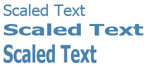

# Typography in WPF
This topic introduces the major typographic features of [!INCLUDE[TLA2#tla_winclient](../../../../includes/tla2sharptla-winclient-md.md)]. These features include improved quality and performance of text rendering, [!INCLUDE[TLA#tla_opentype](../../../../includes/tlasharptla-opentype-md.md)] typography support, enhanced international text, enhanced font support, and new text application programming interfaces (APIs).  
  

  
   
## Improved Quality and Performance of Text  
 Text in [!INCLUDE[TLA2#tla_winclient](../../../../includes/tla2sharptla-winclient-md.md)] is rendered using [!INCLUDE[TLA#tla_ct](../../../../includes/tlasharptla-ct-md.md)], which enhances the clarity and readability of text. [!INCLUDE[TLA2#tla_ct](../../../../includes/tla2sharptla-ct-md.md)] is a software technology developed by [!INCLUDE[TLA#tla_ms](../../../../includes/tlasharptla-ms-md.md)] that improves the readability of text on existing LCDs (Liquid Crystal Displays), such as laptop screens, Pocket PC screens and flat panel monitors. [!INCLUDE[TLA2#tla_ct](../../../../includes/tla2sharptla-ct-md.md)] uses sub-pixel rendering which allows text to be displayed with a greater fidelity to its true shape by aligning characters on a fractional part of a pixel. The extra resolution increases the sharpness of the tiny details in text display, making it much easier to read over long durations. Another improvement of [!INCLUDE[TLA2#tla_ct](../../../../includes/tla2sharptla-ct-md.md)] in [!INCLUDE[TLA2#tla_winclient](../../../../includes/tla2sharptla-winclient-md.md)] is y-direction anti-aliasing, which smoothes the tops and bottoms of shallow curves in text characters. For more details on [!INCLUDE[TLA2#tla_ct](../../../../includes/tla2sharptla-ct-md.md)] features, see [ClearType Overview](../../../../docs/framework/wpf/advanced/cleartype-overview.md).  
  
   
Text with ClearType y-direction antialiasing  
  
 The entire text rendering pipeline can be hardware-accelerated in [!INCLUDE[TLA2#tla_winclient](../../../../includes/tla2sharptla-winclient-md.md)] provided your machine meets the minimum level of hardware required. Rendering that cannot be performed using hardware falls back to software rendering. Hardware-acceleration affects all phases of the text rendering pipeline—from storing individual glyphs, compositing glyphs into glyph runs, applying effects, to applying the [!INCLUDE[TLA2#tla_ct](../../../../includes/tla2sharptla-ct-md.md)] blending algorithm to the final displayed output. For more information on hardware acceleration, see [Graphics Rendering Tiers](../../../../docs/framework/wpf/advanced/graphics-rendering-tiers.md).  
  
   
Diagram of the text rendering pipeline  
  
 In addition, animated text, whether by character or glyph, takes full advantage of the graphics hardware capability enabled by [!INCLUDE[TLA2#tla_winclient](../../../../includes/tla2sharptla-winclient-md.md)]. This results in smooth text animation.  
  
   
## Rich Typography  
 The [!INCLUDE[TLA2#tla_opentype](../../../../includes/tla2sharptla-opentype-md.md)] font format is an extension of the [!INCLUDE[TLA#tla_truetype](../../../../includes/tlasharptla-truetype-md.md)] font format. The [!INCLUDE[TLA2#tla_opentype](../../../../includes/tla2sharptla-opentype-md.md)] font format was developed jointly by [!INCLUDE[TLA#tla_ms](../../../../includes/tlasharptla-ms-md.md)] and Adobe, and provides a rich assortment of advanced typographic features. The <xref:System.Windows.Documents.Typography> object exposes many of the advanced features of [!INCLUDE[TLA2#tla_opentype](../../../../includes/tla2sharptla-opentype-md.md)] fonts, such as stylistic alternates and swashes. The [!INCLUDE[TLA2#tla_lhsdk](../../../../includes/tla2sharptla-lhsdk-md.md)] provides a set of sample [!INCLUDE[TLA2#tla_opentype](../../../../includes/tla2sharptla-opentype-md.md)] fonts that are designed with rich features, such as the Pericles and Pescadero fonts. For more information, see [Sample OpenType Font Pack](../../../../docs/framework/wpf/advanced/sample-opentype-font-pack.md).  
  
 The Pericles [!INCLUDE[TLA2#tla_opentype](../../../../includes/tla2sharptla-opentype-md.md)] font contains additional glyphs that provide stylistic alternates to the standard set of glyphs. The following text displays stylistic alternate glyphs.  
  
   
Text using OpenType stylistic alternate glyphs  
  
 Swashes are decorative glyphs that use elaborate ornamentation often associated with calligraphy. The following text displays standard and swash glyphs for the Pescadero font.  
  
   
Text using OpenType standard and swash glyphs  
  
 For more details on [!INCLUDE[TLA2#tla_opentype](../../../../includes/tla2sharptla-opentype-md.md)] features, see [OpenType Font Features](../../../../docs/framework/wpf/advanced/opentype-font-features.md).  
  
   
## Enhanced International Text Support  
 [!INCLUDE[TLA2#tla_winclient](../../../../includes/tla2sharptla-winclient-md.md)] provides enhanced international text support by providing the following features:  
  
-   Automatic line-spacing in all writing systems, using adaptive measurement.  
  
-   Broad support for international text. For more information, see [Globalization for WPF](../../../../docs/framework/wpf/advanced/globalization-for-wpf.md).  
  
-   Language-guided line breaking, hyphenation, and justification.  
  
   
## Enhanced Font Support  
 [!INCLUDE[TLA2#tla_winclient](../../../../includes/tla2sharptla-winclient-md.md)] provides enhanced font support by providing the following features:  
  
-   Unicode for all text. Font behavior and selection no longer require charset or codepage.  
  
-   Font behavior independent of global settings, such as system locale.  
  
-   Separate <xref:System.Windows.FontWeight>, <xref:System.Windows.FontStretch>, and <xref:System.Windows.FontStyle> types for defining a <xref:System.Windows.Media.FontFamily>. This provides greater flexibility than in [!INCLUDE[TLA#tla_win32](../../../../includes/tlasharptla-win32-md.md)] programming, in which Boolean combinations of italic and bold are used to define a font family.  
  
-   Writing direction (horizontal versus vertical) handled independent of font name.  
  
-   Font linking and font fallback in a portable [!INCLUDE[TLA#tla_xml](../../../../includes/tlasharptla-xml-md.md)] file, using composite font technology. Composite fonts allow for the construction of full range multilingual fonts. Composite fonts also provide a mechanism that avoids displaying missing glyphs. For more information, see the remarks in the <xref:System.Windows.Media.FontFamily> class.  
  
-   International fonts built from composite fonts, using a group of single-language fonts. This saves on resource costs when developing fonts for multiple languages.  
  
-   Composite fonts embedded in a document, thereby providing document portability. For more information, see the remarks in the <xref:System.Windows.Media.FontFamily> class.  
  
   
## New Text Application Programming Interfaces (APIs)  
 [!INCLUDE[TLA2#tla_winclient](../../../../includes/tla2sharptla-winclient-md.md)] provides several text [!INCLUDE[TLA2#tla_api#plural](../../../../includes/tla2sharptla-apisharpplural-md.md)] for developers to use when including text in their applications. These [!INCLUDE[TLA2#tla_api#plural](../../../../includes/tla2sharptla-apisharpplural-md.md)] are grouped into three categories:  
  
-   **Layout and user interface**. The common text controls for the [!INCLUDE[TLA#tla_gui](../../../../includes/tlasharptla-gui-md.md)].  
  
-   **Lightweight text drawing**. Allows you to draw text directly to objects.  
  
-   **Advanced text formatting**. Allows you to implement a custom text engine.  
  
### Layout and User Interface  
 At the highest level of functionality, the text [!INCLUDE[TLA2#tla_api#plural](../../../../includes/tla2sharptla-apisharpplural-md.md)] provide common [!INCLUDE[TLA#tla_ui](../../../../includes/tlasharptla-ui-md.md)] controls such as <xref:System.Windows.Controls.Label>, <xref:System.Windows.Controls.TextBlock>, and <xref:System.Windows.Controls.TextBox>. These controls provide the basic [!INCLUDE[TLA2#tla_ui](../../../../includes/tla2sharptla-ui-md.md)] elements within an application, and offer an easy way to present and interact with text. Controls such as <xref:System.Windows.Controls.RichTextBox> and <xref:System.Windows.Controls.PasswordBox> enable more advanced or specialized text-handling. And classes such as <xref:System.Windows.Documents.TextRange>, <xref:System.Windows.Documents.TextSelection>, and <xref:System.Windows.Documents.TextPointer> enable useful text manipulation. These [!INCLUDE[TLA2#tla_ui](../../../../includes/tla2sharptla-ui-md.md)] controls provide properties such as <xref:System.Windows.Controls.Control.FontFamily%2A>, <xref:System.Windows.Controls.Control.FontSize%2A>, and <xref:System.Windows.Controls.Control.FontStyle%2A>, which enable you to control the font that is used to render the text.  
  
#### Using Bitmap Effects, Transforms, and Text Effects  
 [!INCLUDE[TLA2#tla_winclient](../../../../includes/tla2sharptla-winclient-md.md)] allows you to create visually interesting uses of text by uses features such as bitmap effects, transforms, and text effects. The following example shows a typical type of a drop shadow effect applied to text.  
  
   
Text with a drop shadow  
  
 The following example shows a drop shadow effect and noise applied to text.  
  
   
Text with a drop shadow and noise  
  
 The following example shows an outer glow effect applied to text.  
  
   
Text with an outer glow effect  
  
 The following example shows a blur effect applied to text.  
  
   
Text with a blur effect  
  
 The following example shows the second line of text scaled by 150% along the x-axis, and the third line of text scaled by 150% along the y-axis.  
  
   
Text using a ScaleTransform  
  
 The following example shows text skewed along the x-axis.  
  
   
Text using a SkewTransform  
  
 A <xref:System.Windows.Media.TextEffect> object is a helper object that allows you to treat text as one or more groups of characters in a text string. The following example shows an individual character being rotated. Each character is rotated independently at 1-second intervals.  
  
   
Example of a rotating text effect animation  
  
#### Using Flow Documents  
 In addition to the common [!INCLUDE[TLA2#tla_ui](../../../../includes/tla2sharptla-ui-md.md)] controls, [!INCLUDE[TLA2#tla_winclient](../../../../includes/tla2sharptla-winclient-md.md)] offers a layout control for text presentation—the <xref:System.Windows.Documents.FlowDocument> element. The <xref:System.Windows.Documents.FlowDocument> element, in conjunction with the <xref:System.Windows.Controls.DocumentViewer> element, provides a control for large amounts of text with varying layout requirements. Layout controls provide access to advanced typography through the <xref:System.Windows.Documents.Typography> object and font-related properties of other [!INCLUDE[TLA2#tla_ui](../../../../includes/tla2sharptla-ui-md.md)] controls.  
  
 The following example shows text content hosted in a <xref:System.Windows.Controls.FlowDocumentReader>, which provides search, navigation, pagination, and content scaling support.  
  
   
Text hosted in a FlowDocumentReader  
  
 For more information, see [Documents in WPF](../../../../docs/framework/wpf/advanced/documents-in-wpf.md).  
  
### Lightweight Text Drawing  
 You can draw text directly to [!INCLUDE[TLA2#tla_winclient](../../../../includes/tla2sharptla-winclient-md.md)] objects by using the <xref:System.Windows.Media.DrawingContext.DrawText%2A> method of the <xref:System.Windows.Media.DrawingContext> object. To use this method, you create a <xref:System.Windows.Media.FormattedText> object. This object allows you to draw multi-line text, in which each character in the text can be individually formatted. The functionality of the <xref:System.Windows.Media.FormattedText> object contains much of the functionality of the DrawText flags in the Win32 API. In addition, the <xref:System.Windows.Media.FormattedText> object contains functionality such as ellipsis support, in which an ellipsis is displayed when text exceeds its bounds. The following example shows text that has several formats applied to it, including a linear gradient on the second and third words.  
  
   
Displayed text using FormattedText object  
  
 You can convert formatted text into <xref:System.Windows.Media.Geometry> objects, allowing you to create other types of visually interesting text. For example, you could create a <xref:System.Windows.Media.Geometry> object based on the outline of a text string.  
  
   
Text outline using a linear gradient brush  
  
 The following examples illustrate several ways of creating interesting visual effects by modifying the stroke, fill, and highlight of converted text.  
  
   
Example of setting stroke and fill to different colors  
  
   
Example of an image brush applied to the stroke  
  
   
Example of an image brush applied to the stroke and highlight  
  
 For more information on the <xref:System.Windows.Media.FormattedText> object, see [Drawing Formatted Text](../../../../docs/framework/wpf/advanced/drawing-formatted-text.md).  
  
### Advanced Text Formatting  
 At the most advanced level of the text [!INCLUDE[TLA2#tla_api#plural](../../../../includes/tla2sharptla-apisharpplural-md.md)], [!INCLUDE[TLA2#tla_winclient](../../../../includes/tla2sharptla-winclient-md.md)] offers you the ability to create custom text layout by using the <xref:System.Windows.Media.TextFormatting.TextFormatter> object and other types in the <xref:System.Windows.Media.TextFormatting> namespace. The <xref:System.Windows.Media.TextFormatting.TextFormatter> and associated classes allow you to implement custom text layout that supports your own definition of character formats, paragraph styles, line breaking rules, and other layout features for international text. There are very few cases in which you would want to override the default implementation of the [!INCLUDE[TLA2#tla_winclient](../../../../includes/tla2sharptla-winclient-md.md)] text layout support. However, if you were creating a text editing control or application, you might require a different implementation than the default [!INCLUDE[TLA2#tla_winclient](../../../../includes/tla2sharptla-winclient-md.md)] implementation.  
  
 Unlike a traditional text [!INCLUDE[TLA#tla_api](../../../../includes/tlasharptla-api-md.md)], the <xref:System.Windows.Media.TextFormatting.TextFormatter> interacts with a text layout client through a set of callback methods. It requires the client to provide these methods in an implementation of the <xref:System.Windows.Media.TextFormatting.TextSource> class. The following diagram illustrates the text layout interaction between the client application and <xref:System.Windows.Media.TextFormatting.TextFormatter>.  
  
   
Interaction between application and TextFormatter  
  
 For more details on creating custom text layout, see [Advanced Text Formatting](../../../../docs/framework/wpf/advanced/advanced-text-formatting.md).  
  
## See Also  
 <xref:System.Windows.Media.FormattedText>  
 <xref:System.Windows.Media.TextFormatting.TextFormatter>  
 [ClearType Overview](../../../../docs/framework/wpf/advanced/cleartype-overview.md)  
 [OpenType Font Features](../../../../docs/framework/wpf/advanced/opentype-font-features.md)  
 [Drawing Formatted Text](../../../../docs/framework/wpf/advanced/drawing-formatted-text.md)  
 [Advanced Text Formatting](../../../../docs/framework/wpf/advanced/advanced-text-formatting.md)  
 [Text](../../../../docs/framework/wpf/advanced/optimizing-performance-text.md)  
 [Microsoft Typography](http://www.microsoft.com/typography/default.mspx)
