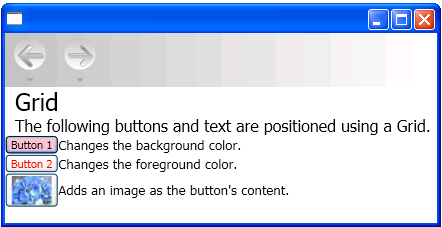

# Use Automatic Layout Overview
This topic introduces guidelines for developers on how to write [!INCLUDE[TLA#tla_winclient](../../../../includes/tlasharptla-winclient-md.md)] applications with localizable [!INCLUDE[TLA#tla_ui#plural](../../../../includes/tlasharptla-uisharpplural-md.md)]. In the past, localization of a [!INCLUDE[TLA2#tla_ui](../../../../includes/tla2sharptla-ui-md.md)] was a time consuming process. Each language that the [!INCLUDE[TLA2#tla_ui](../../../../includes/tla2sharptla-ui-md.md)] was adapted for required a pixel by pixel adjustment. Today with the right design and right coding standards, [!INCLUDE[TLA2#tla_ui#plural](../../../../includes/tla2sharptla-uisharpplural-md.md)] can be constructed so that localizers have less resizing and repositioning to do. The approach to writing applications that can be more easily resized and repositioned is called automatic layout, and can be achieved by using [!INCLUDE[TLA2#tla_winclient](../../../../includes/tla2sharptla-winclient-md.md)] application design.  
  
   
## Advantages of Using Automatic Layout  
 Because the [!INCLUDE[TLA2#tla_winclient](../../../../includes/tla2sharptla-winclient-md.md)] presentation system is powerful and flexible, it provides the ability to layout elements in an application that can be adjusted to fit the requirements of different languages. The following list points out some of the advantages of automatic layout.  
  
-   [!INCLUDE[TLA2#tla_ui](../../../../includes/tla2sharptla-ui-md.md)] displays well  in any language.  
  
-   Reduces the need to readjust position and size of controls after text is translated.  
  
-   Reduces the need to readjust window size.  
  
-   [!INCLUDE[TLA2#tla_ui](../../../../includes/tla2sharptla-ui-md.md)] layout renders properly in any language.  
  
-   Localization can be reduced to the point that it is little more than string translation.  
  
   
## Automatic Layout and Controls  
 Automatic layout enables an application to adjust the size of a control automatically. For example, a control can change to accommodate the length of a string. This capability enables  localizers to translate the string; they no longer need to resize the control to fit the translated text. The following example creates a button with English content.  
  
 [!code-xaml[LocalizationBtn_snip#1](../../../../samples/snippets/csharp/VS_Snippets_Wpf/LocalizationBtn_snip/CS/Pane1.xaml#1)]  
  
 In the example, all you have to do to make a Spanish button is change the text. For example,  
  
 [!code-xaml[LocalizationBtn#1](../../../../samples/snippets/csharp/VS_Snippets_Wpf/LocalizationBtn/CS/Pane1.xaml#1)]  
  
 The following graphic shows the output of the code samples.  
  
   
Auto Resizable Button  
  
   
## Automatic Layout and Coding Standards  
 Using the automatic layout approach requires a set of coding and design standards and rules to produce a fully localizable  [!INCLUDE[TLA2#tla_ui](../../../../includes/tla2sharptla-ui-md.md)]. The following guidelines will aid your automatic layout coding.  
  
|Coding Standards|Description|  
|----------------------|-----------------|  
|Do not use absolute positions.|-   Do not use <xref:System.Windows.Controls.Canvas> because it positions elements absolutely. -   Use <xref:System.Windows.Controls.DockPanel>, <xref:System.Windows.Controls.StackPanel>, and <xref:System.Windows.Controls.Grid> to position controls. -   For a discussion about various types of panels, see [Panels Overview](../../../../docs/framework/wpf/controls/panels-overview.md).|  
|Do not set a fixed size for a window.|-   Use <xref:System.Windows.Window.SizeToContent%2A>. -   For example:   [!code-xaml[LocalizationGrid#2](../../../../samples/snippets/csharp/VS_Snippets_Wpf/LocalizationGrid/CS/Pane1.xaml#2)]|  
|Add a <xref:System.Windows.FrameworkElement.FlowDirection%2A>.|<ul><li>Add a <xref:System.Windows.FrameworkElement.FlowDirection%2A> to the root element of your application.</li><li>[!INCLUDE[TLA2#tla_winclient](../../../../includes/tla2sharptla-winclient-md.md)] provides a convenient way to support horizontal, bidirectional, and vertical layouts. In presentation framework,   the <xref:System.Windows.FrameworkElement.FlowDirection%2A> property can be used to define layout. The flow-direction patterns are:   <ul><li><xref:System.Windows.FlowDirection.LeftToRight> (LrTb) — horizontal layout for Latin, East Asian, and so forth.</li><li><xref:System.Windows.FlowDirection.RightToLeft> (RlTb) — bidirectional for Arabic, Hebrew, and so forth.</li></ul></li></ul>|  
|Use composite fonts instead of physical fonts.|<ul><li>With composite fonts, the <xref:System.Windows.Controls.Control.FontFamily%2A> property does not need to be localized.</li><li>Developers can use one of the following fonts or create their own.   <ul><li>Global User Interface</li><li>Global San Serif</li><li>Global Serif</li></ul></li></ul>|  
|Add xml:lang.|-   Add the `xml:lang` attribute in the root element of your [!INCLUDE[TLA2#tla_ui](../../../../includes/tla2sharptla-ui-md.md)], such as `xml:lang="en-US"` for an English application. -   Because composite fonts use `xml:lang` to determine what font to use, set this property to support multilingual scenarios.|  
  
   
## Automatic Layout and Grids  
 The <xref:System.Windows.Controls.Grid> element, is useful for automatic layout because it enables a developer to position elements. A <xref:System.Windows.Controls.Grid> control is capable of distributing the available space among its child elements, using a column and row arrangement. The [!INCLUDE[TLA2#tla_ui](../../../../includes/tla2sharptla-ui-md.md)] elements can span multiple cells, and it is possible to have grids within grids. Grids are useful because they enable you to create and position complex [!INCLUDE[TLA2#tla_ui](../../../../includes/tla2sharptla-ui-md.md)]. The following example demonstrates using a grid to position some buttons and text. Notice that the height and width of the cells are set to <xref:System.Windows.GridUnitType.Auto>; therefore, the cell that contains the button with an image adjusts to fit the image.  
  
 [!code-xaml[LocalizationGrid#1](../../../../samples/snippets/csharp/VS_Snippets_Wpf/LocalizationGrid/CS/Pane1.xaml#1)]  
  
 The following graphic shows the grid produced by the previous code.  
  
   
Grid  
  
   
## Automatic Layout and Grids Using the IsSharedSizeScope Property  
 A <xref:System.Windows.Controls.Grid> element is useful in localizable applications to create controls that adjust to fit content. However, at times you want controls to maintain a particular size regardless of content. For example, if you have "OK", "Cancel" and "Browse" buttons you probably do not want the buttons sized to fit the content. In this case the <xref:System.Windows.Controls.Grid.IsSharedSizeScope%2A?displayProperty=nameWithType> attached property is useful for sharing the same sizing among multiple grid elements. The following example demonstrates how to share column and row sizing data between multiple <xref:System.Windows.Controls.Grid> elements.  
  
 [!code-xaml[gridIssharedsizescopeProp#2](../../../../samples/snippets/csharp/VS_Snippets_Wpf/gridIssharedsizescopeProp/CSharp/Window1.xaml#2)]  
  
 **Note** For the complete code sample, see [Share Sizing Properties Between Grids](../../../../docs/framework/wpf/controls/how-to-share-sizing-properties-between-grids.md)  
  
## See Also  
 [Globalization for WPF](../../../../docs/framework/wpf/advanced/globalization-for-wpf.md)  
 [Use Automatic Layout to Create a Button](../../../../docs/framework/wpf/advanced/how-to-use-automatic-layout-to-create-a-button.md)  
 [Use a Grid for Automatic Layout](../../../../docs/framework/wpf/advanced/how-to-use-a-grid-for-automatic-layout.md)
