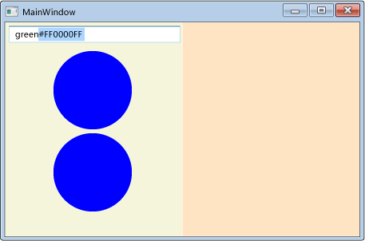
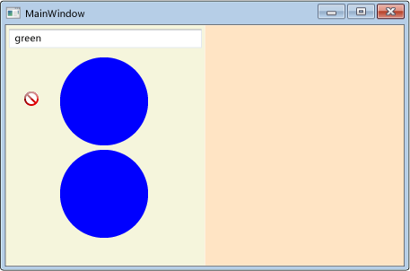
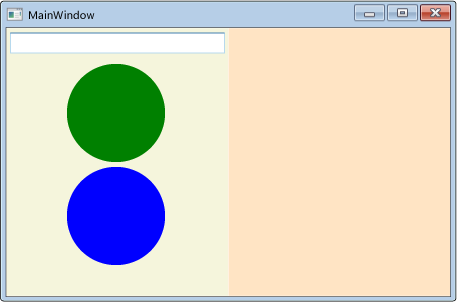
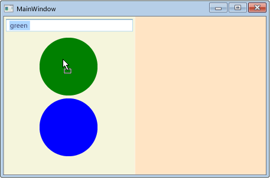
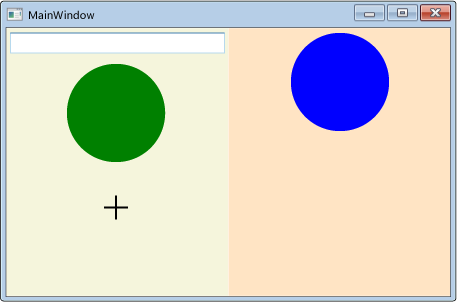

# Walkthrough: Enabling Drag and Drop on a User Control
This walkthrough demonstrates how to create a custom user control that can participate in drag-and-drop data transfer in [!INCLUDE[TLA#tla_winclient](../../../../includes/tlasharptla-winclient-md.md)].  
  
 In this walkthrough, you will create a custom WPF <xref:System.Windows.Controls.UserControl> that represents a circle shape. You will implement functionality on the control to enable data transfer through drag-and-drop. For example, if you drag from one Circle control to another, the Fill color data is copied from the source Circle to the target. If you drag from a Circle control to a <xref:System.Windows.Controls.TextBox>, the string representation of the Fill color is copied to the <xref:System.Windows.Controls.TextBox>. You will also create a small application that contains two panel controls and a <xref:System.Windows.Controls.TextBox> to test the drag-and-drop functionality. You will write code that enables the panels to process dropped Circle data, which will enable you to move or copy Circles from the Children collection of one panel to the other.  
  
 This walkthrough illustrates the following tasks:  
  
-   Create a custom user control.  
  
-   Enable the user control to be a drag source.  
  
-   Enable the user control to be a drop target.  
  
-   Enable a panel to receive data dropped from the user control.  
  
## Prerequisites  
 You need the following components to complete this walkthrough:  
  
-   Visual Studio 2010  
  
## Creating the Application Project  
 In this section, you will create the application infrastructure, which includes a main page with two panels and a <xref:System.Windows.Controls.TextBox>.  
  
### To create the project  
  
1.  Create a new WPF Application project in Visual Basic or Visual C# named `DragDropExample`. For more information, see [How to: Create a New WPF Application Project](http://msdn.microsoft.com/library/1f6aea7a-33e1-4d3f-8555-1daa42e95d82).  
  
2.  Open MainWindow.xaml.  
  
3.  Add the following markup between the opening and closing <xref:System.Windows.Controls.Grid> tags.  
  
     This markup creates the user interface for the test application.  
  
     [!code-xaml[DragDropWalkthrough#PanelsStep1XAML](../../../../samples/snippets/csharp/VS_Snippets_Wpf/DragDropWalkthrough/CS/SnippetWindow.xaml#panelsstep1xaml)]  
  
## Adding a New User Control to the Project  
 In this section, you will add a new user control to the project.  
  
### To add a new user control  
  
1.  On the Project menu, select **Add User Control**.  
  
2.  In the Add New Item dialog box, change the name to `Circle.xaml`, and click **Add**.  
  
     Circle.xaml and its code-behind is added to the project.  
  
3.  Open Circle.xaml.  
  
     This file will contain the user interface elements of the user control.  
  
4.  Add the following markup to the root <xref:System.Windows.Controls.Grid> to create a simple user control that has a blue circle as its UI.  
  
     [!code-xaml[DragDropWalkthrough#EllipseXAML](../../../../samples/snippets/csharp/VS_Snippets_Wpf/DragDropWalkthrough/CS/Circle.xaml#ellipsexaml)]  
  
5.  Open Circle.xaml.cs or Circle.xaml.vb.  
  
6.  In C#, add the following code after the default constructor to create a copy constructor. In Visual Basic, add the following code to create both a default constructor and a copy constructor.  
  
     In order to allow the user control to be copied, you add a copy constructor method in the code-behind file. In the simplified Circle user control, you will only copy the Fill and the size of the of the user control.  
  
     [!code-csharp[DragDropWalkthrough#CopyCtor](../../../../samples/snippets/csharp/VS_Snippets_Wpf/DragDropWalkthrough/CS/Circle.xaml.cs#copyctor)]
     [!code-vb[DragDropWalkthrough#CopyCtor](../../../../samples/snippets/visualbasic/VS_Snippets_Wpf/DragDropWalkthrough/VB/Circle.xaml.vb#copyctor)]  
  
### To add the user control to the main window  
  
1.  Open MainWindow.xaml.  
  
2.  Add the following XAML to the opening <xref:System.Windows.Window> tag to create an XML namespace reference to the current application.  
  
    ```  
    xmlns:local="clr-namespace:DragDropExample"  
    ```  
  
3.  In the first <xref:System.Windows.Controls.StackPanel>, add the following XAML to create two instances of the Circle user control in the first panel.  
  
     [!code-xaml[DragDropWalkthrough#CirclesXAML](../../../../samples/snippets/csharp/VS_Snippets_Wpf/DragDropWalkthrough/CS/SnippetWindow.xaml#circlesxaml)]  
  
     The full XAML for the panel looks like the following.  
  
     [!code-xaml[DragDropWalkthrough#PanelsStep2XAML](../../../../samples/snippets/csharp/VS_Snippets_Wpf/DragDropWalkthrough/CS/SnippetWindow.xaml#panelsstep2xaml)]  
  
## Implementing Drag Source Events in the User Control  
 In this section, you will override the <xref:System.Windows.UIElement.OnMouseMove%2A> method and initiate the drag-and-drop operation.  
  
 If a drag is started (a mouse button is pressed and the mouse is moved), you will package the data to be transferred into a <xref:System.Windows.DataObject>. In this case, the Circle control will package three data items; a string representation of its Fill color, a double representation of its height, and a copy of itself.  
  
### To initiate a drag-and-drop operation  
  
1.  Open Circle.xaml.cs or Circle.xaml.vb.  
  
2.  Add the following <xref:System.Windows.UIElement.OnMouseMove%2A> override to provide class handling for the <xref:System.Windows.UIElement.MouseMove> event.  
  
     [!code-csharp[DragDropWalkthrough#OnMouseMove](../../../../samples/snippets/csharp/VS_Snippets_Wpf/DragDropWalkthrough/CS/Circle.xaml.cs#onmousemove)]
     [!code-vb[DragDropWalkthrough#OnMouseMove](../../../../samples/snippets/visualbasic/VS_Snippets_Wpf/DragDropWalkthrough/VB/Circle.xaml.vb#onmousemove)]  
  
     This <xref:System.Windows.UIElement.OnMouseMove%2A> override performs the following tasks:  
  
    -   Checks whether the left mouse button is pressed while the mouse is moving.  
  
    -   Packages the Circle data into a <xref:System.Windows.DataObject>. In this case, the Circle control packages three data items; a string representation of its Fill color, a double representation of its height, and a copy of itself.  
  
    -   Calls the static <xref:System.Windows.DragDrop.DoDragDrop%2A?displayProperty=nameWithType> method to initiate the drag-and-drop operation. You pass the following three parameters to the <xref:System.Windows.DragDrop.DoDragDrop%2A> method:  
  
        -   `dragSource` – A reference to this control.  
  
        -   `data` – The <xref:System.Windows.DataObject> created in the previous code.  
  
        -   `allowedEffects` – The allowed drag-and-drop operations, which are <xref:System.Windows.DragDropEffects.Copy> or <xref:System.Windows.DragDropEffects.Move>.  
  
3.  Press F5 to build and run the application.  
  
4.  Click one of the Circle controls and drag it over the panels, the other Circle, and the <xref:System.Windows.Controls.TextBox>. When dragging over the <xref:System.Windows.Controls.TextBox>, the cursor changes to indicate a move.  
  
5.  While dragging a Circle over the <xref:System.Windows.Controls.TextBox>, press the CTRL key. Notice how the cursor changes to indicate a copy.  
  
6.  Drag and drop a Circle onto the <xref:System.Windows.Controls.TextBox>. The string representation of the Circle’s fill color is appended to the <xref:System.Windows.Controls.TextBox>.  
  
       
  
 By default, the cursor will change during a drag-and-drop operation to indicate what effect dropping the data will have. You can customize the feedback given to the user by handling the <xref:System.Windows.UIElement.GiveFeedback> event and setting a different cursor.  
  
### To give feedback to the user  
  
1.  Open Circle.xaml.cs or Circle.xaml.vb.  
  
2.  Add the following <xref:System.Windows.UIElement.OnGiveFeedback%2A> override to provide class handling for the <xref:System.Windows.UIElement.GiveFeedback> event.  
  
     [!code-csharp[DragDropWalkthrough#OnGiveFeedback](../../../../samples/snippets/csharp/VS_Snippets_Wpf/DragDropWalkthrough/CS/Circle.xaml.cs#ongivefeedback)]
     [!code-vb[DragDropWalkthrough#OnGiveFeedback](../../../../samples/snippets/visualbasic/VS_Snippets_Wpf/DragDropWalkthrough/VB/Circle.xaml.vb#ongivefeedback)]  
  
     This <xref:System.Windows.UIElement.OnGiveFeedback%2A> override performs the following tasks:  
  
    -   Checks the <xref:System.Windows.GiveFeedbackEventArgs.Effects%2A> values that are set in the drop target's <xref:System.Windows.UIElement.DragOver> event handler.  
  
    -   Sets a custom cursor based on the <xref:System.Windows.GiveFeedbackEventArgs.Effects%2A> value. The cursor is intended to give visual feedback to the user about what effect dropping the data will have.  
  
3.  Press F5 to build and run the application.  
  
4.  Drag one of the Circle controls over the panels, the other Circle, and the <xref:System.Windows.Controls.TextBox>. Notice that the cursors are now the custom cursors that you specified in the <xref:System.Windows.UIElement.OnGiveFeedback%2A> override.  
  
       
  
5.  Select the text `green` from the <xref:System.Windows.Controls.TextBox>.  
  
6.  Drag the `green` text to a Circle control. Notice that the default cursors are shown to indicate the effects of the drag-and-drop operation. The feedback cursor is always set by the drag source.  
  
## Implementing Drop Target Events in the User Control  
 In this section, you will specify that the user control is a drop target, override the methods that enable the user control to be a drop target, and process the data that is dropped on it.  
  
### To enable the user control to be a drop target  
  
1.  Open Circle.xaml.  
  
2.  In the opening <xref:System.Windows.Controls.UserControl> tag, add the <xref:System.Windows.UIElement.AllowDrop%2A> property and set it to `true`.  
  
     [!code-xaml[DragDropWalkthrough#UCTagXAML](../../../../samples/snippets/csharp/VS_Snippets_Wpf/DragDropWalkthrough/CS/Circle.xaml#uctagxaml)]  
  
 The <xref:System.Windows.UIElement.OnDrop%2A> method is called when the <xref:System.Windows.UIElement.AllowDrop%2A> property is set to `true` and data from the drag source is dropped on the Circle user control. In this method, you will process the data that was dropped and apply the data to the Circle.  
  
### To process the dropped data  
  
1.  Open Circle.xaml.cs or Circle.xaml.vb.  
  
2.  Add the following <xref:System.Windows.UIElement.OnDrop%2A> override to provide class handling for the <xref:System.Windows.UIElement.Drop> event.  
  
     [!code-csharp[DragDropWalkthrough#OnDrop](../../../../samples/snippets/csharp/VS_Snippets_Wpf/DragDropWalkthrough/CS/Circle.xaml.cs#ondrop)]
     [!code-vb[DragDropWalkthrough#OnDrop](../../../../samples/snippets/visualbasic/VS_Snippets_Wpf/DragDropWalkthrough/VB/Circle.xaml.vb#ondrop)]  
  
     This <xref:System.Windows.UIElement.OnDrop%2A> override performs the following tasks:  
  
    -   Uses the <xref:System.Windows.DataObject.GetDataPresent%2A> method to check if the dragged data contains a string object.  
  
    -   Uses the <xref:System.Windows.DataObject.GetData%2A> method to extract the string data if it is present.  
  
    -   Uses a <xref:System.Windows.Media.BrushConverter> to try to convert the string to a <xref:System.Windows.Media.Brush>.  
  
    -   If the conversion is successful, applies the brush to the <xref:System.Windows.Shapes.Shape.Fill%2A> of the <xref:System.Windows.Shapes.Ellipse> that provides the UI of the Circle control.  
  
    -   Marks the <xref:System.Windows.UIElement.Drop> event as handled. You should mark the drop event as handled so that other elements that receive this event know that the Circle user control handled it.  
  
3.  Press F5 to build and run the application.  
  
4.  Select the text `green` in the <xref:System.Windows.Controls.TextBox>.  
  
5.  Drag the text to a Circle control and drop it. The Circle changes from blue to green.  
  
       
  
6.  Type the text `green` in the <xref:System.Windows.Controls.TextBox>.  
  
7.  Select the text `gre` in the <xref:System.Windows.Controls.TextBox>.  
  
8.  Drag it to a Circle control and drop it. Notice that the cursor changes to indicate that the drop is allowed, but the color of the Circle does not change because `gre` is not a valid color.  
  
9. Drag from the green Circle control and drop on the blue Circle control. The Circle changes from blue to green. Notice that which cursor is shown depends on whether the <xref:System.Windows.Controls.TextBox> or the Circle is the drag source.  
  
 Setting the <xref:System.Windows.UIElement.AllowDrop%2A> property to `true` and processing the dropped data is all that is required to enable an element to be a drop target. However, to provide a better user experience, you should also handle the <xref:System.Windows.UIElement.DragEnter>, <xref:System.Windows.UIElement.DragLeave>, and <xref:System.Windows.UIElement.DragOver> events. In these events, you can perform checks and provide additional feedback to the user before the data is dropped.  
  
 When data is dragged over the Circle user control, the control should notify the drag source whether it can process the data that is being dragged. If the control does not know how to process the data, it should refuse the drop. To do this, you will handle the <xref:System.Windows.UIElement.DragOver> event and set the <xref:System.Windows.DragEventArgs.Effects%2A> property.  
  
### To verify that the data drop is allowed  
  
1.  Open Circle.xaml.cs or Circle.xaml.vb.  
  
2.  Add the following <xref:System.Windows.UIElement.OnDragOver%2A> override to provide class handling for the <xref:System.Windows.UIElement.DragOver> event.  
  
     [!code-csharp[DragDropWalkthrough#OnDragOver](../../../../samples/snippets/csharp/VS_Snippets_Wpf/DragDropWalkthrough/CS/Circle.xaml.cs#ondragover)]
     [!code-vb[DragDropWalkthrough#OnDragOver](../../../../samples/snippets/visualbasic/VS_Snippets_Wpf/DragDropWalkthrough/VB/Circle.xaml.vb#ondragover)]  
  
     This <xref:System.Windows.UIElement.OnDragOver%2A> override performs the following tasks:  
  
    -   Sets the <xref:System.Windows.DragEventArgs.Effects%2A> property to <xref:System.Windows.DragDropEffects.None>.  
  
    -   Performs the same checks that are performed in the <xref:System.Windows.UIElement.OnDrop%2A> method to determine whether the Circle user control can process the dragged data.  
  
    -   If the user control can process the data, sets the <xref:System.Windows.DragEventArgs.Effects%2A> property to <xref:System.Windows.DragDropEffects.Copy> or <xref:System.Windows.DragDropEffects.Move>.  
  
3.  Press F5 to build and run the application.  
  
4.  Select the text `gre` in the <xref:System.Windows.Controls.TextBox>.  
  
5.  Drag the text to a Circle control. Notice that the cursor now changes to indicate that the drop is not allowed because `gre` is not a valid color.  
  
 You can further enhance the user experience by applying a preview of the drop operation. For the Circle user control, you will override the <xref:System.Windows.UIElement.OnDragEnter%2A> and <xref:System.Windows.UIElement.OnDragLeave%2A> methods. When the data is dragged over the control, the current background <xref:System.Windows.Shapes.Shape.Fill%2A> is saved in a placeholder variable. The string is then converted to a brush and applied to the <xref:System.Windows.Shapes.Ellipse> that provides the Circle's UI. If the data is dragged out of the Circle without being dropped, the original <xref:System.Windows.Shapes.Shape.Fill%2A> value is re-applied to the Circle.  
  
### To preview the effects of the drag-and-drop operation  
  
1.  Open Circle.xaml.cs or Circle.xaml.vb.  
  
2.  In the Circle class, declare a private <xref:System.Windows.Media.Brush> variable named `_previousFill` and initialize it to `null`.  
  
     [!code-csharp[DragDropWalkthrough#Brush](../../../../samples/snippets/csharp/VS_Snippets_Wpf/DragDropWalkthrough/CS/Circle.xaml.cs#brush)]
     [!code-vb[DragDropWalkthrough#Brush](../../../../samples/snippets/visualbasic/VS_Snippets_Wpf/DragDropWalkthrough/VB/Circle.xaml.vb#brush)]  
  
3.  Add the following <xref:System.Windows.UIElement.OnDragEnter%2A> override to provide class handling for the <xref:System.Windows.UIElement.DragEnter> event.  
  
     [!code-csharp[DragDropWalkthrough#OnDragEnter](../../../../samples/snippets/csharp/VS_Snippets_Wpf/DragDropWalkthrough/CS/Circle.xaml.cs#ondragenter)]
     [!code-vb[DragDropWalkthrough#OnDragEnter](../../../../samples/snippets/visualbasic/VS_Snippets_Wpf/DragDropWalkthrough/VB/Circle.xaml.vb#ondragenter)]  
  
     This <xref:System.Windows.UIElement.OnDragEnter%2A> override performs the following tasks:  
  
    -   Saves the <xref:System.Windows.Shapes.Shape.Fill%2A> property of the <xref:System.Windows.Shapes.Ellipse> in the `_previousFill` variable.  
  
    -   Performs the same checks that are performed in the <xref:System.Windows.UIElement.OnDrop%2A> method to determine whether the data can be converted to a <xref:System.Windows.Media.Brush>.  
  
    -   If the data is converted to a valid <xref:System.Windows.Media.Brush>, applies it to the <xref:System.Windows.Shapes.Shape.Fill%2A> of the <xref:System.Windows.Shapes.Ellipse>.  
  
4.  Add the following <xref:System.Windows.UIElement.OnDragLeave%2A> override to provide class handling for the <xref:System.Windows.UIElement.DragLeave> event.  
  
     [!code-csharp[DragDropWalkthrough#OnDragLeave](../../../../samples/snippets/csharp/VS_Snippets_Wpf/DragDropWalkthrough/CS/Circle.xaml.cs#ondragleave)]
     [!code-vb[DragDropWalkthrough#OnDragLeave](../../../../samples/snippets/visualbasic/VS_Snippets_Wpf/DragDropWalkthrough/VB/Circle.xaml.vb#ondragleave)]  
  
     This <xref:System.Windows.UIElement.OnDragLeave%2A> override performs the following tasks:  
  
    -   Applies the <xref:System.Windows.Media.Brush> saved in the `_previousFill` variable to the <xref:System.Windows.Shapes.Shape.Fill%2A> of the <xref:System.Windows.Shapes.Ellipse> that provides the UI of the Circle user control.  
  
5.  Press F5 to build and run the application.  
  
6.  Select the text `green` in the <xref:System.Windows.Controls.TextBox>.  
  
7.  Drag the text over a Circle control without dropping it. The Circle changes from blue to green.  
  
       
  
8.  Drag the text away from the Circle control. The Circle changes from green back to blue.  
  
## Enabling a Panel to Receive Dropped Data  
 In this section, you will enable the panels that host the Circle user controls to act as drop targets for dragged Circle data. You will implement code that enables you to move a Circle from one panel to another, or to make a copy of a Circle control by holding down the CTRL key while dragging and dropping a Circle.  
  
### To enable the panel to be a drop target  
  
1.  Open MainWindow.xaml.  
  
2.  As shown in the following XAML, in each of the <xref:System.Windows.Controls.StackPanel> controls, add handlers for the <xref:System.Windows.UIElement.DragOver> and <xref:System.Windows.UIElement.Drop> events. Name the <xref:System.Windows.UIElement.DragOver> event handler, `panel_DragOver`, and name the <xref:System.Windows.UIElement.Drop> event handler, `panel_Drop`.  
  
     [!code-xaml[DragDropWalkthrough#PanelsXAML](../../../../samples/snippets/csharp/VS_Snippets_Wpf/DragDropWalkthrough/CS/MainWindow.xaml#panelsxaml)]  
  
3.  Open MainWindows.xaml.cs or MainWindow.xaml.vb.  
  
4.  Add the following code for the <xref:System.Windows.UIElement.DragOver> event handler.  
  
     [!code-csharp[DragDropWalkthrough#PanelDragOver](../../../../samples/snippets/csharp/VS_Snippets_Wpf/DragDropWalkthrough/CS/MainWindow.xaml.cs#paneldragover)]
     [!code-vb[DragDropWalkthrough#PanelDragOver](../../../../samples/snippets/visualbasic/VS_Snippets_Wpf/DragDropWalkthrough/VB/MainWindow.xaml.vb#paneldragover)]  
  
     This <xref:System.Windows.UIElement.DragOver> event handler performs the following tasks:  
  
    -   Checks that the dragged data contains the "Object" data that was packaged in the <xref:System.Windows.DataObject> by the Circle user control and passed in the call to <xref:System.Windows.DragDrop.DoDragDrop%2A>.  
  
    -   If the "Object" data is present, checks whether the CTRL key is pressed.  
  
    -   If the CTRL key is pressed, sets the <xref:System.Windows.DragEventArgs.Effects%2A> property to <xref:System.Windows.DragDropEffects.Copy>. Otherwise, set the <xref:System.Windows.DragEventArgs.Effects%2A> property to <xref:System.Windows.DragDropEffects.Move>.  
  
5.  Add the following code for the <xref:System.Windows.UIElement.Drop> event handler.  
  
     [!code-csharp[DragDropWalkthrough#PanelDrop](../../../../samples/snippets/csharp/VS_Snippets_Wpf/DragDropWalkthrough/CS/MainWindow.xaml.cs#paneldrop)]
     [!code-vb[DragDropWalkthrough#PanelDrop](../../../../samples/snippets/visualbasic/VS_Snippets_Wpf/DragDropWalkthrough/VB/MainWindow.xaml.vb#paneldrop)]  
  
     This <xref:System.Windows.UIElement.Drop> event handler performs the following tasks:  
  
    -   Checks whether the <xref:System.Windows.UIElement.Drop> event has already been handled. For instance, if a Circle is dropped on another Circle which handles the <xref:System.Windows.UIElement.Drop> event, you do not want the panel that contains the Circle to also handle it.  
  
    -   If the <xref:System.Windows.UIElement.Drop> event is not handled, checks whether the CTRL key is pressed.  
  
    -   If the CTRL key is pressed when the <xref:System.Windows.UIElement.Drop> happens, makes a copy of the Circle control and add it to the <xref:System.Windows.Controls.Panel.Children%2A> collection of the <xref:System.Windows.Controls.StackPanel>.  
  
    -   If the CTRL key is not pressed, moves the Circle from the <xref:System.Windows.Controls.Panel.Children%2A> collection of its parent panel to the <xref:System.Windows.Controls.Panel.Children%2A> collection of the panel that it was dropped on.  
  
    -   Sets the <xref:System.Windows.DragEventArgs.Effects%2A> property to notify the <xref:System.Windows.DragDrop.DoDragDrop%2A> method whether a move or copy operation was performed.  
  
6.  Press F5 to build and run the application.  
  
7.  Select the text `green` from the <xref:System.Windows.Controls.TextBox>.  
  
8.  Drag the text over a Circle control and drop it.  
  
9. Drag a Circle control from the left panel to the right panel and drop it. The Circle is removed from the <xref:System.Windows.Controls.Panel.Children%2A> collection of the left panel and added to the Children collection of the right panel.  
  
10. Drag a Circle control from the panel it is in to the other panel and drop it while pressing the CTRL key. The Circle is copied and the copy is added to the <xref:System.Windows.Controls.Panel.Children%2A> collection of the receiving panel.  
  
       
  
## See Also  
 [Drag and Drop Overview](../../../../docs/framework/wpf/advanced/drag-and-drop-overview.md)
